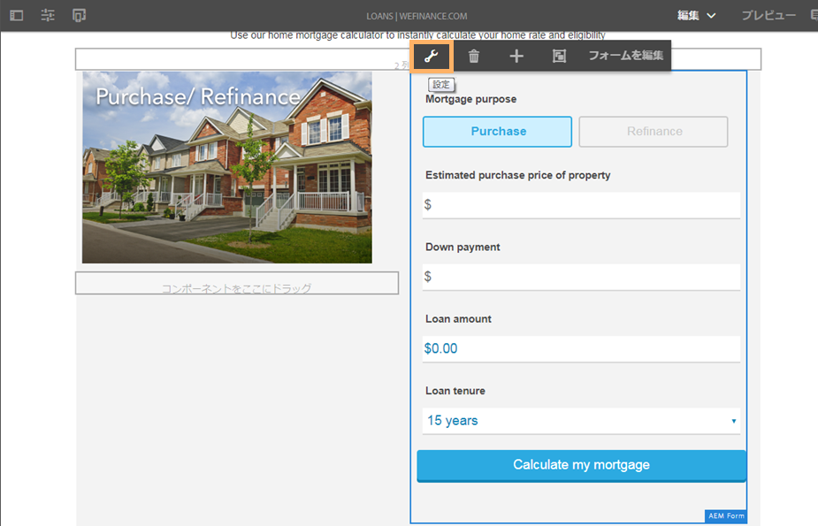
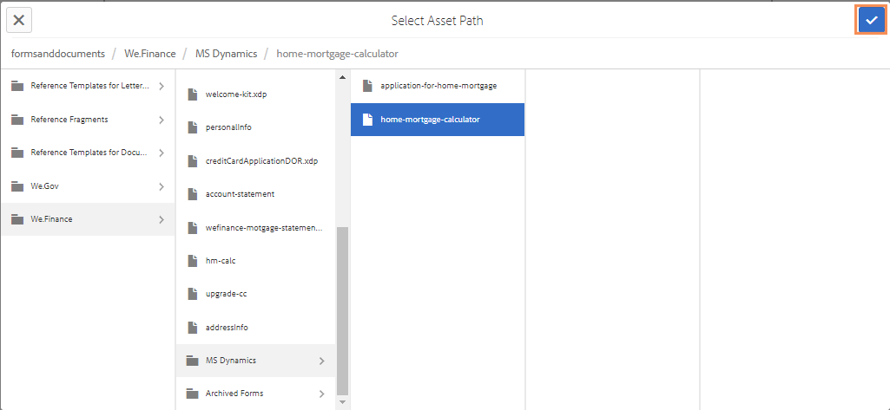

# We.Finance リファレンスサイトの住宅ローンワークフローのための Microsoft Dynamics 365 の設定 {#configure-microsoft-dynamics-for-the-home-mortgage-workflow-of-the-we-finance-reference-site}

We.Finance リファレンスサイトの住宅ローンワークフローでアダプティブフォームを通じてMicrosoft® Dynamics 365 サービスを活用する方法を説明します

## 概要 {#overview}

Microsoft® Dynamics 365 は、顧客関係管理（CRM）および企業資源計画（ERP）用のソフトウェアで、顧客の口座や連絡先、潜在顧客、顧客機会、顧客事例を作成して管理する企業ソリューションを提供します。

AEM Forms はクラウドサービスを提供して、Dynamics 365 を [Forms データ統合](/help/forms/using/data-integration.md)モジュールに統合します。シナリオ [Microsoft® Dynamics を使用した住宅ローン申し込みのチュートリアル](/help/forms/using/finance-reference-site-walkthrough.md#home-mortgage-application-walkthrough-with-microsoft-dynamics) は、お客様がMicrosoft® Dynamics for Forms Data Integration を使用している場合に、We.Finance リファレンスサイトを使用してローンの申し込み方法を示しています。 Microsoft® Dynamics を使用した住宅ローン申し込みのチュートリアルのシナリオを使用する前に、Microsoft® Dynamics 365 を We.Finance 参照サイトで使用するために設定をおこなう必要があります。

## 前提条件 {#prerequisites}

Dynamics 365 のセットアップと設定を開始する前に、次の点を確認してください。

* [AEM Formsリファレンスサイトのセットアップと設定](/help/forms/using/setup-reference-sites.md).

* AEM 6.3 Forms Service Pack 1 以降
* Microsoft® Dynamics 365 アカウント
* Microsoft® Azure Active Directory を使用した Dynamics 365 サービスの登録済みアプリケーション
* 登録済みアプリケーションのクライアント ID とクライアントの秘密鍵

## 住宅ローン計算ツールをサイトのホームページにリンクする {#link-the-home-mortgage-calculator-with-your-site-home-page}

1. オーサーインスタンスで、次のページに移動します。

   https://[サーバー]:[ポート]/editor.html/content/we-finance/global/en/loan-landing-page.html

1. 下にスクロールして住宅ローン計算機を表示します。
1. 右側の列の（計算ツールの）パネルをハイライト表示し、をタップしてポップアップメニューを表示します。 ポップアップメニューで、「設定」をタップします。 「AEM Formsコンテナを編集」ダイアログが表示されます。

   

1. AEM Forms コンテナを編集ダイアログでアセットのパスを参照し、以下のパスにある home-mortgage-calculator を選択して「**確認**」をタップします。

   formsanddocuments/We.Finance/MS Dynamics/

   

1. 「**完了**」をタップします。
1. 編集したページを公開します。

   >[!NOTE]
   >
   >計算フィールドと FDM の連結は、We.Finance リファレンスサイトパッケージを通じて事前に設定されています。 連結を表示するには、オーサリングモードでフォームを開き、フィールドの連結参照を確認します。

1. 住宅ローン申し込みの申し込みの申し込み者レコードを保存するカスタムエンティティを作成するには、AEMFormsFSIRefsite_1_0.zip ソリューションパッケージをMicrosoft® Dynamics インスタンスに読み込みます。

   1. パッケージのダウンロード元：

      `https://[server]:[port]/content/aemforms-refsite-collaterals/we-finance/home-mortgage/ms-dynamics/AEMFormsFSIRefsite_1_0.zip`

   1. ソリューションパッケージを Microsoft® Dynamics インスタンスに読み込みます。Microsoft® Dynamics インスタンスで、**設定**／**ソリューション**&#x200B;に移動し、「**読み込み**」をタップします。

1. リファレンスサイトで使用するユーザーの連絡先の詳細を設定するには、Sarah Rose Contact.CSV パッケージをMicrosoft® Dynamics インスタンスにインポートします。

   1. パッケージのダウンロード元：

      `https://[server]:[port]/content/aemforms-refsite-collaterals/we-finance/home-mortgage/ms-dynamics/Sarah%20Rose%20Contact.csv`

   1. パッケージを Microsoft® Dynamics インスタンスに読み込みます。Microsoft® Dynamics インスタンスで、**営業**／**連絡先**&#x200B;に移動し、「**データを読み込み**」をタップします。
