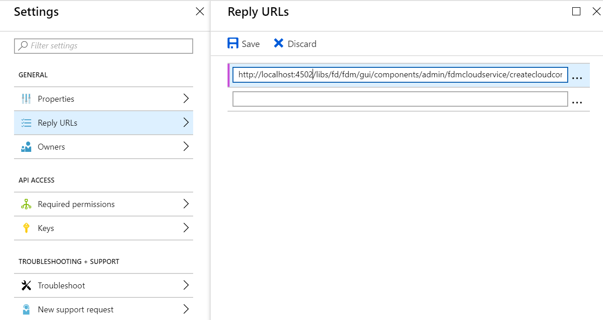
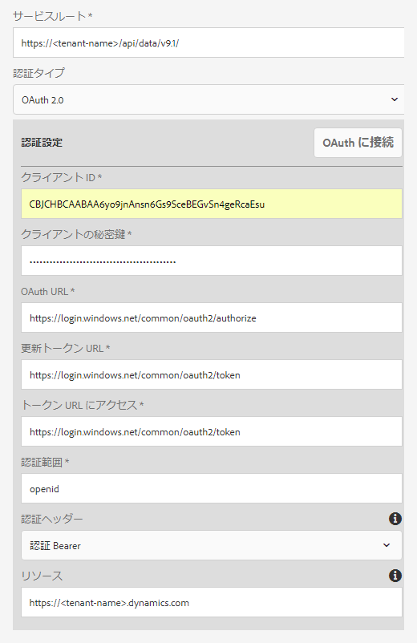

# Microsoft Dynamics OData の設定 {#microsoft-dynamics-odata-configuration}

統合機能の使用方法と、フォームデータモデルでオンラインとオンプレミスの Microsoft Dynamics サービスを使用する方法について説明します。


Microsoft Dynamics は、顧客関係管理（CRM）および企業資源計画（ERP）用のソフトウェアで、顧客の口座や連絡先、潜在顧客、顧客機会、顧客事例を作成して管理する企業ソリューションを提供します。[AEM Forms のデータ統合機能](/help/forms/using/data-integration.md)の OData クラウドサービス設定を使用して、オンラインの Microsoft Dynamics サービスとオンプレミスの Microsoft Dynamics サービスの両方に Forms を統合することができます。これにより、Microsoft Dynamics サービスで定義されているエンティティ、属性、サービスに基づいて、フォームデータモデルを作成できるようになります。フォームデータモデルを使用して、Microsoft Dynamicsサーバーとやり取りし、ビジネスワークフローを有効にするアダプティブフォームを作成できます。 次に例を示します。

* Microsoft Dynamicsサーバーにデータのクエリを実行し、アダプティブフォームを事前入力する
* アダプティブフォーム送信時にMicrosoft Dynamicsにデータを書き込む
* フォームデータモデルで定義されたカスタムエンティティを使用してMicrosoft Dynamicsにデータを書き込む（またはその逆の方法）

AEM Formsアドオンパッケージには、Microsoft DynamicsとAEM Formsをすばやく統合するために利用できる参照用OData設定も含まれています。

パッケージがインストールされると、AEM Forms インスタンス上で以下のエンティティとサービスを使用できるようになります。

* MS Dynamics OData Cloud Service（OData サービス）
* 事前に設定されたMicrosoft Dynamicsエンティティとサービスを含むフォームデータモデル。

Microsoft Dynamicsのエンティティとサービスが事前に設定されたODataCloud Serviceおよびフォームデータモデルは、AEMインスタンスの実行モードが`samplecontent`（デフォルト）に設定されている場合にのみ、AEM Formsインスタンスで使用できます。 AEM インスタンスの実行モードの設定について詳しくは、「[実行モード](/help/sites-deploying/configure-runmodes.md)」を参照してください。

## 前提条件 {#prerequisites}

Microsoft Dynamics の設定を開始する前に、以下の項目が使用可能な状態になっていることを確認する必要があります。

* [AEM 6.4 Formsアドオンパッケージ](https://helpx.adobe.com//experience-manager/6-4/forms/using/installing-configuring-aem-forms-osgi.html)をインストールしました。
* Microsoft Dynamics 365 がオンライン環境で設定されているか、以下のいずれかのバージョンの Microsoft Dynamics のインスタンスがインストールされていること：

   * オンプレミス環境の Microsoft Dynamics 365
   * オンプレミス環境の Microsoft Dynamics 2016

* [Microsoft DynamicsオンラインサービスのアプリケーションをMicrosoft Azure Active Directoryに登録しました](https://docs.microsoft.com/ja-jp/dynamics365/customer-engagement/developer/walkthrough-register-dynamics-365-app-azure-active-directory)。登録済みサービスのクライアント ID（アプリケーション ID）とクライアントの秘密鍵の値を書き留めてください。これらの値は [Microsoft Dynamics サービス用にクラウドサービスを設定する](/help/forms/using/ms-dynamics-odata-configuration.md#configure-cloud-service-for-your-microsoft-dynamics-service)時に使用します。

## 登録された Microsoft Dynamics アプリケーションの応答 URL を設定する {#set-reply-url-for-registered-microsoft-dynamics-application}

以下の手順で、登録された Microsoft Dynamics アプリケーションの応答 URL を設定します。

>[!NOTE]
>
>この手順は、AEM Forms をオンラインの Microsoft Dynamics サーバーと統合する場合にのみ使用してください。

1. Microsoft Azure Active Directory アカウントに移動し、登録済みアプリケーションの「**[!UICONTROL 応答 URL]**」設定に以下のクラウドサービス設定の URL を追加します。

   `https://[server]:[port]/libs/fd/fdm/gui/components/admin/fdmcloudservice/createcloudconfigwizard/cloudservices.html`

   

1. 設定を保存します。

## IFD 用に Microsoft Dynamics を設定する {#configure-microsoft-dynamics-for-ifd}

外部のユーザーは、Microsoft Dynamics でクレームベース認証を使用して、Microsoft Dynamics CRM サーバー上のデータにアクセスすることができます。この機能を有効にするには、以下の手順により、インターネット接続展開（IFD）用に Microsoft Dynamics を有効にして、クレーム設定を構成します。

>[!NOTE]
>
>この手順は、AEM Forms をオンプレミスの Microsoft Dynamics サーバーと統合する場合にのみ使用してください。

1. [Microsoft Dynamics用のIFDの設定](https://technet.microsoft.com/ja-jp/library/dn609803.aspx)の説明に従って、IFD用のMicrosoft Dynamicsオンプレミスインスタンスを設定します。
1. Windows PowerShell を使用して以下のコマンドを実行し、IFD が有効になっている Microsoft Dynamics でクレームを設定します。

   ```
   Add-PSSnapin Microsoft.Crm.PowerShell 
    $ClaimsSettings = Get-CrmSetting -SettingType OAuthClaimsSettings 
    $ClaimsSettings.Enabled = $true 
    Set-CrmSetting -Setting $ClaimsSettings
   ```

   詳しくは、「[CRM オンプレミス（IFD）のアプリ登録](https://msdn.microsoft.com/ja-jp/library/dn531010(v=crm.7).aspx#bkmk_ifd)」を参照してください。

## AD FS マシンで OAuth クライアントを設定する {#configure-oauth-client-on-ad-fs-machine}

OAuth クライアントを Active Directory Federation Services（AD FS）マシンに登録し、AD FS マシンでアクセス権限を設定するには、以下の手順を実行します。

>[!NOTE]
>
>この手順は、AEM Forms をオンプレミスの Microsoft Dynamics サーバーと統合する場合にのみ使用してください。

1. 次のコマンドを実行します。

   `Add-AdfsClient -ClientId “<Client-ID>” -Name "<name>" -RedirectUri "<redirect-uri>" -GenerateClientSecret`

   ここで、

   * `Client-ID` は、任意の GUID ジェネレーターを使用して生成できるクライアント ID です。
   * `redirect-uri` は、AEM Forms 上の Microsoft Dynamics OData クラウドサービスに対する URL です。AEM Formsパッケージと共にインストールされるデフォルトのクラウドサービスは、次のURLにデプロイされます。

      ```
      http://[server]:[port]/libs/fd/fdm/gui/components/admin/fdmcloudservice/createcloudconfigwizard/cloudservices.html
      ```

1. 以下のコマンドを実行して、AD FS マシン上でアクセス権を設定します。

   `Grant-AdfsApplicationPermission -ClientRoleIdentifier “<Client-ID>” -ServerRoleIdentifier <resource> -ScopeNames openid`

   ここで、

   * `resource` は、Microsoft Dynamics の組織 URL です。

1. Microsoft Dynamics では、HTTPS プロトコルが使用されます。Forms サーバーから AD FS のエンドポイントを呼び出すには、AEM Forms が稼働しているコンピューターで `keytool` コマンドを使用して、Microsoft Dynamics のサイト証明書を Java の証明書ストアにインストールします。

## Microsoft Dynamics サービス用にクラウドサービスを設定する {#configure-cloud-service-for-your-microsoft-dynamics-service}

**MS Dynamics ODataCloud Service（ODataサービス）**&#x200B;設定には、デフォルトのOData設定が付属しています。 Odata サービスを設定して Microsoft Dynamics サービスに接続するには、以下の手順を実行します。

1. **[!UICONTROL ツール／クラウドサービス／データソース]**&#x200B;に移動し、`global` 設定フォルダーをタップします。
1. **[!UICONTROL MS Dynamics OData Cloud Service（OData サービス）]**&#x200B;の設定を選択して「**[!UICONTROL プロパティ]**」をタップします。クラウドサービスの設定プロパティを表示するダイアログが開きます。

   「**[!UICONTROL 認証設定]**」タブで、次のように設定します。

   1. 「**[!UICONTROL サービスルート]**」フィールドの値を入力します。Dynamics インスタンスの「**[!UICONTROL 開発者向けリソース]**」に移動し、「サービスルート」フィールドの値を表示します。例えば、https://&lt;tenant-name>/api/data/v9.1/ です。
   1. 「**[!UICONTROL クライアント ID]**」（「**[!UICONTROL アプリケーション ID]**」とも呼ばれます）、「**[!UICONTROL クライアントの秘密鍵]**」、「**[!UICONTROL OAuth URL]**」、「**[!UICONTROL 更新トークン URL]**」、「**[!UICONTROL アクセストークン URL]**」、「**[!UICONTROL リソース]**」の各フィールドのデフォルト値を、Microsoft Dynamics サービス設定の値と置き換えます。Microsoft Dynamicsをフォームデータモデルで設定するには、**[!UICONTROL 「Resource]**」フィールドにDynamicsインスタンスのURLを指定する必要があります。 サービスルート URL を使用して、Dynamics インスタンスの URL を取得します。例えば、[https://org.crm.dynamics.com](https://org.crm.dynamics.com/) です。
   1. Microsoft Dynamicsでの承認プロセスの&#x200B;**[!UICONTROL Authorization Scope]**&#x200B;フィールドに&#x200B;**[!UICONTROL openid]**&#x200B;を指定します。

   

1. 「**[!UICONTROL OAuth に接続]**」をクリックします。Microsoft Dynamics のログインページにリダイレクトされます。
1. Microsoft Dynamicsの資格情報を使用してログインし、を受け入れて、クラウドサービス設定からMicrosoft Dynamicsサービスに接続できるようにします。 このサービスとクラウドサービスとの間に接続を確立する操作は 1 回だけ行います。

   クラウドサービス設定のページに切り替わります。このページには、OData の設定が正常に保存されたことを示すメッセージが表示されます。

これで、MS Dynamics OData Cloud Service（OData サービス）がクラウドサービスとして設定され、Dynamics サービスに接続されます。

## フォームデータモデルの作成 {#create-form-data-model}

AEM Formsパッケージをインストールすると、フォームデータモデル&#x200B;**Microsoft Dynamics FDM**&#x200B;がAEMインスタンスにデプロイされます。 デフォルトでは、フォームデータモデルは、MS Dynamics ODataCloud Service（ODataサービス）で設定されたMicrosoft Dynamicsサービスをデータソースとして使用します。

初めてフォームデータモデルを開くと、設定済みの Microsoft Dynamics サービスにフォームデータモデルが接続され、Microsoft Dynamics インスタンスからエンティティが取得されます。Microsoft Dynamics から取得される「連絡先」エンティティと「潜在顧客」エンティティは、フォームデータモデル内に既に追加されています。

フォームデータモデルを確認するには、**[!UICONTROL フォーム／データ統合]**&#x200B;に移動します。**[!UICONTROL Microsoft Dynamics FDM]** を選択し、「**[!UICONTROL 編集]**」をクリックしてフォームデータモデルを編集モードで開きます。または、次のURLから直接フォームデータモデルを開くこともできます。

`https://[*server*]:[*port*]/aem/fdm/editor.html/content/dam/formsanddocuments-fdm/ms-dynamics-fdm`


次に、フォームデータモデルに基づいてアダプティブフォームを作成し、次のような様々なアダプティブフォームの使用例で使用することができます。

* Microsoft Dynamicsのエンティティとサービスから情報を照会して、アダプティブフォームに事前入力する
* アダプティブフォームのルールを使用して、フォームデータモデルで定義されたMicrosoft Dynamicsサーバーの操作を呼び出す
* 送信されたフォームデータを Microsoft Dynamics のエンティティに書き込む

AEM Forms パッケージに付属したフォームデータモデルのコピーを作成し、要件に合わせてデータモデルとサービスを設定することをお勧めします。これにより、今後のパッケージの更新時に、フォームデータモデルが上書きされることがなくなります。

ビジネスワークフローでのフォームデータモデルの作成および使用について詳しくは、「[データ統合](/help/forms/using/data-integration.md)」を参照してください。
