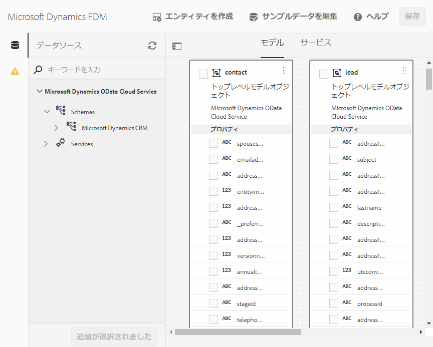

# Microsoft Dynamics OData の設定 {#microsoft-dynamics-odata-configuration}

統合機能の使用方法と、フォームデータモデルでオンラインとオンプレミスの Microsoft Dynamics サービスを使用する方法について説明します。


Microsoft Dynamics は、顧客関係管理 (CRM) およびエンタープライズリソース計画 (ERP) ソフトウェアで、顧客アカウント、連絡先、リード、商談、事例を作成および管理するためのエンタープライズソリューションを提供します。 [AEM Forms Data Integration](/help/forms/using/data-integration.md) は、Formsをオンラインとオンプレミスの両方のMicrosoft Dynamics サーバーと統合するための OData クラウドサービス設定を提供します。 これにより、Microsoft Dynamics サービスで定義されたエンティティ、属性、サービスに基づいてフォームデータモデルを作成できます。 フォームデータモデルを使用して、Microsoft Dynamics サーバーと連携するアダプティブフォームを作成することにより、ビジネスワークフローを使用できるようになります。次に例を示します。

* Microsoft Dynamics サーバーに対してクエリーを実行し、各種のデータや事前に設定されているアダプティブフォームを照会する
* アダプティブフォームの送信時に、データを Microsoft Dynamics に書き込む
* フォームデータモデル内で定義されているカスタムエンティティを使用して、データを Microsoft Dynamics に書き込む（またはその逆の動作）

AEM Forms アドオンパッケージパッケージには、Microsoft Dynamics を AEM Forms に素早く統合するのに役立つ参照 OData 設定も含まれています。

パッケージをインストールすると、AEM Formsインスタンスで次のエンティティとサービスを使用できるようになります。

* MS Dynamics ODataCloud Service（OData サービス）
* Microsoft Dynamics の各種エンティティとサービスが事前設定されたフォームデータモデル。

Microsoft Dynamics のエンティティとサービスが事前設定された ODataCloud Serviceとフォームデータモデルは、AEMインスタンスの実行モードがに設定されている場合にのみ、AEM Formsインスタンスで使用できます `samplecontent`（デフォルト）。 AEMインスタンスの実行モードの設定について詳しくは、 [実行モード](/help/sites-deploying/configure-runmodes.md).

## 前提条件 {#prerequisites}

Microsoft Dynamics のセットアップと設定を開始する前に、次の点を確認してください。

* をインストールする [AEM 6.4 Formsアドオンパッケージ](https://helpx.adobe.com//experience-manager/6-4/forms/using/installing-configuring-aem-forms-osgi.html)
* Microsoft Dynamics 365 をオンラインで設定したか、以下のMicrosoft Dynamics バージョンのいずれかのインスタンスをインストールしました。

   * Microsoft Dynamics 365 オンプレミス
   * Microsoft Dynamics 2016 オンプレミス

* [Microsoft Dynamics オンラインサービスのアプリケーションを Microsoft Azure Active Directory に登録している](https://docs.microsoft.com/ja-jp/dynamics365/customer-engagement/developer/walkthrough-register-dynamics-365-app-azure-active-directory)。登録済みサービスのクライアント ID（アプリケーション ID）とクライアントの秘密鍵の値を書き留めてください。これらの値は、 [Microsoft Dynamics サービス用のクラウドサービスの設定](/help/forms/using/ms-dynamics-odata-configuration.md#configure-cloud-service-for-your-microsoft-dynamics-service).

## 登録済みMicrosoft Dynamics アプリケーションの返信 URL を設定 {#set-reply-url-for-registered-microsoft-dynamics-application}

次の手順を実行して、登録済みのMicrosoft Dynamics アプリケーションの返信 URL を設定します。

>[!NOTE]
>
>この手順は、AEM FormsとオンラインMicrosoft Dynamics サーバーを統合する場合にのみ使用してください。

1. Microsoft Azure Active Directory アカウントに移動し、登録済みアプリケーションの「**[!UICONTROL 応答 URL]**」設定に以下のクラウドサービス設定の URL を追加します。

   `https://[server]:[port]/libs/fd/fdm/gui/components/admin/fdmcloudservice/createcloudconfigwizard/cloudservices.html`

   

1. 設定を保存します。

## IFD 用のMicrosoft Dynamics の設定 {#configure-microsoft-dynamics-for-ifd}

Microsoft Dynamics では、要求ベースの認証を使用して、Microsoft Dynamics CRM サーバー上のデータに外部ユーザーがアクセスできるようにします。 これを有効にするには、次の手順を実行して、Microsoft Dynamics for Internet-facing Deployment (IFD) を構成し、要求の設定を構成します。

>[!NOTE]
>
>この手順は、AEM FormsとオンプレミスのMicrosoft Dynamics サーバーを統合する場合にのみ使用してください。

1. 「[Configure IFD for Microsoft Dynamics](https://technet.microsoft.com/ja-jp/library/dn609803.aspx)」の説明に従い、オンプレミス環境の Microsoft Dynamics インスタンスを IFD 用に設定します。
1. Windows PowerShell を使用して以下のコマンドを実行し、IFD が有効になっている Microsoft Dynamics でクレームを設定します。

   ```
   Add-PSSnapin Microsoft.Crm.PowerShell 
    $ClaimsSettings = Get-CrmSetting -SettingType OAuthClaimsSettings 
    $ClaimsSettings.Enabled = $true 
    Set-CrmSetting -Setting $ClaimsSettings
   ```

   詳しくは、「[CRM オンプレミス（IFD）のアプリ登録](https://msdn.microsoft.com/ja-jp/library/dn531010(v=crm.7).aspx#bkmk_ifd)」を参照してください。

## AD FS マシンで OAuth クライアントを設定する {#configure-oauth-client-on-ad-fs-machine}

OAuth クライアントを Active Directory Federation Services（AD FS）マシンに登録し、AD FS マシンでアクセス権限を設定するには、以下の手順を実行します。

>[!NOTE]
>
>この手順は、AEM FormsとオンプレミスのMicrosoft Dynamics サーバーを統合する場合にのみ使用してください。

1. 次のコマンドを実行します。

   `Add-AdfsClient -ClientId “<Client-ID>” -Name "<name>" -RedirectUri "<redirect-uri>" -GenerateClientSecret`

   各パラメーターの意味は次のとおりです。

   * `Client-ID` は、任意の GUID ジェネレーターを使用して生成できるクライアント ID です。
   * `redirect-uri` は、AEM Forms 上の Microsoft Dynamics OData クラウドサービスに対する URL です。AEM Forms パッケージと共にインストールされるデフォルトのクラウドサービスは、次の URL にデプロイされます。

      ```
      http://[server]:[port]/libs/fd/fdm/gui/components/admin/fdmcloudservice/createcloudconfigwizard/cloudservices.html
      ```

1. 以下のコマンドを実行して、AD FS マシン上でアクセス権を設定します。

   `Grant-AdfsApplicationPermission -ClientRoleIdentifier “<Client-ID>” -ServerRoleIdentifier <resource> -ScopeNames openid`

   各パラメーターの意味は次のとおりです。

   * `resource` は、Microsoft Dynamics の組織 URL です。

1. Microsoft Dynamics では、HTTPS プロトコルが使用されます。Forms サーバーから AD FS のエンドポイントを呼び出すには、AEM Forms が稼働しているコンピューターで `keytool` コマンドを使用して、Microsoft Dynamics のサイト証明書を Java の証明書ストアにインストールします。

## Microsoft Dynamics サービス用にクラウドサービスを設定する {#configure-cloud-service-for-your-microsoft-dynamics-service}

**MS Dynamics OData Cloud Service（OData サービス）**&#x200B;の設定は、デフォルトの OData 設定に付属しています。Odata サービスを設定して Microsoft Dynamics サービスに接続するには、以下の手順を実行します。

1. **[!UICONTROL ツール／クラウドサービス／データソース]**&#x200B;に移動し、`global` 設定フォルダーをタップします。
1. 選択 **[!UICONTROL MS Dynamics ODataCloud Service（OData サービス）]** 設定およびタップします。 **[!UICONTROL プロパティ]**. クラウドサービス設定プロパティダイアログが開きます。

   「**[!UICONTROL 認証設定]**」タブで、次のように設定します。

   1. の値を入力します。 **[!UICONTROL サービスルート]** フィールドに入力します。 Dynamics インスタンスの「**[!UICONTROL 開発者向けリソース]**」に移動し、「サービスルート」フィールドの値を表示します。例えば、https://&lt;tenant-name>/api/data/v9.1/ です。
   1. 「**[!UICONTROL クライアント ID]**」（「**[!UICONTROL アプリケーション ID]**」とも呼ばれます）、「**[!UICONTROL クライアントの秘密鍵]**」、「**[!UICONTROL OAuth URL]**」、「**[!UICONTROL 更新トークン URL]**」、「**[!UICONTROL アクセストークン URL]**」、「**[!UICONTROL リソース]**」の各フィールドのデフォルト値を、Microsoft Dynamics サービス設定の値と置き換えます。Microsoft Dynamics をフォームデータモデルで構成するには、「**[!UICONTROL リソース]**」フィールドで Dynamics インスタンスの URL を指定する必要があります。サービスルート URL を使用して、Dynamics インスタンスの URL を取得します。例えば、[https://org.crm.dynamics.com](https://org.crm.dynamics.com/) です。
   1. Microsoft Dynamics の認証プロセス用の「**[!UICONTROL 認証範囲]**」フィールドで、「**[!UICONTROL openid]**」を指定します。

   

1. 「**[!UICONTROL OAuth に接続]**」をクリックします。Microsoft Dynamics のログインページにリダイレクトされます。
1. Microsoft Dynamics の資格情報を使用してログインし、クラウドサービス設定を使用して Microsoft Dynamics サービスに接続することに同意します。クラウドサービスとサービスの間の接続を確立するのは、1 回限りのタスクです。

   クラウドサービスの設定ページが表示され、OData 設定が正常に保存されたことを示すメッセージが表示されます。

これで、MS Dynamics OData Cloud Service（OData サービス）がクラウドサービスとして設定され、Dynamics サービスに接続されます。

## フォームデータモデルの作成 {#create-form-data-model}

AEM Forms パッケージをインストールすると、フォームデータモデルの&#x200B;** Microsoft Dynamics FDM** が AEM インスタンスにデプロイされます。デフォルトの場合、MS Dynamics OData Cloud Service（OData サービス）で定義された Microsoft Dynamics サービスが、フォームデータモデルのデータソースとして使用されます。 

初めてフォームデータモデルを開くと、設定済みのMicrosoft Dynamics サービスに接続して、Microsoft Dynamics インスタンスからエンティティを取得します。 Microsoft Dynamics の「連絡先」エンティティと「リード」エンティティは、既にフォームデータモデルに追加されています。

フォームデータモデルを確認するには、次に移動します。 **[!UICONTROL Forms /データ統合]**. 選択 **[!UICONTROL Microsoft Dynamics FDM]** をクリックし、 **[!UICONTROL 編集]** をクリックして、フォームデータモデルを編集モードで開きます。 または、次の URL から直接フォームデータモデルを開くこともできます。

`https://[*server*]:[*port*]/aem/fdm/editor.html/content/dam/formsanddocuments-fdm/ms-dynamics-fdm`



この後、フォームデータモデルに基づいてアダプティブフォームを作成し、次のようなさまざまな方法でアダプティブフォームを使用できます。

* Microsoft Dynamics のエンティティとサービスに対してクエリーを実行し、取得した情報を使用してアダプティブフォームを事前に設定する
* アダプティブフォームのルールを使用して、フォームデータモデル内で定義された Microsoft Dynamics サーバーの操作を呼び出す
* 送信されたフォームデータを Microsoft Dynamics のエンティティに書き込む

AEM Formsパッケージに付属しているフォームデータモデルのコピーを作成し、要件に合わせてデータモデルとサービスを設定することをお勧めします。 これにより、今後のパッケージの更新で、フォームデータモデルが上書きされないようにすることができます。

ビジネスワークフローでのフォームデータモデルの作成と使用について詳しくは、 [データ統合](/help/forms/using/data-integration.md).
