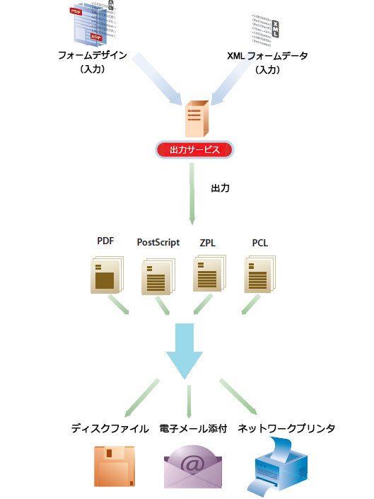

# Output サービス {#output-service}

## 概要 {#overview}

出力サービスは、AEM ドキュメントサービスの一部である OSGi サービスの一種です。Outputサービスは、AEM Forms Designerの様々な出力形式と出力デザイン機能をサポートしています。 出力サービスでは、XFA テンプレートと XML データを変換することにより、様々な形式の印刷ドキュメントを生成することができます。

出力サービスにより、以下のような機能を備えたアプリケーションを作成することができます。

* テンプレートファイルに XML データを格納することで、最終形式のドキュメントを生成する
* 非インタラクティブ PDF、ポストスクリプト、PCL、および ZPL のプリントストリームを含む様々な形式でフォームを出力する
* XFA フォームの PDF ファイルから印刷用 PDF を生成する
* 複数のデータセットを提供されたテンプレートと結合して、PDF、ポストスクリプト、PCLおよびZPLドキュメントを一括生成します。

>[!NOTE]
>
>Output サービスは、32 ビットアプリケーションです。Microsoft Windows では、32 ビットアプリケーションが使用できるメモリは最大 2 GB です。この制限は Output サービスにも適用されます。

## 非インタラクティブ形式のドキュメントを作成する {#creating-non-interactive-form-documents}

通常、テンプレートは AEM Forms Designer を使用して作成します。これらのテンプレートは、出力サービスの `generatePDFOutput` と `generatePrintedOutput` の各 API により、PDF、ポストスクリプト、ZPL や PCL などの様々な形式に直接変換することができます。

`generatePDFOutput`操作でPDFが生成され、`generatePrintedOutput`操作でPostScript、ZPL、PCL形式が生成されます。 各演算の最初のパラメータは、テンプレートファイルの名前（例えば、`ExpenseClaim.xdp`）、またはテンプレートが含まれているドキュメントオブジェクトのいずれかを受け取ります。テンプレートファイルの名前を指定した場合は、テンプレートを含むフォルダへのパスとしてのコンテンツルートも指定します。コンテンツルートは、`PDFOutputOptions`または`PrintedOutputOptions`パラメーターを使用して指定できます。 これらのパラメータを使用して指定できる他のオプションの詳細については、Javadoc を参照してください。

2番目のパラメータは、出力ドキュメントを生成しながら、テンプレートに結合された XML 文書を受け取ります。

`generatePDFOutput` 演算では、XFA ベースの PDF フォームを入力として受け取り、出力として非インタラクティブの PDF フォームを返すこともできます。

## 非インタラクティブ形式のドキュメントを作成する {#generating-non-interactive-form-documents}

たとえば、1 つ以上のテンプレートが存在しており、各テンプレートには XML データの複数のレコードがあるシナリオを考えてみましょう。

各レコードの印刷文書を生成するために、出力サービスの `generatePDFOutputBatch` と `generatePrintedOutputBatch` の演算を使用します。

また、単一のドキュメントにレコードを組み合わせることもできます。いずれの演算でも、4 つのパラメータが必要です。

最初のパラメータはマップであり、この中には、任意の文字列が鍵として、およびテンプレートファイルの名前が値として収められています。

2番目のパラメータは別のマップです。この値は、XML データを含むドキュメントオブジェクトです。この鍵は、最初のパラメータに指定したものと同じものです。

`generatePDFOutputBatch`または`generatePrintedOutputBatch`の3番目のパラメーターは、それぞれ`PDFOutputOptions`または`PrintedOutputOptions`型です。

パラメーターの型は、`generatePDFOutput`操作と`generatePrintedOutput`操作のパラメーターの型と同じで、同じ効果が得られます。

4つ目のパラメーターは`BatchOptions`型で、レコードごとに別のファイルを生成するかどうかを指定します。 このパラメータのデフォルト値は false です。

`generatePrintedOutputBatch`と`generatePDFOutputBatch`の両方は、`BatchResult`型の値を返します。 値には、生成されたドキュメントのリストが含まれています。また、XML形式のメタデータドキュメントも含まれており、この中には、生成された各ドキュメントに関連する情報が収められています。
