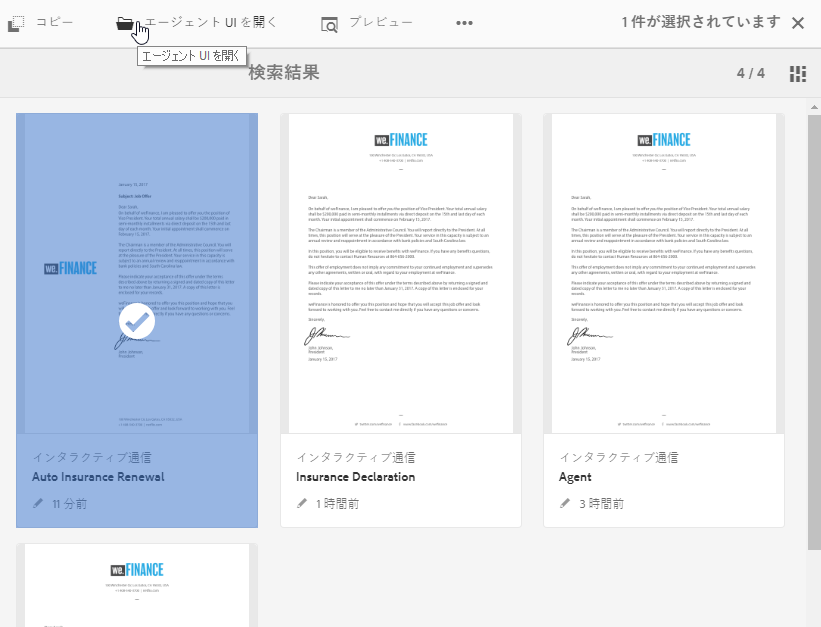
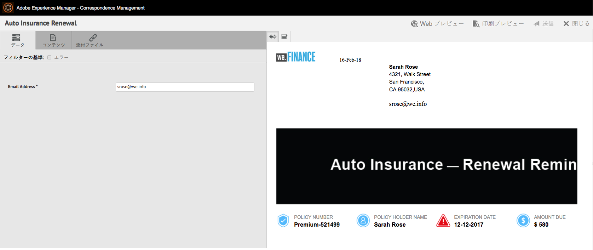
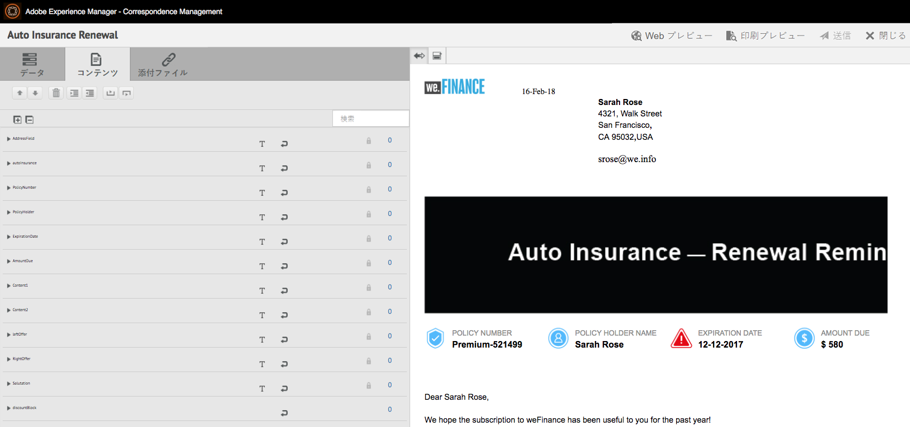
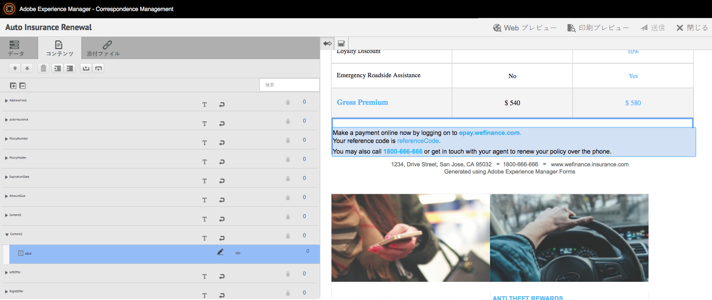
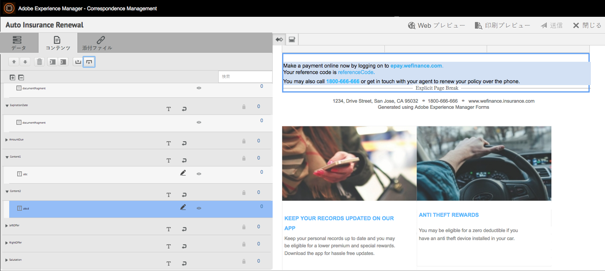
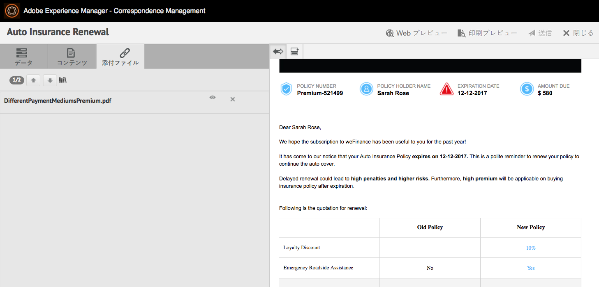
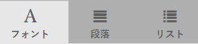
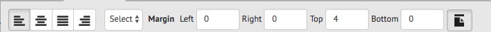
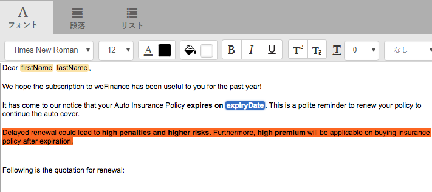
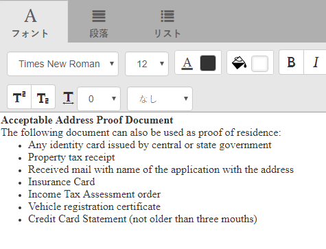

# エージェント UI を使用してインタラクティブ通信の準備と送信を行う {#prepare-and-send-interactive-communication-using-the-agent-ui}

エージェント UI を使用してインタラクティブ通信の準備を行い、後処理用として送信することができます。エージェントは、許可設定に基づいて必要な変更を行い、電子メールの送信や印刷出力などの後処理用としてインタラクティブ通信を送信します。

## 概要 {#overview}

対話型通信の作成後、エージェントはエージェントUIで対話型通信を開き、データを入力し、コンテンツと添付ファイルを管理することで、受信者固有のコピーを作成できます。 最後に、エージェントはインタラクティブ通信を後処理に送信できます。

エージェントUIを使用して対話型通信を準備する際、エージェントは、後処理に送信する前に、エージェントUIで対話型通信の次の側面を管理します。

* **データ**：エージェント UI の「データ」タブには、インタラクティブ通信内の変数とロックが解除されたフォームデータモデルプロパティが表示されます（エージェントを使用して編集できる変数とフォームデータモデルプロパティ）。これらの変数とプロパティは、インタラクティブ通信内のドキュメントフラグメントの編集時または作成時に生成されます。「データ」タブには、XDP テンプレートまたは印刷チャネルテンプレートに組み込まれているフィールドも表示されます。「Data」タブは、エージェントが編集可能なインタラクティブ通信の変数、フォームデータモデルのプロパティまたはフィールドがある場合にのみ表示されます。
* **コンテンツ**：エージェントにより、「コンテンツ」タブに表示される各種コンテンツ（インタラクティブ通信内のドキュメントフラグメントやコンテンツ変数など）が管理されます。エージェントは、ドキュメントフラグメントのプロパティで対話型通信を作成する際に、ドキュメントフラグメントに許可された変更を加えることができます。 また、ドキュメントフラグメントの並べ替え、追加/削除、改ページの追加（可能な場合）を行うこともできます。
* **添付ファイル**:「添付ファイル」タブは、対話型通信に添付ファイルがある場合、またはエージェントがライブラリにアクセスできる場合にのみ、エージェントUIに表示されます。エージェントは添付ファイルの変更や編集を許可される場合とできない場合があります。

## エージェントUIを使用して対話型通信を準備{#prepare-interactive-communication-using-the-agent-ui}

1. **[!UICONTROL フォーム]**／**[!UICONTROL フォームとドキュメント]**&#x200B;を選択します。
1. 適切な対話型通信を選択し、**[!UICONTROL エージェントUIを開く]**&#x200B;をタップします。

   >[!NOTE]
   >
   >エージェントUIは、選択した対話型通信に印刷チャネルがある場合にのみ機能します。

   

   インタラクティブ通信のコンテンツとプロパティに基づいて、エージェント UI に、「データ」タブ、「コンテンツ」タブ、「添付ファイル」タブという 3 つのタブが表示されます。

   

   次に、データの入力、コンテンツの管理、添付ファイルの管理を行います。

### データの入力 {#enter-data}

1. 「データ」タブで、変数のデータ、フォームデータモデルのプロパティ、印刷テンプレート（XDP）のフィールドを、必要に応じて入力します。アスタリスク(&amp;ast;)が付いている必須フィールドをすべて入力し、「**送信**」ボタンを有効にします。

   対話型通信プレビューのデータフィールドの値をタップすると、「データ」タブで対応するデータフィールドが強調表示されます。逆の場合も同様です。

### コンテンツを管理 {#manage-content}

「コンテンツ」タブで、インタラクティブ通信内のドキュメントフラグメントやコンテンツ変数などのコンテンツを管理します。

1. 「**[!UICONTROL コンテンツ]**」を選択します。対話型通信のコンテンツタブが表示されます。

   

1. 必要に応じて、「コンテンツ」タブでドキュメントフラグメントを編集します。コンテンツ階層の関連するフラグメントにフォーカスするには、インタラクティブ通信プレビューで関連する行または段落をタップするか、コンテンツ階層で直接フラグメントをタップします。

   例えば、以下のプレビュー画面で、「Make a payment online now ...」という行が含まれているドキュメントフラグメントを選択すると、「コンテンツ」タブでも同じドキュメントフラグメントが選択されます。

   

   「コンテンツ」タブまたは「データ」タブで、プレビューの左上にある「選択したプレビューをコンテンツ内でハイライト」()をタップすると、関連するテキスト、段落またはデータフィールドをタップまたはで選択したときに、ドキュメントフラグメントに移動する機能を無効または有効にできます。

   対話型通信の作成時にエージェントが編集できるフラグメントには、選択されたコンテンツを編集()アイコンが付きます。 このアイコンをタップすると、フラグメントが編集モードで表示され、フラグメントを編集できるようになります。テキストの書式設定と管理を行うには、以下のオプションを使用します。

   * [書式設定オプション](#formattingtext)

      * [書式設定されたテキストを他のアプリケーションからコピーして貼り付け](#pasteformattedtext)
      * [テキストの一部をハイライト表示](#highlightemphasize)
   * [特殊文字](#specialcharacters)
   * [ショートカットキー](/help/forms/using/keyboard-shortcuts.md)

   エージェント・ユーザー・インタフェース内の様々なドキュメント・フラグメントで使用できるアクションの詳細については、「[エージェント・ユーザー・インタフェースで使用できるアクションと情報](#actionsagentui)」を参照してください。

1. インタラクティブ通信の印刷出力に改ページを追加するには、改ページを挿入する位置にカーソルを置き、前の改ページまたは後の改ページ()を選択します。

   インタラクティブ通信に、改ページのプレースホルダーが明示的に挿入されます。この明示的な改ページによってインタラクティブ通信の外観がどのように変わるのかを確認するには、印刷出力をプレビュー表示します。

   

   次に、インタラクティブ通信の添付ファイルの管理を行います。

### 添付ファイルの管理  {#manage-attachments}

1. 「**[!UICONTROL 添付ファイル]**」を選択します。 エージェントUIは、対話型通信の作成時に設定したとおりに、使用可能な添付ファイルを表示します。

   表示アイコンをタップして、Interactive Communicationと共に添付ファイルを送信しないように選択できます。また、添付ファイルの×印をタップすると、添付ファイルを削除（エージェントが添付ファイルを削除または非表示にできる場合）をInteractive Communicationから削除できます。 インタラクティブ通信の作成時に必須ファイルとして指定された添付ファイルの場合、ビューアイコンと削除アイコンは無効になります。

   

1. ライブラリアクセス（）アイコンをタップしてコンテンツライブラリにアクセスし、添付ファイルとしてDAMアセットを挿入します。

   >[!NOTE]
   >
   >ライブラリアクセスアイコンは、Interactive Communicationの作成中に(印刷チャネルのドキュメントコンテナのプロパティで)ライブラリアクセスが有効になっている場合にのみ使用できます。

1. インタラクティブ通信の作成時に、添付ファイルの順序をロックしなかった場合は、添付ファイルを選択して上下の矢印をタップすると、添付ファイルの順序を変更することができます。
1. Web プレビューと印刷プレビューを使用して、2 つの出力が正しく作成されているかどうかを確認します。

   十分な結果が得られるプレビューが見つかった場合は、「**[!UICONTROL 送信]**」をタップして、インタラクティブ通信を後処理に送信または送信します。 または、変更を行うには、プレビューを終了して変更に戻ります。

## テキストの書式設定 {#formattingtext}

エージェント UI でテキストフラグメントを編集する場合、編集のタイプ（フォント、段落、リスト）に応じて、表示されるツールバーが異なります。

 

フォントツールバー

段落ツールバー

リストツールバー

### テキストの一部をハイライト表示または強調表示する  {#highlightemphasize}

編集可能なフラグメント内のテキストの一部をハイライト表示または強調表示するには、目的のテキストを選択して「ハイライト表示の色」をタップします。

### 書式設定されたテキストの貼り付け {#pasteformattedtext}

### テキスト内に特殊文字を挿入する {#specialcharacters}

エージェント UI では、210 個の特殊文字がサポートされています。管理者は、カスタマイズ](/help/forms/using/custom-special-characters.md)によって、追加/カスタムの特殊文字のサポートを追加できます。[

#### 添付ファイルの配信 {#attachmentdelivery}

* Server-side APIを使用してインタラクティブ通信がインタラクティブまたは非インタラクティブPDFとしてレンダリングされる場合、レンダリングされるPDFには、添付ファイルがPDF添付ファイルとして含まれます。
* インタラクティブ通信に関連付けられた後処理がエージェントUIを使用して送信の一部として読み込まれると、添付ファイルはリスト&lt;com.adobe.idp.ドキュメント> inAttachmentDocsパラメーターとして渡されます。
* 配信メカニズムワークフロー（電子メールや印刷出力など）により、PDF 版のインタラクティブ通信と共に添付ファイルも配信されます。

## エージェント UI で使用できる操作と情報  {#actionsagentui}

### ドキュメントフラグメント {#document-fragments}

* **上矢印と下矢印**：上矢印と下矢印を使用して、インタラクティブ通信内のドキュメントフラグメントを上下に移動することができます。
* **削除**:可能な場合は、ドキュメントフラグメントをインタラクティブ通信から削除します。
* **直前に改ページ**：（ターゲット領域の子フラグメントで使用可能）ドキュメントフラグメントの直前に改ページが挿入されます。
* **インデント**:ドキュメントフラグメントのインデントを増減します。
* **直後に改ページ** (ターゲット領域の子フラグメントに適用):ドキュメントフラグメントの後に改ページを挿入します。

* 編集：（テキストフラグメントの場合のみ）テキストドキュメントフラグメントを編集するためのリッチテキストエディターが起動します。詳しくは、[テキストのフォーマット](#formattingtext)を参照してください。

* 選択（目のアイコン）：インタラクティブ通信にドキュメントフラグメントを含めたり、インタラクティブ通信からドキュメントフラグメントを除外したりすることができます。
* 未入力値：ターゲット領域の未入力変数の数が表示されます。これは、表示専用情報です。

### リストドキュメントフラグメント  {#list-document-fragments}

* 空白行を挿入： 空白行を挿入します。
* 選択（目のアイコン）：インタラクティブ通信にドキュメントフラグメントを含めたり、インタラクティブ通信からドキュメントフラグメントを除外したりすることができます。
* 箇条書き／番号付けをスキップ：リストドキュメントフラグ内で、箇条書きまたは番号付けをスキップすることができます。
* 未入力値：ターゲット領域の未入力変数の数が表示されます。これは、表示専用情報です。

