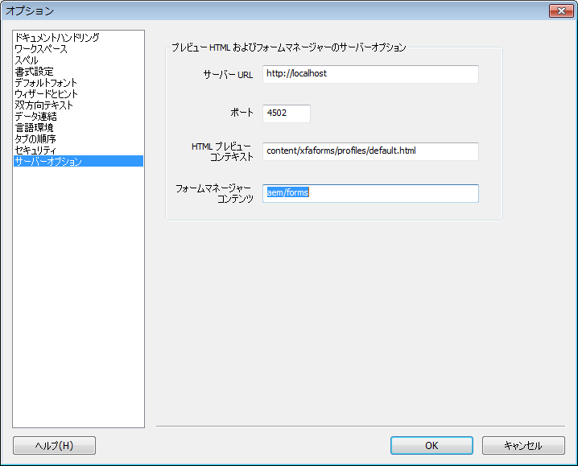

# XDP フォームの HTML5 プレビューの生成 {#generate-html-preview-of-an-xdp-form}

AEM Forms Designer でフォームをデザインする際には、フォームのPDFレンディションをプレビューする以外に、フォームのHTML5 レンディションをプレビューすることもできます。 以下を使用して、 **プレビューHTML** タブを使用して、フォームがブラウザーに表示される状態をプレビューします。

## Designer での XDP フォームのHTMLプレビューの有効化 {#html-preview-of-forms-in-forms-designer}

Designer で XDP フォームのHTMLプレビューを生成できるようにするには、次の設定を実行します。

* Apache Sling Authentication Service の設定
* 保護モードの無効化
* AEM Forms サーバーの詳細の指定

### Apache Sling Authentication Service の設定 {#configure-apache-sling-authentication-service}

1. OSGi で実行されている AEM Forms では `https://[server]:[port]/system/console/configMgr`、

   JEE で実行されている AEM Forms では `https://[server]:[port]/lc/system/console/configMgr` に移動します。

1. **Apache Sling Authentication Service** 設定を探してクリックし、編集モードで開きます。 

1. AEM Forms を OSGi または JEE のどちらで実行しているかにより、**Authentication Requirements** フィールドで以下を追加します。

   * JEE 上の AEM Forms

      * -/content/xfaforms
      * -/etc/clientlibs
   * OSGi 上の AEM Forms

      * -/content/xfaforms
      * -/etc/clientlibs/fd/xfaforms

   >[!NOTE]
   >
   >「認証要件」フィールドで指定した値をコピー&amp;ペーストしないでください。値の特殊文字が破損する可能性があります。 代わりに、指定した値をフィールドに入力します。

1. でのユーザー名とパスワードの指定 **[!UICONTROL 匿名ユーザー名]** および **[!UICONTROL 匿名ユーザーパスワード]** フィールドに設定されます。 指定された資格情報は、匿名認証を処理し、匿名ユーザーへのアクセスを許可するために使用されます。
1. 「**保存**」をクリックして、設定を保存します。

### 保護モードの無効化 {#disable-protected-mode}

この [保護モード](/help/forms/using/get-xdp-pdf-documents-aem.md) デフォルトではオンです。 実稼動環境で有効にしたままにします。 開発環境で無効にして、開発者でHTML5 Formsをプレビューできます。 このモードを無効にするには、以下の手順を実行します。

1. 管理者として AEM Web コンソールにログインします。

   * OSGi 上の AEM Forms の URL：`https://[server]:[port]/system/console/configMgr`
   * JEE 上の AEM Forms の URL：`https://[server]:[port]/lc/system/console/configMgr`

1. 開く **[!UICONTROL モバイルForms設定]** （編集用）
1. 選択を解除する **[!UICONTROL 保護モード]** オプションを選択し、 **[!UICONTROL 保存]**.

### AEM Forms サーバーの詳細の指定 {#provide-details-of-aem-forms-server}

1. Designer で、**ツール**／**オプション**&#x200B;に移動します。
1. オプションウィンドウで&#x200B;**サーバーオプション**&#x200B;ページを選択し、次の詳細を提供して「**OK**」をクリックします。

   * **Server URL**：AEM Forms サーバーの URL です。
   * **HTTP ポート番号**:AEMサーバーポート。 デフォルト値は 4502 です。
   * **HTML Preview Context：** XFA フォームのレンダリングに使用するプロファイルのパス。Designer でのフォームのプレビューには、次のプロファイルがデフォルトで使用されています。ただし、カスタムプロファイルへのパスを指定することもできます。

      * `/content/xfaforms/profiles/default.html` (OSGi 上の AEM Forms)
      * `/lc/content/xfaforms/profiles/default.html` (JEE 上の AEM Forms)
   * **Forms Manager コンテキスト：** Forms Manager UI がデプロイされるコンテキストパス。 デフォルト値は次のとおりです。

      * `/aem/forms` (OSGi 上の AEM Forms)
      * `/lc/forms` (JEE 上の AEM Forms)

   **注意：** *AEM Formsサーバーが起動および実行中であることを確認します。 HTML プレビューは、プレビューを*&#x200B;生成&#x200B;*するために CRX サーバーに接続します。*

   

   AEM Forms Designer のオプション

1. フォームを HTML でプレビューするには、「**HTML プレビュー**」タブをクリックします。

   >[!NOTE]
   >
   >[HTMLプレビュー ] タブが閉じている場合は、F4 キーを押して [ プレビューHTML] タブを開きます。 [ 表示 ] メニューの [ プレビューHTML] を選択して、[ プレビューHTML] タブを開くこともできます。

   >[!NOTE]
   >
   >HTML プレビューは PDF ドキュメントをサポートしません。HTML プレビューは XDP ドキュメント専用です。

## サンプルデータを使用してフォームをプレビューするには {#to-preview-a-form-using-sample-data}

Designer では、サンプルの XML データを使用してフォームをプレビューし、テストすることができます。 フォームが正しくレンダリングされることを確認するために、サンプルデータを使用して頻繁にフォームをテストすることをお勧めします。

サンプルデータがない場合は、Designer で作成することも、自分で作成することもできます。 ( [フォームをプレビューするサンプルデータを自動的に生成するには](https://help.adobe.com/ja_JP/AEMForms/6.1/DesignerHelp/WS107c29ade9134a2c136ae6f212a1f379c94-8000.2.html#WS92d06802c76abadb-728f46ac129b395660c-7efe.2) および [フォームをプレビューするサンプルデータを作成するには](https://help.adobe.com/ja_JP/AEMForms/6.1/DesignerHelp/WS107c29ade9134a2c136ae6f212a1f379c94-8000.2.html#WS92d06802c76abadb-728f46ac129b395660c-7eff.2).)

サンプルデータソースを使用してフォームをテストすると、データとフィールドがマッピングされ、繰り返しサブフォームが想定どおりに繰り返されることを確認できます。 各オブジェクトに適したスペースを提供し、結合されたデータを表示するバランスのとれたフォームレイアウトを作成できます。

1. **ファイル／フォームのプロパティ**&#x200B;を選択します。

1. 「**プレビュー**」タブをクリックし、「データファイル」ボックスに、テストデータファイルへの完全なパスを入力します。参照ボタンを使用してファイルを指定することもできます。

1. 「**OK**」をクリックします。次回に「**HTML プレビュー**」タブでフォームをプレビューするときには、それぞれのオブジェクトにサンプル XML ファイルからのデータ値が表示されます。

## リポジトリ内のフォームをプレビューする {#html-preview-of-forms-in-forms-manager}

AEM Formsでは、リポジトリ内のフォームやドキュメントをプレビューできます。 プレビューを使用すると、エンドユーザーが使用する際のフォームの外観と動作を正確に把握できます。

[**サポートへのお問い合わせ**](https://www.adobe.com/jp/account/sign-in.supportportal.html)
