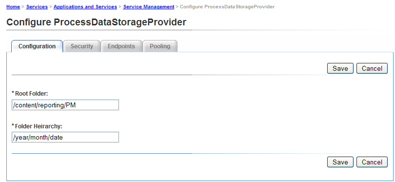
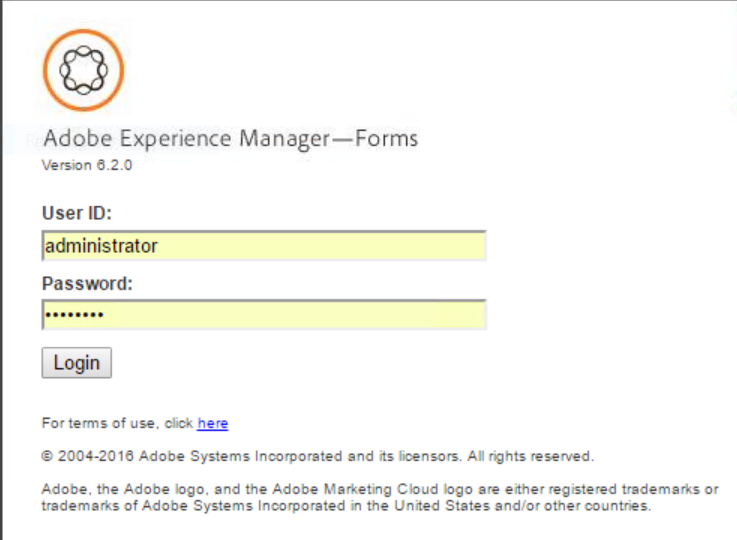

# プロセスレポートの概要 {#getting-started-with-process-reporting}

プロセスレポートを使用すると、AEM Formsのユーザーは、AEM Forms実装で現在定義されているAEM Formsプロセスに関する情報を照会できます。 ただし、プロセスレポートは、AEM Formsリポジトリから直接データにアクセスするわけではありません。 データは、最初にスケジュールに従って Process Reporting リポジトリに公開されます (*ProcessDataPublisher および ProcessDataStorage サービスによって* s) です。 次に、プロセスレポートのレポートとクエリは、リポジトリに公開されたプロセスレポートデータから生成されます。 Process Reporting は、インストールモジュールの一部としてForms Workflowされます。

この記事では、Process Reporting リポジトリにAEM Formsデータを公開する手順を説明します。 その後、プロセスレポートを使用して、レポートとクエリを実行できます。 この記事では、Process Reporting サービスの設定に使用できるオプションについても説明します。

## プロセスレポートの前提条件 {#process-reporting-pre-requisites}

### 不要なプロセスのパージ {#purge-non-essential-processes}

現在Forms Workflowを使用している場合、AEM Formsデータベースに大量のデータが含まれている可能性があります

Process Reporting 公開サービスは、データベースで現在使用可能なすべてのAEM Formsデータを公開します。 つまり、レポートやクエリを実行する必要がないレガシーデータがデータベースに含まれている場合、そのデータはレポートに必要ないにもかかわらず、すべてリポジトリにも公開されます。 このデータは、サービスを実行して Process Reporting リポジトリに公開する前にパージすることをお勧めします。 これにより、パブリッシャーサービスと、レポート用にデータをクエリするサービスの両方のパフォーマンスが向上します。

AEM Formsプロセスデータのパージについて詳しくは、 [プロセスデータのパージ](https://help.adobe.com/en_US/livecycle/11.0/AdminHelp/WS92d06802c76abadb-5145d5d12905ce07e7-7cb2.2.html).

>[!NOTE]
>
>パージユーティリティのヒントとテクニックについては、 Adobe Developer Connectionの記事 ( [プロセスとジョブのパージ](https://www.adobe.com/content/dam/Adobe/en/devnet/livecycle/pdfs/purging_processes_jobs.pdf).

## Process Reporting Services の構成 {#configuring-process-reporting-services}

### プロセスデータの公開をスケジュール {#schedule-process-data-publishing}

Process Reporting Services は、AEM Formsデータベースから Process Reporting リポジトリにデータをスケジュールに従って公開します。

この操作はリソースを大量に消費する可能性があり、AEM Formsサーバーのパフォーマンスに影響を与える可能性があります。 AEM Formsサーバーのビジータイムスロット外でスケジュールすることをお勧めします。

デフォルトでは、データの公開は毎日午前 2 時に実行されるようにスケジュールされています。

公開スケジュールを変更するには、次の手順を実行します。

>[!NOTE]
>
>クラスターでAEM Forms実装を実行している場合は、クラスターの各ノードで次の手順を実行します。

#### JBoss Application Server {#jboss-application-server}

1. AEM Formsサーバーインスタンスを停止します。
   * （Windows の場合） `[*JBoss root*]/bin/run.conf.bat` ファイルを編集します。
   * （Linux、AIX、Solaris の場合） `[*JBoss root*]/bin/run.conf.sh` ファイルを編集します。

1. JVM 引数を追加します。 `-Dreporting.publisher.cron = <expression>.`

   例：次の Cron 式を使用すると、Process Reporting は 5 時間ごとにAEM Formsデータを Process Reporting リポジトリに公開します。

   * `-Dreporting.publisher.cron = 0_0_0/5_*_*_?`

1. `run.conf.bat` ファイルを保存して閉じます。

1. AEM Formsサーバーインスタンスを再起動します。

#### WebSphere Application Server {#websphere-application-server}

1. AEM Formsサーバーインスタンスを停止します。
1. WebSphere Administrative Console にログインします。ナビゲーションツリーで、 **サーバー** >  **アプリケーションサーバー** 次に、右側のウィンドウで、サーバ名をクリックします。

1. 「Server Infrastructure」で、 **Java と Process Management** > **プロセス定義**.

1. 「Additional Properties」で、「**Java Virtual Machine**」をクリックします。

   「 Generic JVM arguments 」ボックスに引数を追加します。 `-Dreporting.publisher.cron = <expression>.`

   **例**:次の Cron 式を使用すると、Process Reporting は 5 時間ごとにAEM Formsデータを Process Reporting リポジトリに公開します。

   * `-Dreporting.publisher.cron = 0_0_0/5_*_*_?`

1. クリック **適用**、「 OK 」をクリックし、 **マスター設定に直接保存**.

1. AEM Formsサーバーインスタンスを再起動します。

#### WebLogic Application Server {#weblogic-application-server}

1. AEM Formsサーバーインスタンスを停止します。
1. WebLogic 管理コンソールにログインします。 WebLogic 管理コンソールのデフォルトのアドレスは、 `https://[hostname]:[port]/console`.

1. Change Center で、「**Lock &amp; Edit**」をクリックします。

1. 「Domain Structure」で、**Environment**／**Servers** をクリックし、右側のウィンドウで、管理対象サーバー名をクリックします。

1. 次の画面で、「**Configuration**」タブ／「**Server Start**」タブをクリックします。

1. 「引数」ボックスに、JVM 引数を追加します。 `-Dreporting.publisher.cron = <expression>`.

   **例**:次の Cron 式を使用すると、Process Reporting は 5 時間ごとにAEM Formsデータを Process Reporting リポジトリに公開します。

   `-Dreporting.publisher.cron = 0_0_0/5_*_*_?`

1. 「**Save**」をクリックし、「**Activate Changes**」をクリックします。

1. AEM Formsサーバーインスタンスを再起動します。

### ProcessDataStorage サービス {#processdatastorage-service}

ProcessDataStorageProvider サービスは、ProcessDataPublisher サービスからプロセスデータを受け取り、そのデータを Process Reporting リポジトリに保存します。

公開サイクルごとに、データは事前に定義されたルートフォルダーのサブフォルダーに保存されます。

管理コンソールを使用して、ルート (**デフォルト**: `/content/reporting/pm`) の場所とサブフォルダー (**デフォルト**: `/yyyy/mm/dd/hh/mi/ss`) プロセスデータを保存する階層形式。

#### Process Reporting リポジトリの場所を設定するには {#to-configure-the-process-reporting-repository-locations}

1. にログインします。 **管理コンソール** 管理者の資格情報を持つ。 管理コンソールのデフォルト URL は、 `https://[server]:[port]/adminui`
1. に移動します。 **ホーム** >  **サービス** >  **アプリケーションとサービス** > **サービス管理** をクリックし、 **ProcessDataStorageProvider** サービス。

   

   **RootFolder**

   レポート用にプロセスデータが格納される CRX の場所。

   `Default`: `/content/reporting/pm`

   **フォルダー階層**

   プロセス作成時間に基づいて、プロセスデータが格納されるフォルダー階層。

   `Default`: `/yyyy/mm/dd/hh/mi/ss`

1. 「**保存**」をクリックします。

### ReportConfiguration サービス {#reportconfiguration-service}

ReportConfiguration サービスは、プロセスレポートクエリサービスを設定するために、プロセスレポートで使用されます。

#### ReportingConfiguration サービスを設定するには、以下を実行します。 {#to-configure-the-reportingconfiguration-service}

1. にログインします。 **Configuration Manager** CRX 管理者の資格情報を持つ。 Configuration Manager のデフォルトの URL は、 `https://[*server*]:[*port*]/lc/system/console/configMgr`
1. を開きます。 **ReportingConfiguration** サービス。
1. **レコード数**

   リポジトリでクエリを実行すると、結果に大量のレコードが含まれる可能性があります。 結果セットが大きい場合、クエリの実行によってサーバーリソースが消費される可能性があります。

   大きな結果セットを処理するために、ReportConfiguration サービスはクエリ処理を複数のレコードに分割します。 これにより、システムの負荷が軽減されます。

   `Default`: `1000`

   **CRX ストレージパス**

   レポート用にプロセスデータを保存する CRX の場所。

   `Default`: `/content/reporting/pm`

   >[!NOTE]
   >
   >これは、ProcessDataStorage 構成オプションで指定した場所と同じです **ルートフォルダー**.
   >
   >ProcessDataStorage 設定の「Root Folder」オプションを更新する場合は、ReportConfiguration サービスの CRX Storage Path の場所を更新する必要があります。

1. クリック **保存** と閉じます。 **CQ Configuration Manager**.

### ProcessDataPublisher サービス {#processdatapublisher-service}

ProcessDataPublisher サービスは、AEM Formsデータベースからプロセスデータをインポートし、そのデータを ProcessDataStorageProvider サービスにパブリッシュして保存します。

#### ProcessDataPublisher サービスを設定するには   {#to-configure-processdatapublisher-service-nbsp}

1. にログインします。 **管理コンソール** 管理者の資格情報を持つ。

   デフォルトの URL は `https://[server]:port]/adminui/` です。

1. に移動します。 **ホーム** >  **サービス** >  **アプリケーションとサービス** > **サービス管理** をクリックし、 **ProcessDataPublisher** サービス。

**データを公開**

プロセスデータの公開を開始するには、このオプションを有効にします。 デフォルトでは、このオプションは無効になっています。

プロセス・レポート・コンポーネントに関連するすべての構成が適切に設定されている場合にのみ、プロセス・レポートを有効にします。

または、不要になったプロセスデータの公開を無効にするには、このオプションを使用します。

`Default`: `Off`

**バッチ間隔（秒）**

ProcessDataPublisher サービスが実行されるたびに、サービスは最初に、Batch Interval によってサービスの最後の実行からの時間を分割します。 次に、このサービスはAEM Formsデータの各間隔を個別に処理します。

これは、サイクル内の各実行（バッチ）中にパブリッシャーが処理するデータのサイズを制御するのに役立ちます。

例えば、パブリッシャーが毎日実行する場合、1 回の実行で 1 日分のデータ全体を処理する代わりに、デフォルトでは、処理を 1 時間ごとに 24 個のバッチに分割します。

`Default`: `3600`

`Unit`: `Seconds`

**ロックタイムアウト（秒）**

パブリッシャーサービスは、データの処理を開始する際にロックを取得するので、パブリッシャーの複数のインスタンスが実行を開始したり、データを同時に処理したりすることはありません。

ロックを取得したパブリッシャーサービスがロックタイムアウト値で定義された秒数の間アイドル状態の場合は、そのロックが解除され、他のパブリッシャーサービスインスタンスが処理を続行できるようになります。

`Default`: `3600`

`Unit`: `Seconds`

**データの公開元**

AEM Forms環境には、環境が設定された時点のデータが含まれています。

デフォルトでは、ProcessDataPublisher サービスはAEM Formsデータベースからすべてのデータをインポートします。

レポートのニーズに応じて、特定の日時の後にデータに対してレポートやクエリを実行する予定がある場合は、日時を指定することをお勧めします。 その後、公開サービスはその日付以降に公開されます。

`Default`: `01-01-1970 00:00:00`

`Format`: `dd-MM-yyyy HH:mm:ss`

## プロセス・レポートのユーザー・インタフェースへのアクセス {#accessing-the-process-reporting-user-interface}

プロセスレポートのユーザーインターフェイスは、ブラウザーベースです。

Process Reporting を設定したら、AEM Formsのインストール先の次の場所で、Process Reporting の使用を開始できます。

`https://<server>:<port>/lc/pr`

### プロセスレポートにログイン {#log-in-to-process-reporting}

プロセスレポートの URL(https://) に移動するとき&lt;server>:&lt;port>/lc/pr) の場合は、ログイン画面が表示されます。

Process Reporting モジュールにログインするための資格情報を指定します。

>[!NOTE]
>
>Process Reporting ユーザーインターフェイスにログインするには、次のAEM Forms権限が必要です。
>
>`PERM_PROCESS_REPORTING_USER`

Process Reporting にログインすると、 **[!UICONTROL ホーム]** 画面が表示されます。

### プロセスレポートのホーム画面 {#process-reporting-home-screen}

**プロセスレポートのツリー表示：** ホーム画面の左側のツリービューには、プロセスレポートモジュールの項目が表示されます。

ツリービューは、次の最上位項目で構成されます。

**レポート：** この項目には、Process Reporting に付属の標準のレポートが含まれています。

事前定義済みレポートについて詳しくは、 [プロセスレポートの事前定義レポート](pre-defined-reports-in-process-reporting.md).

**アドホッククエリ：** この項目には、プロセスとタスクをフィルターベースで検索するオプションが含まれています。

アドホッククエリについて詳しくは、 [プロセスレポートのアドホッククエリ](adhoc-queries-in-process-reporting.md).

**カスタム：** 「カスタム」ノードには、作成したカスタムレポートが表示されます。

カスタムレポートの作成と表示の手順については、 [処理中のレポートのカスタムレポート](/help/forms/using/process-reporting/process-reporting-custom-reports.md).

**プロセスレポートのタイトルバー：** プロセスレポートのタイトルバーには、ユーザーインターフェイスで作業する際に使用できる一般的なオプションがいくつか含まれています。

**プロセスレポートのタイトル：** プロセスレポートのタイトルは、タイトルバーの左隅に表示されます。

タイトルをクリックすれば、いつでもホーム画面に戻ることができます。

**最終更新時間：** プロセスデータは、AEM Formsデータベースから Process Reporting リポジトリにスケジュールに従って公開されます。

「最終更新時間」には、データの更新が Process Reporting リポジトリにプッシュされた最終日時が表示されます。

データ公開サービスとこのサービスのスケジュール方法について詳しくは、 [プロセスデータの公開をスケジュール](/help/forms/using/process-reporting/install-start-process-reporting.md#p-schedule-process-data-publishing-p) （「プロセスレポートの概要」の記事）を参照してください。

**Process Reporting ユーザー：** ログインしたユーザー名は、最終更新時間の右側に表示されます。

**プロセスレポートのタイトルバードロップダウンリスト：** 「プロセスレポート」タイトルバーの右隅にあるドロップダウンリストには、次のオプションが含まれます。

* **[!UICONTROL 同期]**:埋め込まれた Process Reporting リポジトリをAEM Formsデータベースと同期します。
* **[!UICONTROL ヘルプ]**:プロセスレポートに関するヘルプドキュメントを表示します。
* **[!UICONTROL ログアウト]**:プロセスレポートからログアウト
