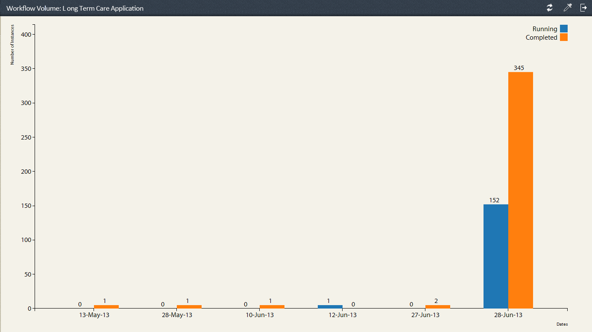

# プロセスレポート{#pre-defined-reports-in-process-reporting}の事前定義済みレポート

AEM Forms・プロセス・レポートには、次の&#x200B;*すぐに使える*&#x200B;レポートが付属しています。

* **[Long Running Processes](/help/forms/using/process-reporting/pre-defined-reports-in-process-reporting.md#p-long-running-processes-p)**:完了に指定時間以上かかったすべてのAEM Formsプロセスのレポート

* **[プロセス期間グラフ](/help/forms/using/process-reporting/pre-defined-reports-in-process-reporting.md#p-process-duration-report-br-p)**:期間別の特定AEM Formsプロセスのレポート

* **[ワークフローの量](/help/forms/using/process-reporting/pre-defined-reports-in-process-reporting.md#p-workflow-volume-report-p)**:日付別に指定されたプロセスの実行中および完了インスタンスのレポート

## 長時間実行中のプロセス{#long-running-processes}

長時間実行中のプロセスレポートには、完了に指定時間以上かかったAEM Formsのプロセスが表示されます。

### 長時間実行中のプロセスレポートを実行するには{#to-execute-a-long-running-process-report-br}

1. プロセスレポートで事前定義済みのレポートのリストを表示するには、**プロセスレポート**&#x200B;ツリー表示で&#x200B;**レポート**&#x200B;ノードをクリックします。
1. **Long Running Processes**&#x200B;レポートノードをクリックします。

   

   レポートを選択すると、ツリー表示の右側に&#x200B;**レポートパラメーター**&#x200B;パネルが表示されます。

   

   パラメーター:

   * **期間**(*必須*):期間と単位を指定します。指定した期間を超えて実行されたすべてのAEM Formsプロセスを表示します。
   * **開始後** (*オプション*):日付を選択します。レポートをフィルターして、指定した日付以降に開始したプロセスインスタンスを表示します。
   * **開始前** (*オプション*):日付を選択します。指定した日付より前に開始したプロセスインスタンスを表示するように、レポートをフィルターします。

1. 「**移動**」をクリックしてレポートを実行します。

   レポートは、**プロセスレポート**&#x200B;ウィンドウの右側の&#x200B;**レポート**&#x200B;パネルに表示されます。

   

   **レポート**&#x200B;パネルの右上隅にあるオプションを使用して、レポートに対して次の操作を実行します。

   * **更新**:ストレージ内の最新データを使用してレポートを更新します
   * **凡例の色を変更**:レポートの凡例の色を選択して変更する
   * **CSVにエクスポート**:レポートからデータをエクスポートし、コンマ区切りファイルにダウンロードする

## プロセス期間レポート{#process-duration-report-br}

プロセス期間レポートは、Formsプロセスのインスタンス数を、各インスタンスが実行された日数別に表示します。

### プロセス期間レポートを実行するには{#to-execute-a-process-duration-report-br}

1. プロセスレポートで事前定義済みのレポートを表示するには、**プロセスレポート**&#x200B;ツリー表示で&#x200B;**レポート**&#x200B;ノードをクリックします。
1. **プロセス期間**&#x200B;レポートノードをクリックします。

   

   レポートを選択すると、ツリー表示の右側に&#x200B;**レポートパラメーター**&#x200B;パネルが表示されます。

   

   パラメーター:

   * **Select Process** (*mandatory*):AEM Formsプロセスを選択します。

1. 「**移動**」をクリックしてレポートを実行します。

   レポートは、プロセスレポートウィンドウの右側の&#x200B;**レポート**&#x200B;パネルに表示されます。

   

   **レポート**&#x200B;パネルの右上隅にあるオプションを使用して、レポートに対して次の操作を実行します。

   * **更新**:ストレージ内の最新データを使用してレポートを更新します
   * **凡例の色を変更**:レポートの凡例の色を選択して変更する
   * **CSVにエクスポート**:レポートからデータをエクスポートし、コンマ区切りファイルにダウンロードする

## ワークフローボリュームレポート{#workflow-volume-report}

ワークフローの量レポートには、現在実行中の、および完了したAEM Formsプロセスのインスタンス数がカレンダーの日別に表示されます。

### ワークフローボリュームレポート{#to-execute-a-workflow-volume-report-br}を実行するには

1. プロセスレポートで事前定義済みのレポートを表示するには、**プロセスレポート**&#x200B;ツリー表示で&#x200B;**レポート**&#x200B;ノードをクリックします。
1. **ワークフローボリューム**&#x200B;レポートノードをクリックします。

   

   レポートを選択すると、ツリー表示の右側に&#x200B;**レポートパラメーター**&#x200B;パネルが表示されます。

   

   パラメーター:

   * **Select Process**(*mandatory*):AEM Formsプロセスを選択します。
   * **開始後** (*オプション*):日付を選択します。指定した日付以降に開始したプロセスインスタンスを表示するフィルターをレポートに追加します。
   * **開始前** (*オプション*):日付を選択します。指定した日付より前に開始したプロセスインスタンスを表示するフィルターをレポートに追加します。

1. 「**移動**」をクリックしてレポートを実行します。

   レポートは、**プロセスレポート**&#x200B;ウィンドウの右側の&#x200B;**レポート**&#x200B;パネルに表示されます。

   

   **レポート**&#x200B;パネルの右上隅にあるオプションを使用して、レポートに対して次の操作を実行します。

   * **更新**:ストレージ内の最新データを使用してレポートを更新します
   * **凡例の色を変更**:レポートの凡例の色を選択して変更する
   * **CSVにエクスポート**:レポートからデータをエクスポートし、コンマ区切りファイルにダウンロードする

