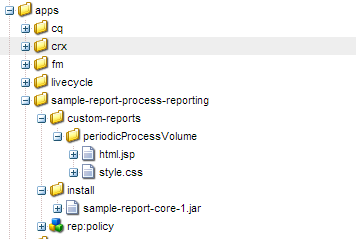
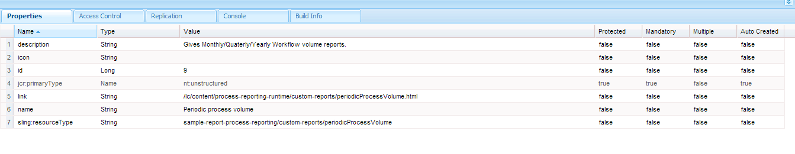

# 処理中のレポートのカスタムレポート {#custom-reports-in-process-reporting}

QueryBuilder の REST インターフェイスを使用するか、QueryBuilder API を使用して OSGi サービスを作成して、カスタムレポートを作成できます。

## カスタムレポートを作成するための一般的な手順 {#generic-steps-to-build-a-custom-report}

カスタムレポートを追加する前に、次のテンプレート手順を実行します。

1. カスタムレポートで使用するデータは、プロセスレポートで使用できる必要があります。 データを確実に使用するには、cron ジョブをスケジュールするか、 **[同期](https://helpx.adobe.com/livecycle/help/process-reporting/install-start-process-reporting.html#Process%20Reporting%20Home%20screen)** 」オプションを使用して、Process Reporting UI で設定できます。
1. URL リクエスト（目的のクエリをカプセル化）は、適切なクエリ結果オブジェクトを返す必要があります。 クエリを作成するには、次の REST インターフェイスを使用します。 [QueryBuilder](https://docs.adobe.com/docs/en/cq/current/dam/customizing_and_extendingcq5dam/query_builder.html) QueryBuilder API を使用して OSGi サービスを作成する場合。 動的クエリや静的クエリを作成できます。

1. 結果を表示するカスタムユーザーインターフェイスを作成します。 スタンドアロンのユーザーインターフェイスを作成したり、結果を既存の Process Reporting UI と統合したりできます。

## QueryBuilder の REST インターフェイスの使用 {#using-the-rest-interface-of-the-querybuilder}

CRX QueryBuilder REST インターフェイスは、Java API と REST API を介してアセット共有 Query Builder の機能を公開します。 使用方法を学ぶ [CRX QueryBuilder REST インターフェイス](https://docs.adobe.com/docs/en/cq/current/dam/customizing_and_extendingcq5dam/query_builder.html)、次の手順を実行する前に

1. URL を参照 `https://[server]:[port]/lc/bin/querybuilder.json`

1. プロセスレポートのストレージノード構造とノードプロパティに基づいてクエリを作成します。

   オプションのパラメーターを指定して、オフセット、制限、ヒットおよびプロパティを指定できます。 静的レポートの引数をハードコードし、動的レポートの UI からパラメーターを取得できます。

   すべてのプロセス名を取得するには、次のようなクエリを実行します。

   `https://[Server]:[Port]/lc/bin/querybuilder.json?exact=false&p.hits=selective&p.properties=pmProcessTitle&path=%2fcontent%2freporting%2fpm&property=pmNodeType&property.operation=equals&property.value=ProcessType&type=sling%3aFolder`

   >[!NOTE]
   >
   >すべてのクエリで、パスパラメーターは crx ストレージの場所を指し、文字は URL 標準に従ってエスケープされます。

## Query Builder API を使用したサービスの作成  {#creating-a-service-using-query-builder-api-nbsp}

Query Builder API を使用してサービスを作成するための前提条件は次のとおりです。 [CQ OSGI バンドルの作成とデプロイ](https://docs.adobe.com/docs/v5_2/html-resources/cq5_guide_developer/cq5_guide_developer.html) および [Query Builder API の使用](https://docs.adobe.com/docs/en/cq/current/dam/customizing_and_extendingcq5dam/query_builder.html).

1. 適切な注釈で OSGi サービスを作成します。 QueryBuilder にアクセスするには、次を使用します。

   ```
   @Reference(referenceInterface = QueryBuilder.class) 
    private QueryBuilder queryBuilder;
   ```

1. 述語グループを作成します。 述語グループを作成するコードは次のとおりです。

   ```
   PredicateGroup predicateGroup = new PredicateGroup(); 
    predicateGroup.setAllRequired(true);
   ```

1. 新しく作成した predicateGroup に述語を追加します。 以下に、便利な述語の構成をいくつか示します。 [JcrBoolPropertyPredicateEvaluator](https://docs.adobe.com/docs/en/cq/5-3/javadoc/com/day/cq/search/eval/JcrBoolPropertyPredicateEvaluator.html), [JcrPropertyPredicateEvaluator](https://docs.adobe.com/docs/en/cq/5-3/javadoc/com/day/cq/search/eval/JcrPropertyPredicateEvaluator.html), [RangePropertyPredicateEvaluator](https://docs.adobe.com/docs/en/cq/5-3/javadoc/com/day/cq/search/eval/RangePropertyPredicateEvaluator.html), [DateRangePredicateEvaluator](https://docs.adobe.com/docs/en/cq/5-3/javadoc/com/day/cq/search/eval/RelativeDateRangePredicateEvaluator.html)、および [TypePredicateEvaluator](https://docs.adobe.com/docs/en/cq/5-3/javadoc/com/day/cq/search/eval/TypePredicateEvaluator.html).

   静的レポートの場合は述語をハードコードし、動的レポートの場合はリクエストから述語を取得します。

   プロセスのすべてのインスタンスを取得するコードの例を次に示します。

   ```java
   Predicate predicate;
   
     //Add the path Constraint
     predicate = new Predicate(PathPredicateEvaluator.PATH);
     predicate.set(PathPredicateEvaluator.PATH, "/content/reporting/pm"); // should point to the crx path being used to store data
     predicate.set(PathPredicateEvaluator.EXACT, "false");
     predicateGroup.add(predicate);
   
     //type nt:unstructured
     predicate = new Predicate(TypePredicateEvaluator.TYPE);
     predicate.set(TypePredicateEvaluator.TYPE, "nt:unstructured");
     predicateGroup.add(predicate);
   
     //NodeType: Process Instance
     predicate = new Predicate(JcrPropertyPredicateEvaluator.PROPERTY);
     predicate.set(JcrPropertyPredicateEvaluator.PROPERTY, "pmNodeType");
     predicate.set(JcrPropertyPredicateEvaluator.OPERATION, JcrPropertyPredicateEvaluator.OP_EQUALS);
     predicate.set(JcrPropertyPredicateEvaluator.VALUE, "ProcessInstance");
     predicateGroup.add(predicate);
   
     //processName
     predicate = new Predicate(JcrPropertyPredicateEvaluator.PROPERTY);
     predicate.set(JcrPropertyPredicateEvaluator.PROPERTY, "pmProcessName");
     predicate.set(JcrPropertyPredicateEvaluator.OPERATION, JcrPropertyPredicateEvaluator.OP_EQUALS);
     predicate.set(JcrPropertyPredicateEvaluator.VALUE, processName); //processName variable stores the name of the process whose instances need to be searched
     predicateGroup.add(predicate);
   ```

1. predicateGroup を使用してクエリを定義します。

   `Query query = queryBuilder.createQuery(predicateGroup, session);`

1. クエリの結果を取得します。

   ```java
   query.setStart(offset); // hardcode or fetch from request
           if(hits == -1)         // hardcode or fetch from request
               hits = 0;
           query.setHitsPerPage(hits);
           SearchResult searchResult = query.getResult();
   ```

1. 結果に対して反復処理を行い、結果を目的の形式に変換します。 結果を CSV 形式で送信するコードは次のとおりです。

   ```java
   Iterator<Node> iter = searchResult.getNodes();
                   while(iter.hasNext()) {
                       Node node = iter.next();
                       row = new StringBuilder();
                       for (String property : includeProperties) { // the properties of the node which needs to be returned, or one can return all the properties too.
                           try {
                               row.append(node.getProperties(property).nextProperty().getString() + COMMA_SEPARATOR);
                           } catch (NoSuchElementException e) {
                               //Adding separator for no value
                               row.append(COMMA_SEPARATOR);
                           } catch (RepositoryException e) {
                               e.printStackTrace();
                           }
                       }
                       row.deleteCharAt(row.lastIndexOf(COMMA_SEPARATOR));
                       row.append(NEW_LINE);
                       out.write(row.toString().getBytes());
   ```

1. 以下を使用： `org.apache.felix maven-bundle-plugin` ：サーブレット用の OSGi バンドルを作成します。

1. CRX サーバーにバンドルをデプロイします。

### サービスの例 {#service-example}

次のサービスの例では、 **実行中** および **完了** 毎月、四半期、年の終わりに州（米国）を追加します。

```java
package custom.reporting.service;
 
import java.text.DateFormatSymbols;
import java.util.Calendar;
import java.util.HashMap;
import java.util.Iterator;
import java.util.LinkedHashMap;
import java.util.Map;
import java.util.SortedSet;
import java.util.TreeSet;
 
import javax.jcr.Node;
import javax.jcr.Session;
 
import org.apache.felix.scr.annotations.Component;
import org.apache.felix.scr.annotations.Reference;
import org.apache.felix.scr.annotations.Service;
 
import com.day.cq.search.Predicate;
import com.day.cq.search.PredicateGroup;
import com.day.cq.search.Query;
import com.day.cq.search.QueryBuilder;
import com.day.cq.search.eval.JcrPropertyPredicateEvaluator;
import com.day.cq.search.eval.PathPredicateEvaluator;
import com.day.cq.search.eval.TypePredicateEvaluator;
import com.day.cq.search.result.SearchResult;
 
@Component(metatype = true, immediate = true, label = "PeriodicProcessVolume", description = "Service for supporting cutom reports pluggable to Process Reporting.")
@Service(value = PeriodicProcessVolume.class)
public class PeriodicProcessVolume {
 
    private static String[] monthNameList = new DateFormatSymbols().getMonths();
    private static String[] quaterNameList = { "I", "II", "III", "IV" };
 
    private final Map<Integer, Map<Integer, Long[]>> monthly = new HashMap<Integer, Map<Integer, Long[]>>();
    private final Map<Integer, Map<Integer, Long[]>> quaterly = new HashMap<Integer, Map<Integer, Long[]>>();
    private final Map<Integer, Long[]> yearly = new HashMap<Integer, Long[]>();
 
    @Reference(referenceInterface = QueryBuilder.class)
    private QueryBuilder queryBuilder;
 
    private void addConstraints(PredicateGroup predicateGroup, String processName) {
        Predicate predicate;
 
        //Add the path Constraint
        predicate = new Predicate(PathPredicateEvaluator.PATH);
        predicate.set(PathPredicateEvaluator.PATH, "/content/reporting/pm");
        predicate.set(PathPredicateEvaluator.EXACT, "false");
        predicateGroup.add(predicate);
 
        //type nt:unstructured
        predicate = new Predicate(TypePredicateEvaluator.TYPE);
        predicate.set(TypePredicateEvaluator.TYPE, "nt:unstructured");
        predicateGroup.add(predicate);
 
        //NodeType: Process Instance
        predicate = new Predicate(JcrPropertyPredicateEvaluator.PROPERTY);
        predicate.set(JcrPropertyPredicateEvaluator.PROPERTY, "pmNodeType");
        predicate.set(JcrPropertyPredicateEvaluator.OPERATION, JcrPropertyPredicateEvaluator.OP_EQUALS);
        predicate.set(JcrPropertyPredicateEvaluator.VALUE, "ProcessInstance");
        predicateGroup.add(predicate);
 
        //processName
        if (processName != null) {
            predicate = new Predicate(JcrPropertyPredicateEvaluator.PROPERTY);
            predicate.set(JcrPropertyPredicateEvaluator.PROPERTY, "pmProcessName");
            predicate.set(JcrPropertyPredicateEvaluator.OPERATION, JcrPropertyPredicateEvaluator.OP_EQUALS);
            predicate.set(JcrPropertyPredicateEvaluator.VALUE, processName);
            predicateGroup.add(predicate);
        }
    }
 
    private Long[] setFrequency(Long[] frequency, int index) {
        if (frequency == null) {
            frequency = new Long[2];
            frequency[0] = 0L;
            frequency[1] = 0L;
        }
        frequency[index] = frequency[index] + 1L;
        return frequency;
    }
 
    public void populateValues(Session session, String processName) {
        PredicateGroup predicateGroup = new PredicateGroup();
        predicateGroup.setAllRequired(true);
        try {
            addConstraints(predicateGroup, processName);
 
            long batchSize = 10000L;
            long start = 0l;
 
            while (true) {
                Query query = queryBuilder.createQuery(predicateGroup, session);
                query.setStart(start);
                query.setHitsPerPage(batchSize);
                SearchResult searchResult = query.getResult();
                Iterator<Node> itr = searchResult.getNodes();
                long length = 0;
                while (itr.hasNext()) {
                    length++;
                    Node n = itr.next();
                    Calendar calender = n.getProperty("pmCreateTime").getDate();
                    String status = n.getProperty("pmStatus").getString();
                    int index = 0;
                    if ("COMPLETE".equals(status)) {
                        index = 1;
                    } else if ("RUNNING".equals(status)) {
                        index = 0;
                    } else {
                        continue;
                    }
                    int month = calender.get(Calendar.MONTH);
                    int year = calender.get(Calendar.YEAR);
                    int quater;
                    if (month < 3) {
                        quater = 1;
                    } else if (month < 6) {
                        quater = 2;
                    } else if (month < 9) {
                        quater = 3;
                    } else {
                        quater = 4;
                    }
 
                    Long frequency[];
                    Map<Integer, Long[]> yearMonthMap = this.monthly.get(year);
                    if (yearMonthMap == null) {
                        yearMonthMap = new HashMap<Integer, Long[]>();
                    }
                    frequency = yearMonthMap.get(month);
                    frequency = setFrequency(frequency, index);
                    yearMonthMap.put(month, frequency);
                    this.monthly.put(year, yearMonthMap);
 
                    Map<Integer, Long[]> yearQuaterMap = this.quaterly.get(year);
                    if (yearQuaterMap == null) {
                        yearQuaterMap = new HashMap<Integer, Long[]>();
                    }
                    frequency = yearQuaterMap.get(quater);
                    frequency = setFrequency(frequency, index);
                    yearQuaterMap.put(quater, frequency);
                    this.quaterly.put(year, yearQuaterMap);
 
                    frequency = this.yearly.get(year);
                    frequency = setFrequency(frequency, index);
                    this.yearly.put(year, frequency);
                }
 
                if (length < batchSize) {
                    break;
                } else {
                    start = start + batchSize;
                }
            }
        } catch (Exception e) {
            e.printStackTrace();
        }
 
    }
 
    public Map<String, Long[]> getMonthly() {
        Map<String, Long[]> result = new LinkedHashMap<String, Long[]>();
        SortedSet<Integer> years = new TreeSet<Integer>(monthly.keySet());
        for (Integer year : years) {
            Map<Integer, Long[]> yearMonthMap = monthly.get(year);
            SortedSet<Integer> months = new TreeSet<Integer>(yearMonthMap.keySet());
            for (Integer month : months) {
                String str = monthNameList[month] + " " + year;
                result.put(str, yearMonthMap.get(month));
            }
        }
        return result;
    }
 
    public Map<String, Long[]> getQuaterly() {
        Map<String, Long[]> result = new LinkedHashMap<String, Long[]>();
        SortedSet<Integer> years = new TreeSet<Integer>(quaterly.keySet());
        for (Integer year : years) {
            Map<Integer, Long[]> quaterMonthMap = quaterly.get(year);
            SortedSet<Integer> quaters = new TreeSet<Integer>(quaterMonthMap.keySet());
            for (Integer quater : quaters) {
                String str = quaterNameList[quater - 1] + " " + year;
                result.put(str, quaterMonthMap.get(quater));
            }
        }
        return result;
    }
 
    public Map<Integer, Long[]> getYearly() {
        return yearly;
    }

}
```

サンプル `pom.xml`サービスの上に構築するファイルは次のとおりです。

```java
<project xmlns="https://maven.apache.org/POM/4.0.0" xmlns:xsi="https://www.w3.org/2001/XMLSchema-instance" xsi:schemaLocation="https://maven.apache.org/POM/4.0.0 https://maven.apache.org/maven-v4_0_0.xsd">
    <modelVersion>4.0.0</modelVersion>
 
    <!-- ====================================================================== -->
    <!-- P R O J E C T  D E S C R I P T I O N                                   -->
    <!-- ====================================================================== -->
    <groupId>com.custom</groupId>
    <artifactId>sample-report-core</artifactId>
    <packaging>bundle</packaging>
    <name>PR Sample Report</name>
    <description>Bundle providing support for a custom report pluggable to process reporting.</description>
    <version>1</version>

    <!-- ====================================================================== -->
    <!-- B U I L D   D E F I N I T I O N                                        -->
    <!-- ====================================================================== -->
    <build>
        <plugins>
          <plugin>
              <groupId>org.apache.felix</groupId>
              <artifactId>maven-bundle-plugin</artifactId>
              <version>2.3.7</version>
              <extensions>true</extensions>
              <configuration>
                    <instructions>
                        <Bundle-Category>sample-report</Bundle-Category>
                        <Export-Package>
                            custom.reporting.service.*;
                        </Export-Package>
                     </instructions>
              </configuration>
          </plugin>
          <plugin>
                <groupId>org.apache.felix</groupId>
                <artifactId>maven-scr-plugin</artifactId>
                <version>1.11.0</version>
                <executions>
                    <execution>
                        <id>generate-scr-scrdescriptor</id>
                        <goals>
                            <goal>scr</goal>
                        </goals>
                        <configuration>
                            <!-- Private service properties for all services. -->
                            <properties>
                                <service.vendor>Sample Report</service.vendor>
                            </properties>
                        </configuration>
                    </execution>
                </executions>
            </plugin>
        </plugins>
    </build>
 
    <!-- ====================================================================== -->
    <!-- D E P E N D E N C I E S                                                -->
    <!-- ====================================================================== -->
    <dependencies>
        <dependency>
          <groupId>com.day.cq</groupId>
          <artifactId>cq-search</artifactId>
          <version>5.6.4</version>
        </dependency>
 
        <dependency>
          <groupId>javax.jcr</groupId>
          <artifactId>jcr</artifactId>
          <version>2.0</version>
        </dependency>
 
        <dependency>
          <groupId>org.apache.felix</groupId>
          <artifactId>org.apache.felix.scr.annotations</artifactId>
          <version>1.9.0</version>
        </dependency>
    </dependencies>
</project>
```

## 別の UI の作成  {#creating-a-separate-ui-nbsp}

結果を表示するための個別の UI を作成するための前提条件は次のとおりです。 [Sling の基本](https://docs.adobe.com/docs/en/cq/5-6-1/developing/the_basics.html), [CRX ノードの作成](https://docs.adobe.com/docs/en/crx/current/developing/development_tools/developing_with_crxde_lite.html#Creating%20a%20Node) 適切な [アクセス権限](https://docs.adobe.com/docs/en/crx/current/developing/development_tools/developing_with_crxde_lite.html#Access%20Control).

1. CRX ノードを `/apps` ノードに追加し、適切なアクセス権限を付与します。 (PERM_PROCESS_REPORTING_USER)
1. でレンダラーを定義します。 `/content` ノード。
1. 手順 1 で作成したHTMLに JSP ファイルまたはノードファイルを追加します。 また、CSS ファイルを追加することもできます。

   

   JSP ファイルと CSS ファイルを含むサンプルノード

1. JavaScript コードを追加して、querybuilder REST API またはサービスへの Ajax 呼び出しを開始します。 また、適切な引数を追加します。

1. Ajax 呼び出しに適切な成功ハンドラーを追加し、結果を解析して表示します。 結果を複数の形式（json、csv、ユーザー定義）で解析し、表形式または他の形式で表示できます。

1. （オプション）Ajax 呼び出しに適切なエラーハンドラーを追加します。

OSGi サービスと QueryBuilder API の両方を使用する JSP コードのサンプルは次のとおりです。

```
<%@taglib prefix="sling" uri="https://sling.apache.org/taglibs/sling/1.0"%>
<%request.setAttribute("silentAuthor", new Boolean(true));%>
<%@include file="/libs/foundation/global.jsp"%>
<%@ page import="java.util.Map,
java.util.Set,
com.adobe.idp.dsc.registry.service.ServiceRegistry,
javax.jcr.Session,
org.apache.sling.api.resource.ResourceResolver,
custom.reporting.service.PeriodicProcessVolume"%>
<%
response.setContentType("text/html");
response.setCharacterEncoding("utf-8");
%><!DOCTYPE HTML>
<html>
    <head>
        <meta charset="UTF-8">
 
        <link rel="stylesheet" href="/lc/apps/sample-report-process-reporting/custom-reports/periodicProcessVolume/style.css">
        <title>REPORT Monthly / Qaterly / Yearly</title>
        <script type="text/javascript">
 
            <%
                slingResponse.setCharacterEncoding("utf-8");
                ResourceResolver resolver = slingRequest.getResourceResolver();
                String processName = slingRequest.getParameter("processName");
                Session session = resolver.adaptTo(Session.class);
                custom.reporting.service.PeriodicProcessVolume periodicProcessVolume = sling.getService(custom.reporting.service.PeriodicProcessVolume.class);
                periodicProcessVolume.populateValues(session, processName);
                if (processName == null) {
                    processName = "All";
                }
            %>
            var lineSeprator = "<td>----------------</td>";
            var tableEnder = "<tr>" + lineSeprator + lineSeprator + lineSeprator + "</tr>";
 
            var tableColHeader = "<td>Running</td>";
            tableColHeader += "<td>Complete</td></tr>";
            tableColHeader += tableEnder;
 
            var monthly = "<table><tr><td>Month</td>";
            monthly += tableColHeader;
 
            <%
                Map<String, Long[]> monthlyMap = periodicProcessVolume.getMonthly();
                Set<String> monthKeys = monthlyMap.keySet();
                for (String key: monthKeys) {
                    Long[] frequencies = monthlyMap.get(key);
            %>
 
            monthly += "<tr><td> <%= key %> </td>";
            monthly += "<td> <%= frequencies[0] %> </td>";
            monthly += "<td> <%= frequencies[1] %> </td></tr>";
            <%
                }
            %>
 
            monthly += tableEnder;
 
            var quaterly = "<table><tr><td>Quater</td>";
            quaterly += tableColHeader;
 
            <%
                Map<String, Long[]> quaterMap = periodicProcessVolume.getQuaterly();
                Set<String> quaterKeys = quaterMap.keySet();
                for (String key: quaterKeys) {
                    Long[] frequencies = quaterMap.get(key);
            %>
 
            quaterly += "<tr><td> <%= key %> </td>";
            quaterly += "<td> <%= frequencies[0] %> </td>";
            quaterly += "<td> <%= frequencies[1] %> </td></tr>";
            <%
                }
            %>
 
            quaterly += tableEnder;
 
            var yearly = "<table><tr><td>Year</td>";
            yearly += tableColHeader;
 
            <%
                Map<Integer, Long[]> yearMap = periodicProcessVolume.getYearly();
                Set<Integer> yearKeys = yearMap.keySet();
                for (Integer key: yearKeys) {
                    Long[] frequencies = yearMap.get(key);
            %>
 
            yearly += "<tr><td> <%= key %> </td>";
            yearly += "<td> <%= frequencies[0] %> </td>";
            yearly += "<td> <%= frequencies[1] %> </td></tr>";
            <%
                }
            %>
 
            yearly += tableEnder;
 
            function reloadFrame(value) {
                if (value === '-1') {
                    window.location = "/lc/content/process-reporting-runtime/custom-reports/periodicProcessVolume.html";
                } else {
                    window.location = "/lc/content/process-reporting-runtime/custom-reports/periodicProcessVolume.html?processName=" + value;
                }
            }
 
            function populateTable(selection) {
                if (selection === 0) {
                    document.getElementById('tableHeading').innerHTML = 'Monthly';
                    document.getElementById('volumeTable').innerHTML = monthly;
                } else if (selection === 1) {
                    document.getElementById('tableHeading').innerHTML = 'Quaterly';
                    document.getElementById('volumeTable').innerHTML = quaterly;
                } else {
                    document.getElementById('tableHeading').innerHTML = 'Yearly';
                    document.getElementById('volumeTable').innerHTML = yearly;
                }
            }
 
            function fetchProcesses() {
                var xmlhttp = new XMLHttpRequest(),
                    request = '';
                xmlhttp.onreadystatechange = function() {
                   if (xmlhttp.readyState === 4 && xmlhttp.status === 200) {
                       var responseText,
                           response,
                           items,
                           hits = [],
                           responseSize = 0,
                           processName,
                           selectedIndex = 0,
                           comboBox;
                       responseText = xmlhttp.responseText;
                       if (responseText !== undefined && responseText !== null) {
                           response = JSON.parse(responseText);
                           responseSize = response.results;
                           hits = response.hits;
                       }
 
                       items = "<option value='-1'>All</option>";
 
                       for(var i = 0; i < responseSize; i++) {
                           processName = hits[i].pmProcessTitle;
                           if (processName === '<%= processName %>') {
                               selectedIndex = i + 1;
                           }
                           items += "<option value='" + processName + "'>" + processName + "</option>"
                       }
 
                       comboBox = document.getElementById('processSelection');
                       comboBox.innerHTML = items;
                       comboBox.selectedIndex = selectedIndex;
                   }
               };
               request = "/lc/bin/querybuilder.json?";
               request += "exact=false&";
               request += "p.hits=selective&";
               request += "p.properties=pmProcessTitle&";
               request += "path=%2fcontent%2freporting%2fpm&";
               request += "property=pmNodeType&";
               request += "property.operation=equals&";
               request += "property.value=ProcessType&";
               request += "type=sling%3aFolder";

               xmlhttp.open("POST", request, true);
               xmlhttp.setRequestHeader("Content-type","application/json");
               xmlhttp.send();
            }
 
        </script>
    </head>
    <body onLoad="fetchProcesses();populateTable(0);">
        Process:
        <select id="processSelection" onchange="reloadFrame(this.value);"></select>
        &nbsp &nbsp Period Interval:
        <select name="periodSelection" onchange="populateTable(this.selectedIndex);">
            <option value="1">Monthly</option>
            <option value="2">Quaterly</option>
            <option value="3">Yearly</option>
        </select>
        <br> <br> <br> <br>
        <div class="inline"> Process: &nbsp <b><%= processName %></b> &nbsp &nbsp Period: &nbsp </div> <b> <div id="tableHeading" class="inline"> </div> </b>
        <br><br>
        <div id="volumeTable"> </div>
 
    </body>
</html>
```

## 既存のプロセスレポート UI へのレポート UI の統合  {#integrating-report-ui-in-existing-process-reporting-ui-nbsp}

結果を表示するための個別の UI を作成するための前提条件は次のとおりです。 [Sling の基本](https://wem.help.adobe.com/enterprise/en_US/10-0/wem/developing/the_basics.html), [CRX ノードの作成](https://docs.adobe.com/docs/en/crx/current/developing/development_tools/developing_with_crxde_lite.html#Creating%20a%20Node) 適切な [アクセス権限](https://docs.adobe.com/docs/en/crx/current/developing/development_tools/developing_with_crxde_lite.html#Access%20Control).

1. 別の UI を作成します。詳しくは、 [別の UI の作成](#creating-a-separate-ui-nbsp) 」セクションに入力します。
1. 子の作成 `nt:unstructured` ノード ( `/content/process-reporting-runtime/custom-reports` プラグ可能なすべてのレポートのノード。

   * **id** — レポートの一意の ID 番号を指定します。
   * **名前** — レポート名を指定します。 名前が UI に表示されます。
   * **リンク** — 個別の UI のレンダラーへの相対リンクを指定します。 リンクは手順 1 で作成します。
   * **説明** — レポートの 1 行の説明を指定します。 説明フィールドは空のままにすることができます。
   * **アイコン** — レポートを画像で表す画像を指定します。 アイコンフィールドは空のままにしておくことができます。

   

   ノードのプロパティ

1. レポート UI は、プロセスレポート UI に統合されています。 UI を統合すると、更新された UI は次の画像のようになります。

   

   新しく追加されたカスタムレポートのユーザーインターフェイス

   

   カスタムレポートの結果画面

## サンプルパッケージ {#sample-package}

次をインポート： `sample-report-pkg-1.zip` この記事で説明したカスタムレポートと UI をプロセス管理 UI に統合するためのパッケージです。

[ファイルを入手](assets/sample-report-pkg-1.zip)
