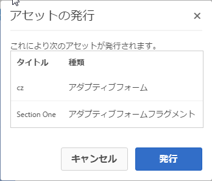
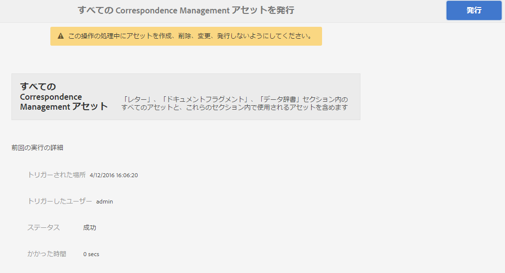

# フォームとドキュメントの発行と非公開 {#publishing-and-unpublishing-forms-and-documents}

AEM Forms では、フォームを簡単に作成、発行、および非公開できます。AEM Forms の詳細については、[フォーム管理の概要](/help/forms/using/introduction-managing-forms.md)を参照してください。

AEM Forms サーバーは 2 つのインスタンス（作成者と発行）を提供します。オーサーインスタンスは、フォームのアセットとリソースを作成し管理するためのものです。パブリッシュインスタンスは、エンドユーザーに対して使用可能なアセットや関連リソースを保持するためのものです。XDP フォームと PDF フォームはオーサーモードで読み込むことができます。For more information, see [Getting XDP and PDF documents in AEM Forms](/help/forms/using/get-xdp-pdf-documents-aem.md).

## サポートされているアセットタイプ{#supported-assets-nbsp}

AEM Formsは、次の種類のアセットをサポートしています。

* アダプティブフォーム
* アダプティブドキュメント
* アダプティブフォームフラグメント
* テーマ
* フォームテンプレート（XFA フォーム）
* PDF のフォーム
* ドキュメント（非インタラクティブ PDF ドキュメント）
* フォームセット
* リソース（画像、スキーマ、スタイルシート）

初期設定では、すべてのアセットはオーサーインスタンスでのみ使用可能です。管理者またはフォーム作成者は、リソースを除くすべてのアセットを発行できます。

フォームを選択して発行すると、関連のアセットとリソースも発行されます。ただし、依存のアセットは発行されません。このコンテキストでは、関連のアセットやリソースは、発行済みアセットが使用または参照するアセットです。依存のアセットは、発行済みアセットを参照するアセットです。

アダプティブフォームには、自動的に発行されない構成、設定、カスタマイズが含まれる場合があります。アダプティブフォームを発行する前に、以下のリソースを発行またはアクティブ化することをお勧めします。

* 編集可能なアダプティブフォームテンプレート
* Adobe Sign、Typekit、reCAPTCHA、フォームデータモデルのクラウドサービスの構成
* その他のクラウドサービスの構成は、ユーザーが管理者権限を保有している場合にのみアクティブ化されます。
* カスタマイズ。これには以下が含まれますが、これらに限定されません。

   * カスタムレイアウト
   * カスタム外観
   * CSSファイル — アダプティブフォームコンテナのプロパティダイアログで入力として取得
   * クライアントライブラリカテゴリ — アダプティブフォームコンテナのプロパティダイアログで入力として取得
   * アダプティブフォームテンプレートの一部として含まれる可能性のあるその他のクライアントライブラリ
   * デザインパス

## アセットの状態 {#asset-states}

アセットは次のステータスを持つことができます。

* **非公開**：一度も発行されていないアセット（未公開状態は、フォームアセットのみに適用されます。Correspondence Managementアセットには、非公開の状態がありません。)
* **発行済み**：発行済みアセット。パブリッシュインスタンスで使用できます。
* **変更済み**:発行後に変更されるアセット

## アセットの発行 {#publish-an-asset}

1. AEM Forms サーバーにログインします。
1. 次のいずれかの手順を使って、アセットを選択し発行します。

   1. ポインターをアセットの上に移動し、「 **[!UICONTROL Publish]** aem6forms_globe 」をタップします。
   1. 次のいずれかを行い、「公開」をタップします。

      * If you are in the card view, tap **[!UICONTROL Enter Selection]** , and tap the asset. アセットが選択されます。
      * リスト表示になっている場合は、アセットのチェックボックスを選択します。アセットが選択されます。
      * 詳細を表示するアセットを表示します。
      * Display an asset&#39;s properties by tapping View Properties .

      >[!NOTE]
      >
      >複数のアセットを選択しないでください。複数のアセットを一度に発行する機能はサポートされていません。

1. 発行プロセスが始まるときに、確認ダイアログが表示され、関連するすべてのアセットとリソースが表示されます。In the dialog box that contains related assets, tap **[!UICONTROL Publish]**. アセットが発行され、アセット発行成功ダイアログが表示されます。

   >[!NOTE]
   >
   >アダプティブフォームの場合、関連アセットと一緒に、アダプティブフォームページ名も表示されます。

   

   関連するすべてのアセットとリソースが表示されている確認ダイアログ。

   >[!NOTE]
   >
   >Forms Manager を使用する場合で、ユーザーが表示されているアセットを発行する権限を持っていないときは、発行アクションは無効化されます。特別な権限を必要とするアセットは、赤色で表示されます。

   アセットが発行されると、そのアセットのメタデータプロパティがパブリッシュインスタンスにコピーされ、アセットのステータスが発行済みに変更されます。発行される依存アセットのステータスも発行済みに変更されます。

   アセットの発行後に、Forms Portal を使用して、すべてのアセットを Web ページに表示できます。詳細については、「[ポータル上のフォーム発行について](/help/forms/using/introduction-publishing-forms.md)」を参照してください。

## すべての Correspondence Management アセットを発行 {#publish-all-the-correspondence-management-assets}

AEM Forms では、サーバー上のすべての Correspondence Management アセットを 1 度で発行します。発行済みのアセットには、すべての Correspondence Management アセットと関連する依存性が含まれます。

サーバー上のすべての Correspondence Management アセットを発行するには、次の手順を実行します。

1. AEM Forms サーバーにログインします。
1. グローバルナビゲーションバーで「**Adobe Experience Manager**」をタップします。
1. Tap , and then tap **Forms**.
1. Tap **Publish Correspondence Management Assets**.

   

   Publish All Correspondence Managementアセットページが表示され、前回Publish Correspondence Management Assetsの処理が試行された時点に関する情報が表示されます。

   

1. Tap **Publish** and, in the confirm message, tap **OK**.

   バッチ処理が完了すると、前回の実行詳細を表示できます。これには管理者ログインや、バッチが正常に実行されたか、失敗したかなどの情報が含まれます。

   >[!NOTE]
   >
   >発行処理は、一度開始するとキャンセルすることはできません。また、発行操作の進行中は、アセットを作成、削除、変更、発行したり、「すべてのCorrespondence Managementアセットを書き出し」操作を開始したりしないでください。

## フォームとドキュメントの発行と非公開の自動化 {#automate-publishing-and-unpublishing-for-forms-amp-documents}

AEM Forms では、フォームとドキュメントでアセットの発行と非公開をスケジュールできます。スケジュールはメタデータエディターで指定できます。For more information about managing form metadata, see [Managing form metadata.](/help/forms/using/manage-form-metadata.md)

以下の手順に従って、フォームとドキュメントアセットの発行と非公開の日時をスケジュールします。

1. Select an asset and tap **[!UICONTROL View Properties]**. メタデータプロパティページが開きます。
1. メタデータプロパティページで、「 **[!UICONTROL 詳細」をタップし]**、「 **[!UICONTROL Edit]** illustratorcc_penciltool_cur_edit_2_17 」をタップします。
1. **[!UICONTROL 発行オン時間]**&#x200B;フィールドと&#x200B;**[!UICONTROL 発行オフ時間]**&#x200B;フィールドで、日時を選択します。

   「 **[!UICONTROL Done]**」をタップします。

## アセットの非公開 {#unpublish-an-asset}

1. Select an asset that is published and tap **[!UICONTROL Unpublish]** .
1. 次のいずれかの手順を使用して、アセットを選択し非公開にします。

   1. Move the pointer over an asset and tap **[!UICONTROL Unpublish]** .
   1. 次のいずれかを行い、「非公開」をタップします。

      * If you are in the card view, tap **[!UICONTROL Enter Selection]** , and tap the asset. アセットが選択されます。
      * If you are in the list view, hover over an asset and tap  . アセットが選択されます。
      * 詳細を表示するアセットを表示します。
      * Display an asset&#39;s properties by tapping View Properties .

1. 非公開プロセスが始まるときに、確認ダイアログが表示されます。Tap **[!UICONTROL Unpublish]**.

   >[!NOTE]
   >
   >選択されているアセットだけが非公開になり、子アセットと参照されているアセットは非公開にはなりません。

## アセットまたはレターを以前に発行したバージョンに戻す {#revert-an-asset-or-letter-to-the-previously-published-version}

アセットまたはレターを編集して発行するたびに、アセットまたはレターのバージョンが作成されます。アセットまたはレターを、以前に発行したバージョンに戻すことができます。アセットまたはドキュメントの現在のバージョンに対して誰かが誤った操作をした場合、バージョンの巻き戻しが必要になることがあります。

>[!NOTE]
>
>発行済みのレターで使用されている依存アセットがシステムから削除されている場合、そのレターを最後に発行した状態に戻さないでください。

1. Select an asset and tap **[!UICONTROL Revert to Previously Published Version]** .
1. アセットが戻される前に、確認ダイアログが表示されます。Tap **[!UICONTROL Revert]**.

   アセットまたはレターが、以前に発行したバージョンにロールバックされます。

## アセットの削除 {#delete-an-asset}

>[!NOTE]
>
>アセットを削除すると、パブリッシュインスタンスからアセットが削除されます。アセットを削除すると、そのアセットのバージョン履歴も、ベースバージョンを除いて削除されます。

1. Select an asset and tap **[!UICONTROL Delete]** .

   >[!NOTE]
   >
   >The Delete option is also available when you display asset details by tapping an asset or you display an asset&#39;s properties by tapping View Properties .

1. アセットを削除する前に、確認ダイアログが表示されます。「**[!UICONTROL 削除]**」をタップします。

   >[!NOTE]
   >
   >選択されているアセットだけが削除され、従属アセットは削除されません。To check references of an asset, tap  and then select an asset.
   >
   >削除しようとしているアセットが別のアセットの子アセットである場合、削除されません。そのようなアセットを削除するには、別のアセットからのそのアセットへの参照を削除してから再度実行します。

## アダプティブフォームの保護 {#protected-adaptive-forms}

選択したユーザーにアクセスを許可するフォームの認証を有効にすることができます。フォームの認証を有効にすると、ユーザーにはアクセス前にログイン画面が表示されます。認証済みの資格情報を持つユーザーのみがフォームにアクセスすることができます。

フォームの認証を有効にする手順は次のとおりです。

1. ブラウザーで、パブリッシュインスタンスの configMgr を開きます。

   URL: `https://<hostname>:<PublishPort>/system/console/configMgr`

1. Adobe Experience Manager Web Console Configuration で、**Apache Sling Authentication Service** をクリックして設定します。
1. 表示された Apache Sling Authentication Service ダイアログで、「**+**」ボタンを使用してパスを追加します。

   パスを追加すると、そのパスのフォームに対して認証サービスが有効になります。

