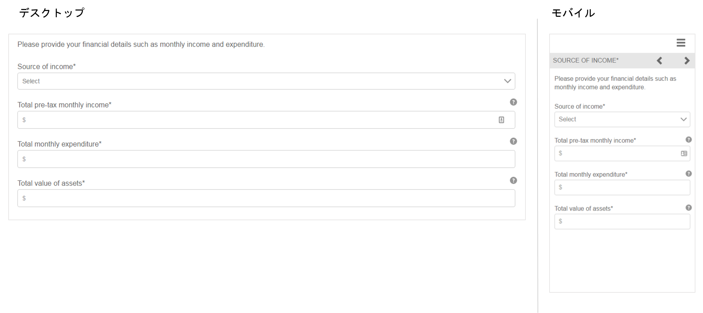

# 参照用のアダプティブフォームフラグメント {#reference-adaptive-form-fragments}

[アダプティブフォームフラグメント](/help/forms/using/adaptive-form-fragments.md) は、フォームの作成時に使用できるフィールドのグループ、またはフィールドのグループを含むパネルです。 これを使用してフォームを簡単にすばやく作成できます。サイドバーのアセットブラウザーを使用して、アダプティブフォームフラグメントをフォームにドラッグ＆ドロップし、それをフォームエディターで編集できます。

アダプティブフォームの作成者を対象に、[AEM Forms アドオンパッケージ](https://experienceleague.adobe.com/docs/experience-manager-release-information/aem-release-updates/forms-updates/aem-forms-releases.html?lang=ja)で参照用のフラグメントが提供されています。これには、次のフラグメントが含まれます。

* アドレス
* 連絡先情報
* クレジットカード情報
* 現在の職業
* 扶養家族の情報
* 職歴
* 収入と支出
* 名前
* 利用条件
* 署名付き利用条件

このパッケージをインストールすると、参照フラグメントを含む参照フラグメントフォルダーが「Forms &amp; Documents」の下に作成されます。 パッケージのインストールについては、[パッケージの作業方法](/help/sites-administering/package-manager.md)を参照してください。

## アドレス {#address}

郵送先住所を指定するフィールドが含まれます。 使用可能なフィールドは、住所、郵便番号、市区町村、都道府県、国です。 また、指定した米国の郵便番号の市区町村と州を入力する事前設定済み Web サービスも含まれています。

[クリックして拡大](assets/address.png)

## 連絡先情報 {#contact-information}

電話番号とメールアドレスを取得するためのフィールドが含まれています。

[クリックして拡大](assets/contact-info-1.png)

## クレジットカード情報 {#credit-card-information}

支払い処理に使用できるクレジットカード情報を取得するためのフィールドが含まれています。

## 現在の職業 {#current-employment}

雇用形態、雇用分野、役職、会社名、入社日など、現在の職業の詳細を取得するためのフィールドが含まれています。

[クリックして拡大](assets/current-emp-1.png)

## 扶養家族の情報 {#dependents-information}

1 人以上の扶養家族に関する情報（名前、関係、年齢など）を表形式で指定するためのフィールドが含まれています。

[クリックして拡大](assets/dependents-info-1.png)

## 職歴 {#employment-history}

雇用履歴をキャプチャするためのフィールドが含まれます。 複数の組織を追加できます。

[クリックして拡大](assets/emp-history-1.png)

## 収入と支出 {#income-expenditure}

1 か月のキャッシュフローと支出を取得するためのフィールドが含まれています。ユーザーに財務の詳細を入力するよう求めるFormsは、このフラグメントを使用して収入と支出をキャプチャできます。

[クリックして拡大](assets/income-1.png)

## 名前 {#name}

称号、名、ミドルネームおよび姓を指定するためのフィールドが含まれています。

[クリックして拡大](assets/name-1.png)

## 利用条件 {#terms-conditions}

ユーザーがフォームを送信する前に同意する利用条件を指定します。

[クリックして拡大](assets/tnc-1.png)

## 署名付き利用条件 {#terms-conditions-with-scribble}

ユーザーがフォームを送信する前に同意して署名する利用条件を指定します。

[クリックして拡大](assets/tnc-scribble-1.png)
