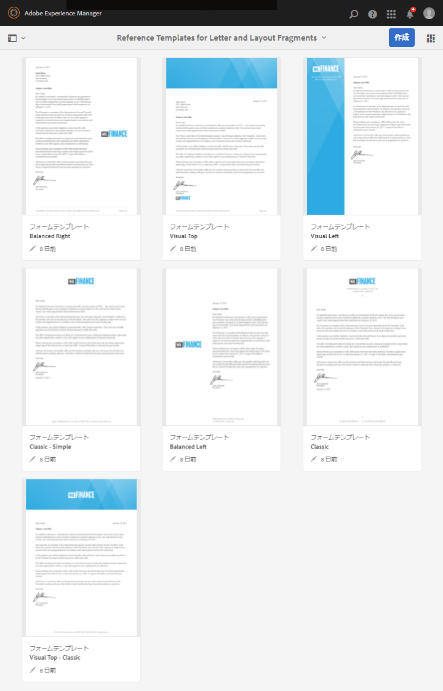

# 参照レターテンプレート {#reference-letter-templates}

>[!CAUTION]
>
>AEM 6.4 の拡張サポートは終了し、このドキュメントは更新されなくなりました。 詳細は、 [技術サポート期間](https://helpx.adobe.com/jp/support/programs/eol-matrix.html). サポートされているバージョンを見つける [ここ](https://experienceleague.adobe.com/docs/?lang=ja).

Correspondence Management のレターテンプレートには、一般的なフォームフィールド、ヘッダーやフッターなどのレイアウト機能、コンテンツを配置するための空の「ターゲット領域」が含まれています。

Correspondence Management では、レターテンプレートをAEM Formsパッケージで提供します [AEM Formsアドオンパッケージ](https://experienceleague.adobe.com/docs/?lang=jaexperience-manager-release-information/aem-release-updates/forms-updates/aem-forms-releases.html). パッケージのインストールについては、[パッケージの作業方法](/help/sites-administering/package-manager.md)を参照してください。使用するブランディングやビジネスニーズに応じて、Designer でテンプレートをカスタマイズできます。このパッケージには、次のテンプレートが含まれています。

* クラシック
* クラシックシンプル
* バランス（左）
* バランス（右）
* Visual Left
* ビジュアルトップ
* ビジュアルトップ — クラシック

パッケージをインストールすると、レイアウトテンプレート (XDP) が次の場所にある templates-folder に一覧表示されます。

`https://[server]:[port]/[context-root]/aem/forms.html/content/dam/formsanddocuments/templates-folder`

このパッケージのすべてのテンプレートで共通するフィールドは次のとおりです。

* 日付
* 挨拶
* 終了テキスト
* 署名テキスト

AEM-FORMS-6.3-REFERENCE-LAYOUT-TEMPLATES パッケージをインストールすると、テンプレートが templates-folder に一覧表示されます。

## クラシック {#classic}

上にロゴが付いているクラシックテンプレートは、普通のプロフェッショナルなレターに適しています。

クラシックPDFを使用して作成されたレターのテンプレートプレビュー

## クラシックシンプル {#classic-simple}

電話番号とメールアドレスを取得するためのフィールドが含まれています。クラシックシンプルテンプレートは、クラシックテンプレートに似ていますが、受信者のアドレスを入力できるフィールドがない点が異なります。

クラシックシンプルテンプレートを使用して作成されたレターのPDFプレビュー

## バランス（左） {#balanced-left}

バランスレフトテンプレートでは、レターの左側にロゴが表示されます。

バランスレフトPDFを使用して作成されたレターのテンプレートプレビュー

## バランス（右） {#balanced-right}

バランスライトテンプレートは、会社のロゴを左側に表示し、レター自体に受信者のアドレスを入力するスペースを提供します。 バランスライトテンプレートには、レターに複数のページが含まれる場合にリフローするフッターも含まれています。

バランスライトテンプレートを使用して作成されたレターのPDFプレビュー

## Visual Left {#visual-left}

Visual Left テンプレートのページ左側には、会社のロゴがサイドヘッドの上に配置されたサイドヘッドがあります。 Visual Left テンプレートには件名フィールドがありますが、フッターはありません。

Visual Left テンプレートを使用して作成されたレターのPDFプレビュー

## ビジュアルトップ {#visual-top}

ビジュアルトップテンプレートの上部に視覚的な余白が表示されます。 「ビジュアルトップ」テンプレートには、ページ自体に受信者のアドレスを入力するためのフィールドがあります。 ビジュアルトップテンプレートには、複数ページに拡張されるレターの件名フィールドとフッターが含まれます。

ビジュアルトップテンプレートを使用して作成されたレターのPDFプレビュー

## ビジュアルトップ — クラシック {#visual-top-classic}

ビジュアルトップ — クラシックテンプレートでは、ページの上に会社のロゴが付いたヘッダーが表示されます。 ビジュアルトップ — クラシックテンプレートには、件名を入力するフィールドがありますが、フッターはありません。

ビジュアルトップ - クラシックのテンプレートを使用して作成されたレターの PDF プレビュー
