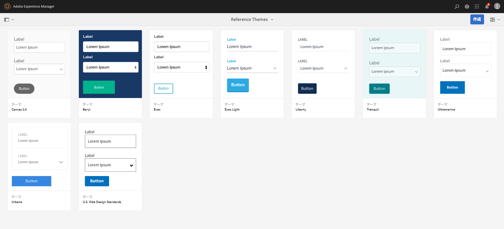

# リファレンステーマ {#reference-themes}

>[!CAUTION]
>
>AEM 6.4 の拡張サポートは終了し、このドキュメントは更新されなくなりました。 詳細は、 [技術サポート期間](https://helpx.adobe.com/jp/support/programs/eol-matrix.html). サポートされているバージョンを見つける [ここ](https://experienceleague.adobe.com/docs/?lang=ja).

[テーマ](/help/forms/using/themes.md)を使用すると、CSS に関する深い知識がなくてもフォームのスタイルを設定できます。デフォルトのテーマに加え、[AEM Forms アドオンパッケージ](https://experienceleague.adobe.com/docs/?lang=jaexperience-manager-release-information/aem-release-updates/forms-updates/aem-forms-releases.html)をインストールすることで以下のテーマを取得できます。

* Beryl
* Exec
* Exec-Light
* Liberty
* Ultramarine
* Urbane
* U.S. Web Design Standards
* Tranquil

各テーマには、ユーザー向けの快適なアダプティブフォームを作成するために使用できる、独自のエレガントなスタイルが含まれています。 パネル、テキストボックス、数値ボックス、ラジオボタン、テーブル、スイッチなど、セレクターに固有のスタイルが設定されています。 これらのテーマのスタイルは、要件に基づいています。 例えば、特定のシナリオでは、クリーンなフォントを備えたミニマリストテーマが必要です。 Liberty テーマを使用すると、その外観を実現できます。

このパッケージに含まれるテーマはレスポンシブで、これらのテーマ内のスタイルはモバイルディスプレイとデスクトップディスプレイに対して定義されます。 様々なデバイス上の最新ブラウザーのほとんどは、これらのテーマのいずれかが適用されたフォームを問題なくレンダリングできます。

パッケージのインストールについて詳しくは、[パッケージの作業方法](/help/sites-administering/package-manager.md)を参照してください。

## Beryl {#beryl}

ベリルテーマは次の場合に使用されます： [We.Gov アダプティブフォーム](/help/forms/using/gov-reference-site-walkthrough.md)背景画像、透明度、大きくてフラットなアイコンの使用に重点を置きます。 以下のスクリーンショットで、Beryl テーマの外観と、フォームのスタイル設定がどのように拡張されるかを確認できます。
[クリックして拡大](assets/beryl-1.png)

## Exec {#exec}

Exec テーマを使用すると、背景の塗りつぶしが実線的に行われず、フォームコンポーネントが強調されます。 コンポーネントを選択してクリックすると、フォントの色が変わります。 デフォルトのキャンバステーマと比較すると、選択したタブのテキストのフォントカラーが濃い青に変わります。 ナビゲーションボタンと送信ボタンが Beryl テーマとは異なることに注意してください。

[クリックして拡大](assets/exec-1.png)

## Exec Light {#exec-light}

Exec Light テーマは、空白を使用してシームレスなエクスペリエンスを作成します。 「次へ」ボタンと「送信」ボタンは、塗りつぶしと 3D 影を表示します。 左側で選択したタブには、二重チェックマークではなく矢印が表示されます。

[クリックして拡大](assets/exec-light-1.png)

## Liberty {#liberty}

Liberty テーマは、ミニマリスト的なアプローチを使用して、重要性を強調します。 例えば、訪問したタブのフォントカラーが緑に変わります。 テキストボックスの下の輪郭だけが表示され、線付きの紙ベースのフォームの外観をエミュレートします。 アクティブなテキストボックスは、黒い下部のアウトラインを持ち、他のテキストボックスは薄いグレーの下部のアウトラインを持ちます。

[クリックして拡大](assets/liberty-1.png)

## Tranquil {#tranquil}

Tranquil テーマは、Tranquil カラースキームの明るい色合いと暗い色合いを提供し、フォームの様々なコンポーネントをハイライトします。 例えば、ラジオボタン、パネル、タブでは、異なるグリーンのシェードが表示されます。

[クリックして拡大](assets/tranquil-1.png)

## Ultramarine {#ultramarine}

Ultramarine テーマでは、濃い青色のシェードを使用して、タブ、パネル、テキストボックス、ボタンなどのコンポーネントをハイライトします。

## Urbane {#urbane}

Urbane テーマは、フォームの最小限の機能的外観を強調します。Urbane テーマをフォームに適用すると、コンポーネントはフラットになります。パネルには細いアウトラインが付けられ、モダンな外観を作成します。

[クリックして拡大](assets/urbane-1.png)

## U.S. Web Design Standards {#u-s-web-design-standards}

U.S. Web Design Standards テーマは、名前が示すとおり、Draft U.S. Web Design Standards サイトで規定されている書体とスタイルを使用します。この Web 標準は、連邦政府の Web サイト間での Web エクスペリエンスを統一するために、連邦政府機関で使用されています。

[クリックして拡大](assets/usgov.png)
