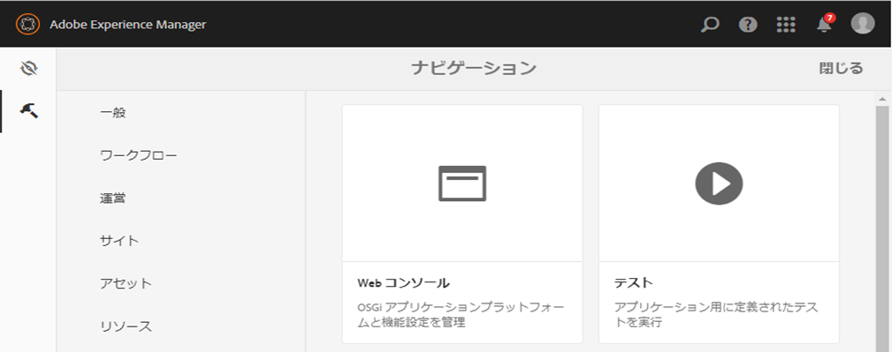
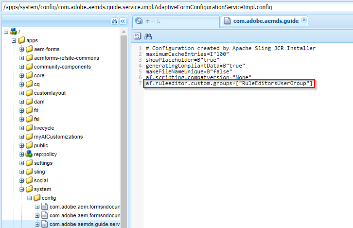

# 選択したユーザーグループにルールエディターへのアクセスを許可する {#grant-rule-editor-access-to-select-user-groups}

## 概要 {#overview}

アダプティブフォームで作業を行うユーザーのタイプやスキルは、それぞれ異なっています。正しい知識を使用してスクリプトや複雑なルールを操作できる上級ユーザーもいれば、アダプティブフォームのレイアウトや基本的なプロパティ以外の操作はできない初心者レベルのユーザーもいます。

AEM Forms では、各ユーザーの役割や職務に応じて、ルールエディターへのアクセスを制限することができます。アダプティブフォームの設定サービスを使用して、ルールエディターを表示してアクセスできる[ユーザーグループ](/help/sites-administering/security.md)を指定することができます。

## ルールエディターにアクセスできるユーザーグループの指定 {#specify-user-groups-that-can-access-rule-editor}

1. 管理者として AEM Forms にログインします。
1. オーサーインスタンスで、Adobe Experience Manager/ツール/操作/Webコンソールをクリックします。 新しいウィンドウに Web コンソールが表示されます。

   

1. Webコンソールウィンドウで、「 **[!UICONTROL アダプティブフォームとインタラクティブ通信Webチャネルの設定]** 」を探してクリックします。 **[!UICONTROL 「アダプティブフォーム」と「インタラクティブ通信Webチャネルの設定」]** ダイアログが表示されます。値を変更せずに、「**[!UICONTROL 保存]**」をクリックします。

   これにより、CRX リポジトリに /apps/system/config/com.adobe.aemds.guide.service.impl.AdaptiveFormConfigurationServiceImpl.config ファイルが作成されます。

1. 管理者として CRXDE にログインします。編集のため、/apps/system/config/com.adobe.aemds.guide.service.impl.AdaptiveFormConfigurationServiceImpl.config ファイルを開きます。
1. 次のプロパティを使用して、ルールエディターにアクセスできるグループの名前（例えば RuleEditorsUserGroup）を指定し、「**すべて保存**」をクリックします。

   `af.ruleeditor.custom.groups=["RuleEditorsUserGroup"]`

   複数のグループに対するアクセスを有効にするには、コンマで区切られた値のリストを指定します。

   `af.ruleeditor.custom.groups=["RuleEditorsUserGroup", "PermittedUserGroup"]`

   

   現在は、指定されたユーザーグループ（ここではRuleEditorsUserGroup）に属さないユーザーがフィールドをタップした場合、コンポーネントツールバーの「ルールを編集」アイコン(  )は使用できません。

   

   ルールエディターへのアクセス権を持つユーザーに表示されるコンポーネントツールバー

   

   ルールエディターへのアクセス権を持たないユーザーに表示されるコンポーネントツールバー

   ユーザーをグループに追加する方法については、[ユーザーの管理とセキュリティ](/help/sites-administering/security.md)を参照してください。
