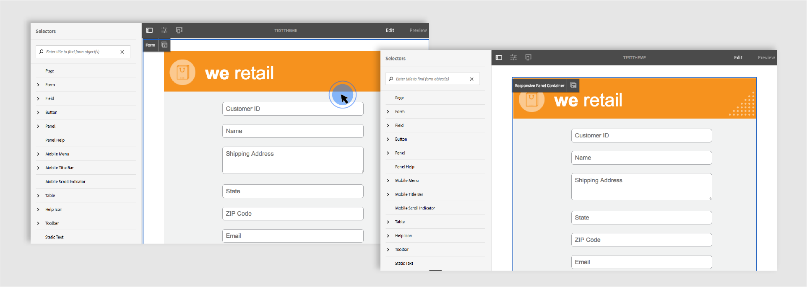

# アダプティブフォームのスタイル設定 {#do-not-publish-style-your-adaptive-form}

カスタムテーマの作成、個別コンポーネントのスタイル設定、テーマでの Web フォントの使用について説明します。

これは、「[最初のアダプティブフォームを作成する](create-your-first-adaptive-form.md)」シリーズを構成するチュートリアルです。チュートリアル内のユースケースを理解して実際に操作できるように、このシリーズのチュートリアルを最初から順に学習することをお勧めします。

## このチュートリアルについて  {#about-the-tutorial}

テーマを使用すると、アダプティブフォームに独自の外観やスタイルを設定できます。アダプティブフォームエディターの初期設定済みテーマを適用することも、独自のカスタムテーマを作成することもできます。AEM Forms はカスタムテーマを作成するための[テーマエディター](themes.md)を提供します。単一のテーマを使用すると、モバイル、タブレット、デスクトップで開いた同一のアダプティブフォームに異なる外観を設定できます。テーマエディターを使用する場合、CSS や LESS の予備知識は特に必要ありません。

このチュートリアルを終了すると、以下の操作を実行できるようになります。

* 初期設定済みテーマをアダプティブフォームに適用する
* テーマエディターを使用して、アダプティブフォームのテーマを作成する
* 個別コンポーネントのスタイルを設定する
* オプション：カスタムテーマに Web フォントを使用する

チュートリアルを完了すると、フォームの外観は以下のようになります。

## 事前準備 {#before-you-start}

以下に示すヘッダースタイルとロゴの画像をローカルマシンにダウンロードします。`shipping-address-add-update-form` アダプティブフォームのヘッダーは、ヘッダースタイルとロゴの画像を使用します。ヘッダースタイルの画像はヘッダーの右側に表示されます。

[ファイルを入手](assets/header-style.png)

[ファイルを入手](assets/logo-1.png)

## 手順 1：アダプティブフォームへのテーマの適用 {#step-apply-a-theme-to-your-adaptive-form}

アダプティブフォームエディターは多数の初期設定済みテーマを提供します。アダプティブフォームにカスタムスタイルを使用する場合は、初期設定済みテーマを使用してアダプティブフォームを発行することもできます。テーマはアダプティブフォームから独立しています。同一のテーマを複数のアダプティブフォームに適用できます。テーマをアダプティブフォームに適用するには：

1. アダプティブフォームを編集用に開きます。

   [http://localhost:4502/editor.html/content/forms/af/shipping-address-add-update-form.html](http://localhost:4502/editor.html/content/forms/af/shipping-address-add-update-form.html)

1. **アダプティブフォームコンテナ**&#x200B;のプロパティを開きます。プロパティブラウザーで、**基本**／**アダプティブフォームのテーマ**&#x200B;に移動します。すべての初期設定済みテーマとカスタムテーマが、「**アダプティブフォームのテーマ**」フィールドに表示されます。デフォルトではキャンバステーマが適用されます。
1. 「**アダプティブフォームのテーマ**」フィールドでテーマを選択します（**調査テーマ**&#x200B;など）。 をタップして、選択したテーマを適用します。

**図：** *デフォルトのテーマを使用したアダプティブフォーム*

**図：** *調査テーマを使用したアダプティブフォーム*

## 手順 2：アダプティブフォームの更新 {#step-update-your-adaptive-form}

上記のデザインでは、既存のアダプティブフォームのプレースホルダーテキストとロゴを変更する必要があります。必要な変更を行うには、次の手順を実行します。

1. ヘッダーの既存のロゴとテキストを変更します。ロゴを削除するには、次の手順を実行します。

   1. フォームエディターでフォームを開きます。

      [http://localhost:4502/editor.html/content/forms/af/shipping-address-add-update-form.html](http://localhost:4502/editor.html/content/forms/af/shipping-address-add-update-form.html)

   1. ヘッダーコンポーネントでロゴの画像をタップし、 「プロパティ」をタップします。画像のプロパティで X をタップし、既存のロゴの画像を削除します。
   1. 「アップロード」をタップして、logo.png を選択し、  をタップして変更を保存します。この画像は「[事前準備](/help/forms/using/style-your-adaptive-form.md#before-you-start)」セクションでダウンロードした画像です。
   1. ヘッダーテキスト `We.Retail` をタップしてから、  「**編集**」をタップします。ヘッダーテキストを `we retail` に変更します。太字書式を `we retail` の `we` にのみ適用します。

   

1. タイトルを削除してプレースホルダーテキストを追加します。

   1. 「顧客 ID」フィールドをタップし、「プロパティ」をタップします。
   1. 「**タイトル**」フィールドの内容を「**プレースホルダーテキスト**」フィールドにコピーします。
   1. 「**タイトル**」 フィールドのコンテンツを削除して、 をタップします。
   1. フォーム内のすべてのテキストボックス、数値ボックス、電子メールフィールドで、上記の 3 つの手順を繰り返します。

   

## 手順 3：アダプティブフォームのカスタムテーマの作成 {#step-create-a-custom-theme-for-your-adaptive-form}

[テーマエディター](/help/forms/using/themes.md)を使用すると、カスタムテーマを作成できます。テーマエディターは非常に強力な WYSIWYG エディターです。視覚的に確認しながら、アダプティブフォームの各種コンポーネントに CSS を適用できます。アダプティブフォームのコンポーネントやパネルのスタイルを詳細にコントロールできます。

アダプティブフォームと同様、テーマは独立したエンティティです。アダプティブフォームのコンポーネントとパネルのスタイル（CSS）が含まれています。スタイルには背景色、状態色、透明度、配置、サイズなど、CSS プロパティが含まれています。テーマを適用すると、指定したスタイルがアダプティブフォームの対応するコンポーネントに適用されます。

このチュートリアルでは、ヘッダー、フッター、テキストコンポーネント、数値コンポーネント、添付ファイルコンポーネント、ボタンのスタイルを設定します。まずテーマを作成することから始めましょう。

### テーマの作成 {#create-a-theme}

1. AEM オーサーインスタンスにログインして、**Adobe Experience Manager**／**Forms**／**テーマ**&#x200B;に移動します。デフォルトの URL は [http://localhost:4502/aem/forms.html/content/dam/formsanddocuments-themes](http://localhost:4502/aem/forms.html/content/dam/formsanddocuments-themes) です。 
1. 「**[!UICONTROL 作成]**」をタップし、「**[!UICONTROL テーマ]**」を選択します。テーマの作成が必要なフィールドを含む「テーマを作成」ページが表示されます。「タイトル」フィールドと「ドキュメント名」フィールドは必須です。

   * **タイトル：**&#x200B;テーマのタイトルを指定します。（**グローバルテーマ**&#x200B;など）。タイトルはテーマのリストから目的のテーマを見つけるのに役立ちます。
   * **名前：**&#x200B;テーマの名前を指定します。（**グローバルテーマ**&#x200B;指定された名前のノードがリポジトリーに作成されます。タイトルを入力し始めると、名前フィールドの値が自動的に生成されます。候補として入力された値は変更可能です。「ドキュメント名」フィールドには、英数字、ハイフン、アンダースコアのみを使用できます。無効な入力は、すべてハイフンに置き換えられます。

1. 「**作成**」をタップします。テーマが作成され、フォームを編集用に開くためのダイアログが表示されます。「**開く**」をタップし、新規作成されたテーマを新しいタブで開きます。テーマがテーマエディターで開きます。スタイルを設定する際、テーマエディターは AEM Forms に付属している初期設定済みアダプティブフォームを使用します。

   テーマエディター UI の使用について詳しくは、「[テーマエディターについて](/help/forms/using/themes.md#aboutthethemeeditor)」を参照してください。

1. **テーマオプション** ／**設定**&#x200B;をタップします。「**フォームのプレビュー**」フィールドで **shipping-address-add-update-form** アダプティブフォームを選択し、 「」、「 **保存**」の順にタップします。テーマエディターで、デフォルトのアダプティブフォームではなく独自のアダプティブフォームを使用できるようになります。テーマエディターに戻るには、「**キャンセル**」をタップします。

   

   **図：** *shipping-address-add-update-form アダプティブフォームを使用したテーマエディター*

   

   **図：** *デフォルトのフォームを使用したアダプティブフォーム*

### ヘッダーとフッターのスタイル設定 {#style-header-and-footer}

ヘッダーとフッターをアダプティブフォームで使用すると、独特な外観を作成できます。通常、ヘッダーには組織のロゴと名前が含まれ、フッターには著作権情報が含まれます。これらは組織の複数のフォーム間で統一されます。shipping-address-add-update-form アダプティブフォームのヘッダーとフッターのスタイルを設定するには、次の手順を実行します。

1. セレクターパネルで&#x200B;**ヘッダー**／**テキスト**&#x200B;オプションに移動します。セレクターパネルはテーマエディターの左側にあります。パネルが表示されない場合は、をタップします。  サイドパネルを切り替えます。

1. 「**テキスト**」アコーディオンで以下のプロパティを設定し、「」をタップします。

   | プロパティ | 値 |
   |---|---|
   | フォントファミリー | Arial |
   | フォントカラー | FFFFFF |
   | フォントサイズ | 54 px |

1. ヘッダーウィジェットをタップし、「**ヘッダー**」をタップします。ヘッダーウィジェットのスタイルを設定するオプションが左側に表示されます。「**寸法と位置**」アコーディオンを展開し、「**高さ** 」を `120px`に設定して、 「」をタップします。
1. ヘッダーウィジェットの「背景」アコーディオンを展開し、「**背景色**」を「`F6921E.`」に設定します。

   **画像とグラデーション**／**+ 追加**&#x200B;にポインターを合わせ、 「**画像**」をタップします。以下のプロパティを設定し、「」をタップします。

   | プロパティ | 値 |
   |---|---|
   | 画像 | header-style.png をアップロードします。この画像は「[事前準備](/help/forms/using/style-your-adaptive-form.md#before-you-start)」セクションでダウンロードした画像です。 |
   | 位置 | 右下 |
   | タイル | 繰り返しなし |

1. テーマエディターで、ヘッダーのロゴをタップし、「**ヘッダーロゴ**」をタップします。「寸法と位置」アコーディオンを展開し、次のプロパティを設定して、「」をタップします。

<table> 
 <tbody> 
  <tr> 
   <td>余白</td> 
   <td>値</td> 
  </tr> 
  <tr> 
   <td>余白</td> 
   <td> 
    <ul> 
     <li>上：1.5rem</li> 
     <li>下：-35 px</li> 
     <li>左：1rem<strong>  </strong></li> 
    </ul> 
<strong>ヒント：</strong> フィールドごとに異なる値を設定するには、 リンクアイコンをタップします。  
 </td> 
  </tr> 
  <tr> 
   <td>高さ</td> 
   <td>4.75rem</td> 
  </tr> 
 </tbody> 
</table>

1. フッターウィジェットをタップし、「**フッター**」をタップします。「**背景**」アコーディオンを展開し、「**背景色**」を「`F6921E` 」に設定して、「」をタップします。

### データ取得コンポーネントのスタイル設定とアダプティブフォームの背景の適用 {#style-the-data-capture-component-and-apply-a-background-to-the-adaptive-form}

アダプティブフォームでは複数のコンポーネントを使用してデータを取得できます。例えば、テキストボックスと数値ボックスを使用できます。すべてのデータ取得コンポーネントに同じスタイルを設定することも、コンポーネントごとに異なるスタイルを設定することもできます。このチュートリアルでは、数値ボックス（顧客 ID、郵便番号）とテキストボックス（顧客 ID、名前、発送先住所、状態、電子メール）に同じスタイルを適用します。データ取得コンポーネントのスタイルを設定するには、次の手順を実行します。

1. 「顧客 ID」フィールドをタップし、「**フィールドウィジェット**」オプションをタップします。次のプロパティを設定し、「」をタップします。

<table> 
 <tbody> 
  <tr> 
   <td>アコーディオン</td> 
   <td>プロパティ</td> 
   <td>値</td> 
  </tr> 
  <tr> 
   <td>境界線</td> 
   <td>境界線の色</td> 
   <td>A7A9AC</td> 
  </tr> 
  <tr> 
   <td>境界線</td> 
   <td>境界線の半径 </td> 
   <td> 
    <ul> 
     <li>上：7 px  </li> 
     <li>右：7 px  </li> 
     <li>下：7 px  </li> 
     <li>左：7 px  </li> 
    </ul> </td> 
  </tr> 
  <tr> 
   <td>テキスト</td> 
   <td>フォントファミリー</td> 
   <td>Arial</td> 
  </tr> 
  <tr> 
   <td>テキスト</td> 
   <td>フォントカラー</td> 
   <td>939598  </td> 
  </tr> 
  <tr> 
   <td>テキスト</td> 
   <td>フォントサイズ</td> 
   <td>18 px</td> 
  </tr> 
  <tr> 
   <td>寸法と位置</td> 
   <td>幅</td> 
   <td>60%</td> 
  </tr> 
  <tr> 
   <td>寸法と位置</td> 
   <td>余白</td> 
   <td> 
    <ul> 
     <li>左：10rem</li> 
    </ul> </td> 
  </tr> 
 </tbody> 
</table>

1. 「顧客 ID」フィールドの上部で空白領域をタップし、「**レスポンシブパネルコンテナ**」をタップします。**背景**／**背景色**&#x200B;を F1F2F2 に設定します。「」をタップします。

   

### ボタンのスタイル設定 {#style-the-buttons}

カスタムテーマを使用すると、アダプティブフォームのすべてのボタンに同じスタイルを適用することも、特定のボタンに[インラインスタイル設定](/help/forms/using/inline-style-adaptive-forms.md)を適用することもできます。ボタンのスタイルを設定するには、次の手順を実行します。

1. 「**送信**」ボタンをタップし、「**ボタン**」オプションをタップします。次のプロパティを設定し、「」をタップします。

<table> 
 <tbody> 
  <tr> 
   <td>アコーディオン</td> 
   <td>プロパティ</td> 
   <td>値</td> 
  </tr> 
  <tr> 
   <td>背景</td> 
   <td>背景色</td> 
   <td>F6921E</td> 
  </tr> 
  <tr> 
   <td>境界線  </td> 
   <td>境界線の色</td> 
   <td>F6921E</td> 
  </tr> 
  <tr> 
   <td>境界線</td> 
   <td>境界線の半径 </td> 
   <td> 
    <ul> 
     <li>上：7 px  </li> 
     <li>右：7 px  </li> 
     <li>下：7 px  </li> 
     <li>左：7 px</li> 
    </ul> </td> 
  </tr> 
  <tr> 
   <td>テキスト  </td> 
   <td>フォントファミリー</td> 
   <td>Arial</td> 
  </tr> 
  <tr> 
   <td>テキスト</td> 
   <td>フォントカラー</td> 
   <td>FFFFFF</td> 
  </tr> 
  <tr> 
   <td>テキスト</td> 
   <td>フォントサイズ</td> 
   <td>18 px</td> 
  </tr> 
 </tbody> 
</table>

1. アダプティブフォームに[カスタムテーマを適用](/help/forms/using/style-your-adaptive-form.md#step-apply-a-theme-to-your-adaptive-form)するか、グローバルテーマを適用します。スタイルがアダプティブフォームに反映されない場合は、ブラウザーのキャッシュを削除した後、もう一度実行してください。

   

## 手順 4：個別コンポーネントのスタイル設定 {#step-style-individual-components}

一部のスタイルは特定のコンポーネントのみに適用されます。このようなコンポーネントのスタイルは、アダプティブフォームエディターで設定します。

1. アダプティブフォームを編集用に開きます。[http://localhost:4502/editor.html/content/forms/af/shipping-address-add-update-form.html](http://localhost:4502/editor.html/content/forms/af/change-billing-shipping-address.html)
1. 上部バーで「**スタイル**」オプションを選択します。

   

1. 「**添付**」ボタンをタップし、 アイコンをタップします。「**寸法と位置**」アコーディオンで以下のプロパティを設定します。

   | プロパティ | 値 |
   |---|---|
   | 浮動小数 | Left |
   | 幅 | 10% |

1. 「**Government approved address proof**」オプションをタップし、 アイコンをタップします。次のプロパティを設定します。

<table> 
 <tbody> 
  <tr> 
   <td>アコーディオン</td> 
   <td>プロパティ</td> 
   <td>値</td> 
  </tr> 
  <tr> 
   <td>寸法と位置</td> 
   <td>浮動小数</td> 
   <td>左</td> 
  </tr> 
  <tr> 
   <td>寸法と位置</td> 
   <td>幅</td> 
   <td>73%</td> 
  </tr> 
  <tr> 
   <td>寸法と位置</td> 
   <td>パディング</td> 
   <td> 
    <ul> 
     <li>左：10 px</li> 
    </ul> </td> 
  </tr> 
  <tr> 
   <td>寸法と位置</td> 
   <td>高さ</td> 
   <td>40 px</td> 
  </tr> 
  <tr> 
   <td>寸法と位置  </td> 
   <td>余白</td> 
   <td>  
    <ul> 
     <li>右：2rem</li> 
     <li>左：10rem </li> 
    </ul> </td> 
  </tr> 
  <tr> 
   <td>背景</td> 
   <td>背景色</td> 
   <td>FFFFFF</td> 
  </tr> 
  <tr> 
   <td>境界線</td> 
   <td>境界線の幅</td> 
   <td>1 px</td> 
  </tr> 
  <tr> 
   <td>境界線</td> 
   <td>境界線のスタイル</td> 
   <td>実線</td> 
  </tr> 
  <tr> 
   <td>境界線</td> 
   <td>境界線の色</td> 
   <td>A7A9AC</td> 
  </tr> 
  <tr> 
   <td>境界線</td> 
   <td>境界線の半径</td> 
   <td>7 px</td> 
  </tr> 
  <tr> 
   <td>テキスト</td> 
   <td>フォントファミリー</td> 
   <td>Arial</td> 
  </tr> 
  <tr> 
   <td>テキスト</td> 
   <td>フォントカラー</td> 
   <td>BCBEC0</td> 
  </tr> 
  <tr> 
   <td>テキスト</td> 
   <td>フォントサイズ</td> 
   <td>18 px</td> 
  </tr> 
  <tr> 
   <td>テキスト</td> 
   <td>行の高さ</td> 
   <td>2</td> 
  </tr> 
 </tbody> 
</table>

1. 「**送信**」ボタンをタップし、 アイコンをタップします。次のプロパティを設定します。

<table> 
 <tbody> 
  <tr> 
   <td>アコーディオン</td> 
   <td>プロパティ</td> 
   <td>値</td> 
  </tr> 
  <tr> 
   <td>寸法と位置</td> 
   <td>浮動小数</td> 
   <td>Right</td> 
  </tr> 
  <tr> 
   <td>寸法と位置</td> 
   <td>余白</td> 
   <td> 
    <ul> 
     <li>上：5rem</li> 
     <li>右：14rem</li> 
     <li>下：20 px</li> 
     <li>左：20 px  </li> 
    </ul> </td> 
  </tr> 
  <tr> 
   <td>背景</td> 
   <td>背景色</td> 
   <td>F6921E</td> 
  </tr> 
  <tr> 
   <td>境界線</td> 
   <td>境界線の色</td> 
   <td>F6921E</td> 
  </tr> 
 </tbody> 
</table>

## 手順 5：オプション：カスタムテーマでの Web フォントの使用 {#step-bonus-section-using-web-fonts-in-a-custom-theme}

アダプティブフォームは各種フォントを使用してデザインできます。アダプティブフォームのデザインに使用するフォントが、アダプティブフォームを表示するデバイスに存在しない場合があります。Web フォントサービスを使用すると、必要なフォントを目的のデバイスで使用できます。

Adobe Typekit は Web フォントサービスです。アダプティブフォームでこのサービスを設定、使用できます。アダプティブフォームでAdobe Typekitを使用するには：

>[!NOTE]
>
> Typekit は現在はAdobe Fontsと呼ばれ、Creative Cloudや他の購読に含まれています。 [詳細情報](https://fonts.adobe.com/)を参照してください。

1. の作成 [Adobe Typekit](https://typekit.com/) アカウント、キットの作成、キットへのフォントMyriad Pro の追加、キットの公開、キット ID の取得を行います。 アダプティブフォームでAdobe Typekitフォント（Web フォント）を使用する必要があります。
1. AEM Formsサーバーで、に移動します。  **Adobe Experience Manager** > **ツール**  > **導入** > **Cloud Services**. Cloud Servicesページで、に移動します。 **サードパーティのサービス** > **Typekit**&#x200B;をクリックし、 **設定** Typekit の下に表示されます。 設定が既に使用可能な場合は、「+」ボタンをクリックして新しいインスタンスを作成します。

   設定を作成ダイアログで、新しい設定の「**タイトル**」を指定し、「**作成**」をクリックします。設定ページにリダイレクトされます。コンポーネントを編集ダイアログが表示されるので、**キット ID** を入力して「**OK**」をクリックします。

1. TypeKit 設定を使用するようにテーマを設定します。オーサーインスタンスで、テーマエディターを使用して「**グローバルテーマ**」を開きます。テーマエディターで、テーマオプション／設定に移動します。In **Typekit 設定** 「 」フィールドでキットを選択し、 **保存**.

   Typekit に追加されたフォントは、 **テキスト** アコーディオンを使用します。
