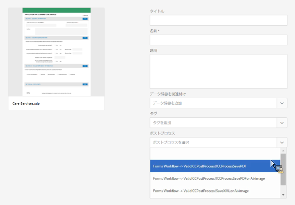

# レターとインタラクティブ通信の後処理 {#post-processing-of-letters-and-interactive-communications}

>[!CAUTION]
>
>AEM 6.4 の拡張サポートは終了し、このドキュメントは更新されなくなりました。 詳細は、 [技術サポート期間](https://helpx.adobe.com/jp/support/programs/eol-matrix.html). サポートされているバージョンを見つける [ここ](https://experienceleague.adobe.com/docs/?lang=ja).

## 後処理 {#post-processing}

エージェントは、レターとインタラクティブ通信に対して後処理ワークフローを関連付け、実行できます。 実行する後処理は、レターテンプレートのプロパティビューで選択できます。 最終レターを電子メールで送信、印刷、FAX、またはアーカイブする後処理を設定できます。

後処理をレターとインタラクティブ通信に関連付けるには、まず後処理を設定する必要があります。送信済みのレターに対しては、次の 2 つのタイプのワークフローが実行できます。

1. **Forms Workflow：** AEM Forms on JEE のプロセス管理ワークフローです。[Forms Workflow](#formsworkflow) の設定手順。

1. **AEM Workflow：** AEM Workflow は、送信済みレターに対する後処理として使用することもできます。[AEM Workflow](/help/forms/using/aem-forms-workflow.md) の設定手順。

## Forms のワークフロー {#formsworkflow}

1. AEM で次の URL を使用して、ご使用のサーバーの Adobe Experience Manager web コンソール設定を開きます：`https://<server>:<port>/<contextpath>/system/console/configMgr`

   

1. このページで AEM Forms Client SDK Configuration を探し、それをクリックして展開します。
1. サーバーの URL で、AEM Forms on JEE サーバーの名前とログインの詳細を入力し、「**保存**」をクリックします。

   

1. ユーザー名とパスワードを指定します。
1. sun.util.calendar がファイアウォールのデシリアライゼーション設定に追加されていることを確認します。

   デシリアライゼーションファイアウォール設定に移動し、パッケージプレフィックスのホワイトリストに登録されたクラスの下で、sun.util.calendar を追加します。

1. これで、サーバーのマッピングが行われ、レターの作成時に、AEM Forms on JEE 内の後処理が AEM ユーザーインターフェイスで使用できるようになります。

   

1. 処理／サービスを認証するには、処理の名前をコピーし、Adobe Experience Manager Web Console Configurations ページ／AEM Forms Client SDK Configuration に戻ってこのプロセスを新しいサービスとして追加します。

   例えば、レターのプロパティページのドロップダウンに、処理の名前が Forms Workflow -> ValidCCPostProcess/SaveXML として表示されている場合は、サービス名を `ValidCCPostProcess/SaveXML` として追加します。

1. 後処理にAEM Forms on JEE ワークフローを使用するには、必要なパラメーターと出力を設定します。 パラメーターのデフォルト値を以下に示します。

   Adobe Experience Manager web コンソール設定ページの「**[!UICONTROL Correspondence Management の設定]**」に移動して、以下のパラメーターを設定します。

   1. **inPDFDoc（PDF ドキュメントパラメーター）：** PDF ドキュメントを入力とします。この入力はレンダリングされたレターを入力として含みます。示されたパラメーター名は設定可能です。これらのパラメーター名は、「設定」の「Correspondence Management の設定」で編集することができます。
   1. **inXMLDoc（XML データパラメーター）：** XML ドキュメントを入力とします。この入力には、XML 形式でユーザーが入力したデータが含まれます。
   1. **inXDPDoc（XDP ドキュメントパラメーター）：** XML ドキュメントを入力とします。この入力には、基になるレイアウト（XDP）が含まれます。
   1. **inAttachmentDocs（添付ドキュメントパラメーター）：** リスト入力パラメーター。この入力には、すべての添付ファイルが入力として含まれます。
   1. **redirectURL（リダイレクト URL 出力）：** リダイレクト先の URL を示す出力タイプ。

   フォームワークフローには、PDFドキュメントパラメーターまたは XML データパラメーターのどちらかが、入力として指定された **[!UICONTROL Correspondence Management 設定]**. これは、後処理ドロップダウンにプロセスがリスト表示されるために必要です。

## パブリッシュインスタンスでの設定 {#settings-on-the-publish-instance}

1. `http://localhost:publishport/aem/forms` にログインします。
1. に移動します。 **[!UICONTROL レター]** をクリックして、パブリッシュインスタンスで使用可能な発行済みレターを表示します。
1. AEM DS の設定を行います。 詳しくは、 [AEM DS 設定の指定](/help/forms/using/configuring-the-processing-server-url-.md).

>[!NOTE]
>
>FormsまたはAEMワークフローを使用している場合、パブリッシュサーバーから送信する前に、DS 設定サービスを設定する必要があります。 そうしないと、フォームの送信が失敗します。

## レターインスタンスの取得 {#letter-instances-retrieval}

保存されたレターインスタンスは、LetterInstanceService で定義された次の API を使用して、レターインスタンスの取得やレターインスタンスの削除など、さらに操作できます。

<table> 
 <tbody> 
  <tr> 
   <td><strong>サーバーサイド API</strong></td> 
   <td><strong>操作名</strong></td> 
   <td><strong>説明</strong></td> 
  </tr> 
  <tr> 
   <td>
公開 LetterInstanceVO
 
getLetterInstance(String letterInstanceId)
 
ICCException をスロー 
 </td> 
   <td>getLetterInstance</td> 
   <td>指定したレターインスタンスを取得します </td> 
  </tr> 
  <tr> 
   <td>公開ボイド deleteLetterInstance(String letterInstanceId) が ICCException; をスロー </td> 
   <td>deleteLetterInstance </td> 
   <td>指定したレターインスタンスを削除しました </td> 
  </tr> 
  <tr> 
   <td>リスト getAllLetterInstances(Query) が ICCException; をスロー </td> 
   <td>getAllLetterInstances </td> 
   <td>この API は、入力クエリパラメーターに基づいてレターインスタンスを取得します。すべてのレターインスタンスを取得するには、クエリパラメーターをヌルとして渡すことができます。  </td> 
  </tr> 
  <tr> 
   <td>公開ブール letterInstanceExists(String letterInstanceName) が ICCException; をスロー </td> 
   <td>letterInstanceExists </td> 
   <td>レターインスタンスが指定した名前で存在するかどうかをチェックします </td> 
  </tr> 
 </tbody> 
</table>

## 後処理とレターの関連付け {#associating-a-post-process-with-a-letter}

CCR ユーザーインターフェイスで、次の手順を実行して後処理をレターに関連付けます。

1. レターの上にマウスカーソルを置き、**プロパティを表示**&#x200B;をタップします。
1. 「**編集**」を選択します。
1. 基本プロパティで、後処理ドロップダウンを使用して、レターに関連付ける後処理を選択します。 AEM関連の後処理とForms関連の後処理の両方がドロップダウンに表示されます。
1. 「**保存**」をタップします。
1. 「後処理」でのレターの設定が完了したら、レターを発行します。必要な場合は、パブリッシュインスタンスの AEM DS 設定サービスで、処理 URL を指定します。これにより、後処理が処理インスタンス上で実行されるようになります。

## ドラフトレターインスタンスを再読み込み  {#reloaddraft}

ドラフトレターインスタンスは、次の URL を使用してユーザーインターフェイスで再読み込みできます。

`https://<server>:<port>/aem/forms/`

`createcorrespondence.html?/random=$&cmLetterInstanceId=$<LetterInstanceId>`

LetterInstaceID:送信されたレターインスタンスの一意の ID。

ドラフトレターの保存の詳細については、 [ドラフトの保存とレターインスタンスの送信](/help/forms/using/create-correspondence.md#savingdrafts).
