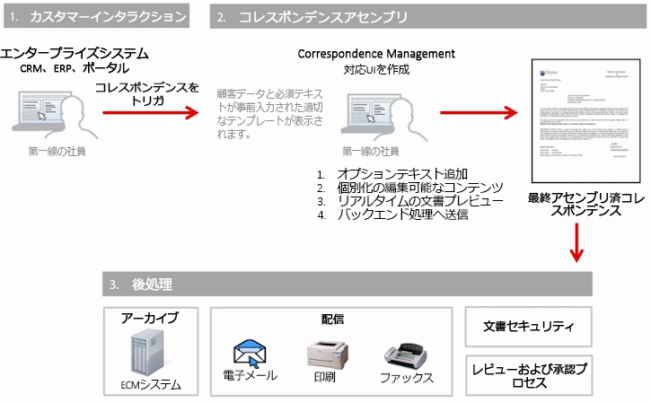

# レターとインタラクティブ通信の後処理 {#post-processing-of-letters-and-interactive-communications}

## 後処理 {#post-processing}

エージェントはレターおよびインタラクティブ通信上で後処理のワークフローを関連付けて実行できます。実行する後処理は、レターテンプレートのプロパティビューで選択できます。最終レターを電子メールで送信したり、印刷したり、ファックスしたり、あるいはアーカイブしたりするための後処理を設定できます。

後処理をレターとインタラクティブ通信に関連付けるには、まず後処理を設定する必要があります。送信済みのレターに対しては、次の 2 種類のワークフローを実行できます。

1. **Forms Workflow:** これらは、JEE 上のAEM Formsのプロセス管理ワークフローです。 設定手順 [Forms Workflow](#formsworkflow).

1. **AEM Workflow:** AEMワークフローは、送信済みレターの後処理としても使用できます。 設定手順 [AEM Workflow](/help/forms/using/aem-forms-workflow.md).

## Forms のワークフロー {#formsworkflow}

1. AEMで、次の URL を使用して、サーバーのAdobe Experience Manager Web Console Configuration を開きます。 `https://<server>:<port>/<contextpath>/system/console/configMgr`

   

1. このページで AEM Forms Client SDK Configuration を探し、それをクリックして展開します。
1. 「サーバー URL 」に、JEE 上のAEM Formsサーバーの名前とログインの詳細を入力し、「 **保存**.

   

1. ユーザー名とパスワードを指定します。
1. sun.util.calendar が Deserialization Firewall Configuration に追加されていることを確認します。

   デシリアライゼーションファイアウォール設定に移動し、パッケージプレフィックスのホワイトリストに登録されたクラスの下で、sun.util.calendar を追加します。

1. これで、サーバーがマッピングされ、JEE 上のAEM Formsの後処理が、レターの作成中にAEMユーザーインターフェイスで使用できるようになります。

   

1. 処理／サービスを認証するには、処理の名前をコピーし、Adobe Experience Manager Web Console Configurations ページ／AEM Forms Client SDK Configuration に戻ってこのプロセスを新しいサービスとして追加します。

   例えば、レターのプロパティページのドロップダウンにプロセスの名前がForms Workflow-> ValidCCPostProcess/SaveXML として表示される場合、サービス名を `ValidCCPostProcess/SaveXML`.

1. JEE 上の AEM Forms ワークフローを使用して後処理を行うには、必要なパラメーターと出力を設定します。パラメーターのデフォルト値を以下に示します。

   Adobe Experience Manager Web コンソール設定ページに移動します。 **[!UICONTROL Correspondence Management 設定]** 次のパラメータを設定します。

   1. **inPDFDoc (PDF・ドキュメント・パラメータ ):** 入力としてのPDFドキュメント。 この入力はレンダリングされたレターを入力として含みます。指定されたパラメーター名は設定可能です。 Correspondence Management 設定から設定できます。
   1. **inXMLDoc （XML データパラメータ）:** 入力としての XML ドキュメント。 この入力には、XML の形式でユーザーが入力したデータが含まれます。
   1. **inXDPDoc （XDP ドキュメントパラメーター）:** 入力としての XML ドキュメント。 この入力には基になるレイアウト (XDP) が含まれます。
   1. **inAttachmentDocs （Attachment Documents パラメーター）:** リスト入力パラメーター。 この入力には、すべての添付ファイルが入力として含まれます。
   1. **redirectURL （リダイレクト URL 出力）:** リダイレクト先の URL を示す出力タイプです。

   フォームワークフローでは、「**[!UICONTROL Correspondence Management の設定]**」で指定した名前を使用して、PDF ドキュメントパラメーターまたは XML データパラメーターのいずれかを入力値として指定する必要があります。これは、後処理ドロップダウンにリスト表示する処理に対しては必須です。

## パブリッシュインスタンスでの設定 {#settings-on-the-publish-instance}

1. ログイン `http://localhost:publishport/aem/forms`.
1. 「**[!UICONTROL レター]**」に移動して、パブリッシュインスタンスで使用可能な発行済みレターを表示します。
1. AEM DS の設定を行います。詳しくは、「[AEM DS の設定](/help/forms/using/configuring-the-processing-server-url-.md)」を参照してください。

>[!NOTE]
>
>Forms ワークフローまたは AEM ワークフローを使用している場合は、発行サーバーから送信を行う前に、DS 設定サービスを構成する必要があります。このサービスを構成しないと、フォームの送信が失敗します。

## レターインスタンスの取得 {#letter-instances-retrieval}

保存されたレターインスタンスに対しては、LetterInstanceService 内で定義されている次の API を使用して、レターインスタンスの取得やレターインスタンスの削除といった作業を実行できます。

<table> 
 <tbody> 
  <tr> 
   <td><strong>サーバーサイド API</strong></td> 
   <td><strong>操作名</strong></td> 
   <td><strong>説明</strong></td> 
  </tr> 
  <tr> 
   <td>
公開 LetterInstanceVO
 
getLetterInstance(String letterInstanceId)
 
ICCException；をスロー 
 </td> 
   <td>getLetterInstance</td> 
   <td>指定したレターインスタンスを取得 </td> 
  </tr> 
  <tr> 
   <td>public void deleteLetterInstance(String letterInstanceId) が ICCException；をスロー </td> 
   <td>deleteLetterInstance </td> 
   <td>指定したレターインスタンスを削除しました </td> 
  </tr> 
  <tr> 
   <td>List getAllLetterInstances(Query) が ICCException；をスロー </td> 
   <td>getAllLetterInstances </td> 
   <td>この API は、入力クエリパラメーターに基づいてレターインスタンスを取得します。 すべてのレターインスタンスを取得するには、クエリパラメーターをヌルとして渡すことができます。  </td> 
  </tr> 
  <tr> 
   <td>パブリックブール letterInstanceExists(String letterInstanceName) が ICCException；をスロー </td> 
   <td>letterInstanceExists </td> 
   <td>LetterInstance が指定した名前で存在するかどうかを確認します </td> 
  </tr> 
 </tbody> 
</table>

## 後処置をレターに関連付け {#associating-a-post-process-with-a-letter}

CCR ユーザーインターフェイスで、次の手順を実行して後処理をレターに関連付けます。

1. レターの上にマウスポインターを置いて、 **プロパティを表示**.
1. 「**編集**」を選択します。
1. 基本のプロパティで、後処理ドロップダウンを使用して、レターに関連付ける後処理を選択します。AEM および Forms 関連の両方の後処理がドロップダウンリストに表示されます。
1. 「**保存**」をタップします。
1. 「後処理」でのレターの設定が完了したら、レターを発行します。必要な場合は、パブリッシュインスタンスの AEM DS 設定サービスで、処理 URL を指定します。これにより、後処理が処理インスタンス上で実行されるようになります。

## ドラフトレターインスタンスの再読み込み {#reloaddraft}

ドラフトレターインスタンスは、次の URL を使ってユーザーインターフェイス内で再読み込みできます。

`https://<server>:<port>/aem/forms/`

`createcorrespondence.html?/random=$&cmLetterInstanceId=$<LetterInstanceId>`

LetterInstaceID：送信済みレターインスタンスの一意の ID.

ドラフトレターの保存について詳しくは、「[ドラフトの保存とレターインスタンスの送信](/help/forms/using/create-correspondence.md#savingdrafts)」を参照してください。
