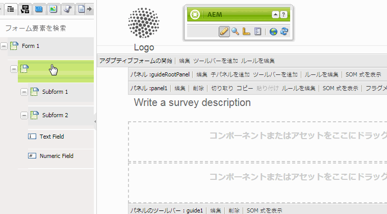
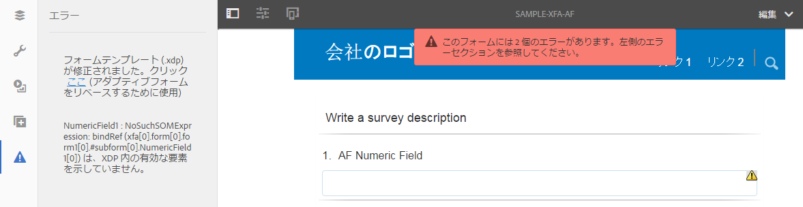
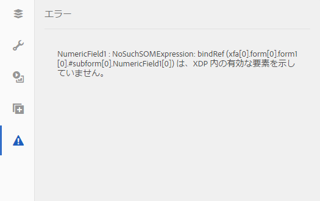

# アダプティブフォームと XFA フォームテンプレートの同期 {#synchronizing-adaptive-forms-with-xfa-form-templates}

>[!CAUTION]
>
>AEM 6.4 の拡張サポートは終了し、このドキュメントは更新されなくなりました。 詳細は、 [技術サポート期間](https://helpx.adobe.com/jp/support/programs/eol-matrix.html). サポートされているバージョンを見つける [ここ](https://experienceleague.adobe.com/docs/?lang=ja).

## はじめに {#introduction}

XFA フォームテンプレート（`*.XDP` ファイル）に基づいてアダプティブフォームを作成することができます。この方法では既存の XFA フォームが再利用でき、投資効率が得られます。XFA フォームテンプレートを使用したアダプティブフォームの作成方法については、「[テンプレートに基づくアダプティブフォームの作成](/help/forms/using/creating-adaptive-form.md#p-create-an-adaptive-form-based-on-an-xfa-form-template-p)」を参照してください。

アダプティブフォーム内で XDP ファイルのフィールドを再利用できます。 これらのフィールドは、連結されたフィールドと呼ばれます。 連結されたフィールドのプロパティ（スクリプト、ラベル、表示形式など）は、XDP ファイルからコピーされます。 これらのプロパティには、値をオーバーライドできるものもあります。

AEM Formsでは、XDP ファイル内の対応するフィールドに後で変更が加えられた場合に、アダプティブフォームのフィールドを同期した状態に保つことができます。 この記事では、この同期を有効にする方法を説明します。

AEM Formsオーサリング環境では、XFA フォーム（左）からアダプティブフォーム（右）にフィールドをドラッグすることができます

## 前提条件 {#prerequisites}

この記事の情報を使用するには、次の内容について確認しておくと役立ちます。

* [アダプティブフォームの作成](/help/forms/using/creating-adaptive-form.md)

* XFA（XML Forms Architecture）

この記事の例に示されているアセットを使用するには、次のセクション「[サンプルパッケージ](/help/forms/using/synchronizing-adaptive-forms-xfa.md#p-sample-package-p)」で説明されているとおりにサンプルパッケージをダウンロードしてください。

## サンプルパッケージ {#sample-package}

この記事では、サンプルを使用して、アダプティブフォームを更新された XFA フォームテンプレートと同期する方法を示しています。 例で使用しているアセットは、この記事の「[ダウンロード](/help/forms/using/synchronizing-adaptive-forms-xfa.md#p-downloads-p)」の節からダウンロードできるパッケージに含まれています。

パッケージをアップロードすると、これらのアセットがAEM Forms UI に表示されます。

パッケージマネージャー: `https://<server>:<port>/crx/packmgr/index.jsp` を使ってパッケージをインストールします

パッケージには次のアセットが含まれています。

1. `sample-form.xdp`：例として使用されている XFA フォームテンプレート

1. `sample-xfa-af`：sample-form.xdp ファイルに基づくアダプティブフォームただし、このアダプティブフォームにはフィールドは含まれていません。次の手順で、このアダプティブフォームにコンテンツを追加します。

### アダプティブフォームへのコンテンツの追加 {#add-content-to-adaptive-form-br}

1. https://&lt;server>:&lt;port>/aem/forms.html に移動します。要求された場合は、資格情報を入力します。
1. sample-af-xfa をオーサリングモードで編集用に開きます。
1. サイドバーのコンテンツブラウザーで、「データモデルオブジェクト」タブを選択します。 NumericField1 と TextField1 をアダプティブフォームにドラッグします。
1. NumericField1 のタイトルを **Numeric Field** から **AF Numeric Field** に変更します。

>[!NOTE]
>
>上記の手順では、XDP ファイル内のフィールドのプロパティを上書きしました。 したがって、XDP ファイル内の対応するプロパティが後で変更された場合、このプロパティは同期されません。

## XDP ファイル内の変更の検出 {#detecting-changes-in-xdp-file}

XDP ファイルまたはフラグメントに変更が生じた場合は常に、AEM Forms UI によって、その XDP ファイルまたはフラグメントに基づくすべてのアダプティブフォームにフラグが付けられます。

XDP ファイルを更新した後、変更がフラグ付けされるようにするには、その XDP ファイルを AEM Forms UI に再度アップロードする必要があります。

例として、次の手順を使って `sample-form.xdp` ファイルを更新します。

1. `https://<server>:<port>/projects.html.`に移動します。指示に従って、資格情報を入力します。
1. 左側にある「フォーム」タブをクリックします。
1. ローカルマシンに `sample-form.xdp` ファイルをダウンロードします。XDP ファイルが、任意のファイル解凍ユーティリティで抽出可能な `.zip` ファイル形式でダウンロードされます。

1. `sample-form.xdp` ファイルを開き、TextField1 のタイトルを **Text Field** から **My Text Field** に変更します。

1. `sample-form.xdp` ファイルを AEM Forms UI にアップロードして戻します。

XDP ファイルが更新されると、XDP ファイルに基づいてアダプティブフォームを編集する際に、エディターにアイコンが表示されます。 このアイコンは、アダプティブフォームが XDP ファイルと同期されていないことを示します。 次の画像では、サイドバーにアイコンが表示されています。

## アダプティブフォームと最新の XDP ファイルとの同期 {#synchronizing-adaptive-forms-with-the-latest-xdp-file}

XDP ファイルと同期していないアダプティブフォームを次回、作成用に開くと、**このアダプティブフォームのスキーマ / フォームテンプレートは更新されました`Click Here`というメッセージが表示されます（新しいバージョンでリベースするために使用）。**

メッセージをクリックすると、アダプティブフォーム内のフィールドが XDP ファイル内の対応するフィールドと同期されます。

この記事で使用される例では、`sample-xfa-af` をオーサリングモードで開きます。メッセージが、アダプティブフォームの下部に表示されます。

### プロパティの更新 {#updating-the-properties}

XDP ファイルからアダプティブフォームにコピーされたすべてのプロパティは、作成者によってアダプティブフォーム内で（コンポーネントダイアログから）明示的に上書きされたプロパティを除き、更新されます。 更新されたプロパティのリストは、サーバーログで見ることができます。

例にあるアダプティブフォームのプロパティを更新するには、メッセージ内の「`"Click Here"`」のラベルが付いたリンクをクリックします。TextField1 のタイトルが、**Text Field** から **My Text Field** に変更されます。

>[!NOTE]
>
>AF Numeric Field のラベルが変更されなかったのは、「[アダプティブフォームへのコンテンツの追加](#p-add-content-to-adaptive-form-br-p)」で説明したとおり、コンポーネントプロパティダイアログでこのプロパティを上書きしたためです。

### XDP ファイルからアダプティブフォームへの新しいフィールドの追加   {#adding-new-fields-from-xdp-file-to-adaptive-form-nbsp}

元の XDP ファイルに後から追加されたフィールドは「フォーム階層」タブに表示され、新しいフィールドをアダプティブフォームにドラッグすることができます。

「フォーム階層」タブのフィールドを更新するために、エラーメッセージ内のリンクをクリックする必要はありません。

### XDP ファイルから削除されたフィールド {#deleted-fields-in-xdp-file}

アダプティブフォームに以前にコピーされたフィールドが XDP ファイルから削除されると、そのフィールドが XDP ファイルに存在しないことを示すエラーメッセージがオーサリングモードで表示されます。 その場合は、アダプティブフォームから手動でそのフィールドを削除するか、コンポーネントダイアログで `bindRef` プロパティを消去します。

次の手順では、この記事で使われている例の中のアセットに対してこの方法を使用する流れを説明します。

1. `sample-form.xdp` ファイルを更新し、NumericField1 を削除します。
1. AEM Forms UI に `sample-form.xdp` ファイルをアップロードします。
1. `sample-xfa-af` アダプティブフォームを作成のために開きます。次のエラーメッセージが表示されます：このアダプティブフォームのスキーマ／フォームテンプレートは更新されました。`Click Here`(新しいバージョンでリベースするために使用)。

1. メッセージ内の「`Click Here`のラベル」が付いたリンクをクリックします。XDP ファイルにフィールドが存在しないというエラーメッセージが表示されます。

削除されたフィールドも、フィールドにエラーが存在することを示すアイコンでマークされます。

>[!NOTE]
>
>アダプティブフォームのフィールドで誤ったバインド（編集ダイアログの無効な `bindRef` 値）を持つフィールドも、削除されたフィールドとみなされます。作成者がこれらのエラーを修正せずにアダプティブフォームを公開した場合、フィールドはバインドされていない通常のアダプティブフォームフィールドとして扱われ、出力 XML ファイルのバインドされていないセクションに含まれます。

## ダウンロード {#downloads}

この記事の例に使用されているコンテンツパッケージ

[ファイルを入手](assets/sample-xfa-af-sync-1.0.zip)
