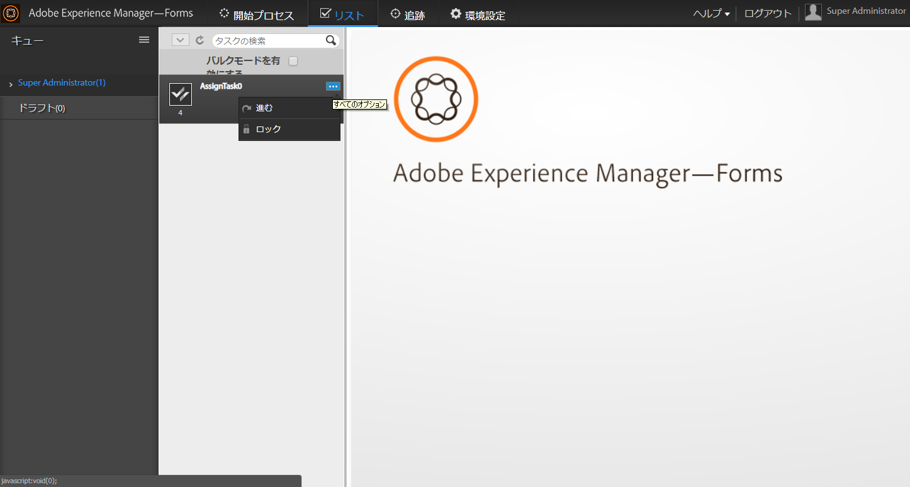

# マネージャービューを使用した組織階層でのタスクの管理 {#managing-tasks-in-an-organizational-hierarchy-using-manager-view}

AEM Forms ワークスペースで、マネージャーは階層のメンバー（直属または直属ではない部下）に割り当てられたタスクにアクセスし、さまざまなアクションを実行できるようになりました。タスクは、AEM Forms ワークスペースの「TODO」タブで利用できます。直属の部下のタスクでサポートされているアクションを以下に示します。

**進む** タスクを直属のレポートから任意のユーザーに転送します。

**要求** 直接レポートのタスクを要求します。

**要求して開く** 直属のレポートのタスクを要求し、マネージャの TODO リストで自動的に開きます。

**拒否** 他のユーザーによって直属のレポートに転送されたタスクを却下します。 このオプションは、他のユーザーによって直属の部下に転送されたタスクで使用できます。

AEM Forms は、ユーザーのアクセスをアクセス制御（ACL）を持つユーザーのタスクのみに制限しています。そのようなチェックを行うことで、ユーザーは自分がアクセス許可を持つタスクのみを取得できることを確認します。サードパーティの Web サービスと実装を使用して階層を定義すると、組織はマネージャーと直属の部下をニーズに合うようにカスタマイズできます。

1. DSC を作成します。詳しくは、「 AEM Forms 用コンポーネントの開発」( [AEM Formsを使用したプログラミング](https://www.adobe.com/go/learn_aemforms_programming_63) ガイド。
1. DSC で、階層管理の新しい SPI を定義して、AEM Forms ユーザー内の直属の部下と階層を定義します。Java™ コードスニペットのサンプルを以下に示します。

   ```as3
   public class MyHierarchyMgmtService 
   { 
        /*
       Input : Principal Oid for a livecycle user
       Output : Returns true when the user is either the service invoker OR his direct/indirect report.
       */
       boolean isInHierarchy(String principalOid) {
   
       }
   
       /* 
       Input : Principal Oid for a livecycle user
       Output : List of principal Oids for direct reports of the livecycle user
       A user may get direct reports only for himself OR his direct/indirect reports.
       So the API is functionally equivalent to - 
       isInHierarchy(principalOid) ? <return direct reports> : <return empty list>
       */
       List<String> getDirectReports(String principalOid) {
   
       }
   
       /* 
       Returns whether a livecycle user has direct reports or not.
       It's functionally equivalent to -
       getDirectReports(principalOid).size()>0
       */
       boolean isManager(String principalOid) {
   
       }  
   }
   ```

1. component.xml ファイルを作成します。spec-id が以下のコードスニペットと同じである必要があることを確認してください。再利用できるサンプルコードスニペットを以下に示します。

   ```as3
   <component xmlns="https://adobe.com/idp/dsc/component/document"> 
       <component-id>com.adobe.sample.SampleDSC</component-id> 
       <version>1.1</version> 
       <supports-export>false</supports-export> 
         <descriptor-class>com.adobe.idp.dsc.component.impl.DefaultPOJODescriptorImpl</descriptor-class> 
         <services> 
           <service name="MyHierarchyMgmtService" title="My hierarchy management service" orchestrateable="false"> 
           <auto-deploy service-id="MyHierarchyMgmtService" category-id="Sample DSC" major-version="1" minor-version="0" /> 
           <description>Service for resolving hierarchy management.</description> 
            <specifications> 
            <specification spec-id="com.adobe.idp.taskmanager.dsc.enterprise.HierarchyManagementProvider"/> 
            </specifications> 
           <specification-version>1.0</specification-version> 
           <implementation-class>com.adobe.sample.hierarchymanagement.MyHierarchyMgmtService</implementation-class> 
           <request-processing-strategy>single_instance</request-processing-strategy> 
           <supported-connectors>default</supported-connectors> 
           <operation-config> 
               <operation-name>*</operation-name> 
               <transaction-type>Container</transaction-type> 
               <transaction-propagation>supports</transaction-propagation> 
               <!--transaction-timeout>3000</transaction-timeout--> 
           </operation-config> 
           <operations> 
               <operation anonymous-access="true" name="isInHierarchy" method="isInHierarchy"> 
                   <input-parameter name="principalOid" type="java.lang.String" /> 
                   <output-parameter name="result" type="java.lang.Boolean"/> 
               </operation> 
               <operation anonymous-access="true" name="getDirectReports" method="getDirectReports"> 
                   <input-parameter name="principalOid" type="java.lang.String" /> 
                   <output-parameter name="result" type="java.util.List"/> 
               </operation> 
               <operation anonymous-access="true" name="isManager" method="isManager"> 
                   <input-parameter name="principalOid" type="java.lang.String" /> 
                   <output-parameter name="result" type="java.lang.Boolean"/> 
               </operation> 
               </operations> 
               </service> 
         </services>
   </component>
   ```

1.  Workbench を介して DSC をデプロイします。再起動 `ProcessManagementTeamTasksService` サービス。
1. ブラウザーを更新するか、または再度ユーザーでログアウト / ログインする必要がある場合があります。

次の画面は、直属の部下のタスクへのアクセスと利用可能なアクションを示しています。



直属の部下のタスクへのアクセスとタスクで実行するアクション
