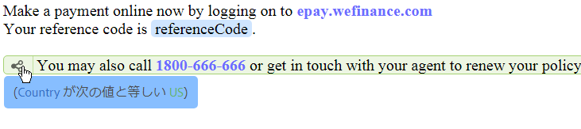

# インタラクティブ通信内のテキスト {#texts-in-interactive-communications}

ここでは、インタラクティブ通信で使用するテキストドキュメントフラグメントの作成方法と編集方法について説明します。インタラクティブ通信の作成では 4 種類のドキュメントフラグメントが使用されますが、テキストフラグメントはそのうちの 1 つです。他の 3 つは、条件フラグメント、リストフラグメント、レイアウトフラグメントです。

## 概要 {#overview}

テキストドキュメントフラグメントは、1 つ以上のテキスト段落で構成されています。段落は静的または動的にすることができます。動的な段落には、フォームデータモデルのプロパティと変数を含めることができます。また、テキストドキュメントフラグメント内でルールを適用し、繰り返すこともできます。 例えば、挨拶文の顧客名はフォームデータモデル (FDM) プロパティで、実行時に値が使用可能になります。 これらの値を変更すると、エージェント UI を使用して、異なる顧客に対して同じインタラクティブ通信を準備できます。

インタラクティブ通信のテキストドキュメントフラグメントは、次の種類の動的データをサポートします。

* **データモデルオブジェクト**:データプロパティでは、バックエンドのデータソースが使用されます。
* **ルールベースのコンテンツ**：ルールに基づいて表示と非表示が切り替わる、テキスト内の特定のコンテンツ。また、フォームデータモデルのプロパティと変数に基づいてルールを作成することもできます。
* **変数**：テキストドキュメントフラグメントでは、バックエンドのデータソースに変数が連結されることはありません。エージェントは、変数内の値を入力または選択するか、変数をデータソースにバインドして、後処理に送信するインタラクティブ通信を準備します。
* **繰り返し**:インタラクティブ通信には、クレジットカード明細書のトランザクションなど、生成された各インタラクティブ通信に対して発生回数が変化し続ける可能性のある動的な情報が含まれている場合があります。 繰り返し構造を使用すると、このような動的な情報の書式設定と構造化を行うことができます。詳しくは、 [インライン条件と繰り返し](cm-inline-condition.md).

## テキストの作成 {#createtext}

1. 選択 **`[!UICONTROL Forms]`** > **[!UICONTROL ドキュメントフラグメント]**.
1. 選択 **`[!UICONTROL Create]`** > **[!UICONTROL テキスト]**.
1. 次の情報を指定します。

   * **[!UICONTROL タイトル]**:（オプション）テキストドキュメントフラグメントのタイトルを入力します。 タイトルは一意である必要はなく、特殊文字や英語以外の文字を含めることもできます。テキストは、そのタイトル（利用可能な場合）（サムネールやプロパティなど）で参照されます。
   * **[!UICONTROL 名前]**:フォルダー内のテキストの一意の名前。 どのような状態であっても、1 つのフォルダー内に、同じ名前を持つ 2 つのドキュメントフラグメント（テキスト、条件、リスト）を保管することはできません。「名前」フィールドでは、英数字およびハイフンのみ使用できます。「名前」フィールドは、タイトルフィールドに基づいて自動的に入力されます。「タイトル」フィールドに入力された特殊文字、スペース、数字および英語以外の文字は、「名前」フィールドではハイフンに置き換えられます。 「タイトル」フィールドの値は「名前」フィールドに自動的にコピーされますが、値を編集することもできます。
   * **[!UICONTROL 説明]**：テキストの説明を入力します。
   * **[!UICONTROL フォームデータモデル]**：（任意）フォームデータモデルに基づいてテキストを作成する場合は、「フォームデータモデル」ラジオボタンを選択します。「フォームデータモデル」ラジオボタンを選択すると、「**[!UICONTROL フォームデータモデル]**」*フィールドが表示されます。フォームデータモデルを参照して選択します。インタラクティブ通信用のテキストを作成する場合は、そのインタラクティブ通信で使用するものと同じデータモデルを使用する必要があります。フォームデータモデルについて詳しくは、 [データ統合](/help/forms/using/data-integration.md).
   * **[!UICONTROL タグ]**：（オプション）テキストフィールドにカスタムタグの値を入力し、Enter キーを押します。このテキストを保存すると、新しく追加されたタグが作成されます。

1. 「**[!UICONTROL 次へ]**」をタップします。

   テキストの作成ページが表示されます。フォームデータモデルのベースのテキストを作成することを選択した場合は、左側のペインにフォームデータモデルのプロパティが表示されます。

1. テキストを入力し、以下のオプションを使用して、フォームデータモデルのプロパティと変数について書式設定と条件設定を行い、それらのプロパティと変数をテキストに挿入します。

   * [フォームデータモデル](#formdatamodel)
   * [変数](#variables)
   * [ルールエディター](#rules)
   * [書式設定オプション](#formatting)

      * [書式設定されたテキストを他のアプリケーションからコピーして貼り付け](#paste)
      * [テキストの一部をハイライト表示](#highlight)
   * [繰り返し](/help/forms/using/cm-inline-condition.md)
   * [特殊文字](#special)
   * [テキストの検索と置換](#search-features)
   * [ショートカットキー](/help/forms/using/keyboard-shortcuts.md)

1. 「**[!UICONTROL 保存]**」をタップします。

   これで、テキストが作成されました。このテキストを使用して、インタラクティブ通信を作成することができます。

## テキストの編集 {#edittext}

以下の手順により、既存のテキストドキュメントフラグメントを編集することができます。インタラクティブ通信エディター内から、テキストドキュメントフラグメントの編集を選択することもできます。

1. 選択 **`[!UICONTROL Forms]`** > **[!UICONTROL ドキュメントフラグメント]**.
1. 目的のテキストドキュメントフラグメントに移動して選択します。
1. 「**[!UICONTROL 編集]**」をタップします。
1. 必要な変更を行います。テキストのオプションについて詳しくは、 [テキストを作成](#createtext).
1. タップ **[!UICONTROL 保存]** 次に、 **[!UICONTROL 閉じる]**.

## フォームデータモデルのプロパティを使用してテキストドキュメントフラグメントをカスタマイズする {#formdatamodel}

フォームデータモデルのプロパティを挿入することにより、テキストドキュメントフラグメントをカスタマイズすることができます。フォームデータモデルのプロパティをテキストに挿入すると、インタラクティブ通信のプレビュー中に、関連するデータソースから受信者固有のデータを取得して入力できます。 フォームデータモデルについて詳しくは、 [AEM Forms Data Integration](/help/forms/using/data-integration.md).

テキストの作成時にフォームデータモデルを指定した場合は、フォームデータモデルのプロパティがテキストエディターの左側のウィンドウに表示されます。 指定したフォームデータモデルは、テキストドキュメントフラグメントと、そのフラグメントを含むインタラクティブ通信で同じである必要があります。

* FDM プロパティをテキストに挿入するには、プロパティを挿入する位置にカーソルを置き、 **`[A]`** プロパティをタップして左側のウィンドウに表示し、 **`[B]`** **[!UICONTROL 選択項目を追加]**. プロパティをダブルタップして、 **`[C]`** カーソル位置 フォームデータモデルのプロパティは、茶色の背景色でハイライト表示されます。

* エージェント UI で FDM プロパティの値を編集できるようにするには、次の手順を実行します。 [インタラクティブ通信の準備と送信](/help/forms/using/prepare-send-interactive-communication.md) エージェント UI を使用して、 **`[D]`** そのプロパティのロックアイコンを使用し、ロックが解除状態になっていることを確認します。 プロパティのデフォルトの状態はロックされ、エージェント UI でプロパティを編集することはできません。

フォームデータモデルのプロパティを使用して、特定のコンテンツの表示と非表示を切り替えるためのルールを作成することもできます。詳しくは、「[テキスト内でルールを作成する](#rules)」を参照してください。

## テキストドキュメントフラグメント内で変数を作成して使用する {#variables}

変数とは、インタラクティブ通信の作成時に連結できるプレースホルダーのことです。変数は、フォームデータモデルのプロパティに連結することも、テキストフラグメントに連結することもできます。エージェントを使用して、変数の値を設定することもできます。

以下の場合は、フォームデータモデルのプロパティの代わりに、変数を使用することができます。

* 複数のインタラクティブ通信で同じテキストドキュメントフラグメントを使用し、異なるインタラクティブ通信に変数を連結する必要がある場合。
* 作成したテキストドキュメントフラグメントに、フォームデータモデルが含まれていない場合。変数を挿入し、インタラクティブ通信を作成する際に、その変数をフォームデータモデルのプロパティに連結することができます。
* テキストドキュメントフラグメントからテキストを取得して連結する必要がある場合。既に変数が含まれているテキストドキュメントフラグメントを別の変数に連結することはできません。

テキストドキュメントフラグメントの作成時または編集時に、変数を作成して挿入することができます。作成した変数は、エージェント UI の「データ」タブに表示されます。エージェントは変数の値を指定します。 [エージェント UI を使用してインタラクティブ通信を準備し、送信する](/help/forms/using/prepare-send-interactive-communication.md).

### 変数の作成 {#create-variables}

1. 左側のウィンドウで、 **[!UICONTROL 変数]**.

   変数ペインが表示されます。

   

1. 「**[!UICONTROL 作成]**」をタップします。

   変数作成ペインが表示されます。

1. 次の情報を入力し、 **[!UICONTROL 作成]**:

   * **[!UICONTROL 名前*]**：変数の名前を入力します。
   * **[!UICONTROL 説明]**:必要に応じて、変数の説明を入力します。
   * **[!UICONTROL タイプ*]**:変数のタイプを選択します。文字列、数値、ブール値、日付のいずれかです。
   * **[!UICONTROL 特定の値のみ許可]**：文字列タイプまたは数値タイプの変数の場合、このオプションを選択すると、エージェント UI のプレースホルダーの特定の値セットから、エージェントによって値が選択されます。一連の値を指定するには、このオプションを選択し、 **[!UICONTROL 値]** フィールドに入力します。

1. 「**[!UICONTROL 作成]**」をタップします。

   作成された変数が変数ペインに表示されます。

1. テキスト内に変数を挿入するには、適切な場所にカーソルを置き、変数を選択してをタップします。 **[!UICONTROL 選択項目を追加]**.

   

   変数が明るい青の背景色でハイライト表示され、フォームデータモデルのプロパティが茶色の背景色でハイライト表示されます。

1. 「**[!UICONTROL 保存]**」をタップします。

## テキスト内でルールを作成する {#rules}

テキスト内でルールエディターを使用して、**事前に定義された条件**&#x200B;に基づいてコンテンツやテキストの文字列の表示と非表示を切り替えるためのルールを作成することができます。事前に定義された条件は、以下のデータに基づいて設定することができます。

* 文字列
* 数値
* 数式
* 日付
* 関連するフォームデータモデルのプロパティ
* テキスト内に作成された任意の変数

### テキスト内でルールを作成する {#create-rules-in-text}

1. テキストの作成時または編集時に、ルールを使用して条件を設定するテキスト内の文字列、段落、またはコンテンツを選択します。

   

1. 「**[!UICONTROL ルールを作成]**」をタップします。

   ルール作成ダイアログが表示されます。文字列、数値、数式、日付のほかに、以下のデータをルールエディターで使用して、ルールのステートメントを作成することができます。

   * 関連するフォームデータモデルのプロパティ
   * 作成済みの任意の変数

   評価するオプションを選択します。

   

   

   >[!NOTE]
   >
   >コレクションプロパティは、テキストに条件を付けて表示するルールを作成する場合はサポートされません。

1. 「次の値と等しい」、「次の値を含む」、「次の値で始まる」など、ルールを評価するための適切な演算子を選択します。

   

1. 評価式、値、データモデルプロパティ、または変数を挿入します。

   

   フォームデータモデルのソースデータに基づき、受信者が米国に居住している場合に、選択されたテキストを表示するためのルール

   * ルールを作成または編集する際に、  （サイズ変更）をクリックして、[ ルールを作成/ルールを編集 ] ダイアログを展開します。 ダイアログを拡張して全画面表示にすると、フォームデータモデルのプロパティと変数をドラッグアンドドロップして、変数を作成できるようになります。もう一度「サイズ変更」をタップすると、ルールを作成ダイアログに戻ります。
   * 1 つのルールで複数の条件を作成することもできます。
   * 既にルールが適用されているコンテンツの一部に対して、別のルールを作成して適用することもできます。

1. 「**[!UICONTROL 完了]**」をタップします。

   これで、ルールが適用されました。ルールが適用されたテキストまたはコンテンツは、緑色でハイライト表示されます。ハイライト表示されているテキストやコンテンツの左側に表示されているハンドルにカーソルを置くと、適用されているルールが表示されます。

   

   適用されているルールの左側に表示されているハンドルをクリックすると、そのルールの編集や削除を行うためのオプションが表示されます。

## テキストの書式設定 {#formatting}

テキストの作成や編集を行う場合、選択する編集のタイプ（「段落」、「整列」、「リスト」）に応じて、表示されるツールバーが異なります。

ツールバーのタイプの選択：段落、整列、またはリスト

フォント編集ツールバー

整列ツールバー

リストツールバー

### テキストの一部をハイライト表示または強調表示する {#highlight}

編集可能なドキュメントフラグメント内のテキストの一部をハイライト表示または強調表示するには、テキストを選択して「ハイライトの色」をタップします。

基本色を直接タップすることもできます **`[A]`** 基本色パレットに表示されるか、 **選択** スライダーを使用した後 **`[B]`** をクリックして、色の適切な色合いを選択します。

必要に応じて、「詳細」タブに移動して、適切な「色相」、「明るさ」、「彩度」を選択することもできます **`[C]`** 正確な色を作成するには、「選択」をタップします。 **`[D]`** をクリックして、テキストをハイライト表示する色を適用します。

### 書式設定されたテキストの貼り付け {#paste}

別のアプリケーション（Microsoft® Word や HTML ページなど）で使用されているテキスト内の 1 つ以上の段落を再利用するには、目的のテキストをコピーしてテキストエディター内に貼り付けます。コピーされたテキストの書式設定は、テキストエディタでも保持されます。

編集可能なテキストドキュメントフラグメント内のテキストの 1 つ以上の段落をコピーして貼り付けることができます。例えば、次のような居住証明書の箇条書きリストが含まれている Microsoft® Word ドキュメントがあるとします。

この場合、Microsoft® Word ドキュメント内のテキストをコピーして、編集可能なテキストドキュメントフラグメントに直接貼り付けることができます。箇条書きリスト、フォント、テキストの色などの書式は、テキストドキュメントフラグメント内に保存されます。

>[!NOTE]
>
>ただし、貼り付けられたテキストの書式設定にはいくつかの[制約](https://helpx.adobe.com/aem-forms/kb/cm-copy-paste-text-limitations.html)があります。

## テキスト内に特殊文字を挿入する {#special}

必要に応じて、ドキュメントフラグメントに特殊文字を挿入します。例えば、特殊文字パレットを使用して、以下の特殊文字を挿入することができます。

* 通貨記号 (€、¥、£など )
* 数学記号 (∑、√、∂、^など )
* 「 」や「 」などの句読点記号

テキストエディターでは、210 個の特殊文字がサポートされます。管理者が実行できる操作 [カスタマイズによる追加/カスタム特殊文字のサポートを追加](/help/forms/using/custom-special-characters.md).

## テキストの検索と置換 {#search-features}

大量のテキストを含むテキストドキュメントフラグメントを操作する場合は、特定のテキスト文字列を検索する必要があります。 また、特定のテキスト文字列を別の文字列に置き換える必要が生じる場合があります。

「検索と置換」機能により、テキストドキュメントフラグメント内の任意のテキスト文字列を検索して置き換えることができます。この機能には、強力な正規表現検索も含まれています。

1. 用のテキストドキュメントフラグメントを開く [編集中](#edittext).
1. 「**[!UICONTROL 検索と置換]**」をタップします。

1. 検索するテキストを「**[!UICONTROL 検索]**」テキストボックスに入力し、そのテキストを置き換えるテキストを「**[!UICONTROL 置換]**」テキストボックスに入力して「**[!UICONTROL 置換]**」をタップします。

1. 検索テキストが見つかると、そのテキストが置換テキストに変更されます。

   * 複数の検索テキストが見つかった場合は、テキストドキュメントフラグメント内でそれらのテキストがハイライト表示されます。「**[!UICONTROL 置換]**」をもう一度タップすると、そのテキストが置換され、カーソルが次の検索テキストに移動します。
   * 検索テキストがそれ以上見つからない場合は、「モジュールの最後に達しました」というメッセージが検索と置換ダイアログに表示されます。

   「すべて置換」をタップして、見つかった検索テキストをすべてまとめて置換することもできます。

   「検索と置換」機能には、強力な正規表現検索機能が組み込まれています。検索で正規表現を使用するには、「 **[!UICONTROL 正規表現]** 次に、 **[!UICONTROL 検索]** または **[!UICONTROL 置換]**.
