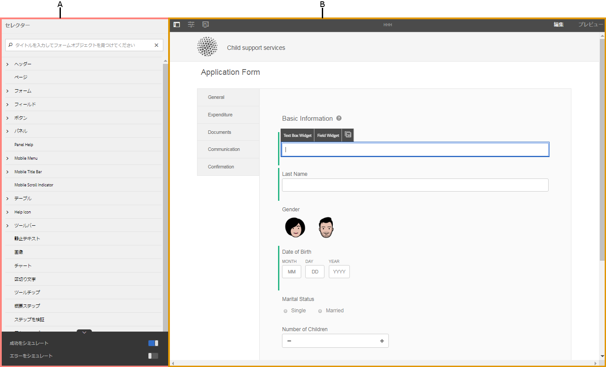
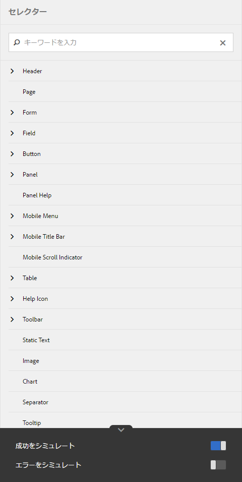
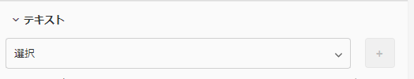
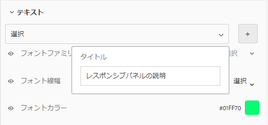
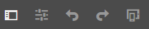
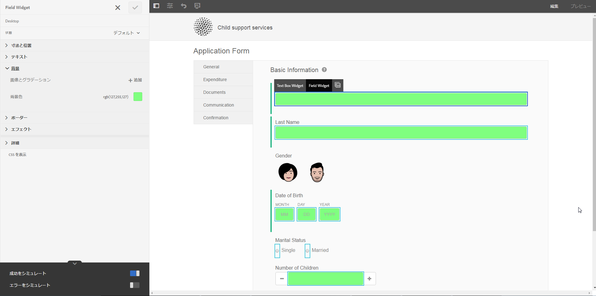
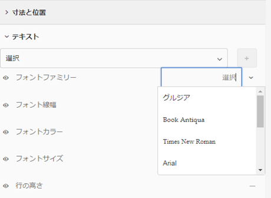
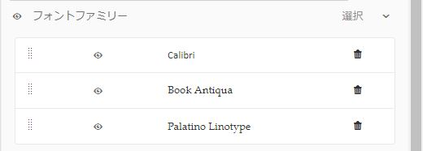
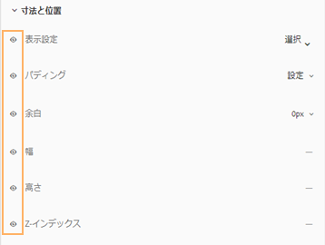
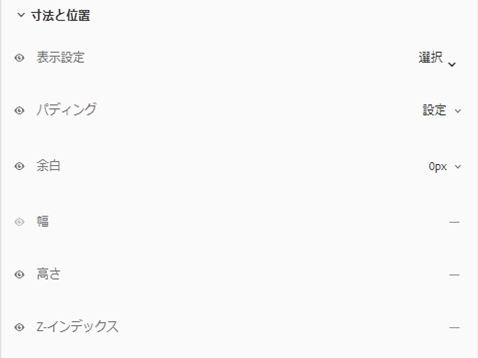

# テーマの作成および使用 {#creating-and-using-themes}

## 概要 {#introduction}

テーマを作成して適用し、アダプティブフォームやインタラクティブ通信のスタイルを設定することができます。 テーマには、コンポーネントとパネルのスタイルを設定するための詳細情報が含まれています。スタイルには、背景色、状態色、透明度、配置、サイズなどのプロパティが含まれます。テーマを適用すると、指定したスタイルが対応するコンポーネントに反映されます。テーマは、アダプティブフォームやインタラクティブ通信を参照することなく、独立して管理されます。

以下の操作を実行できます。

* テーマの作成
* 既存のテーマを編集してコピーする
* 既存のテーマをダウンロードしてAEM Formsサーバーにアップロードする
* テーマの依存関係の管理

## テーマの作成、ダウンロード、アップロード {#creating-downloading-or-uploading-a-theme}

AEM Forms では、テーマを作成、ダウンロード、アップロードできます。テーマは、フォーム、ドキュメント、レターなどの他のアセットと同様に作成できます。テーマは、フォームのようなメタプロパティを含む個別のエンティティとして保存されます。 テーマを個別のエンティティにすることで、複数のアダプティブフォームやインタラクティブ通信で再利用できます。 テーマをAEM Formsの別のインスタンスに移動して再利用することもできます。

### テーマの作成 {#creating-a-theme}

テーマを作成するには、次の手順を実行します。

1. **[!UICONTROL Adobe Experience Manager]**／**[!UICONTROL Forms]**／**[!UICONTROL テーマ]**&#x200B;の順にクリックします。

1. テーマページで、**[!UICONTROL 作成／テーマ]**をクリックします。

   テーマを作成するためのウィザードが起動します。

1. テーマ作成ウィザードの「基本」タブで、テーマの「**[!UICONTROL タイトル]**」フィールドと「**[!UICONTROL 名前]**」フィールドに値を指定します。これらは必須フィールドです。

1. 「詳細」タブには、2 つのフィールドがあります。

   * **[!UICONTROL Clientlib の場所]**：テーマのクライアントライブラリを保存するリポジトリ内の場所です。
   * **[!UICONTROL Clientlib カテゴリ]**：テーマのクライアントライブラリのカテゴリ名を入力するためのテキストフィールドを提供します。

1. **[!UICONTROL 作成]**／**[!UICONTROL 編集]**&#x200B;の順にクリックして、テーマエディターでテーマを開きます。テーマページに戻る場合は、「**[!UICONTROL 完了]**」をクリックします。

### テーマのダウンロード {#downloading-a-theme}

テーマを zip ファイルとして書き出し、他のプロジェクトやAEMインスタンスで使用できます。 テーマをダウンロードするには、以下の手順を実行します。

1. **[!UICONTROL Adobe Experience Manager]**／**[!UICONTROL Forms]**／**[!UICONTROL テーマ]**&#x200B;の順にクリックします。

1. テーマページでテーマを選択し、「 **[!UICONTROL ダウンロード]**. テーマの詳細を示すダイアログボックスが表示されます。

1. 「**[!UICONTROL ダウンロード]**」をクリックします。テーマが zip ファイルとしてダウンロードされます。

>[!NOTE]
>
>アダプティブフォームが関連付けられているテーマをダウンロードし、関連するアダプティブフォームがカスタムテンプレートに基づいている場合は、カスタムテンプレートもダウンロードします。 ダウンロードしたテーマとアダプティブフォームを AEM Forms サーバーにアップロードする場合は、関連するカスタムテンプレートもアップロードしてください。

### テーマのアップロード {#uploading-a-theme}

プロジェクトにスタイル設定がプリセットされた作成済みのテーマを使用できます。他の人が作成したテーマのパッケージをプロジェクトにアップロードしてインポートできます。

テーマをアップロードするには、以下の手順を実行します。

1. **[!UICONTROL Adobe Experience Manager]**／**[!UICONTROL Forms]**／**[!UICONTROL テーマ]**&#x200B;の順にクリックします。

1. テーマページで、**[!UICONTROL 作成／ファイルのアップロード]**&#x200B;をクリックします。
1. ファイルのアップロードプロンプトで、コンピューター上のテーマパッケージを参照して選択し、「**[!UICONTROL アップロード]**」をクリックします。

   アップロードされたテーマは、テーマページで使用することができます。

## テーマのメタデータ {#metadata-of-a-theme}

以下の表に、テーマのメタプロパティを示します。これらのプロパティは、テーマのプロパティページに表示されます。

<table> 
 <tbody> 
  <tr> 
   <th>
<strong>ID</strong>
 
 
 </th> 
   <th><strong>名前</strong></th> 
   <th><strong>編集の可否</strong></th> 
   <th><strong>プロパティの説明</strong></th> 
  </tr> 
  <tr> 
   <td>1.</td> 
   <td>タイトル</td> 
   <td>はい</td> 
   <td>テーマの表示名。</td> 
  </tr> 
  <tr> 
   <td>2.</td> 
   <td>説明</td> 
   <td>はい</td> 
   <td>テーマに関する説明。</td> 
  </tr> 
  <tr> 
   <td>3.</td> 
   <td>タイプ</td> 
   <td>いいえ</td> 
   <td> 
    <ul> 
     <li>アセットのタイプ。</li> 
     <li>値は常にテーマです。</li> 
    </ul> </td> 
  </tr> 
  <tr> 
   <td>4.</td> 
   <td>作成日</td> 
   <td>いいえ</td> 
   <td>テーマの作成日</td> 
  </tr> 
  <tr> 
   <td>5.</td> 
   <td>作成者名</td> 
   <td>はい</td> 
   <td>テーマの作成者。 テーマの作成時に計算されます。</td> 
  </tr> 
  <tr> 
   <td>6.</td> 
   <td>最終変更日</td> 
   <td>いいえ</td> 
   <td>テーマが最後に変更された日付。</td> 
  </tr> 
  <tr> 
   <td>7.</td> 
   <td>ステータス</td> 
   <td>いいえ</td> 
   <td>テーマの状態（変更済み／公開済み）。</td> 
  </tr> 
  <tr> 
   <td>8.</td> 
   <td>オンタイムに公開</td> 
   <td>はい</td> 
   <td>テーマを自動で公開する時間。</td> 
  </tr> 
  <tr> 
   <td>9.</td> 
   <td>オフタイムに公開</td> 
   <td>はい</td> 
   <td>テーマを自動的に非公開にする時間。</td> 
  </tr> 
  <tr> 
   <td>10.</td> 
   <td>タグ</td> 
   <td>はい</td> 
   <td>検索の向上に使用される識別用にテーマに添付されるラベル。</td> 
  </tr> 
  <tr> 
   <td>11.</td> 
   <td>参照</td> 
   <td>リンク</td> 
   <td> 
    <ul> 
     <li>「参照元」セクションを含みます。テーマを使用するフォームを一覧表示します。</li> 
     <li>テーマが他のアセットを参照していないので、「参照」セクションはありません。</li> 
    </ul> </td> 
  </tr> 
  <tr> 
   <td>12.</td> 
   <td>Clientlib の場所</td> 
   <td>対応</td> 
   <td> 
    <ul> 
     <li>このテーマに対応する clientlib が保存される「/etc」内のユーザー定義のリポジトリパス。</li> 
     <li>デフォルト値 — 「/etc/clientlibs/fd/themes」 +テーマアセットの相対パス。</li> 
     <li>場所が存在しない場合、フォルダー階層は自動生成されます。</li> 
     <li>この値を変更すると、clientlib ノード構造は、入力された新しい場所に移動されます。  <em><strong>メモ：</strong>デフォルトの Clientlib の場所を変更する場合、CRXDE リポジトリで <code>crx:replicate, rep:write, rep:glob:*, rep:itemNames:: js.txt, jcr:read </code> を <code>forms-users</code> および <code>crx:replicate</code> に割り当て、<code>jcr:read </code> を新しい場所にある <code>fd-service</code> に割り当てます。また、 jcr:addChildNodes を拒否 対象 <code>forms-user</code></em></li> 
    </ul> </td> 
  </tr> 
  <tr> 
   <td>13.</td> 
   <td>Clientlib カテゴリ名</td> 
   <td>対応</td> 
   <td> 
    <ul> 
     <li>このテーマのユーザ定義の clientlib カテゴリ名。</li> 
     <li>名前が他の既存のテーマで既に使用されている場合は、エラーが表示されます。</li> 
     <li>デフォルト値 — テーマの場所を使用して計算されます。</li> 
     <li>この値を変更すると、対応する clientlib ノードでカテゴリ名が更新されます。 clientlib カテゴリ名は参照で使用されるので、jsp ファイルの Clientlib カテゴリ名の更新は不要です。</li> 
    </ul> </td> 
  </tr> 
 </tbody> 
</table>

## テーマエディターについて {#about-the-theme-editor}

AEM Formsにはテーマエディターが付属しています。 テーマエディターは、ビジネスユーザーや web デザイナー／開発者にとって使いやすいインターフェイスです。アダプティブフォームとインタラクティブ通信の様々な要素のスタイルを簡単に指定するために必要な機能が用意されています。テーマを作成すると、フォーム、インタラクティブ通信、レター、ドキュメントフラグメント、データ辞書のように、独立したエンティティとして保存されます。

テーマエディターでは、テーマでスタイル設定されたコンポーネントのスタイルをカスタマイズできます。デバイス上でのフォームやインタラクティブ通信の外観をカスタマイズできます。

テーマエディターは次の 2 つのパネルに分けられます。

* **キャンバス** - 右側に表示されます。このリストには、すべてのスタイル設定の変更が即座に反映される、サンプルのアダプティブフォームまたはインタラクティブ通信が表示されます。 また、キャンバスから直接オブジェクトを選択して、関連するスタイルを検索したり、これらのスタイルを編集したりすることもできます。 上部のデバイス解像度ルーラーがキャンバスを制御します。 解像度のブレークポイントをルーラーから選択すると、サンプルフォームまたはインタラクティブ通信のプレビューが、それぞれの解像度で表示されます。 キャンバスについて詳しく説明します。 [下](/help/forms/using/themes.md#using-canvas).

* **サイドバー** — 左側に表示されます。 次の項目が含まれます。

   * **セレクター**：スタイル設定用に選択されたコンポーネントと、スタイルを設定するプロパティが表示されます。セレクターは、あるタイプのすべてのコンポーネントを表示します。テーマ内のテキストボックスコンポーネントを選択してスタイルを設定すると、フォームまたはインタラクティブ通信内のすべてのテキストボックスがそのスタイルを継承します。 セレクターを使用すると、汎用コンポーネントまたは特定のコンポーネントを選択してスタイルを設定できます。 例えば、フィールドコンポーネントは汎用コンポーネント、テキストボックスは特定コンポーネントになります。

      **汎用コンポーネントのスタイル設定：**

      フィールドには、年齢などの数値ボックスフィールドや、住所などのテキストボックスフィールドを指定できます。

      1 つのフィールドのスタイルを設定すると、年齢、名前、住所などすべてのフィールドのスタイルが設定されます。

      **特定のコンポーネントのスタイル設定**:

      特定のコンポーネントは、特定のカテゴリのオブジェクトに影響を与えます。 テーマ内で数値ボックスコンポーネントのスタイルを設定すると、フォームまたはインタラクティブ通信内の数値ボックスオブジェクトでのみ、そのスタイルが継承されます。

      例えば、住所などのテキストボックスは長く、年齢などの数値ボックスは短くなります。数値ボックスフィールドを選択し、長さを短くして、フォームに適用することができます。 フォームにあるすべての数値ボックスフィールドの幅が短くなります。

      特定の背景色が設定されているすべてのフィールドコンポーネントをカスタマイズすると、年齢フィールド、名前フィールド、住所フィールドなど、すべてのフィールドでその背景色が継承されます。年齢などの数値ボックスを選択し、幅を短くすると、年齢や家族の人数など、すべての数値ボックスの幅が短くなります。テキストボックスの幅は変更されません。

   * **状態：**&#x200B;特定の状態にあるオブジェクトのスタイル設定をカスタマイズします。例えば、デフォルト、フォーカス、無効、ホバー、エラーの状態におけるオブジェクトの見え方を指定できます。
   * **プロパティカテゴリ：**&#x200B;スタイル設定プロパティには、様々なカテゴリがあります。例えば、サイズと位置、テキスト、背景、境界線、効果などです。各カテゴリで、スタイル設定情報を指定します。例えば、背景では、背景色や画像とグラデーションを指定します。
   * **詳細：**&#x200B;カスタムの CSS を任意のオブジェクトに追加することができます。この CSS により、スタイル設定が重複している場合は、視覚的な制御を行うプロパティが上書きされます。
   * **CSS を表示**:選択したコンポーネントの CSS を表示できます

   また、サイドバーの下部に矢印が表示されます。矢印をクリックすると、「**成功をシミュレート**」と「**エラーをシミュレート」という 2 つのオプションがさらに表示されます。**&#x200B;これらのオプションは、上記のオプションと合わせて、詳細が[下記](/help/forms/using/themes.md#using-rail)で説明されています。

    **A.** サイドバー **B.** キャンバス

### コンポーネントのスタイル設定 {#styling-components}

複数のアダプティブフォームとインタラクティブ通信で、同じテーマを使用できます。その場合、そのテーマ内で指定したコンポーネントの書式設定がアダプティブフォームとインタラクティブ通信にインポートされます。タイトル、説明、パネル、フィールド、アイコン、テキストボックスなど、様々なコンポーネントのスタイルを設定できます。テーマ内でウィジェットを使用して、コンポーネントのプロパティを設定できます。CSS または LESS に関する事前の知識は必要ありませんが、必要です。ただし、CSS のオーバーライドセクションでは CSS コードの記述やカスタムセレクターの提供が可能です。 CSS オーバーライドセクションは、サイドバーでコンポーネントを選択すると表示されます。

サイドバーの各種オプションを使用して、様々なコンポーネントを選択してスタイルを設定できます。

サイドバーにあるコンポーネントの「編集」ボタンをクリックすることでキャンバスのコンポーネントが選択され、サイドバーのオプションを使用してコンポーネントのスタイルを設定できます。

テキストボックス、数値ボックス、ラジオボタン、チェックボックスのような特定のコンポーネントは、フィールドのような高レベルのコンポーネントで分類されます。例えば、ラジオボタンのスタイル設定をカスタマイズすることができます。スタイル設定のラジオボタンを設定するには、**フィールド／ウィジェット／ラジオボタン**&#x200B;を選択します。

クリック **すべて展開** サイドバーで、前面に表示されていない分類されたコンポーネントを表示、選択、スタイル設定します。

### パネルレイアウトのスタイル設定 {#styling-panel-layouts-br}

AEM Formsのテーマは、フォームとインタラクティブ通信のパネルのレイアウトで要素のスタイルを設定するのに役立ちます。 そのまま使用できるレイアウトやカスタムのレイアウト要素のスタイル設定がサポートされています。

既製のパネルには次のものが含まれています。

* 左側のタブ
* 上部のタブ
* アコーディオン
* レスポンシブ
* ウィザード
* モバイルレイアウト

   * ヘッダーのパネルタイトル
   * ヘッダーにパネルタイトルを表示しない

セレクターは、レイアウトごとに異なります。\
テーマエディターからのカスタムレイアウトのスタイル設定には、以下が含まれます。

* スタイル設定が可能なレイアウトのコンポーネントの定義と、これらのコンポーネントを一意に識別する CSS セレクター
* これらのコンポーネントに適用できる CSS プロパティの定義
* ユーザーインターフェイスからインタラクティブにこれらのコンポーネントのスタイル設定を定義する

### 画面サイズごとに異なるスタイル {#different-styles-for-different-screen-sizes-br}

デスクトップとモバイルのレイアウトのスタイルは、若干異なる場合と、まったく異なる場合があります。 モバイルデバイスの場合、タブレットと電話は、コンポーネントのサイズを除く類似したレイアウトを共有します。

テーマエディターのブレークポイントを使用して、異なる画面サイズの代替スタイルを定義します。 テーマの構築を開始するベースデバイスまたは解像度を選択でき、その他の解像度のスタイル設定のバリエーションが自動的に生成されます。 すべての解像度のスタイル設定を明示的に変更できます。

>[!NOTE]
>
>テーマは、最初にフォームまたはインタラクティブ通信を使用して作成され、次に別のフォームまたはインタラクティブ通信に適用されます。 テーマの作成に使用されるブレークポイントは、テーマが適用されるフォームやインタラクティブ通信とは異なる場合があります。 CSS メディアクエリは、テーマが適用されるフォームまたはインタラクティブ通信ではなく、テーマの作成に使用されるフォームまたはインタラクティブ通信に基づいています。

### オブジェクト選択時のサイドバーにおける、スタイル設定プロパティのコンテキストの変更 {#styling-properties-context-changes-in-sidebar-on-selecting-objects}

キャンバスでコンポーネントを選択すると、そのスタイル設定プロパティがサイドバーに表示されます。 オブジェクトのタイプと状態を選択し、スタイルを設定します。

### テーマエディターで最近使用したスタイル {#recently-used-styles-in-theme-editor}

テーマエディターは、1 つのコンポーネントに適用された最大 10 個のスタイルをキャッシュします。 キャッシュしたスタイルは、テーマの別のコンポーネントで使用できます。最近使用したスタイルは、リストボックスとしてサイドバーで選択したコンポーネントのすぐ下に表示されます。 最初は、最近使用したスタイルのリストは空です。

コンポーネントのスタイルを設定すると、スタイルがキャッシュされ、リストボックスに表示されます。 この例では、テキストボックスのラベルのスタイルを設定して、フォントのサイズと色を変更します。 同様の手順に従って、画像を選択したり、色を変更してコンポーネントのスタイルを設定したりできます。 フィールドラベルのスタイル設定が変更された場合に、スタイルがキャッシュされ、リストボックスに表示される方法を確認します。

この例では、フィールドラベルのスタイルが変更され、スタイルとして「レスポンシブパネルの説明」を選択すると、アセットライブラリにリストエントリが追加されます。 アセットライブラリ内のエントリを使用して、レスポンシブパネルの説明のスタイルを変更できます。

アセットライブラリに追加されたスタイルは、別のテーマで使用できます。また、[スタイルモード](/help/forms/using/inline-style-adaptive-forms.md)になっているフォームエディターまたはインタラクティブ通信の UI で使用することもできます。同様に、フォームエディターまたはインタラクティブ通信エディターの UI のスタイルモードを使用してコンポーネントのスタイルを設定すると、そのスタイルがキャッシュに格納され、テーマ内で使用できるようになります。

アセットライブラリに対するプラスボタンを使用すると、指定した名前でスタイルを永久的に保存できます。 サイドバーの「保存」ボタンをクリックしてスタイルをコンポーネントに適用しない場合でも、プラスボタンはスタイルを保存します。 後で使用するためにスタイルを保存するプラスボタンは、スタイルモードでは使用できません。

スタイルにカスタム名を付けると、そのスタイルはテーマに結び付けられ、他のテーマでは使用できなくなります。 保存したスタイルを削除するには：

1. キャンバスツールバーで、**[!UICONTROL テーマオプション]** ／**[!UICONTROL スタイルを管理]**&#x200B;をクリックします。
1. スタイルを管理ダイアログで、保存したスタイルを選択し、「**[!UICONTROL 削除]**」をクリックします。

   

### ライブプレビュー、保存、変更の破棄 {#live-preview-save-and-discard-changes}

スタイル設定で行った変更は、キャンバスに読み込まれたフォームまたはインタラクティブ通信に即座に反映されます。 ライブプレビューを使用すると、スタイル設定の影響をインタラクティブに定義して確認できます。 コンポーネントのスタイル設定を変更すると、 **[!UICONTROL 完了]** ボタンがサイドバーで有効になっている。 変更を保持するには、 **[!UICONTROL 完了]** 」ボタンをクリックします。

>[!NOTE]
>
>フィールドに無効な文字が入力されると、フィールドの境界線の色が赤に変わり、画面の左上隅にエラーメッセージが表示されます。 例えば、数字を入力として使用できるテキストボックスに英文字を入力すると、入力ボックスの境界線の色が赤に変わります。 上部に表示されるエラーを解決しないと、このようなテーマを保存できません。

### 任意のアダプティブフォームまたはインタラクティブ通信を使用してテーマを作成する {#theme-with-another-adaptive-form-or-interactive-communication}

テーマを作成すると、テーマエディターに付属するフォームが作成されます。 このフォームのコンポーネントのスタイル設定を行います。 テーマエディターに付属しているフォームではなく、任意のフォームやインタラクティブ通信を選択してスタイルを設定し、その結果をプレビューできます。

テーマエディターのキャンバス上で現在のフォームまたはインタラクティブ通信を置き換えるには：

1. テーマエディターパネルで、 **[!UICONTROL テーマオプション]**  **[!UICONTROL /設定]**.

1. 「一般」タブの「**[!UICONTROL アダプティブフォーム / ドキュメント]**」フィールドで、フォームまたはインタラクティブ通信を参照して選択します。

### やり直し／取り消し {#redo-undo}

意図しない変更を取り消すまたはやり直すことができます。キャンバスの「やり直し／取り消し」ボタンをクリックします。

**図：** *キャンバスの「元に戻す」/「やり直し」ボタン*

「やり直し／取り消し」ボタンは、テーマエディターでコンポーネントのスタイルを設定すると表示されます。

## テーマエディターの使用 {#using-the-theme-editor}

テーマエディターでは、作成またはアップロードしたテーマを編集できます。**[!UICONTROL フォームとドキュメント／テーマ]**&#x200B;に移動し、テーマを選択して開きます。テーマエディターでテーマが開きます。

上記で説明されているように、テーマエディターにはサイドバーとキャンバスの 2 つのパネルがあります。

テーマエディターでのテキストボックスウィジェットコンポーネントの成功状態のスタイル設定のカスタマイズ。 キャンバスでコンポーネントが選択され、サイドバーでその状態が選択されます。 サイドバーで使用できるスタイル設定オプションを使用して、コンポーネントの外観をカスタマイズします。

### キャンバスの使用 {#using-canvas}

テーマは、標準フォームを使用して作成するか、選択したフォームまたはインタラクティブ通信を使用して作成します。 キャンバスには、テーマで指定されたカスタマイズを含むテーマの作成に使用されるフォームまたはインタラクティブ通信のプレビューが表示されます。 フォームの上のルーラーは、デバイスの表示サイズに応じてレイアウトを決定するために使用します。

キャンバスツールバーには、次の情報が表示されます。

* **[!UICONTROL サイドパネルを切り替え]** ：サイドバーの表示と非表示を切り替えます。

* **[!UICONTROL テーマオプション]** ：3 つのオプションを提供します。

   * 設定：プレビューフォームまたはインタラクティブ通信、基本 clientlib、typekit 設定を選択するオプションが用意されています。
   * テーマ CSS を表示：選択したテーマの CSS が生成されます。
   * スタイルを管理：テキストと画像のスタイルを管理するためのオプションが用意されています。
   * ヘルプ：テーマエディターの画像によるガイドツアーを実行します。

* **[!UICONTROL エミュレーター]** ：異なる画面サイズで、テーマの外観をエミュレートできます。表示サイズは、エミュレーターでブレークポイントとして扱われます。 ブレークポイントを選択し、そのスタイルを指定できます。 例えば、デスクトップとタブレットは 2 つのブレークポイントです。 ブレークポイントごとに異なるスタイルを指定できます。

キャンバスでコンポーネントを選択すると、その上にコンポーネントツールバーが表示されます。 コンポーネントツールバーを使用すると、コンポーネントを選択したり、汎用コンポーネントに切り替えたりできます。 例えば、パネル内の数値テキストボックスを選択したとします。 コンポーネントツールバーには次のオプションが表示されます。

* **[!UICONTROL 数値ボックスウィジェット]**:サイドバーで外観をカスタマイズするコンポーネントを選択できます。
* **[!UICONTROL フィールドウィジェット]**:スタイル設定の汎用コンポーネントを選択できます。 この例では、スタイル設定にすべてのテキスト入力コンポーネント（テキストボックス／数値ボックス／数値ステッパー／日付入力）が選択されています。

* ：スタイル設定のために、汎用コンポーネントに切り替えることができます。数値ボックスを選択してこのアイコンをタップすると、フィールドコンポーネントが選択されます。 フィールドコンポーネントを選択してこのアイコンをタップすると、パネルが選択されます。 このアイコンをタップし続けると、最終的にスタイル設定用のレイアウトが選択されます。

>[!NOTE]
>
>コンポーネントのツールバーで使用できるオプションは、選択したコンポーネントにより異なります。

**図：** *キャンバスの数値ボックス上のコンポーネントツールバー*

### サイドバーの使用 {#using-rail}

テーマエディターのサイドバーには、テーマ内のコンポーネントのスタイルをカスタマイズするオプションが用意されており、セレクターを使用します。 セレクターにより、コンポーネントのグループまたは個別のコンポーネントを選択し、サイドバーのセレクターを検索できます。カスタムコンポーネント用のセレクターを書き込むことができます。

キャンバスまたはサイドバーのセレクターでコンポーネントを選択する場合、サイドバーにはスタイルをカスタマイズするためのすべてのオプションが表示されます。\
コンポーネント選択時、サイドバーに表示されるオプションは次のとおりです。

* 状態
* プロパティシート
* 成功／エラーをシミュレート

#### 状態 {#state}

状態は、コンポーネントに対するユーザーインタラクションの指標です。例えば、ユーザーがテキストボックスに誤ったデータを入力すると、テキストボックスの状態はエラー状態に変わります。 テーマエディターにより、特定の状態に対するスタイル設定を指定できます。

状態のスタイルのカスタマイズのオプションは、コンポーネントごとに異なります。

#### プロパティシート {#property-sheet}

<table> 
 <tbody> 
  <tr> 
   <td><strong>プロパティ</strong></td> 
   <td><strong>使用方法</strong></td> 
  </tr> 
  <tr> 
   <td>
寸法と位置
 </td> 
   <td>
テーマ内のコンポーネントの配置、サイズ、配置、配置のスタイルを設定できます。 
 
オプションは、ディスプレイ設定、余白、マージン、幅、高さおよび Z インデックスです。 
 </td> 
  </tr> 
  <tr> 
   <td>
テキスト
 </td> 
   <td>
テーマのコンポーネントのテキストスタイルをカスタマイズできます。
 
例えば、テキストボックスに入力したテキストの見え方を変更するとします。
 
オプションは、フォントファミリー、重み付け、色、サイズ、行の高さ、テキストの整列、文字間隔、テキストのインデント、下線、斜体、テキストの変換、垂直方向の整列、ベースライン、方向です。 
 </td> 
  </tr> 
  <tr> 
   <td>
背景 
 </td> 
   <td>
コンポーネントの背景を画像または色で塗りつぶします。 
 </td> 
  </tr> 
  <tr> 
   <td>
境界線
 </td> 
   <td>
コンポーネントの境界線の外観を選択します。 例えば、テキストボックスに赤く太い境界線を点線で表示するとします。 
 
オプションは、境界線の幅、スタイル、半径および色です。
 </td> 
  </tr> 
  <tr> 
   <td>
エフェクト
 </td> 
   <td>
不透明度、ブレンドモード、シャドウなどの特殊効果をコンポーネントに追加できます。 
 </td> 
  </tr> 
  <tr> 
   <td>
詳細
 </td> 
   <td>
以下を追加できます。
 
    <ul> 
     <li>セレクターでデフォルトコンテンツの前後にコンテンツを追加して、そのスタイルを設定するための <code>::before</code> および <code>::after</code> 疑似要素プロパティ。  <a href="https://www.w3schools.com/css/css_pseudo_elements.asp" target="_blank">CSS 疑似要素</a>を参照してください。</li> 
     <li>コンポーネントにインライン化されたカスタム CSS コードと、カスタムセレクターを書き込む。 </li> 
    </ul> 
カスタムの CSS コードを追加すると、サイドバーのオプションを使用して追加したカスタマイズがオーバーライドされます。 
 </td> 
  </tr> 
 </tbody> 
</table>

#### 成功／エラーをシミュレート {#simulate-error-success}

サイドバーの下部には、「エラーをシミュレート」と「成功」のオプションがあります。 サイドバーの下部に表示される表示/非表示の矢印を使用して、表示できます。 テーマエディターを使用して、様々な状態のコンポーネントのスタイルを設定できます。

例えば、フォームに数値フィールドを追加し、テーマエディターでそのスタイルを指定したとします。 ユーザーがフィールドに英数字の値を入力するとき、テキストボックスの背景色を変更します。 テーマ内の数値フィールドを選択し、サイドバーの状態オプションを使用します。 サイドバーでエラー状態を選択し、背景色を赤に変更します。 動作をプレビューするには、サイドバーにある「エラーをシミュレート」オプションを使用します。 「エラーをシミュレート」および「成功をシミュレート」オプションについて、以下で詳しく説明します。

* **成功をシミュレート**:

   成功状態のスタイル設定を指定した場合のコンポーネントの外観を確認できます。 例えば、フォームで顧客がパスワードを設定します。ユーザーは、指定したガイドラインに従ってパスワードを設定できます。 指定したすべてのガイドラインに従ってユーザーがパスワードを入力すると、テキストボックスが緑色に変わります。 テキストボックスが緑色に変わると、成功状態になります。 成功状態のコンポーネントのスタイルを指定し、「成功をシミュレート」オプションを使用してその外観をシミュレートできます。

* **エラーをシミュレート**:

   エラー状態のスタイル設定を指定した場合のコンポーネントの外観を確認できます。 例えば、フォームで顧客がパスワードを設定します。ユーザーは、指定したガイドラインに従ってパスワードを設定できます。 ユーザーが入力したすべてのガイドラインに従っていないパスワードを入力すると、テキストボックスが赤に変わります。 テキストボックスが赤に変わると、エラー状態になります。 エラー状態のコンポーネントのスタイルを指定し、「エラーをシミュレート」オプションを使用してその外観をシミュレートできます。

### コンポーネントのスタイル設定 {#styling-a-component}

例えば、フォームに 2 つのタイプのテキストボックスがあるとします。一方は数値のみ、もう一方は英数字の値を入力できます。数値のみを受け入れるテキストボックス（数値ボックス）のスタイル設定をカスタマイズできます。

次の手順を実行して、特定のコンポーネントのスタイル設定をカスタマイズします（この例の数値ボックス）。

1. テーマエディターで、キャンバスの数値ボックスを選択します。
1. 数値ボックスを選択すると、オプションが 3 つあるコンポーネントツールバーが表示されます。

   * **[!UICONTROL 数値ボックスウィジェット]**
   * **[!UICONTROL フィールドウィジェット]**

   * 

1. **[!UICONTROL 数値ボックスウィジェット]** を選択します。
1. サイドバーのタイトルが「数値ボックスウィジェット」に変わり、外観をカスタマイズするオプションが表示されます。

   サイドバーの「**[!UICONTROL 寸法と位置]**」オプションを使用して、コンポーネントのサイズをカスタマイズします。状態が&#x200B;**[!UICONTROL デフォルト]**&#x200B;であることを確認してください。

**[!UICONTROL 数値ボックスウィジェット]**&#x200B;を選択する代わりに、コンポーネントツールバーの&#x200B;**[!UICONTROL フィールドウィジェット]**&#x200B;を選択し、上記の手順を実行します。「**[!UICONTROL フィールドウィジェット]**」オプションでサイズを選択すると、数値ボックスを除くすべてのテキストボックスが同じサイズになります。

### 特定の状態のフィールドのスタイル設定 {#styling-fields-given-state}

コンポーネントツールバーを使用して、異なる状態のコンポーネントのスタイルを指定することもできます。 例えば、コンポーネントが無効になっている場合、無効状態になります。テーマエディターでスタイルを設定できるコンポーネントの状態としてよく使用されるのは、デフォルト、フォーカス、無効、エラー、成功およびホバーです。キャンバスでコンポーネントを選択して、サイドバーの状態オプションを使用し、外観をカスタマイズできます。

特定の状態のコンポーネントのスタイル設定をカスタマイズするには、次の手順を実行します。

1. キャンバスでコンポーネントを選択し、コンポーネントツールバーから適切なオプションを選択します。

   サイドバーに、コンポーネントのスタイル設定をカスタマイズするためのオプションが表示されます。

1. サイドバーで状態を選択します。 例えば、エラー状態です。
1. サイドバーの&#x200B;**[!UICONTROL 「境界線」、「背景」]**&#x200B;などのオプションを使用して、コンポーネントの外観をカスタマイズします。
1. サイドバーの下部にある「**[!UICONTROL エラーをシミュレート]**」オプションを使用して、編集時にスタイル設定がどのように見えるかを確認します。

状態を指定した後にコンポーネントのスタイル設定をカスタマイズすると、カスタマイズは指定した状態に対してのみコンポーネントに表示されます。 例えば、ホバー状態が選択されているときにコンポーネントのスタイル設定をカスタマイズするとします。テーマを適用するレンダリングされたフォームまたはインタラクティブ通信内のコンポーネントにポインタを移動すると、コンポーネントのカスタマイズが表示されます。

エラーと成功以外の状態の動作をシミュレートするには、プレビューモードを使用します。プレビューモードを使用するには、ページツールバーにある「**[!UICONTROL プレビュー]**」をクリックします。

### 小型画面向けレイアウトのスタイル設定 {#styling-layouts-for-smaller-displays}

キャンバスのルーラーを使用して、画面が小さいデバイスのブレークポイントを選択します。キャンバスのエミュレーター  をクリックして、ルーラーとブレークポイントを表示します。ブレークポイントを使用すると、携帯電話やタブレットなど、各種デバイスで表示されるフォームやインタラクティブ通信の表示サイズをプレビューできます。テーマエディターでは、複数の画面サイズがサポートされています。

異なるブレークポイントにスタイルを設定するには、次の手順を実行します。

1. キャンバスで、ルーラーの上にあるブレークポイントを選択します。

   ブレークポイントとは、モバイルデバイスおよびその画面サイズのことです。

1. サイドバーを使用して、選択した表示サイズに合わせて、テーマ内のフォームやインタラクティブ通信のコンポーネントのスタイル設定をカスタマイズします。
1. カスタマイズ内容を保存します。

複数のデバイス用に、フォームやインタラクティブ通信のコンポーネントのスタイルを設定することができます。 デスクトップおよびモバイルデバイス用のフォームおよびインタラクティブ通信コンポーネントのスタイルは、まったく異なる場合があります。

### テーマ内で Web フォントを使用する {#using-web-fonts-in-a-theme}

これまでに行った手順により、Web サービスで使用できるフォントを、アダプティブフォームとインタラクティブ通信でも使用できるようになりました。標準で [Typekit](https://typekit.com/):Adobeの Web フォントサービスを、設定として使用できます。 Typekit を使用するには、キットを作成し、その中にフォントを作成して、キット ID を次の場所から取得します。 [Typekit Web サイト](https://typekit.com/).

次の手順を実行して、AEMで Typekit を設定します。

1. オーサーインスタンスで、 **[!UICONTROL Adobe Experience Manager /ツール&#x200B;]****[!UICONTROL /導入/Cloud Services ]**.
1. の **[!UICONTROL Cloud Services]** ページ、 **[!UICONTROL サードパーティのサービス]** >  **[!UICONTROL Typekit]** をクリックし、 **[!UICONTROL 今すぐ設定]** 「Typekit」の下に移動します。 設定が既に使用可能な場合は、 **+** ボタンをクリックして新しいインスタンスを作成します。
1. の **[!UICONTROL 設定を作成]** ダイアログで、設定のタイトルを指定し、 **[!UICONTROL 作成]**.

   設定ページにリダイレクトされます。

1. コンポーネントを編集ダイアログが表示されるので、キット ID を入力して「**OK**」をクリックします。

TypeKit 設定を使用するテーマを設定するには、次の手順を実行します。

1. オーサーインスタンスで、テーマエディターにあるテーマを開きます。
1. テーマエディターで、**[!UICONTROL テーマオプション]** ／**[!UICONTROL 設定]**&#x200B;に移動します。
1. In **[!UICONTROL Typekit 設定]** フィールドでキットを選択し、 **[!UICONTROL 保存]**.

   これで、テーマの font-family プロパティにフォントが追加されたことがわかります。

### テーマエディターでのフォントの表示と選択 {#listing-and-selecting-fonts-in-theme-editor}

テーマ設定サービスを使用して、テーマエディターにさらにフォントを追加できます。 フォントを追加するには、次の手順を実行します。

1. 管理者権限でAEM Web コンソールにログインします。 AEM Web コンソールの URL は、`https://[server]:[port]/system/console/configMgr` です。
1. **[!UICONTROL Adaptive Form Theme Configuration Service]** を開きます。

   

1. 「+」をクリックし、フォント名を指定して、「 **保存**. フォントが追加され、テーマエディターで使用できます。

#### テーマエディターでのフォントの選択 {#selecting-fonts-in-theme-editor}

「+」ボタンを使用して、フォントを追加できます。 フォントを追加すると、サイドバーに表示されます。

テーマの設定オプションに加えて、テーマエディター自体からフォントを追加することもできます。 サイドバーの下にある「フォントファミリー」フィールドに使用するフォントを入力し、キーボードの Return キーを押します。

フォントを選択すると、そのフォントがフォントファミリリストに追加されます。 テーマエディターの「マスク」オプションを使用して、リストに表示されているフォントを無効または有効にすることができます。

コンポーネントのフォントが変更されたことを確認できます。

「フォントファミリー」フィールドは、複数のフォントをサポートしています。 フォントを入力すると、ブラウザーはフォントを探し、選択したコンポーネントに適用します。 ブラウザがフォントを見つけられない場合は、ファミリ内でフォントの隣にあるフォントを探します。 検索する特定のフォントを入力することから始めることができます。 使用するフォントが見つからない場合は、フォントファミリーに一般的なフォントを入力して使用できます。

#### テーマエディター内で適用されているスタイルをマスク {#mask-styles-applied-in-theme-editor}

テーマ内で適用されているスタイルをマスクできるようになりました。テーマエディターのサイドバーに表示されている  アイコンを使用して、適用されているスタイルを無効にできます。例えば、フォームまたはインタラクティブ通信内のコンポーネントのサイズを変更する場合、プロパティの左側にあるマスクボタンを使用して、プロパティを無効にすることができます。 テーマを保存すると、選択した「マスク」オプションが保持されます。

以下の例では、テーマ内でマスクされたスタイルとマスクされていないスタイルを示しています。

## テーマをフォームまたはインタラクティブ通信に適用する {#applying-a-theme-to-a-form-or-interactive-communication-br}

テーマをアダプティブフォームに適用するには：

1. フォームを編集モードで開きます。フォームを編集モードで開くには、フォームを選択し、 **[!UICONTROL 開く]**.
1. 編集モードで、コンポーネントを選択し、／**[!UICONTROL アダプティブフォームコンテナ]**&#x200B;をクリックしてから、 をクリックします。

   サイドバーのフォームのプロパティを編集できます。

1. サイドバーで、「**[!UICONTROL スタイル設定]**」をクリックします。
1. 「**[!UICONTROL アダプティブフォームのテーマ]**」ドロップダウンリストからテーマを選択し、**[!UICONTROL 完了]**  をクリックします。

テーマをインタラクティブ通信に適用するには、以下の手順を実行します。

1. インタラクティブ通信を編集モードで開きます。 インタラクティブ通信を編集モードで開くには、フォームを選択し、 **[!UICONTROL 開く]**.
1. 編集モードで、コンポーネントを選択し、／**[!UICONTROL ドキュメントコンテナ]**&#x200B;をクリックしてから、 をクリックします。

   サイドバーでフォームのプロパティを編集できます。

1. サイドバーの「**[!UICONTROL 基本]**」の下に表示されている「**[!UICONTROL テーマ]**」ドロップダウンでテーマを選択し、「**[!UICONTROL 完了]**」をクリックします。。

### 実行時にフォームのテーマを変更 {#change-theme-of-a-form-at-runtime}

テーマにより、フォーム内の異なるコンポーネントのスタイルが設定されます。`themeOverride` プロパティを使用して、フォームのテーマを動的に変更できます。フォームの一般的な URL は次のとおりです。

`https://<server>:<port>/content/forms/af/test.html`

themeOverride パラメーターを使用して、実行時にテーマを適用できます。

`https://<server>:<port>/content/forms/af/test.html?themeOverride=/content/dam/formsanddocuments-themes/simpleEnrollmentTheme`

「`themeOverride`」オプションを使用して、テーマにパスを提供できます。これにより、フォームのテーマを変更し、更新されたスタイルを使用してフォームをリフレッシュします。

## テーマを使用した外観の設定 {#specific-af-appearance}

AEM Forms には、すぐに使用できるデフォルトのキャンバステーマ以外に、様々なテーマが用意されています。他のテーマを使用してフォームやインタラクティブ通信をデザインする場合は、テーマライブラリフォルダからテーマをコピーします。 コピーしたテーマをテーマライブラリフォルダーの外部に貼り付け、コピーしたテーマを必要な変更に応じて編集します。

テーマをコピーするには、次の手順に従います。

1. オーサーインスタンスで、**[!UICONTROL Adobe Experience Manager／Forms／テーマ]**&#x200B;に移動します。
1. テーマライブラリフォルダーを開きます。
1. テーマライブラリフォルダーで、対応するすぐに使用可能なテーマにポインターを置いて、「**[!UICONTROL コピー]**」をタップします。
1. コピーしたテーマをテーマライブラリフォルダーの外部に貼り付けます。
1. コピーしたテーマをカスタマイズします。

テーマをカスタマイズした後、そのテーマをフォームまたはインタラクティブ通信に適用します。

>[!NOTE]
>
>テーマライブラリフォルダーにあるテーマに変更を加えないでください。このフォルダーにはシステムテーマが含まれています。 これらのテーマに加えた変更は、AEM Forms の新しいバージョンまたはホットフィックスのインストール時にすべて上書きされます。

## 他のアダプティブフォームの使用例への影響 {#impact-on-other-adaptive-form-use-cases}

* **フォームの公開／非公開：**&#x200B;フォームの公開時に、適用するテーマも公開します（まだ公開していない場合）
* **フォームのインポート／エクスポート：**&#x200B;フォームのインポートまたはエクスポートでは、関連するテーマも自動でインポートまたはエクスポートされます。
* **フォームの参照：**&#x200B;フォームの参照の「参照」セクションには、テーマの追加入力が含まれます。
* **フォームの最終変更時間：**&#x200B;関連するテーマが変更されると更新されます。
* **A/B テスト：** A/B テストのフォームの 2 つのバージョンに異なるテーマを適用できます。2 つのテーマの情報は、2 つのガイドコンテナに個別に保存されます。

## CSS 生成シーケンス {#css-generation-sequence}

「CSS を表示」を選択すると、テーマエディターはすべてのスタイル設定情報を収集し、CSS を構築します。 情報は次の順序で収集されます。

1. テーマの基本クライアントライブラリで定義されたスタイル設定。
1. サイドバーのプロパティを使用して指定された、ユーザー定義のスタイル設定。
1. 「CSS 上書き」オプションを使用して指定された CSS スタイル。

例えば、基本のクライアントライブラリでは、テキストボックスの背景色が青になります。 サイドバーのプロパティを使用して、ピンクに変更します。 CSS を生成すると、テキストボックスの背景色がピンク色で表示されます。 プロパティを使用して背景色を変更した後、別の作成者が CSS 上書きオプションを使用して背景色テキストボックスを白に変更します。 CSS を生成すると、生成された CSS の背景色が白になります。

## スタイルのデバッグ {#debugging-styles}

テーマエディターでコンポーネントのスタイルを指定すると、CSS が生成されます。 汎用コンポーネントのスタイルを設定する場合、そのコンポーネントに含まれる複数のコンポーネントもスタイル設定されます。 例えば、フィールドのスタイルを設定すると、その中のテキストボックスとラベルもスタイル設定されます。 フィールド内のテキストボックスのスタイルを設定すると、その CSS が設定されます。フィールドとコンポーネント用に生成された CSS をデバッグする場合は、テーマエディターに CSS を表示するオプションがあります。

生成された CSS は、次のオプションを使用して確認できます。

* **CSS を表示** サイドバーのオプション：テーマでコンポーネントを選択すると、サイドバーに「 CSS を表示」オプションが表示されます。 `::before`、`::after` 疑似要素を含め、生成された CSS を表示します。

* キャンバスツールバーの「**テーマ CSS を表示**」オプション：キャンバスツールバーで、／**テーマ CSS を表示**&#x200B;をクリックします。テーマエディターで定義したプロパティから生成されたテーマ CSS 全体を表示できます。

## トラブルシューティング、推奨事項、ベストプラクティス {#troubleshooting-recommendations-and-best-practices}

* **別のテーマに属するアセットの回避**

   テーマを編集する際、アセット（画像など）を他のテーマから参照して追加することができます。例えば、ページの背景を編集しているとします。例えば、**[!UICONTROL ページ]** ／**[!UICONTROL 背景／追加／画像]**&#x200B;を選択すると、他のテーマの画像を参照して追加することが可能なダイアログが表示されます。

* アセットを別のテーマから追加し、そのテーマが移動または削除されると、現在のテーマに問題が生じる場合があります。他のテーマからアセットを参照して追加しないようにすることをお勧めします。

* **基本クライアントライブラリ、テーマエディター、インラインスタイル設定の使用**

   * **ベース Clientlib**：

      基本クライアントライブラリには、スタイル設定情報が含まれています。テーマ内のクライアント側ライブラリでスタイル設定情報を使用するには、次の手順を実行します。

      1. **[!UICONTROL Experience Manager／フォーム／テーマ]**&#x200B;に移動します。
      1. テーマページでテーマを選択し、「 **[!UICONTROL プロパティを表示]**.
      1. 表示されるプロパティページで、「 **[!UICONTROL 詳細]**.
      1. 「詳細」タブの「Clientlib の場所」フィールドで、使用するクライアントライブラリを参照して選択します。
      1. 「**[!UICONTROL 保存]**」をクリックします。

      クライアントライブラリで指定したスタイル設定は、それを使用するテーマに読み込まれます。 例えば、クライアントライブラリでテキストボックス、数値ボックス、スイッチのスタイルを指定します。 クライアントライブラリをテーマに読み込むと、テキストボックス、数値ボックス、スイッチのスタイルが読み込まれます。 その後で、テーマエディターを使用して他のコンポーネントのスタイルを設定できます。
\
      テーマを作成して、それをコピーし、コピーしたテーマのスタイル設定を変更して同じような用途に使用することもできます。

      詳しくは、「[テーマを使用して外観を設定する](#specific-af-appearance)」を参照してください。

   * **テーマエディター：**

      テーマエディターを使用すると、テーマを作成して、フォームやインタラクティブ通信のスタイルを設定できます。1 つのテーマ内で各コンポーネントのスタイルを設定すると、作成する複数のフォームやインタラクティブ通信で、外観と操作性を統一できます。まずテーマのスタイル設定情報を指定し、その後でテーマをフォームに適用することをお勧めします。

   * **インラインスタイル設定：**

      フォームで作業を行う際に、フォームまたはインタラクティブ通信のマルチチャネルエディターのスタイルモードを使用して、コンポーネントのスタイルを設定できます。スタイルモードを使用してフォームコンポーネントのスタイル設定を変更すると、テーマで指定したスタイル設定は上書きされます。特定のフォームの特定のコンポーネントのスタイル設定を変更する場合は、 [コンポーネントのインラインスタイル設定](/help/forms/using/inline-style-adaptive-forms.md).

* **クライアントサイドライブラリの使用**

   スタイル設定情報を読み込むためにクライアントライブラリを作成する場合は、[クライアントサイドライブラリの使用](/help/sites-developing/clientlibs.md)を参照してください。クライアントライブラリを作成したら、前述の手順でテーマに読み込むことができます。

* **コンテナパネルのレイアウト幅の変更**

   コンテナパネルのレイアウト幅の変更はお勧めしません。コンテナパネルの幅を指定すると、幅が静的になり、様々なディスプレイに合わせて調整されません。

* **ヘッダーとフッターを操作する際にフォームエディターまたはテーマエディターを使用する場合**

   テーマエディターは、フォントスタイル、背景、透明度などのスタイル設定オプションを使用してヘッダーとフッターのスタイルを設定する場合に使用します。

   ヘッダーにロゴイメージや企業名などの情報を表示し、フッターに著作権情報を表示する場合は、フォームエディターのオプションを使用します。
