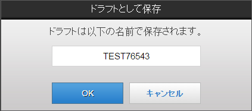
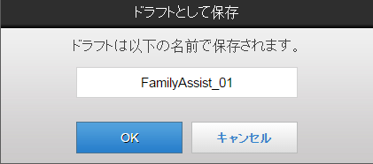
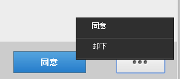

# TODO リストの操作 {#working-with-to-do-lists}

TODO リストを表示すると、割り当てられたビジネスプロセスからのタスク、または所属するグループのタスク、あるいは他のユーザーの共有タスクが表示されます。必要に応じて、要求の承認または拒否、情報の追加などのタスクを開き、操作して、完了することができます。完了したタスクは、ビジネスプロセスの次のユーザーに送信されます。

## TODO リストの概要 {#about-todo-lists}

AEM Forms Workspace には以下の 3 つのタイプの TODO リストがあります。

* 個人リスト。ユーザーに直接割り当てられているタスクが格納されます。
* グループリスト。グループに割り当てられているタスクが格納されます。グループのメンバーであれば、誰でもタスクを開いて完了することができます。タスクを開くには、最初にグループのメンバーがタスクを要求する必要があります。
* 共有リスト。別のユーザーと TODO リストを共有するユーザーに割り当てられているタスクが格納されます。リストを共有するユーザーであれば、誰でもタスクを要求し、開いて完了することができます。

いくつかのアクションは、タスクの上にポインターを重ねたときに表示されるアイコンをクリックすることにより、タスクを開かずに実行することができます。

>[!NOTE]
>
>感嘆符アイコンは、タスクの優先度が高いことを示します。

## 一般的なタスク {#typical-tasks}

タスクを開いたり、操作したりする場合、使用できるツールはタスクによって異なります。このように、タスクに対して使用できる（または使用できない）ツールが異なるのは、タスクの種類に応じて、実行するアクションは異なるためです。受信する可能性のある一般的なタスクを以下に示します。

**情報の提供**：フォームを完成させて送信することを要求するタスクを受信します。

**情報の確認**：情報を確認し、コンテンツに対してサインオフすることを要求するタスクを受信します。

**複数ユーザーによる確認**：別のユーザーがタスクを受信すると同時に、そのタスクを受信します。ユーザーおよび別のユーザーは、情報の提供またはコンテンツの確認のいずれか、あるいは両方を行う必要があります。この種類のタスクで使用できるツールは以下のとおりです。

* タスクに関する指示の表示
* タスクが割り当てられているすべてのユーザーの完了ステータスの表示
* タスクが割り当てられているすべてのユーザーのコメントの表示
* タスクへのコメントの追加

上記のいずれかのタスクで使用できる追加のツールを以下に示します。

* 転送
* 共有
* 問い合わせ
* Return
* 備考
* 添付ファイル

## タスクを開く {#opening-tasks}

個人の TODO リストのタスクを開いてロックしたり、グループまたは共有の TODO リストのタスクを要求して開いたりできます。開いたタスクはメインペインに表示されます。他のタスクは TODO リストの横のタスクリストに表示されます。

タスクの概要URLが存在する場合は、タスクに関連付けられたフォームの代わりに、タスクの概要表示がデフォルトで開きます。 ユーザーが「タスクの割り当て」で「Open the form in maximized mode」オプションを有効にしている場合でも、フォームは最大化モードで開きません。

>[!NOTE]
>
>タスクを開いたとき、タスクのデフォルトによっては、関連付けられているフォームがフルスクリーンモードで表示される場合があります。

### 個人リストのタスクを開いてロック {#open-and-lock-a-task-from-your-list}

共有されている個人の TODO リストからタスクを開く場合は、タスクをロックして、リストへのアクセス権限を持つ別のユーザーがそのタスクを操作できないようにすることができます。

1. TODO リストの左ペインで、個人の TODO リストを選択します。ユーザーのすべてのタスクが中央ペインに表示されます。

   >[!NOTE]
   >
   >TODO リスト内のプロセスの種類を選択して、タスクをフィルターすることができます。TODO リストを選択すると、再度 TODO リスト内のすべてのタスクを表示することができます。

1. 必要に応じて、タスクをロックします。タスクをロックするには、タスクの「すべてのオプション」アイコンをクリックして「ロック」を選択します。オプションを使用できるようにするには、タスクにポインターを重ねます。

   >[!NOTE]
   >
   >タスクが開いているときに、任意のタブでタスクをロックまたはロック解除することもできます。

   

   タスクの「すべてのオプション」メニュー

1. タスクをクリックして開きます。

### 共有タスクリストまたはグループタスクリストのタスクを開いて要求 {#open-and-claim-a-task-from-a-shared-or-group-list}

グループリストまたは共有リストのタスクを開いて要求すると、そのタスクは個人の TODO リストに移動します。該当するリストへのアクセス権限を持つ他のユーザーは、該当するタスクを操作できなくなります。

1. TODOページの左ペインで、グループまたは共有のTODOリストを選択します。 すべてのタスクが中央ペインに表示されます。
1. 以下のいずれかの手順を実行します。

   * タスクをグループまたは共有の TODO リストから開かずに要求するには、タスクにポインターを重ねて「**要求**」をクリックします。または、タスクが開いている場合は、タスクペインの下のアクションバーで「要求」ボタンを使用できます。 要求すると、タスクはグループまたは共有の TODO リストから個人のリストに移動します。
   * タスクをグループまたは共有の TODO リストから要求して開くには、「**要求して開く**」をクリックします。

## タスクの使用 {#working-with-tasks}

タスクを開いた後に、メインペインに表示されるタブや使用できるツールは、タスクによって異なります。表示される可能性のあるタブを以下に示します。

**Task Summary**：タスクが開くと、「タスクの割り当て」手順のプロセスで指定された URL を使用して、「Task Summary」ペインにタスクに関する情報（ある場合）を表示することができます。タスクに対する「タスクサマリーペインの使用」追加および関連情報が表示され、AEM Forms Workspace のエンドユーザーに対してさらに価値が追加されます。このタブは、タスクのサマリー URL が存在しない場合は使用できません。

**詳細**：現在のタスクおよびプロセスに関するいくつかの情報を提供します。

**フォーム**：タスクに関連付けられているフォームが表示されます。PDF、HTML、Guide、SWF ファイルなど、様々なファイル形式のフォームがあります。通常の印刷可能なフォームや Web ベースのフォーム、または一連のウィザード形式のパネルを通じてユーザーから情報を収集するフォームなどがあります。

**履歴**：プロセスインスタンスに含まれるタスク、および各タスクに関連付けられているフォーム、割り当て、添付ファイルが表示されます。

**添付ファイル**：タスクに関連付けられた既存の添付ファイルを表示します。また、必要に応じて添付ファイルを追加します。

**メモ**：タスクに関連付けられた既存のメモを表示します。また、必要に応じてメモを追加します。

タスクを操作するときに、表示される可能性のあるツールおよび実行できるアクションを、以下に示します。

### タスクの転送、共有、問い合わせ {#forward-share-or-consult-on-a-task}

タスクをメモや添付ファイルと共に他のユーザーに転送したり、タスクを別のユーザーと共有したり、タスクについて別のユーザーに問い合わせたりすることができます。タスクに関連付けられているフォームデータを変更する場合は、タスクの転送、共有、問い合わせを行う前に、フォームをドラフトとして保存します。保存しないと、更新したフォームが添付されずにタスクが送信されることになります。タスクを転送して共有した場合、タスクを受け取ったユーザーは、そのタスクを要求して完了したり元のユーザーに戻すことができます。タスクの問い合わせを行った場合、ユーザーはタスクを元のユーザーに戻すことができます。

1. 保持するタスクに関連付けられたフォームを変更する場合は、「**保存**」をクリックします。「保存」オプションは、各タブ下部にあるアクションバーで使用できます。保存しないと、更新したフォームが添付されずにタスクが送信されることになります。

   >[!NOTE]
   >
   >操作中のタスクによっては、フォームで保存ボタンを使用できない場合があります。

1. 任意のタブで、以下のいずれかのボタンをクリックします。

   * **転送**
   * **共有**
   * **問い合わせ**

   >[!NOTE]
   >
   >タスクによっては、タスクを開かずに、TODO リストからこれらの操作を実行することもできます。

1. ポップアップダイアログウィンドウで、タスクの転送、共有、または問い合わせを行うユーザーの名前を検索して選択します。

### タスクを返す {#return-a-task}

1. 任意のタブで、「**返信**」をクリックします。タスクの転送、共有または問い合わせを開始したユーザーの TODO リストに、タスクが返されます。

### タスクのオフライン化 {#take-a-task-offline}

オフラインでタスクを操作して、後で Adobe® Reader®、Adobe® Acrobat® Professional、Adobe® Acrobat® Standard のいずれかからフォームを送信できる場合があります。フォームが送信されると、適切なサーバーの電子メールアドレスを使用して電子メールクライアントが起動されます。その後、完成したフォームをサーバーに電子メールで送信できます。

1. 任意のタブで、「**オフライン**」をクリックします。
1. フォームを保存する際のファイル名を指定して、**「保存」**&#x200B;をクリックします。タスクに関連付けられているフォームがローカルに保存されます。フォームが送信されるまで、タスクは TODO リストに残ります。

### 添付ファイルの操作 {#work-with-attachments}

添付ファイルをローカルで追加、更新、削除または保存できる場合があります。

**添付ファイルの追加**

1. 「**添付ファイル**」タブで、「**参照**」をクリックして添付するファイルを選択します。
1. プロセスに参加している他のユーザーに許可する、添付ファイルに対する権限&#x200B;****&#x200B;レベルを選択します。**「読み取り」**&#x200B;を選択した場合、他のユーザーはファイルをローカルに保存できます。いずれかの編集権限を与えると、他のユーザーも新しいファイルをアップロードして添付ファイルを置き換えることができます。

   >[!NOTE]
   >
   >添付ファイルと一緒にコメントを追加することもできます。

1. 「**アップロード**」をクリックします。ファイルがフォームに添付されます。

**添付ファイルの表示**

1. **「添付ファイル」**&#x200B;タブで、表示する添付ファイルの名前をクリックします。

**添付ファイルのローカル保存**

1. 添付ファイルをクリックして開きます。開いた添付ファイルをローカルに保存します。

**添付ファイルの更新**

1. 添付ファイルで「**編集**」をクリックします。「**参照**」をクリックすることにより、既存の添付ファイルを置き換えるファイルを選択します。

**添付ファイルの削除**

1. 添付ファイルで「**削除**」をクリックします。

### タスクを完了せずに作業内容を保存 {#save-your-work-without-completing-the-task}

1. On any tab, tap **Save**.

   ドラフトとして保存ダイアログが表示されます。ドラフトのデフォルト名は、タスクテンプレートのタスク名です。

   

   >[!NOTE]
   >
   >Workspace を設定して、ユーザーがドラフトとして入力した情報を定期的に自動保存できます。自動保存が有効になっていて、ユーザーがドラフトで作業をしている場合、ドラフトは定期的に保存されます。 自動保存では、タスクにデフォルト名が自動的に付けられます。
   >
   >For more information, see Save Draft Periodically in [Managing Preferences](/help/forms/using/getting-started-livecycle-html-workspace.md).

1. ドラフトとして保存ダイアログで、タスクに一意の名前を指定して、「**OK**」をタップします。

   

   指定した名前でドラフトが保存されます。タスクはTODOリストーに残り、フォームで行った変更はすべてDraftsフォルダーに保存されます。 また、TODO リストでドラフト名を使用してドラフトを検索し、ドラフトの操作を再開できます。

   

## タスクの完了 {#completing-tasks}

タスクの完了方法は、タスク自体およびプロセス内におけるユーザーのロールによって異なります。要求を承認または拒否したり、コンテンツを提供したり、情報を確認したり、アクションが完了したことを通知したりするように要求される場合があります。

タスクは以下に示す様々な方法で完了できます。

* 任意のタブで利用可能なアクションを使用
* フォーム自体に組み込まれているアクションを使用
* タスクを開かずに、TODO リストから

   Note: This option is available if `isMustOpenToComplete` field is not selected in the `Assign Task` step in Workbench, while designing a process.

* 電子メール通知を受信する場合は電子メールで

タスクが完了すると、タスクに応じて、操作を再確認するための確認ダイアログボックスが表示されます。例えば、提供した情報が有効であることを保証するように要求するダイアログボックスが表示されます。

>[!NOTE]
>
>タスクを変更したものの、完了する準備ができていない場合は、保存ボタンをクリックして作業内容をドラフトとして保存し、後で戻ることができます。

### タスクの完了 {#complete-a-task}

1. 次のいずれかの手順を実行します。

   * タスクを選択し、リストの下部で、プロセスで次に必要なステップのボタンをクリックします。
   * If the form has no buttons and the Complete button in AEM Forms workspace is available, click **Complete**.
   * フォームにボタンが含まれ、AEM Forms Workspaceの「完了」ボタンを使用できない場合は、フォーム上で適切なボタンをクリックして、プロセス内の次の手順に進みます。

   フォームにボタンがなく、AEM Forms Workspaceの「完了」ボタンを使用できない場合は、フォームを送信できないことを示すメッセージが表示されます。

1. 確認ダイアログボックスが表示された場合は、次のいずれかのアクションを実行します。

   * タスクが完了し、サインオフの準備ができている場合は、**「OK」**&#x200B;をクリックします。
   * タスクに戻る必要があり、サインオフの準備がまだできていない場合は、**「キャンセル」**&#x200B;をクリックします。

>[!NOTE]
>
>フォームで Process Properties が使用されているときは、HTML フォーム内に「送信」ボタンが表示される場合があります。このボタンは、このフォームが PDF としてレンダリングされたときは表示されません。タスクを完了するには、AEM Forms Workspace の下部にある「送信」ボタンをクリックします。フォームの内側ではなくフォームの外側にある「送信」ボタンを使用します。

### 一括承認タスク {#bulk-approve-tasks}

TODO リストからは複数のタスクを送信できます。タスク名とルートオプションが同じである同一のプロセスのタスクのみを一緒に送信できます。

>[!NOTE]
>
>このオプションは、プロセスの設計時に、Workbenchのタスクの割り当て手順でisMustOpenToCompleteフィールドが選択されていない場合に使用できます。

1. TODO リストの左ペインで、個人の TODO リストを選択します。ユーザーのすべてのタスクが中央ペインに表示されます。
1. 「**一括モードを有効にする**」を選択します。リスト内のタスクの前にチェックボックスが表示されます。

   >[!NOTE]
   >
   >プロセスの設計時に、Workbenchの割り当てタスクの手順でisMustOpenToCompleteフィールドが選択されているタスクに対しては、このオプションを使用できません。 TODOリスト内のこのようなタスクのチェックボックスは、常に無効のままです。

1. 一括承認するタスクを選択します。タスク名とルートオプションが同じである同一のプロセスのタスクを複数選択できます。承認用のタスクを1つ選択すると、同じプロセスを持ち、タスク名とルートオプションが同じタスクのみが有効になります。 残りのタスクは無効になります。

   

1. 使用可能な「送信」オプションをクリックします。選択したタスクが送信されます。

   

## 電子メールを使用したタスクへの参加 {#participating-in-tasks-through-email}

電子メールを受信してタスクを完了することができます。電子メールを使用してタスクに参加すると、TODO リストに新しいタスクがあるかどうかを定期的に確認したり、追跡ページでタスクのステータスを確認したりする必要がなくなります。

まず、電子メール通知を受信するようにAEM Forms Workspaceの環境設定を行います。 AEM Forms Workspaceでは、TODOリスト内のタスクや、自分が属するグループのTODOリストに対して、電子メール通知を送信できます。 電子メール通知メッセージを送信するタイミングやその受信者は、管理者が決定します。

電子メールメッセージには、AEM Forms Workspace でタスクを開くためのリンク、タスクに使用するフォームの添付ファイル、または電子メールを使用してタスクを完了するためのアクションが含まれます。電子メールメッセージにフォームが含まれている場合、タスクを完了するためのボタンがフォームに組み込まれていれば、フォームを開いてタスクを完了できます。タスクを完了するためのアクションが電子メールメッセージに含まれている場合は、電子メールでアクションをクリックするか、電子メール本文の 1 行目にアクションを入力して返信することにより、タスクを完了できます。

>[!NOTE]
>
>To configure the workspace to use the appropriate email templates, see the [AEM Forms JEE Administrator Guide](https://help.adobe.com/en_US/AEMForms/6.1/AdminHelp/).

電子メールを使用してタスクを完了すると、そのタスクは AEM Forms Workspace の TODO リストから削除されます。

>[!NOTE]
>
>ユーザーがブラウザーでAEM Forms Workspaceにログインせず、TODOタスクへのリンクを開いた場合、TODOリンクに直接アクセスすると、リンクは開かず、例外が表示されます。 電子メール内のリンクをクリックする前に、AEM Forms Workspaceにログインします。

>[!NOTE]
>
>電子メール通知を転送して他のユーザーにタスクを割り当てることはできません。他のユーザーにタスクを転送できるのは、AEM Forms Workspace 内からのみになります。

### 電子メール通知メッセージの受信 {#receive-email-notification-messages}

1. **「環境設定」**&#x200B;をクリックします。
1. **「電子メールでタスクイベントを通知」**&#x200B;リストで&#x200B;**「はい」**&#x200B;を選択します。
1. 電子メールメッセージにフォームとデータを含めるには、**「電子メールの添付形式」**&#x200B;リストで&#x200B;**「はい」**&#x200B;を選択します。

## モバイルデバイスを使用したタスクへの参加 {#participating-in-tasks-through-mobile-devices}

AEM Forms Workspace アプリを使用して、モバイルデバイスからタスクに参加できます。このアプリケーションをインストールする前に、組織で AEM Forms Workspace アプリの使用がサポートされていることをシステム管理者に確認してください。

## デッドラインとリマインダーについて {#about-deadlines-and-reminders}

「デッドライン」**&#x200B;は、タスクの完了期限となる日時を決定します。デッドラインを過ぎると、サーバーによってプロセス内の次のステップ（別のユーザーの TODO リストの場合があります）にタスクが送信され、デッドラインアイコンがタスクに表示されます。デッドラインアイコンは、プロセスに関連付けられているルールに関係なく表示されます。

「リマインダー」**&#x200B;は、ユーザーが注意を向ける必要があるタスクをユーザーに通知します。リマインダーは、あらかじめ定められた時間に発生します。その後、関連付けられているタスクを完了するまで一定の間隔で発生します。リマインダーを受け取ると、リマインダーアイコンがタスクに表示されます。

デッドラインとリマインダーの動作およびタイミングは、ビジネスプロセスによって決定されます。デッドラインとリマインダーのないプロセスもあります。管理者は、デッドラインとリマインダーの電子メール通知を送信するかどうかを指定します。ユーザーは、電子メール通知を受信するかどうかを環境設定で設定できます

## グループキューと共有キューのタスクの操作 {#working-with-tasks-from-group-and-shared-queues}

ユーザーに割り当てられたタスクは、ユーザーの TODO リスト（キュー）にすべて表示されます。

ユーザーがアクセス権限を持つグループ TODO リストと共有 TODO リストも、タスクページの左側のペインに表示されます。アクセス権限を持つ任意の TODO リストのタスクを完了できます。

グループ TODO リストには、複数のメンバーが含まれる場合があります。管理者は、組織固有の要件に基づいてグループ TODO リストを設定します。グループ TODO リストを使用すると、同様の責任を共有する複数のユーザーに作業を振り分けることができます。

例えば、チームの各メンバーがローンの申し込みフォームを処理するとします。これらのタスクはすべて、グループの全メンバーがアクセスできるグループ TODO リストに送信されます。グループの各メンバーは、その TODO リストのタスクにアクセスできます。

共有TODOリストは、別のユーザーが自分とTODOリストを共有するか、明示的に自分とタスクを共有する場合に表示されます。 別のユーザーの TODO リスト内のタスクを表示したり、そのユーザーの代わりにタスクを完了したりできます。例えば、休暇を取る場合は、TODO リストを同僚と共有することを選択して、留守中に自分の代わりにタスクを完了してもらうことができます。

>[!NOTE]
>
>また、不在設定を指定して、留守中に別のユーザーにタスクを転送することもできます

グループまたは共有の TODO リストからタスクを操作するには、最初にタスクを要求します。タスクを完了するか別のユーザーに転送するまでは、そのユーザーがタスクの所有者になります

### キューの共有 {#sharing-queues}

TODO リストは別のユーザーと共有できます。共有ユーザーは TODO リストの新しいタスクを表示し、それらのタスクを操作することができます。TODO リストを共有する前に TODO リストにタスクが既に存在する場合、そのタスクは共有ユーザーには表示されません。共有ユーザーは、TODO リストへのアクセス権限を付与された後に TODO リストへ追加されたタスクだけを表示および要求できます。

ユーザーが共有キュー内のタスクを表示できるようにするには、プロセスデザイナーが、User サービスの「Task Access Control List (ACL)」タブで「Add ACL for Shared Queue」オプションを有効にする必要があります。

>[!NOTE]
>
>オフィスを不在にする予定がある場合は、不在設定を指定して、TODO リスト全体を共有するのではなく、留守中にタスクを他のユーザーに転送することもできます。

**キューの共有**

1. 「**環境設定**」タブの「**キュー**」タブで、「現在自分のキューを共有しているユーザー」で「+」アイコンをクリックします。
1. ユーザーの名前を検索して選択します。
1. 選択したユーザーとキューを共有するには、「**共有**」をクリックします。
1. ユーザーの名前を選択し、「**共有**」をクリックします。

   >[!NOTE]
   >
   >TODO リストの共有からユーザーを削除するには、ユーザーが一覧表示されている行の最後にある「**X**」アイコンをクリックします。

### 他のキューへのアクセス {#accessing-other-queues}

別のユーザーの TODO リストに対するアクセス権限を要求し、そのユーザーの TODO リスト内の新しいタスクを表示および要求することができます。

別のユーザーの TODO リストに対するアクセス権限を要求すると、要求先のユーザーの TODO リストに、この要求の承認または拒否を行うためのタスクが送信されます。このユーザーがそのタスクを完了すると、要求元のユーザーの TODO リストに通知が送信されます。

別のユーザーの TODO リストに対するアクセス権限が付与された場合、アクセス権限を付与される前にそのユーザーの TODO リストに存在していたタスクを表示することはできません。TODO リストへのアクセス権限を付与された後にそのユーザーの TODO リストに追加されたタスクだけを表示できます。

**別のキューへのアクセス**

1. 「**環境設定**」タブで、「**キュー**」タブを開きます。
1. 「アクセスできるユーザーキュー」で「+」をクリックします。ポップアップダイアログでユーザーの名前を検索します。
1. ユーザーの名前を選択し、「**要求**」をクリックします。

   >[!NOTE]
   >
   >別の TODO リストへのアクセスを削除するには、「アクセスできるユーザーキュー」リストからユーザー名を選択してユーザーの名前が記載されている行の最後で「**X**」をクリックします。別の TODO リストへのアクセス権限の要求がまだ保留中である場合は、その TODO リストへのアクセス権限を削除できません。

## 不在時の環境設定の指定 {#setting-out-of-office-preferences}

不在にする予定がある場合は、その期間に割り当てられるタスクに実行する操作を指定できます。

不在設定が実施される開始日と時刻および終了日と時刻を指定するオプションがあります。タイムゾーンがサーバーとは異なる場合は、サーバーのタイムゾーンが使用されます。

すべてのタスクが送信されるデフォルトのユーザーを設定できます。また、特定のプロセスのタスクを別のユーザーに送信したり、社内に戻るまで TODO リストに残しておく例外を指定することもできます。指定した別のユーザーも不在の場合は、さらに別の指定されたユーザーにタスクが送信されます。タスクを不在ではないユーザーに割り当てることができない場合、タスクは最初のユーザーの TODO リストに残ります。

>[!NOTE]
>
>不在時には、以前から TODO リストにあったタスクはそのまま残り、他のユーザーに転送されません。

### 不在時の環境設定の指定 {#set-out-of-office-preferences}

1. 「**環境設定**」をクリックし、「**不在**」をクリックします。
1. 不在の時期を指定するには、以下のいずれかの手順を実行します。

   * 不在を無期限に指定するには、「現在の状態」****&#x200B;リストで「不在」****&#x200B;を選択し、日付範囲を追加しないようにします。
   * 不在の開始日と時刻を指定するには、**「不在スケジュール**」で「+」をクリックします。カレンダーと時間リストを使用して、開始日と時刻を指定します。終了日と時刻を指定しない場合は、環境設定を変更するまで、開始日と時刻から無期限に不在であると見なされます。

1. タスクのデフォルトの処理方法を指定するには、「**不在の場合：不在時のタスクのデフォルトユーザー**」リストから以下のいずれかのオプションを選択します。

   * 社内に戻るまでタスクを TODO リストに保持する場合は、「**割り当てません**」を選択します。
   * タスクを割り当てるユーザーを検索するには、**「ユーザーの検索」**&#x200B;を選択します。ユーザーを選択すると、そのユーザーの不在スケジュールを表示することができます。

1. デフォルトに例外を設定するには、「**例外を処理**」で「+」をクリックし、例外を作成するプロセスを選択して別のユーザーを選択するか、「**割り当て先**」リストから「**割り当てません**」を選択します。

   >[!NOTE]
   >
   >プロセスデザイナーは、一部のプロセスのタスクを常に非公開に設定し、別のユーザーに転送されないようにすることができます。この設定は、ユーザーによる設定に優先されます。

1. 環境設定の指定が完了したら、「保存」****&#x200B;をクリックします。設定によって現在は不在であることが示されている場合、変更はただちに有効になります。それ以外の場合は、指定された開始日と時刻に変更が有効になります。不在中にログインしても、設定を変更するまでは不在と見なされます。

