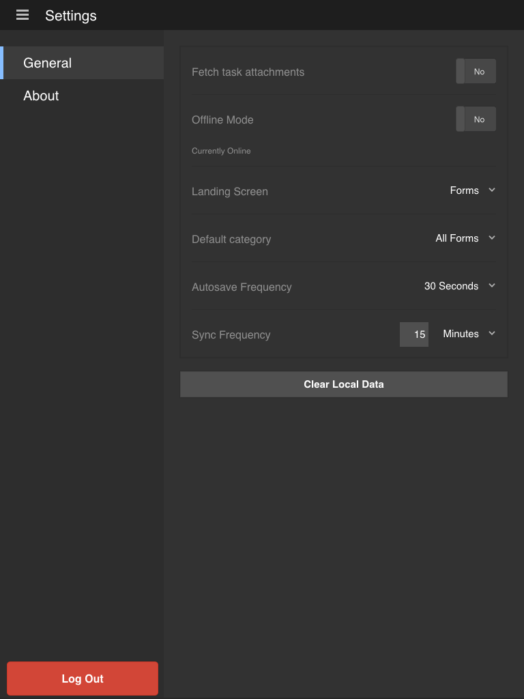

# 一般設定の更新 {#updating-general-settings}

>[!CAUTION]
>
>AEM 6.4 の拡張サポートは終了し、このドキュメントは更新されなくなりました。 詳細は、 [技術サポート期間](https://helpx.adobe.com/jp/support/programs/eol-matrix.html). サポートされているバージョンを見つける [ここ](https://experienceleague.adobe.com/docs/?lang=ja).

AEM Formsアプリの一般設定では、添付ファイルの取得、オフラインモード、ランディング画面、デフォルトカテゴリ、自動保存頻度などの設定を指定できます。

## アプリの一般設定の更新 {#working-with-the-form}

アプリケーションをAEM Formsサーバーと同期すると、すべてのフォームと定義済みのタスクがモバイルデバイスにダウンロードされます。

アプリケーションが同期されたときに、デフォルトの AEM Forms アプリケーションソリューションは、各フォームに関連付けられた添付ファイルをダウンロードすることはありません。

「一般」タブで、ダウンロードの添付ファイルや、オフラインモード、ランディング画面、自動保存、および同期設定変更してください。アプリケーションの[ホーム画面](/help/forms/using/home-screen.md)を変更できます。

**設定画面の「一般」タブに移動します。**

1. 設定画面に移動するには、ホーム画面の左上隅にあるメニューボタンをタップし、次に、 **設定**.
1. 設定画面で、「一般」タブをタップします。

   

   >[!NOTE]
   >
   >オプションは、モバイルデバイスごとに異なる表示になる場合があります。

### 一般設定 {#general-settings}

アプリの設定では、次の項目を変更することができます。

* **タスク添付ファイルを取得**： 各タスクがアプリケーションにダウンロードされたときに、関連の添付ファイルをダウンロードするかどうかを指定します。

* **オフラインモード**:AEM Formsアプリのオフラインサービスを有効または無効にする場合。 詳しくは、 [オフラインモードでの作業](/help/forms/using/work-offline-mode.md) 」を参照してください。

* **ランディング画面**： アプリケーションの開始場所（[ホーム画面](/help/forms/using/home-screen.md)）を設定します。

   選択可能なオプション：

   * フォーム
   * タスク
   * お気に入り

* **デフォルトのカテゴリ**:ホーム画面に表示するフォームのカテゴリを選択できます。 「すべて」を選択すると、すべてのフォームがホーム画面に表示されます。 カテゴリは、アプリケーションに読み込まれたフォームに基づいて設定されます。 フォームは、AEM Forms サーバーで指定したフォーム設定に基づいてアプリケーション内で使用できます。

* **自動保存頻度**： [モバイルアプリケーションがフォームデータをローカルに保存](/help/forms/using/autosave-data-app.md)する頻度を設定します。

* **同期頻度**:頻度を設定するには、以下を実行します。 [モバイルアプリが同期されました](/help/forms/using/sync-app.md) AEM Formsサーバーをオンラインモードで使用します。

**ローカルデータの消去**：デバイス上からデータベースを消去します。この中には、すべてのユーザやファイルストレージ用の設定とローカルデータが含まれます。 

>[!NOTE]
>
>キャッシュを消去すると、直後にアプリからログアウトされます。
>
>ただし、キャッシュ消去の操作を確認するプロンプトが表示されます。
