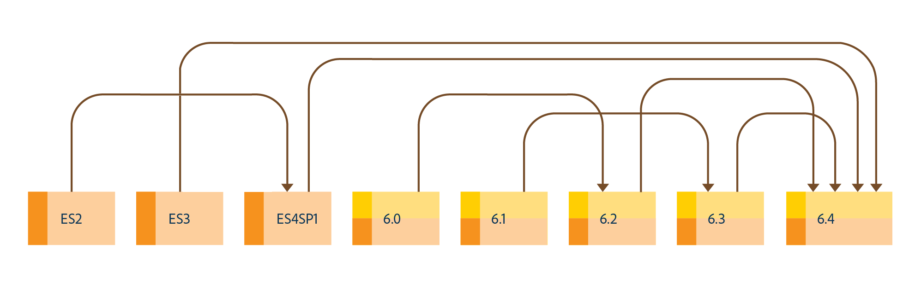

# AEM 6.4 Forms へのアップグレード{#upgrade-to-aem-forms}

>[!CAUTION]
>
>AEM 6.4 の拡張サポートは終了し、このドキュメントは更新されなくなりました。 詳細は、 [技術サポート期間](https://helpx.adobe.com/jp/support/programs/eol-matrix.html). サポートされているバージョンを見つける [ここ](https://experienceleague.adobe.com/docs/?lang=ja).

AEM 6.4 Forms には、いくつかの新機能と機能強化が導入されています。これにより、フォームと通信の作成、管理、ユーザーエクスペリエンスが簡素化されます。AEM 6.4 Forms のすべての新機能と機能強化については、[新機能の概要についてのドキュメント](/help/forms/using/whats-new.md)を参照してください。

既存の LiveCycle または AEM Forms のインストール環境をアップグレードすると、AEM 6.4 Forms に導入された新機能と機能強化を使用できるようになります。既存のデータ、プロセス、アセットはそのまま保存されます。アップグレード時には、メタデータとプロセスの状態も保持されます。アップグレードを開始するためのアップグレードパスを選択できます。

次の図は、OSGi 上の AEM Forms で使用可能なアップグレードパスを示しています。

次の場所から直接アップグレードを実行できます。

* OSGi 上の AEM 6.2 Forms
* OSGi 上の AEM 6.3 Forms

以下の場合は、マルチホップアップグレードを実行することができます。

* OSGi 上の AEM 6.0 Forms
* OSGi 上の AEM 6.1 Forms

次の図に、AEM Forms on JEE で使用可能なアップグレードパスを示します。

次の場所から直接アップグレードを実行できます。

* LiveCycle ES3
* LiveCycle ES4 SP1
* JEE 上の AEM 6.2 Forms
* JEE 上の AEM 6.3 Forms

以下の場合は、マルチホップアップグレードを実行することができます。

* LiveCycle ES2
* JEE 上の AEM 6.0 Forms
* JEE 上の AEM 6.1 Forms
