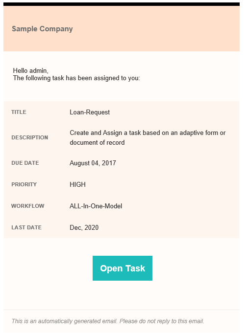
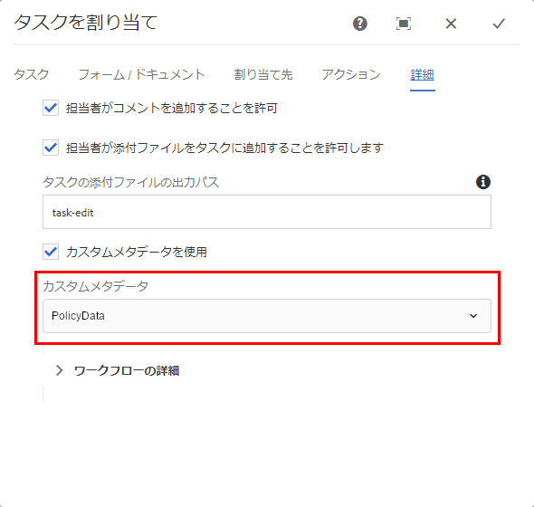

# メール通知におけるメタデータの使用  {#use-metadata-in-an-email-notification}

>[!CAUTION]
>
>AEM 6.4 の拡張サポートは終了し、このドキュメントは更新されなくなりました。 詳細は、 [技術サポート期間](https://helpx.adobe.com/jp/support/programs/eol-matrix.html). サポートされているバージョンを見つける [ここ](https://experienceleague.adobe.com/docs/?lang=ja).

メタデータを使用して、フォームワークフローの電子メール通知に情報を入力する

タスクの割り当て手順を使用して、タスクを作成し、ユーザーまたはグループに割り当てることができます。 タスクがユーザーまたはグループに割り当てられると、定義されたユーザーまたは定義されたグループの各メンバーに電子メール通知が送信されます。 典型的な [電子メール通知](/help/forms/using/use-custom-email-template-assign-task-step.md) 割り当てられたタスクのリンクとタスクに関連する情報が含まれます。

電子メールテンプレートでメタデータを使用すると、電子メール通知に情報を動的に入力できます。 例えば、次の電子メール通知のタイトル、説明、期限、優先度、ワークフローおよび最終日の値は、実行時（電子メール通知が生成される際）に動的に選択されます。



メタデータはキーと値のペアとして保存されます。 電子メールテンプレートでキーを指定し、キーを実行時（電子メール通知が生成される際）の値に置き換えることができます。 例えば、以下のコードサンプルでは、「$ {workitem_title}」がキーです。 実行時に「Loan-Request」という値に置き換えられます。

```xml
subject=Task Assigned - ${workitem_title}

message=<html><body>\n\
 <table>\n\
  <tbody>\n\
   <tr>\n\
    <td>\n\
      Sample Company\n\
    </td>\n\
   </tr>\n\
   <tr>\n\
    <td>\n\
     <pre style="font-size: 13px; font-family: Helvetica, Arial, sans-serif;  font-weight: normal; color: #323232;"> Hello ${workitem_assignee},\n\
 The following task has been assigned to you:</pre>\n\
    </td>\n\
   </tr>\n\
   <tr>\n\
    <td>\n\
     <table>\n\
      <tbody>\n\
       <tr style="border-bottom: solid 2px #FFFCF9;">\n\
        <td> TITLE</td>\n\
        <td>\n\
         <p>${workitem_title}</p>\n\
        </td>\n\
       </tr>\n\
                            <tr style="border-bottom: solid 2px #FFFCF9;">\n\
        <td> DESCRIPTION</td>\n\
        <td>\n\
         <p>${workitem_description}</p>\n\
        </td>\n\
       </tr>\n\
       <tr style="border-bottom: solid 2px #FFFCF9;">\n\
        <td> DUE DATE</td>\n\
        <td>\n\
         <p>${workitem_due_date}</p>\n\
        </td>\n\
       </tr>\n\
       <tr style="border-bottom: solid 2px #FFFCF9;">\n\
        <td> PRIORITY</td>\n\
        <td>\n\
         <p>${workitem_priority}</p>\n\
        </td>\n\
       </tr>\n\
       <tr>\n\
        <td> WORKFLOW</td>\n\
        <td>\n\
         <p>${workitem_workflow}</p>\n\
        </td>\n\
       </tr>\n\
      </tbody>\n\
     </table>\n\
    </td>\n\
   </tr>\n\
   <tr style = "text-align: center; vertical-align: middle;">\n\
    <td> \n\
     <a href="${workitem_url}" target="_blank" style="background-color: #1EBBBB; font-size: 18px; line-height: 25px; font-weight: bold; color: #FFFFFF; text-decoration: none; padding: 15px 15px 15px 15px;">Open Task</a>\n\
    </td>\n\
   </tr>\n\
   <tr>\n\
    <td>\n\
     <p><span style="font-size: 12px; font-weight: normal; font-style: italic; color: #919191;">This is an automatically generated email. Please do not reply to this email.</span></p>\n\
    </td>\n\
   </tr>\n\
  </tbody>\n\
 </table>\n\
</body>\n\
</html>\n\
```

## 電子メール通知でのシステム生成メタデータの使用 {#using-system-generated-metadata-in-an-email-notification}

AEM Formsアプリケーションには、いくつかのメタデータ変数（キーと値のペア）が標準で用意されています。 これらの変数は、E メールテンプレートで使用できます。 変数の値は、関連する Forms アプリケーションに基づきます。 次の表に、すぐに使用できるすべてのメタデータ変数を示します。

<table> 
 <tbody> 
  <tr> 
   <td>キー</td> 
   <td>説明</td> 
  </tr> 
  <tr> 
   <td>workitem_title</td> 
   <td>関連する Forms アプリケーションのタイトル。</td> 
  </tr> 
  <tr> 
   <td>workitem_url</td> 
   <td>関連する Forms アプリケーションにアクセスする URL。</td> 
  </tr> 
  <tr> 
   <td>workitem_description</td> 
   <td>関連する Forms アプリケーションの説明。</td> 
  </tr> 
  <tr> 
   <td>workitem_priority</td> 
   <td>関連する Forms アプリケーションに対して指定された優先度。</td> 
  </tr> 
  <tr> 
   <td>workitem_due_date</td> 
   <td>関連する Forms アプリケーションに対して実行する最終日。</td> 
  </tr> 
  <tr> 
   <td>workitem_workflow</td> 
   <td>Forms アプリケーションに関連付けられているワークフローの名前。</td> 
  </tr> 
  <tr> 
   <td>workitem_assign_timestamp</td> 
   <td>ワークフロー項目が現在の担当者に割り当てられた日時。</td> 
  </tr> 
  <tr> 
   <td>workitem_assignee</td> 
   <td>現在の担当者の名前。</td> 
  </tr> 
  <tr> 
   <td>host_prefix</td> 
   <td>オーサーサーバーの URL。 例えば、https://10.41.42.66:4502<br /> です。 </td> 
  </tr> 
  <tr> 
   <td>publish_prefix</td> 
   <td>パブリッシュサーバーの URL。 例えば、https://10.41.42.66:4503 です。</td> 
  </tr> 
 </tbody> 
</table>

## 電子メール通知でのカスタムメタデータの使用 {#using-custom-metadata-in-an-email-notification}

また、電子メール通知にカスタムメタデータを使用することもできます。 カスタムメタデータには、システム生成メタデータに加えて、情報も含まれます。 例えば、データベースから取得したポリシーの詳細などです。 ECMAScript バンドルまたは OSGi バンドルを使用して、カスタムデータを crx-repository に追加することができます。

### ECMAScript を使用したカスタムメタデータの追加  {#use-ecmascript-to-add-custom-metadata}

[ECMAScript](https://ja.wikipedia.org/wiki/ECMAScript) はスクリプト言語です。 クライアントサイドのスクリプティングやサーバーアプリケーションに使用されます。 次の手順を実行して、ECMAScript を使用してメールテンプレートにカスタムメタデータを追加します。

1. 管理アカウントで CRX DE にログインします。 URL は `https://[server]:[port]/crx/de/index.jsp` です。

1. /apps/fd/dashboard/scripts/metadataScripts に移動します。 拡張子に.ecma を持つファイルを作成します。 例えば、usermetadata.ecma と入力します。

   上記のパスが存在しない場合は、作成します。

1. キーと値のペアでカスタムメタデータを生成するロジックを持つ.ecma ファイルにコードを追加します。 例えば、次の ECMAScript コードは保険証券のカスタムメタデータを生成します。

   ```
   function getUserMetaData()  {
       //Commented lines below provide an overview on how to set user metadata in map and return it.
       var HashMap = Packages.java.util.HashMap;
       var valuesMap = new HashMap();
       valuesMap.put("policyNumber", "2017568972695");
       valuesMap.put("policyHolder", "Adobe Systems");
   
       return valuesMap;
   }
   ```

1. 「すべて保存」をクリックします。これで、AEMワークフローモデルでスクリプトを選択できるようになりました。

   

1. （オプション）スクリプトのタイトルを指定します。

   タイトルを指定しない場合、「カスタムメタデータ」フィールドに ECMAScript ファイルの完全パスが表示されます。 次の手順で、スクリプトに有意のタイトルを指定します。

   1. スクリプトノードを拡張します。**[!UICONTROL jcr:content]** ノードを右クリックしてから、「**[!UICONTROL Mixins]**」をクリックします。
   1. 「 mix:title 」と入力して Mixin を編集ダイアログでクリックします。 **+**.
   1. プロパティに次の値を入力します。

      | 名前 | jcr:title |
      |---|---|
      | 型 | String |
      | 値 | スクリプトのタイトルを指定します。 例えば、ポリシーホルダーのカスタムメタデータです。 指定した値がタスクの割り当て手順に表示されます。 |

### OSGi バンドルと Java インターフェイスを使用したカスタムメタデータの追加 {#use-an-osgi-bundle-and-java-interface-to-add-custom-metadata}

WorkitemUserMetadataService Java インターフェイスを使用して、電子メールテンプレートのカスタムメタデータを追加できます。 WorkitemUserMetadataService Java インターフェイスを使用する OSGi バンドルを作成し、AEM Formsサーバーにデプロイできます。 これにより、タスクの割り当て手順でメタデータを選択できるようになります。

Java インターフェイスで OSGi バンドルを作成するには、を追加します。 [AEM Forms Client SDK](https://helpx.adobe.com/jp/aem-forms/kb/aem-forms-releases.html) jar および [granite jar](https://repo.adobe.com/nexus/content/groups/public/com/adobe/granite/com.adobe.granite.workflow.api/1.0.2/) OSGi バンドルプロジェクトへの外部依存関係としてのファイル。 任意の Java IDE を使用して、OSGi バンドルを作成できます。 次の手順は、Eclipse を使用して OSGi バンドルを作成する手順を示しています。

1. Eclipse IDE を開きます。 ファイル／新規プロジェクトに移動します。

1. ウィザードを選択画面で、Maven プロジェクトを選択し、「次へ」をクリックします。

1. 新しい Maven プロジェクトで、デフォルトをそのままにして、「次へ」をクリックします。 アーキタイプを選択して「次へ」をクリックします。例えば、maven-archetype-quickstart などです。 プロジェクトのグループ ID、アーティファクト ID、バージョン、パッケージを指定し、「完了」をクリックします。 プロジェクトが作成されます。

1. 編集用に pom.xml ファイルを開き、ファイルのすべてのコンテンツを以下に置き換えます。

   ```
   
   ```

1. WorkitemUserMetadataService Java インターフェイスを使用して、電子メールテンプレートのカスタムメタデータを追加するソースコードを追加します。 サンプルコードを以下に示します。

   ```java
   package com.aem.impl;
   
   import com.adobe.fd.workspace.service.external.WorkitemUserMetadataService;
   import org.apache.felix.scr.annotations.Component;
   import org.apache.felix.scr.annotations.Properties;
   import org.apache.felix.scr.annotations.Property;
   import org.apache.felix.scr.annotations.Service;
   import org.osgi.framework.Constants;
   
   import java.util.HashMap;
   import java.util.Map;
   
   @Component
   @Service
   @Properties({
           @Property(name = Constants.SERVICE_DESCRIPTION, value = "A sample implementation of a user metadata service."),
           @Property(name = WorkitemUserMetadataService.SERVICE_PROPERTY_LABEL, value = "Default User Metadata Service")})
   
   public class WorkitemUserMetadataServiceImpl
     implements WorkitemUserMetadataService
   {
     public WorkitemUserMetadataServiceImpl() {}
   
     public Map<String, String> getUserMetadataMap()
     {
       HashMap<String, String> metadataMap = null;
       metadataMap = new HashMap();
       metadataMap.put("test_metadata", "tested-interface implementation");
       return metadataMap;
     }
   }
   ```

1. コマンドプロンプトを開き、OSGi バンドルプロジェクトを含むディレクトリに移動します。 以下のコマンドを使用して OSGi バンドルを作成します。

   `mvn clean install`

1. バンドルをAEM Formsサーバーにアップロードします。 AEM パッケージマネージャーを使用して、バンドルを AEM Forms サーバーに読み込むことができます。

バンドルをインポートすると、タスクの割り当て手順でメタデータを選択して、メールテンプレートで使用できるようになります。
