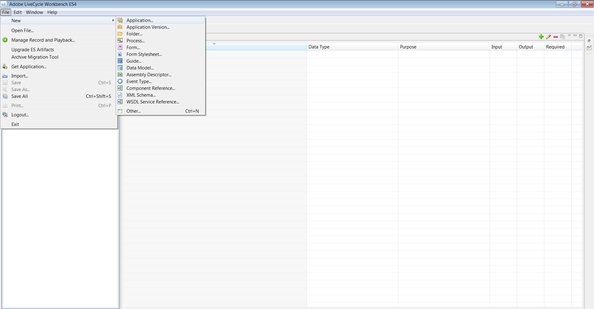

# HTML Workspace でのアダプティブフォームの使用 {#using-an-adaptive-form-in-html-workspace}

>[!CAUTION]
>
>AEM 6.4 の拡張サポートは終了し、このドキュメントは更新されなくなりました。 詳細は、 [技術サポート期間](https://helpx.adobe.com/jp/support/programs/eol-matrix.html). サポートされているバージョンを見つける [ここ](https://experienceleague.adobe.com/docs/?lang=ja).

JEE 上の AEM Forms では、HTML Workspace でアダプティブフォームを使用することができます。

プロセスデザインの際に XDP を選択することができるため、既存のアダプティブフォーム AEM レポジトリから参照できる機能が追加されました。この機能により、プロセスデザイナーは、アダプティブフォームを Task からだけでなく、Starting Point からも設定することができます。

## プロセスデザインエクスペリエンス {#process-design-experience}

プロセスデザインでアダプティブフォームを使用できるようにするには、次の手順を実行します。

* タスクの割り当てとスタートポイントでは、CRX リポジトリ内のアダプティブフォームアセットを参照して、タスクにフォームアセットを割り当てることができます。
* 「Assign Task」/「Start Point」Workbench プロパティシートで、アダプティブフォームの最上位/グローバルツールバーを非表示にすることができます。
* アダプティブフォームで、レンダリングアクションと送信アクションに新しいアクションプロファイルを使用することができます。

### LiveCycleアプリケーションの書き出しと読み込み {#livecycle-application-export-and-import}

アダプティブフォームはAEMリポジトリ内にあるので、LiveCycleの書き出しには、使用するアダプティブフォームの参照のみが含まれます。 そのため、LiveCycle アプリケーションのエクスポートおよびインポートは、2 段階のプロセスとなっています。LiveCycleアプリケーションには、プロセスの定義などが含まれます。 アダプティブフォームを含む別のパッケージが、AEMから ZIP ファイルとして書き出されます。 読み込み時に、LiveCycleアプリケーションは Workbench を通じて読み込まれ、アダプティブフォームはAEMを通じて読み込まれます。

## Workspace でのアダプティブフォームのユーザーエクスペリエンスHTML {#user-experience-of-adaptive-form-in-html-workspace}

HTMLWorkspace には、モバイルフォームで使用できるコントロールに加えて、アダプティブフォーム固有のコントロールがいくつか用意されています。 Task または Start Point を開くと、HTMLWorkspace でアダプティブフォームの添付ファイルの追加、保存、署名、送信、ナビゲーションを行うことができます。 詳細は次のとおりです。

1. ファイルを**添付するには、Mobile Formsと同様に Task 添付ファイルを使用します。 アダプティブフォームでは、File Attachment タイプのボタンは非表示になっています。

1. アダプティブフォームを保存するには、Mobile Forms の場合と同じように「**保存**」をクリックします。アダプティブフォームでは、Save タイプのボタンは非表示になっています。

1. アダプティブフォームを送信するには、Mobile Forms と同じように、「**送信**」ボタンを使うか、またはルートアクションを使用します。アダプティブフォームでは、Submit タイプのボタンは非表示になっています。

1. **アダプティブフォームグローバルツールバーの表示**：プロセスデザイナーがグローバル / トップレベルツールバーを非表示にした場合、ツールバーおよびボタンはアダプティブフォームに表示されません。

1. **Workspace でのアダプティブフォームのナビゲーションコントロール**：HTML Workspace のアダプティブフォームでは、「保存」、「送信」、「ルートアクション」のボタンに加え、「次へ」／「前へ」ボタンも使用できます。HTML Workspace でアダプティブフォームのパネルをナビゲートするには、「次へ」／「前へ」ボタンをクリックします。「次へ」／「前へ」ボタンは、アダプティブフォームのモバイル表示のナビゲーションコントロールのような、精密なナビゲーションを提供します。

1. **アダプティブフォームの eSign サービスと Summary コンポーネント**：Summary コンポーネントは、HTML Workspace では操作できません。つまり、アダプティブフォームに Summary コンポーネントが含まれている場合、Workspace には表示されません。 Esign コンポーネントの自動送信の代わりに、Workspace ユーザーは Workspace で送信またはルートアクションをクリックします。HTML ドキュメントに署名した後は、フラットな署名済みドキュメントとして表示されます。 クリック **送信** タスクまたは開始点を閉じる、または完了するルートアクション。

   署名済みのドキュメントが eSign サービスサーバーから収集され、データ xml ファイルがプロセス内の次のステップへと転送されます。

## アダプティブフォームをプロセスデザインで使用するための手順 {#steps-to-use-adaptive-forms-in-process-design}

1. Adobe Experience Manager Forms Workbench を開きます。

1. **ファイル／新規／アプリケーション**&#x200B;に移動するか、または既存のアプリケーションを使用してアプリケーションを作成します。

   

1. プロセスを作成するか、またはアプリケーション内の既存のプロセスを使用します。

   

1. Start Point または Assign Task を作成し、ダブルクリックします。
1. 「**[!UICONTROL プレゼンテーションとデータ]**」セクションで、「**[!UICONTROL CRX アセットを使用]**」を選択し、アセットの前にある省略記号をクリックします。

   

1. アセットを管理 UI を通して作成されたアダプティブフォームを選択し、「**[!UICONTROL OK]**」をクリックします。

   

   >[!NOTE]
   >
   >アダプティブフォームの作成について詳しくは、 [アダプティブフォームの作成](/help/forms/using/creating-adaptive-form.md).
   >
   >プロセスの作成について詳しくは、[プロセスの作成と管理](https://help.adobe.com/ja_JP/AEMForms/6.1/WorkbenchHelp/WS92d06802c76abadb-1cc35bda128261a20dd-7ff7.2.html)を参照してください。
