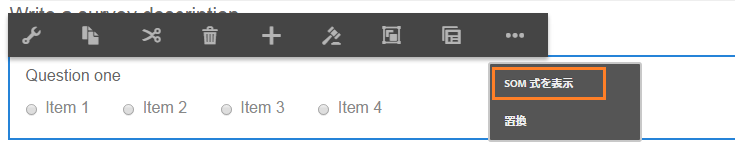
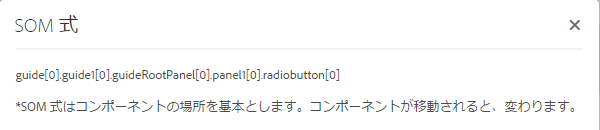

# アダプティブフォームでの SOM 式の使用 {#using-som-expressions-in-adaptive-forms}

>[!CAUTION]
>
>AEM 6.4 の拡張サポートは終了し、このドキュメントは更新されなくなりました。 詳細は、 [技術サポート期間](https://helpx.adobe.com/jp/support/programs/eol-matrix.html). サポートされているバージョンを見つける [ここ](https://experienceleague.adobe.com/docs/?lang=ja).

アダプティブフォームはAEM Page としてモデル化され、AEMリポジトリで JCR コンテンツ構造として表されます。 コンテンツ構造のキー要素は guideContainer ノードです。 guideContainer の下に、ネストされたパネルとフィールドを含む rootPanel があります。

スクリプティングオブジェクトモデル (SOM) を使用して、特定のドキュメントオブジェクトモデル (DOM) 内の値、プロパティ、およびメソッドを参照できます。 DOM は、メモリオブジェクトとプロパティをツリー階層で整理します。 SOM 式は、フィールド/描画要素とパネルを参照します。

次の画像は、コンポーネントをフォームに追加する際、アダプティブフォームが変換するノード構造を示しています。例えば、パネルをルートパネルに追加し、実行時に DOM に変換されるラジオボタンをパネルに追加できます。アダプティブフォームのラジオボタンフィールドには、`guide[0].guide1[0].guideRootPanel[0].panel1[0].radiobutton[0]` のように SOM 式を指定します。

アダプティブフォーム内のすべての要素の SOM 式には、`guide[0].guide1[0]` というプレフィックスが付けられます。ノード構造階層のコンポーネントの場所は SOM 式の派生に使用されます。

SOM 式は、アダプティブフォーム内のラジオボタンの位置を変更すると変更されます。 オーサリングモードでは、「 SOM 式を表示」オプションを使用して、AEM Forms内のフィールドまたは要素の SOM 式を表示できます。 このオプションはフィールドや要素を右クリックするとパネル上に表示されます。

パネル内では、パネルツールバーからこの機能にアクセスできます。この機能により、アダプティブフォームの作成者によるスクリプト作成が容易になります。

[GuideBridge](https://helpx.adobe.com/aem-forms/6/javascript-api/GuideBridge.md) に一覧表示されている API の一部は、要素の SOM 式を使用します。例えば、アダプティブフォーム内の特定のフィールドにフォーカスを移動するには、対応する SOM 式を `guideBridge` の `getFocus` API に渡します。
