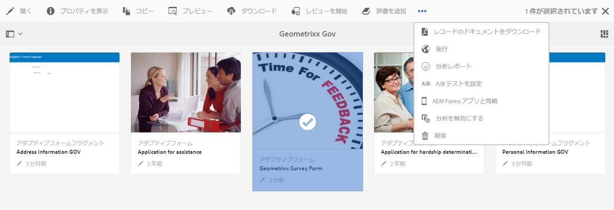
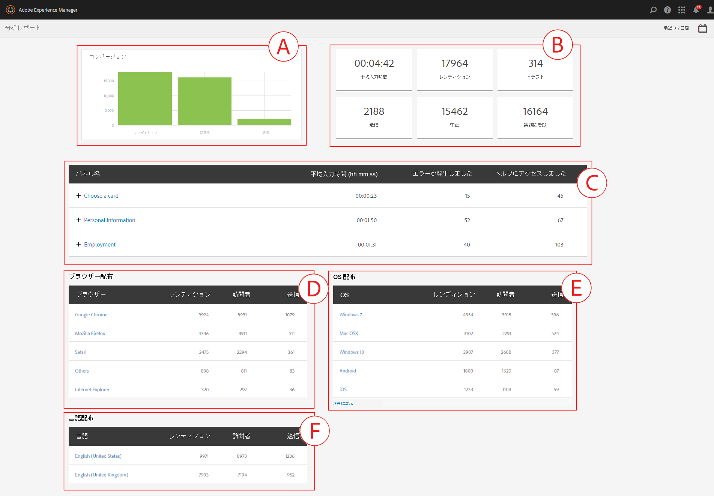
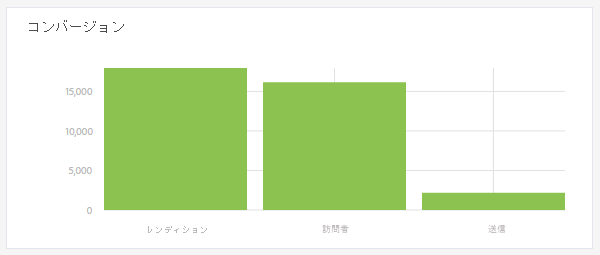
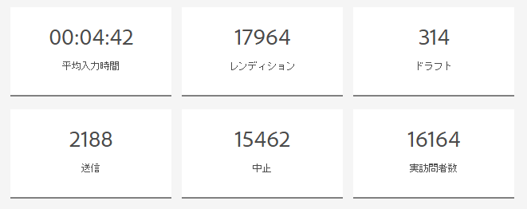

# AEM Forms の分析レポートの確認方法と詳細 {#view-and-understand-aem-forms-analytics-reports}

>[!CAUTION]
>
>AEM 6.4 の拡張サポートは終了し、このドキュメントは更新されなくなりました。 詳細は、 [技術サポート期間](https://helpx.adobe.com/jp/support/programs/eol-matrix.html). サポートされているバージョンを見つける [ここ](https://experienceleague.adobe.com/docs/?lang=ja).

Adobe Experience Manager Formsは、Adobe Analyticsと統合され、発行済みのフォームとドキュメントのパフォーマンス指標を取得して追跡できます。 これらの指標分析の意図は、フォームやドキュメントをさらに有効利用するために必要な変更に関して十分な情報に基づいた決定を行えるよう支援することです。

## 分析の設定 {#setting-up-analytics}

AEM Formsの分析機能は、AEM Formsアドオンパッケージの一部として使用できます。 アドオンパッケージのインストールについて詳しくは、 [AEM Formsのインストールと設定](/help/forms/using/installing-configuring-aem-forms-osgi.md).

アドオンパッケージに加えて、Adobe Analyticsアカウントが必要です。 このソリューションについて詳しくは、 [Adobe Analytics](https://www.adobe.com/jp/solutions/digital-analytics.html).

AEM FormsアドオンパッケージとAdobe Analyticsアカウントを取得したら、 Adobe AnalyticsアカウントをAEM Formsと統合し、フォームやドキュメントのトラッキングを有効にします。詳しくは、 [分析とレポートの設定](/help/forms/using/configure-analytics-forms-documents.md).

## ユーザーインタラクション情報の記録方法 {#how-user-interaction-information-is-recorded}

ユーザーがフォームを操作すると、操作が記録され、Analytics サーバーに送信されます。 次のリストは、様々なユーザーアクティビティのサーバーコールを示しています。

* 訪問あたりのフィールドあたり 2 回の呼び出し
* 1 回のパネル訪問
* 1 保存
* 2 （送信）
* 2 保存
* 1 ヘルプ
* 検証エラーごとに 1
* フォームレンディションの場合は 1、デフォルトのパネル訪問の場合は 1、デフォルトの最初のフィールド訪問の場合は 1
* フォーム放棄の場合は 2

>[!NOTE]
>
>このリストが完全なものではありません。

## 分析レポートの表示 {#summary-report}

分析レポートを表示するには、次の手順を実行します。

1. `https://[hostname]:[port]` から AEM ポータルにログインします。
1. **フォーム／フォームとドキュメント**&#x200B;をクリックします。

1. 分析レポートを表示するためのフォームを選択します。
1. **詳細／分析レポート**&#x200B;を選択します。

**A.** 分析レポートコマンド

以下のように、フォームおよびフォームに含まれる各パネルの分析レポートが AEM Forms によって表示されます。

**A.** コンバージョン **B.** フォームレベルの概要 **C.** パネルレベルの概要 **D.** 訪問者のブラウザー - フィルター **E.** 訪問者の OS - フィルター **F.** 訪問者の言語 - フィルター

デフォルトでは、過去 7 日間の分析レポートが表示されます。 過去 15 日間、過去 1 ヶ月間などのレポートを表示したり、日付範囲を指定したりできます。

>[!NOTE]
>
>「過去 7 日間」や「過去 15 日間」などのオプションでは、分析レポートを生成した日のデータは含まれません。 現在の日のデータを含めるには、現在の日付を含む日付範囲を指定してから、レポートを実行する必要があります。

## アダプティブフォームとHTML5 フォームのコンバージョングラフ {#conversions-graph-for-adaptive-and-html-forms}

フォームレベルのコンバージョングラフでは、次の KPI（主要業績評価指標）に基づいて、フォームの効果に関するインサイトを得ることができます。

* **レンディション**:フォームが開かれた回数
* **訪問者**:フォームの訪問者数
* **送信**:フォームが送信された回数

## アダプティブフォームとHTML5 フォームの分析レポート {#analytics-report-for-adaptive-and-html-forms}

フォームレベルの概要セクションでは、次の KPI（主要業績評価指標）項目別に、フォームの実行状況を把握できます。

* **平均記入時間**：フォームの記入にかかった平均時間。ユーザーがフォームに滞在しても送信しなかった場合、滞在時間はこの計算に含まれません。
* **レンディション**：フォームがレンダリングされた、または開かれた回数

* **ドラフト**:フォームがドラフトとして保存された回数
* **送信**:フォームが送信された回数
* **中止**:ユーザーがフォームの入力を開始し、フォームを完了せずにフォームを終了した回数
* **ユニーク訪問者**：ユニーク訪問者によってフォーム i ``s がレンダリングされた回数。ユニーク訪問者について詳しくは、「[ユニーク訪問者、表示ページ、顧客の行動](https://helpx.adobe.com/jp/analytics/kb/unique-visitors-visitor-behavior.html)」を参照してください。

## パネルレポート {#bottom-summary-report}

パネルレベルの概要セクションでは、フォーム内の各パネルに関する次の情報を提供します。

* **平均記入時間**：フォームが送信されたかどうかを問わず、ユーザーがパネルに滞在した平均時間

* **エラーの発生回数**：ユーザーがパネルのフィールド上で直面したエラーの平均回数エラーの発生回数は、フィールド上で発生したエラーの合計数を、フォームのレンディション回数で除算して計算します。

* **ヘルプのアクセス回数**：パネル内のフィールドでユーザーが文脈依存ヘルプにアクセスした平均回数。ヘルプのアクセス回数は、フィールドのヘルプにアクセスした合計回数を、フォームのレンディション回数で除算して計算します。

### パネルの詳細レポート {#detailed-panel-report}

パネルレポートでパネルの名前をクリックして、各パネルの詳細を表示することもできます。

詳細レポートは、パネル内のすべてのフィールドの値を表示します。

パネルレポートには次の 3 つのタブがあります。

* **時間レポート**（デフォルト）：パネル内の各フィールドの記入にかかった時間を秒単位で表示します
* **エラーレポート**：フィールドの記入中にユーザーが直面したエラーの回数を表示します
* **ヘルプレポート**：特定のフィールドのヘルプがアクセスされた回数

複数のパネルを使用できる場合は、パネル間を移動できます。

### フィルター：ブラウザー、OS、言語 {#filters-browser-os-and-language}

「ブラウザー配布」、「OS 配布」、「言語配布」の各テーブルには、ブラウザー、OS、フォームユーザーの言語ごとに、レンディション、訪問者、送信が表示されます。 これらのテーブルには、デフォルトで最大 5 つのエントリが表示されます。 「表示を増やす」をクリックすると、さらに多くのエントリが表示され、「表示を減らす」をクリックすると、通常の 5 つ以下のエントリに戻ります。

分析データをさらにフィルターするには、任意のテーブルのエントリをクリックします。 例えば、ブラウザー配布テーブルで「 Google Chrome 」をクリックすると、Google Chrome ブラウザーに関連するデータを使用して、次のようにレポートが再度レンダリングされます。

フィルターを適用した後にパネルレポートを表示すると、パネルレポートのデータも適用したフィルターに従って表示されます。

フィルターを適用した場合の動作は次のとおりです。

* 一度に 1 つのフィルターのみ適用できるので、配分テーブルは読み取り専用になります。
* 適用したフィルターのテーブルが消えます。
* 「閉じる」ボタン（下でハイライト表示）をクリックすると、適用したフィルターを削除できます。

## A/B テスト {#a-b-testing}

A/B テストが有効になっていて、フォームに対して設定されている場合、レポートページにはドロップダウンが表示され、A/B テストレポートの表示に使用できます。 A/B テストレポートは、設定したとおりにフォームの 2 つのバージョンの比較パフォーマンス情報を表示します。

A/B テストについて詳しくは、[アダプティブフォームの A/B テストの作成と管理](/help/forms/using/ab-testing-adaptive-forms.md)を参照してください。
