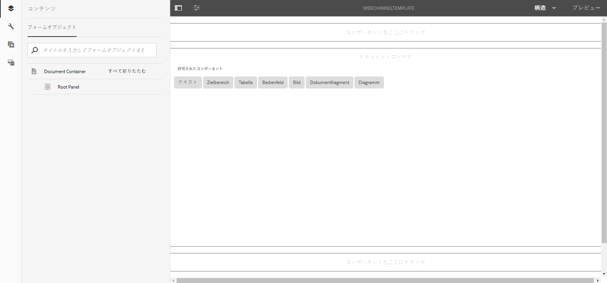

# 印刷チャネルと Web チャネル {#print-channel-and-web-channel}

印刷チャネルテンプレートを読み込み、Web チャネルテンプレートを作成して有効にする

インタラクティブ通信は、印刷チャネルと Web チャネルという 2 つのチャネルを使用して配信することができます。印刷チャネルは、PDF や紙ベースの通信手段（保険料の支払いを通知する印刷書類など）を作成する場合に使用され、Web チャネルは、オンライン情報（Web サイト上で表示されるクレジットカードの取引明細など）を配信する場合に使用されます。

インタラクティブ通信の作成者は、ドキュメントフラグメントや画像などのアセットを再利用して、インタラクティブ通信の印刷版とWeb版の両方を作成できます。

[インタラクティブ通信の作成](/help/forms/using/create-interactive-communication.md)の前提条件の1つは、印刷チャネルやWebチャネル用のテンプレートをサーバー上で使用できるようにすることです。 テンプレート作成者はAEM自体にWebチャネルテンプレートを作成しますが、印刷チャネルテンプレートXDPはAdobeForms Designerで作成され、サーバーにアップロードされます。

## 印刷チャネル {#printchannel}

インタラクティブ通信の印刷チャネルは、XFAフォームテンプレート(XDP)を使用します。 XDP は Adobe Forms Designer でデザインできます。印刷チャネルテンプレートの作成について詳しくは、[レイアウトデザイン](/help/forms/using/layout-design-details.md)を参照してください。 インタラクティブ通信で印刷チャネルテンプレートを使用するには、AEM Formsサーバーにテンプレートをアップロードする必要があります。

### インタラクティブ通信の印刷チャネルテンプレートのアップロード {#upload-interactive-communication-print-channel-template}

テンプレートをアップロードするには、forms-user グループのメンバーになっている必要があります。印刷チャネルテンプレート（XDP）を AEM Forms にアップロードするには、以下の手順を実行します。

1. **[!UICONTROL フォーム]**／**[!UICONTROL フォームとドキュメント]**&#x200B;を選択します。

1. **[!UICONTROL 作成]**／**[!UICONTROL ファイルのアップロード]**&#x200B;をタップします。

   適切な印刷チャネルテンプレート(XDP)に移動して選択し、「**[!UICONTROL 開く]**」をタップします。

## Web チャネル {#web-channel}

テンプレートの作成者と管理者は、テンプレートの作成、編集、有効化を行うことができます。それ以外のユーザーが Web テンプレートを作成できるようにするには、そのユーザーに対して権限を設定する必要があります。詳しくは、[ユーザー、グループ、アクセス権の管理](/help/sites-administering/user-group-ac-admin.md)を参照してください。

### Web チャネルテンプレートの作成 {#authoring-web-channel-template}

Web チャネルテンプレートを作成するには、最初にテンプレートフォルダーを作成する必要があります。テンプレートフォルダー内にWebテンプレートを作成したら、フォームユーザーがそのテンプレートに基づいてインタラクティブ通信のWebチャネルを作成できるように、テンプレートを有効にする必要があります。

Webチャネルテンプレートを作成するには、次の手順を実行します。

1. インタラクティブ通信Webテンプレートがまだ存在しない場合は、テンプレートフォルダを作成して、そのテンプレートを保持します。 詳しくは、「 [ページテンプレート — 編集可能](/help/sites-developing/page-templates-editable.md) 」の「テンプレートフォルダー」を参照してください。

   1. **[!UICONTROL ツール]**  > **[!UICONTROL 設定ブラウザー]**&#x200B;をタップします。
      * 詳しくは、設定ブラウザーのドキュメントを参照してください。
   1. 設定ブラウザーページで、「**[!UICONTROL 作成]**」をタップします。
   1. 設定を作成ダイアログで、フォルダーのタイトルを指定し、「**[!UICONTROL 編集可能なテンプレート]**」をオンにして、「**[!UICONTROL 作成]**」をタップします。

      フォルダーが作成され、設定ブラウザーページに表示されます。

1. 目的のテンプレートフォルダーに移動して、Web チャネルテンプレートを作成します。

   1. **[!UICONTROL ツール]** / **[!UICONTROL テンプレート/フォルダー]**&#x200B;を選択して、適切なテンプレートフォルダーに移動します。
   1. 「**[!UICONTROL 作成]**」をタップします。
   1. 「**[!UICONTROL インタラクティブ通信 — Webチャネル]**」を選択し、「**[!UICONTROL 次へ]**」をタップします。
   1. テンプレートのタイトルと説明を入力して「**[!UICONTROL 作成]**」をタップします。

      作成されたテンプレートがダイアログに表示されます。

   1. 「**[!UICONTROL 開く]**」をタップして、作成したテンプレートをテンプレートエディターで開きます。

      テンプレートエディターが表示されます。

      

      テンプレートの作成者は、テンプレートの作成や編集を行う際に、様々な要素を定義することができます。テンプレートの作成と編集は、ページの作成に似ています。詳しくは、[ページテンプレートの作成](/help/sites-authoring/templates.md)の「テンプレートの編集 — テンプレートの作成者」を参照してください。

1. このテンプレートをインタラクティブ通信の作成に使用できるようにするには、テンプレートを有効にします。

   1. **[!UICONTROL ツール]**  > **[!UICONTROL テンプレート]**&#x200B;をタップします。
   1. 適切なテンプレートに移動して選択し、「**[!UICONTROL 有効]**」をタップし、警告メッセージで「**[!UICONTROL 有効]**」をタップします。

      これでテンプレートが有効になり、テンプレートのステータスとして「有効」が表示されます。新しく作成した Web チャネルテンプレートを使用して、インタラクティブ通信を作成することができます。

### 「印刷チャネルを Web チャネルのマスターとして使用する」オプション{#print-channel-as-master-for-web-channel}

インタラクティブ通信を作成する際に、「印刷チャネルを Web チャネルのマスターとして使用する」オプションを選択すると、印刷チャネルに同期された Web チャネルを作成することができます。印刷チャネルを Web チャネルのマスターとして使用すると、Web チャネルに連結されたコンテンツ、継承設定、データが印刷チャネルから取得され、印刷チャネルに対する変更内容が Web チャネルに反映されます。ただし、インタラクティブ通信の作成者は、必要に応じて、Web チャネル内の特定のコンポーネントの継承設定を解除することができます。

