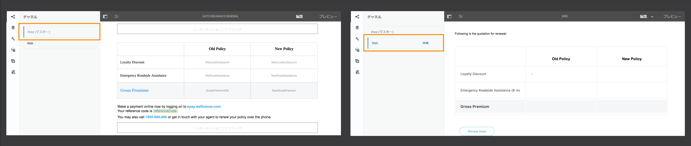
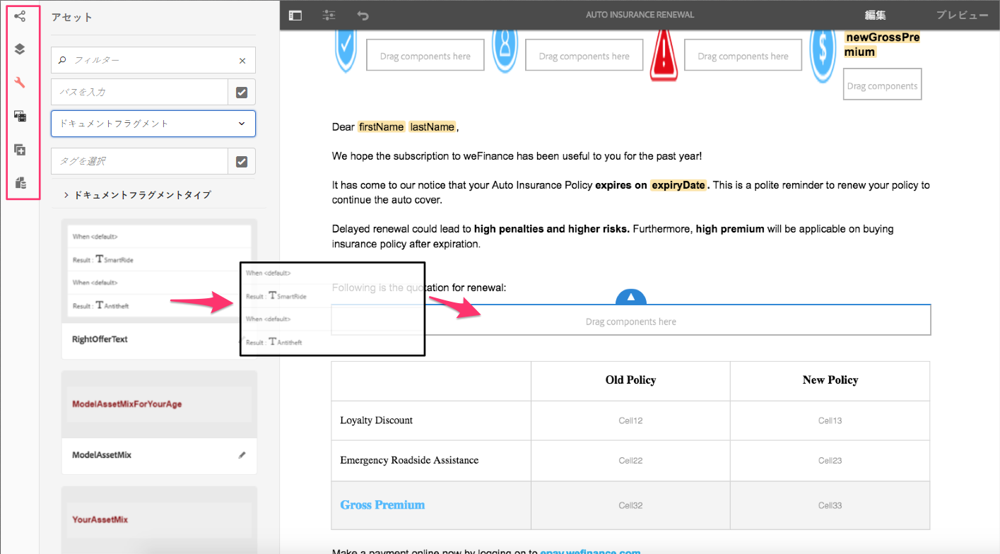
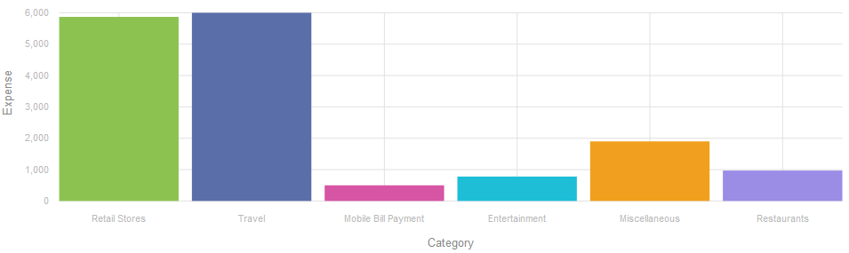
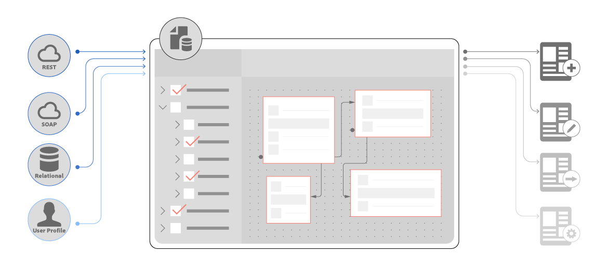

# 新機能の概要 | AEM 6.4 Forms {#new-features-summary-aem-forms}

>[!CAUTION]
>
>AEM 6.4 の拡張サポートは終了し、このドキュメントは更新されなくなりました。 詳細は、 [技術サポート期間](https://helpx.adobe.com/jp/support/programs/eol-matrix.html). サポートされているバージョンを見つける [ここ](https://experienceleague.adobe.com/docs/?lang=ja).

AEM 6.4 Formsの新機能および機能強化の概要です。

AEM Formsには、アダプティブフォームとインタラクティブ通信を使用した作成、管理、ユーザーエクスペリエンスをさらに合理化する新機能および機能強化がいくつか含まれています。

新機能と機能強化の概要については、以下の説明を参照してください。 提供されるリソースの詳細については、ドキュメントを参照してください。 また、「 AEM 6.4 Forms 」も参照してください。 [リリースノート](/help/release-notes/forms.md). 完全なAEM 6.4 Formsドキュメントについては、 [AEM 6.4 Formsガイド](/help/forms/home.md).

## インタラクティブコミュニケーション {#interactive-communications}

Interactive Communications は、ビジネス通信、レター、ドキュメント、声明書、福利厚生通知、資産管理の目論見書、マーケティング・メール、請求書、ウェルカム・キットなど、安全でパーソナライズされたインタラクティブな通信の作成、組み立て、配信を一元化および管理します。

インタラクティブ通信は、レスポンシブアダプティブフォームと同様に、アダプティブフォームと同じ基盤となる技術、プロセス、コンポーネントを使用して、レスポンシブなマルチチャネル通信を作成します。

インタラクティブ通信には、次のような大きな利点があります。

* OOTB とフォームデータモデルを統合し、バックエンドデータベースおよび MS Dynamics などの他の CRM システムへの簡単かつ合理化されたアクセスを可能にします。
* 印刷チャネルと Web チャネル用の統合オーサリングインターフェイスを提供
* 印刷チャネルと Web チャネルの両方に、アダプティブFormsオーサリングと同様のドラッグ&amp;ドロップベースのオーサリングインターフェイスを提供します。

インタラクティブ通信は、顧客とのコミュニケーションを作成するためのデフォルトの推奨される方法です。 AEM 6.3 FormsとAEM 6.2 Formsのレターを引き続き使用するには、互換性パッケージをインストールする必要があります。

### マルチチャネルインタラクティブ通信のオーサリング {#multi-channel-interactive-communication-authoring}

インタラクティブ通信を使用すると、1 つのドキュメントエディターから印刷ドキュメントと Web ドキュメントの両方を作成および編集できます。 同じドキュメントフラグメントを使用して両方のチャネルのレンディションを構築することで、作業の重複を排除できます。

詳しくは、 [インタラクティブ通信の概要](/help/forms/using/interactive-communications-overview.md).

### WYSIWYG ドキュメントエディタ {#wysiwyg-document-editor}

WYSIWYG のドラッグ&amp;ドロップ操作によるドキュメントエディターは、ビジネスにとって使いやすいエディターです。 直感的なインターフェイス、ドラッグ&amp;ドロップ機能、標準コンポーネント、データモデル、およびアセット用の統合リポジトリを使用することで、インタラクティブ通信を迅速かつ簡単にオーサリングできます。

インタラクティブ通信を作成したり、既存の通信を編集したりする場合、ビジネスユーザーは次の構築ブロックを使用できます。チャネル、コンテンツ、プロパティ、アセット、コンポーネント、データソースに関する情報が含まれます。

詳しくは、 [インタラクティブ通信のオーサリングの概要](/help/forms/using/introduction-interactive-communication-authoring.md).

### インタラクティブ通信の印刷コンテンツから Web バージョンを自動生成 {#auto-generate-web-version-from-print-content-in-interactive-communication}

作成者は、印刷ドキュメントから Web ドキュメントコンテンツを自動生成し、同じエディターで印刷ドキュメントと Web ドキュメントの両方を作成、プレビュー、編集できます。 インタラクティブ通信の作成者は、1 回だけ作成して、すべてのチャネルに公開できます。 インタラクティブ通信の作成者は、印刷チャネルと Web チャネルで同じドキュメントフラグメントを使用して、作業の重複を防ぐことができます。

詳しくは、 [印刷チャネルと Web チャネル](/help/forms/using/web-channel-print-channel.md).

### テーマを使用して、インタラクティブ通信の Web チャネルのスタイルを設定する {#use-themes-to-style-web-channel-of-interactive-communication}

インタラクティブ通信はテーマをサポートします。 テーマを作成し、インタラクティブ通信に適用することができます。 テーマには、コンポーネントとパネルのスタイル設定の詳細が含まれます。 様々なインタラクティブ通信でテーマを再利用して、共通の一貫性のある外観とブランディングを提供できます。

AEM Formsには、インタラクティブ通信用の標準のテーマが含まれています。 テーマを使用して、デバイス上でのインタラクティブ通信の外観をカスタマイズすることもできます。

詳しくは、[AEM Forms のテーマ](/help/forms/using/themes.md)を参照してください。

### 拡張エージェントインターフェイス {#enhanced-agent-interface}

エージェントのユーザーインターフェイスで、インタラクティブ通信の印刷と Web プレビューがサポートされるようになりました。 同じエージェントユーザーインターフェイスから、マルチチャネルインタラクティブ通信の印刷チャネルと Web チャネルのプレビューを選択できます。 印刷チャネル内のフィールド、変数、FDM 要素、ドキュメントフラグメントは、エージェントのユーザーインターフェイスでエージェントが変更できるように設定できます。 フォームデータモデルのサポートにより、事前入力されたサンプルデータを使用してプレビューを生成できます。

詳しくは、 [エージェント UI を使用してインタラクティブ通信を準備し、送信する](/help/forms/using/prepare-send-interactive-communication.md).

### グラフに情報を表示 {#present-information-in-charts}

インタラクティブ通信は、Web 上のグラフと、より豊富な通信を実現する印刷チャネルをサポートします。 円グラフ、ドーナツグラフ、棒グラフ、列グラフなどのグラフを使用して、大量の情報を要約し、視覚的に表示して、解釈や分析を容易におこなうことができます。

 

詳しくは、[インタラクティブ通信内でグラフを使用する](/help/forms/using/chart-component-interactive-communications.md)を参照してください。

### ドキュメントを事前に入力するための標準搭載の Data Connectors {#out-of-the-box-data-connectors-to-prefill-documents}

インタラクティブ通信は、CRM システムを含む複数のビジネスシステムと接続し、データをドキュメントにパーソナライズするためのビジネスツールとデータを統合します。

詳しくは、[フォームデータモデルの使用](/help/forms/using/using-form-data-model.md)を参照してください。

### ドキュメントフラグメントエディターの強化 {#enhanced-document-fragment-editor}

インタラクティブ通信のドキュメントフラグメント内で FDM 要素とルールを使用できるようになりました。

* フォームデータモデル要素のサポート
* ルールを使用してアセット/テキストフラグメントを表示または非表示にする
* 要素/変数の値を検証する
* 関数を実行して数式の値を計算する

詳しくは、次を参照してください。

* [インタラクティブ通信内のテキスト](/help/forms/using/texts-interactive-communications.md)
* [インタラクティブ通信内の条件](/help/forms/using/conditions-interactive-communications.md)

### 既存アセットの互換性パッケージ {#compatibility-package-for-existing-assets}

デフォルトでは、以前のバージョンのAEM Formsからのレターアセットは、このリリースではサポートされていません。 AEM 6.3 FormsとAEM 6.2 Formsのレターを引き続き使用する場合は、互換性パッケージをインストールする必要があります。

## データ統合 {#data-integration}

[AEM Formsデータ統合](/help/forms/using/data-integration.md) では、異なるデータソースを設定できます。データベース、RESTful または SOAP ベースの Web サービス、OData サービスなど。アダプティブフォームおよびアダプティブドキュメントでデータのバインド、事前入力、サービスの呼び出しに使用できるフォームデータモデルを作成する場合。

このリリースでは、データ統合にいくつかの新機能と機能強化があります。

### データソースを使用せずにフォームデータモデルを作成する {#create-form-data-model-without-data-source}

ビジネスユーザーやフォーム作成者は、データソースを設定しなくても、エンティティやプロパティを含むフォームデータモデルを作成でき、アダプティブフォームやドキュメントの作成に使用できます。 後でフォームデータモデルをデータソースに連結することができます。 フォームデータモデルを使用すると、フォームやドキュメントを作成する際に、データソースに依存する必要がなくなります。

同様に、既存のフォームデータモデルでエンティティと子プロパティを作成し、後でそれらをデータソース内の対応するエンティティとプロパティに連結することができます。

詳しくは、[フォームデータモデルの作成](/help/forms/using/create-form-data-models.md)を参照してください。

### 計算済みプロパティの作成 {#create-computed-properties}

Formsの作成者と開発者は、フォームデータモデルで計算済みプロパティを作成できます。 設定済みのデータソースで使用可能なデータにルールやロジックを作成することで、プロパティの値を計算できます。 ルールとは、フォームデータモデルにデータが読み込まれたとき、または式のプロパティの値が変更されたときに評価される式のことです。 例えば、Installments という名前の計算済みプロパティを使用すると、データソースで指定された利率と、フォームでユーザーが指定したローンの金額と期間に基づいて、ローンの月額が計算されます。

計算済みプロパティは、フォームデータモデル内にローカルに存在し、データソース内には存在しません。 計算済みプロパティは、アダプティブフォームおよびインタラクティブ通信で使用できます。

詳しくは、「[フォームデータモデルの操作](/help/forms/using/work-with-form-data-model.md)」を参照してください。

### サンプルデータを含むフォームとドキュメントのプレビュー {#preview-forms-and-documents-with-sample-data}

フォームデータモデルを使用すると、フォームデータモデル内のすべてのエンティティのプロパティに関するサンプルデータを生成できます。 生成されるデータは、プロパティに設定されたデータタイプに対応します。 フォームデータモデルに関連付けられたアダプティブフォームまたはドキュメントをプレビューすると、事前入力されたサンプルデータでレンダリングされます。

サンプルデータは、生成のたびに変化するランダムな値のセットです。 ただし、サンプルデータを編集して保存することもできます。サンプルデータは再生成しても保持されます。 例えば、First Name プロパティと Last Name プロパティのサンプルデータを編集して保存し、後でフォームデータモデルに別のプロパティまたはエンティティを追加してサンプルデータを再生成すると、First Name プロパティと Last Name プロパティに保存された値が表示され、他のプロパティの値が再生成されます。

詳しくは、 [フォームデータモデルを使用](/help/forms/using/using-form-data-model.md).

### データソース定義を更新 {#refresh-data-source-definitions}

データソースエンティティやプロパティの更新が、関連するフォームデータモデルに自動的に反映されることはありません。 フォームデータモデルエディターが機能するようになりました  （データソース定義の更新）。サーバーキャッシュを無効化し、更新されたスキーマをデータソースから取得して、フォームデータモデルに即座に反映します。

### タッチ操作対応 UI を使用したデータソースの設定 {#configure-data-sources-using-touch-user-interface}

このリリースでは、タッチ操作対応 UI で、データソースのクラウドサービス設定を利用できます。 また、クラウドサービスを設定する場所は、 **[!UICONTROL ツール/Cloud Services/データソース]**. 詳しくは、 [データソースの設定](/help/forms/using/configure-data-sources.md).

## アダプティブフォーム {#adaptive-forms}

### 遅延読み込み機能が強化され、アダプティブフォームのパフォーマンスが向上 {#improve-performance-of-adaptive-forms-with-enhanced-lazy-loading}

アダプティブフォームの遅延読み込み機能により、必要に応じてフォームフラグメントの初期化が遅延されます。 フォームのレンダリングに要する時間を最小限に抑え、大きなフォームのパフォーマンスを向上させ、ユーザーエクスペリエンスを向上させます。

このリリースでは、遅延読み込み機能に対していくつかの機能強化がおこなわれました。

* 遅延読み込みが有効なフォームフラグメントでは、添付ファイルと利用条件のコンポーネントがサポートされています。
* 遅延読み込みが有効なアダプティブフォームフラグメントは、繰り返し可能なパネルでサポートされています。
* 遅延読み込みが有効なフラグメントを持つアダプティブフォームは、AEM Formsアプリでサポートされています。

## Forms中心のAEM Workflows {#forms-centric-aem-workflows}

Forms中心のAEM Workflows 機能を使用すると、OSGi スタック上の様々なタスクのワークフローを迅速に構築し、デプロイできます。 JEE スタックに使用可能な Process Management 機能をインストールする必要がなくなり、デプロイメントが簡単になり、アプリケーションサーバーとインフラストラクチャのコストが削減されました。 詳しくは、 [OSGi 上のForms中心のワークフロー](/help/forms/using/aem-forms-workflow.md).

Forms中心のAEMワークフローの機能強化は次のとおりです。

* タッチユーザーインターフェイスでは、ワークフローモデルエディターを使用できます。 これにより、フォーム中心のAEMワークフローの作成に要する時間を短縮できます。
* E メールを送信するためのワークフローステップ。 例えば、電子メールステップを使用して、ワークフローの完了時にレコードのドキュメントを送信できます。
* ワークフローモデルでフォームデータモデルサービスを使用するワークフローステップ。 この手順では、カスタムコードを記述せずにデータ統合サービスを呼び出すことができます。 例えば、カスタムコードを記述せずにGETサービスを呼び出して、データベースアーカイブから従業員の詳細を取得できます。

## AEM Forms アプリケーション {#aem-forms-app}

AEM Formsアプリを使用すると、フィールドワーカーはモバイルデバイスをAEM Formsサーバーと同期し、フォームで作業できます。 デバイス上にデータをローカルに保存し、デバイスがオンラインに戻ったときにデータをサーバーと同期することで、デバイスがオフラインのときにも、アプリケーションはシームレスに動作します。 詳しくは、 [AEM Formsアプリ](/help/forms/using/aem-forms-app.md).

AEM Formsアプリの改善点を次に示します。

* 遅延読み込みが有効なフラグメントを持つアダプティブフォームは、AEM Formsアプリでサポートされています。
* フォームデータモデルを持つアダプティブフォームは、AEM Formsアプリでサポートされています。

## Document Security {#document-security}

Document Security を使用すると、サポートされている形式で保存した情報を安全に配布できます。 Document Security を使用すると、許可されたユーザーのみがドキュメントを使用できるようになります。 Document Security の主な変更点を次に示します。

* Document Security は、 [ポータブル保護ライブラリ (PPL)](/help/forms/using/document-security-offerings.md) ドキュメントをAEM Formsサーバーに送信せずに、ローカルでドキュメントを保護する場合。 ネットワーク経由でAEM Formsサーバーに送信されるのは、セキュリティ資格情報とポリシーの詳細のみです。 AEM 6.4 Formsでは、OSGi バンドル形式で Portable Protection Library(PPL) が導入されました。 これで、AEM Formsサーバーに PPL ライブラリを直接インストールし、AEMと PPL の機能を組み合わせて使用できます。
* Document Security C++ SDK および C++ PPL ライブラリは、Microsoft Visual Studio 2013 を使用してコンパイルできます。 以前は、Microsoft Visual Studio 2010 がサポートされていました。

## サポートされているプラットフォーム {#supported-platforms}

サポート対象のオペレーティングシステム、アプリケーションサーバー、データベース、データベースドライバー、JDK サーバー、LDAP サーバー、メールサーバーを自由に組み合わせて、AEM Forms をセットアップすることができます。サポート対象のプラットフォームに関する主な変更点を以下に示します。

<table> 
 <tbody> 
  <tr> 
   <td>コンポーネント</td> 
   <td>追加されたサポート</td> 
   <td>サポートが削除されました</td> 
  </tr> 
  <tr> 
   <td>オペレーティングシステム</td> 
   <td> 
    <ul> 
     <li>Microsoft Windows Server 2016</li> 
     <li>OracleLinux 7 Update 3</li> 
    </ul> </td> 
   <td> 
    <ul> 
     <li>IBM AIX 7.2 [1]  </li> 
     <li>Solaris 11 [1]</li> 
    </ul> </td> 
  </tr> 
  <tr> 
   <td>アプリケーションサーバー  </td> 
   <td> 
    <ul> 
     <li>Red Hat JBoss EAP 7</li> 
    </ul> </td> 
   <td> 
    <ul> 
     <li>IBM Weblogic 12.1.3</li> 
     <li>IBM WebSphere 8.5.5</li> 
     <li>Red Hat JBoss EAP 6</li> 
    </ul> </td> 
  </tr> 
  <tr> 
   <td>データベース</td> 
   <td> 
    <ul> 
     <li>Microsoft SQL Server 2016</li> 
     <li>MySQL 5.7.19 以降</li> 
     <li>IBM DB2 11.1</li> 
     <li>Oracleマルチテナントアーキテクチャ</li> 
    </ul> </td> 
   <td> 
    <ul> 
     <li>Microsoft SQL Server 2012  </li> 
     <li>Microsoft SQL Server 2014</li> 
     <li>MySQL 5.5</li> 
     <li>IBM DB2 10.5  </li> 
    </ul> </td> 
  </tr> 
  <tr> 
   <td>LDAP サーバー</td> 
   <td> 
    <ul> 
     <li>Microsoft Active Directory 2016</li> 
     <li>IBM Tivoli Directory Server 6.4</li> 
    </ul> </td> 
   <td> 
    <ul> 
     <li>Microsoft Active Directory 2008</li> 
     <li>IBM Tivoli Directory Server 6.3</li> 
     <li>Oracleディレクトリサーバーエンタープライズエディション 7.0</li> 
    </ul> </td> 
  </tr> 
  <tr> 
   <td>メールサーバー</td> 
   <td> 
    <ul> 
     <li>Microsoft Office 365</li> 
    </ul> </td> 
   <td> 
    <ul> 
     <li>Novell Groupwise 7</li> 
    </ul> </td> 
  </tr> 
  <tr> 
   <td>コネクタ</td> 
   <td> 
    <ul> 
     <li>Connector for Microsoft Sharepoint 2016</li> 
     <li>Connector for EMC Documentum 7.3</li> 
    </ul> </td> 
   <td> 
    <ul> 
     <li>Connector for Microsoft Sharepoint 2007</li> 
     <li>Connector for Microsoft Sharepoint 2010</li> 
     <li>IBM Filenet 5.0 用 Connector</li> 
     <li>Connector for EMC Documentum 6.7</li> 
    </ul> </td> 
  </tr> 
  <tr> 
   <td>ブラウザー</td> 
   <td> 
    <ul> 
     <li>macOS の Apple Safari 11 x</li> 
     <li>Apple Safari 11.x(iOS)</li> 
    </ul> </td> 
   <td> 
    <ul> 
     <li>Blackberry Z30 および Q10 デバイス用の Blackberry ブラウザ</li> 
    </ul> </td> 
  </tr> 
  <tr> 
   <td>AEM Forms アプリケーション  </td> 
   <td> 
    <ul> 
     <li>Android 4.4 以降</li> 
     <li>Apple iOS 10 以降</li> 
    </ul> </td> 
   <td> </td> 
  </tr> 
 </tbody> 
</table>

1. AIX および Solaris オペレーティング・システムは、アップグレードのお客様に対してのみ使用できます。
