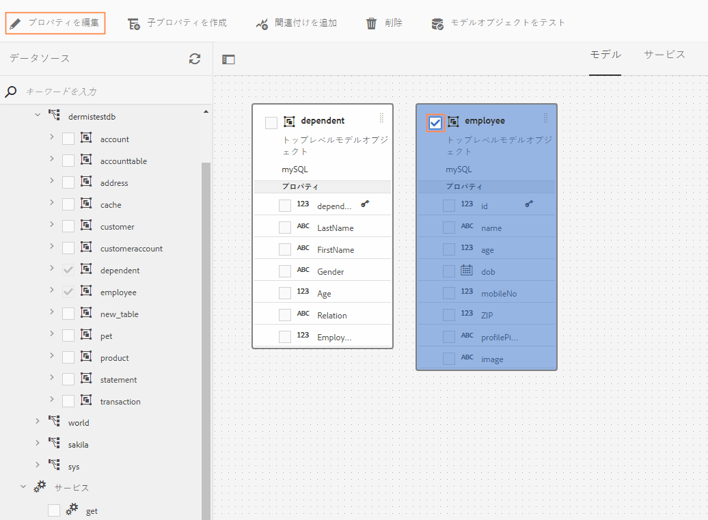
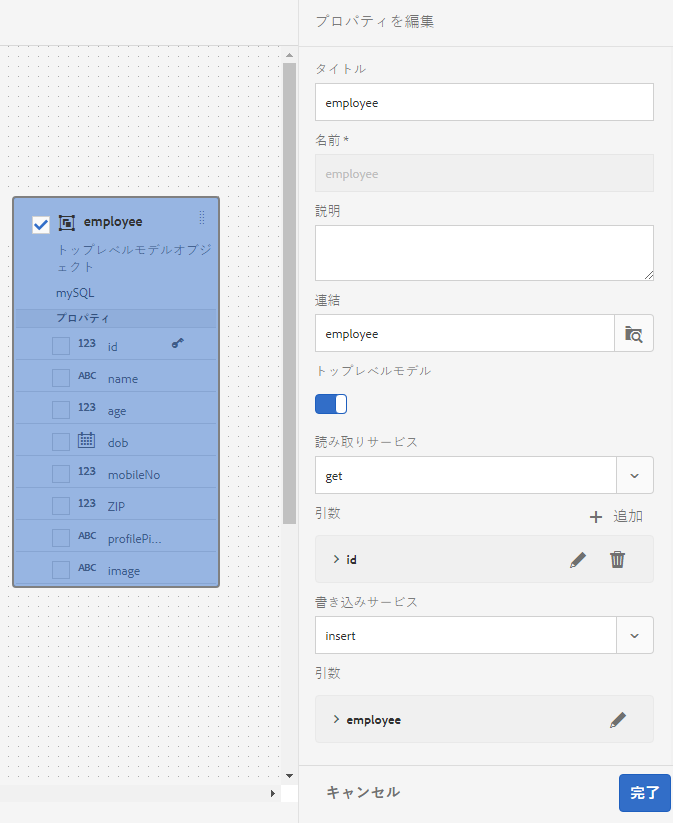
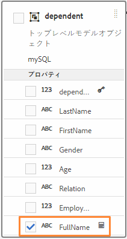
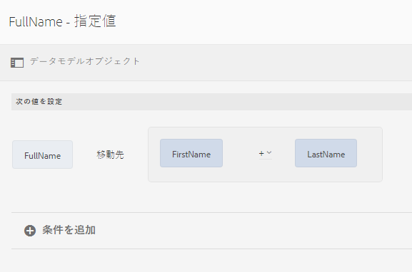

# フォームデータモデルの操作 {#work-with-form-data-model}

>[!CAUTION]
>
>AEM 6.4 の拡張サポートは終了し、このドキュメントは更新されなくなりました。 詳細は、 [技術サポート期間](https://helpx.adobe.com/jp/support/programs/eol-matrix.html). サポートされているバージョンを見つける [ここ](https://experienceleague.adobe.com/docs/?lang=ja).

データ統合機能は、フォームデータモデルを設定および操作するためのフォームデータモデルエディターを提供します。


フォームデータモデルエディターには、フォームデータモデルの編集と設定を行うための直感的なユーザーインターフェイスとツールが用意されています。フォームデータモデル内の関連データソースでこのエディターを使用して、データモデルオブジェクト、プロパティ、サービスの追加と設定を行うことができます。また、データソースを持っていないデータモデルオブジェクトとプロパティを作成し、後でそれらのオブジェクトとプロパティにデータソースを連結することもできます。また、データモデルオブジェクトプロパティのサンプルデータを生成および編集し、アダプティブフォームやインタラクティブ通信の事前入力に使用することもできます。 フォームデータモデルで設定されたデータモデルオブジェクトとサービスをテストして、データソースと適切に統合されていることを確認できます。

Forms のデータ統合機能を初めて使用する場合や、これまでにデータソースの設定やフォームデータモデルの作成を行ったことがない場合は、以下のトピックを参照してください。

* [AEM Forms のデータ統合](/help/forms/using/data-integration.md)
* [データソースの設定](/help/forms/using/configure-data-sources.md)
* [フォームデータモデルの作成](/help/forms/using/create-form-data-models.md)

フォームデータモデルエディターを使用して実行できる様々なタスクや設定について、詳しくはこちらをご覧ください。

>[!NOTE]
>
>フォームデータモデルの作成と操作を行うには、**fdm-author** グループと **forms-user** グループの両方のメンバーである必要があります。AEM管理者に連絡して、グループのメンバーになります。

## データモデルオブジェクトとサービスを追加 {#add-data-model-objects-and-services}

データソースを持つフォームデータモデルが既に作成されている場合は、フォームデータモデルエディターを使用して、データモデルオブジェクトとサービスの追加、各種プロパティの設定、データモデルオブジェクト間の関連付けの定義、フォームデータモデルとサービスのテストをおこなうことができます。

フォームデータモデル内の使用可能なデータソースから、データモデルオブジェクトとサービスを追加することができます。 追加したデータモデルオブジェクトは「モデル」タブに表示され、追加したサービスは「サービス」タブに表示されます。

データモデルオブジェクトとサービスを追加するには、以下の手順を実行します。

1. AEM オーサーインスタンスにログインして&#x200B;**[!UICONTROL フォーム／データ統合]**&#x200B;に移動し、データモデルオブジェクトを追加するフォームデータモデルを開きます。
1. データソースペインでデータソースを展開して、使用可能なデータモデルオブジェクトとサービスを表示します。
1. フォームデータモデルに追加するデータモデルオブジェクトとサービスを選択して、**[!UICONTROL 選択項目を追加]**&#x200B;をタップします。

   

   「モデル」タブには、フォームデータモデルに追加されたすべてのデータモデルオブジェクトのグラフィカル表現と、それらのオブジェクトのプロパティが表示されます。フォームデータモデル内の各データモデルオブジェクトは、ボックスを使用して表現されます。

   

   >[!NOTE]
   >
   >データモデルオブジェクトのボックスを選択してドラッグすると、コンテンツ領域内にデータモデルオブジェクトを配置できます。フォームデータモデルに追加されたデータモデルオブジェクトは、データソースペイン内ではすべてグレーアウトされます。

   「サービス」タブには、追加されたサービスが一覧表示されます。

   

   >[!NOTE]
   >
   >OData サービスのメタデータドキュメントには、データモデルオブジェクトとサービスのほかに、2 つのデータモデルオブジェクト間の関連付けを定義するナビゲーションプロパティが含まれます。詳しくは、 [OData サービスのナビゲーションプロパティの使用](#work-with-navigation-properties-of-odata-services).

1. タップ **[!UICONTROL 保存]** フォームモデルオブジェクトを保存します。

   >[!NOTE]
   >
   >アダプティブフォームのルールを使用して、フォームデータモデルの「サービス」タブで設定したサービスを呼び出すことができます。 設定済みのサービスは、ルールエディターの「サービスを呼び出す」アクションで使用できます。アダプティブフォームのルールでこれらのサービスを使用する方法について詳しくは、「サービスを呼び出す」および「ルールの値を設定する」を参照してください。 [ルールエディター](/help/forms/using/rule-editor.md).

## データモデルオブジェクトと子プロパティの作成 {#create-data-model-objects-and-child-properties}

### データモデルオブジェクトの作成 {#create-data-model-objects}

設定済みのデータソースからデータモデルオブジェクトを追加できますが、データソースのないデータモデルオブジェクトやエンティティを作成することもできます。 フォームデータモデルでデータソースを設定していない場合は特に便利です。

データソースを持たないデータモデルオブジェクトを作成するには、次の手順に従います。

1. AEMオーサーインスタンスにログインし、に移動します。 **[!UICONTROL Forms /データ統合]**&#x200B;をクリックし、データモデルオブジェクトまたはエンティティを作成するフォームデータモデルを開きます。
1. **[!UICONTROL エンティティを作成]**&#x200B;をタップします。
1. データモデルを作成ダイアログで、データモデルオブジェクトの名前を指定して&#x200B;**[!UICONTROL 追加]**&#x200B;をタップします。データモデルオブジェクトがフォームデータモデルに追加されます。新しく追加されたデータモデルオブジェクトは、データソースには連結されないことに注意してください。また、以下の図に示すように、プロパティも設定されません。

   

次に、連結されていないデータモデルオブジェクトに子プロパティを追加できます。

### 子プロパティを追加 {#child-properties}

フォームデータモデルエディターを使用すると、データモデルオブジェクト内に子プロパティを作成できます。 作成時のプロパティは、データソース内のどのプロパティにも連結されません。 後で、この子プロパティを、含むデータモデルオブジェクト内の別のプロパティにバインドできます。

子プロパティを作成するには、以下の手順を実行します。

1. フォームデータモデルでデータモデルオブジェクトを選択して「**[!UICONTROL 子プロパティを作成]**」をタップします。
1. 内 **[!UICONTROL 子プロパティを作成]** ダイアログで、 **[!UICONTROL 名前]** および **[!UICONTROL タイプ]** フィールドに設定されます。 オプションで、プロパティのタイトルと説明を指定できます。
1. プロパティが計算済みプロパティの場合は、「計算済み」を有効にします。 計算済みプロパティの値は、ルールまたは式に基づいて評価されます。 詳しくは、 [プロパティを編集](#edit-properties).
1. データモデルオブジェクトがデータソースに連結されている場合、追加された子プロパティは、同じ名前とデータ型を持つ親データモデルオブジェクトのプロパティに自動的に連結されます。

   子プロパティをデータモデルオブジェクトプロパティに手動で連結するには、 **[!UICONTROL バインド参照]** フィールドに入力します。 この **[!UICONTROL オブジェクトを選択]** ダイアログには、親データモデルオブジェクトのすべてのプロパティが一覧表示されます。 バインドするプロパティを選択し、チェックマークアイコンをタップします。 子プロパティと同じデータ型のプロパティのみを選択できます。

1. タップ **[!UICONTROL 完了]** 子プロパティを保存してをタップします。 **[!UICONTROL 保存]** フォームデータモデルを保存するには… これで、子プロパティがデータモデルオブジェクトに追加されました。

データモデルのオブジェクトとプロパティを作成した後は、フォームデータモデルに基づいてアダプティブフォームとインタラクティブ通信を引き続き作成することができます。 後で、データソースを使用して設定する場合、フォームデータモデルとデータソースを連結できます。 連結の設定は、関連するアダプティブフォームとインタラクティブ通信内で自動的に更新されます。フォームデータモデルを使用してアダプティブフォームとインタラクティブ通信を作成する方法については、[フォームデータモデルの使用](/help/forms/using/using-form-data-model.md)を参照してください。

### データモデルオブジェクトとプロパティの連結 {#bind-data-model-objects-and-properties}

フォームデータモデルに統合するデータソースが使用可能な状態になったら、[データソースの更新](/help/forms/using/create-form-data-models.md#update)に記載されている説明に従い、データソースをフォームデータモデルに追加することができます。次に、次の手順を実行して、非連結のデータモデルオブジェクトとプロパティをバインドします。

1. フォームデータモデルで、データソースに連結する連結されていないデータソースを選択します。
1. 「**[!UICONTROL プロパティを編集]**」をタップします。
1. 内 **[!UICONTROL プロパティを編集]** ウィンドウで、横の参照アイコンをタップします。 **[!UICONTROL 連結]** フィールドに入力します。 すると、 **[!UICONTROL オブジェクトを選択]** フォームデータモデルに追加されたデータソースを一覧表示するダイアログ。

   

1. データソースツリーを展開し、バインドするデータモデルオブジェクトを選択して、チェックマークアイコンをタップします。
1. タップ **[!UICONTROL 完了]** プロパティを保存し、 **[!UICONTROL 保存]** フォームデータモデルを保存します。 これで、データモデルオブジェクトがデータソースに連結されました。 これ以降は、データモデルオブジェクトに「連結されていない」というテキストが表示されることはありません。

   

## サービスの設定 {#configure-services}

データモデルオブジェクトのデータの読み取りと書き込みを行うには、以下の手順を実行して、読み取りサービスと書き込みサービスを設定します。

1. データモデルオブジェクト上部のチェックボックスを選択してをタップします。 **[!UICONTROL プロパティを編集]**.

   

   データモデルオブジェクトの読み取りサービスと書き込みサービスの設定を行う「プロパティを編集」

   プロパティ編集ダイアログが表示されます。

   

   プロパティを編集ダイアログ

   >[!NOTE]
   >
   >OData サービスのメタデータドキュメントには、データモデルオブジェクトとサービスのほかに、2 つのデータモデルオブジェクト間の関連付けを定義するナビゲーションプロパティが含まれます。OData サービスデータソースをフォームデータモデルに追加すると、フォームデータモデル内のすべてのナビゲーションプロパティに対して、フォームデータモデル内のサービスが使用可能になります。 このサービスを使用して、対応するデータモデルオブジェクトのナビゲーションプロパティを読み取ることができます。
   >
   >このサービスの使用について詳しくは、「[OData サービスのナビゲーションプロパティの操作](#work-with-navigation-properties-of-odata-services)」を参照してください。

1. 切り替え **[!UICONTROL 最上位オブジェクト]** をクリックして、データモデルオブジェクトが最上位のモデルオブジェクトかどうかを指定します。

   フォームデータモデルで設定されたデータモデルオブジェクトは、フォームデータモデルに基づくアダプティブフォームのコンテンツブラウザーの「データモデルオブジェクト」タブで使用できます。 2 つのデータモデルオブジェクト間の関連付けを追加すると、「データモデルオブジェクト」タブで、関連付け先のデータモデルオブジェクトが、関連付け元のデータモデルオブジェクトの下にネストされます。ネストされたデータモデルが最上位のオブジェクトの場合は、「データモデルオブジェクト」タブにも別々に表示されます。 そのため、入れ子になった階層の内側と外側の 2 つのエントリが表示され、フォームの作成者が混乱する可能性があります。 関連するデータモデルオブジェクトをネストされた階層内だけで表示するには、そのデータモデルオブジェクトの「トップレベルオブジェクト」プロパティを無効にします。

1. 選択したデータモデルオブジェクトの読み取りサービスと書き込みサービスを選択します。 サービスの引数が表示されます。

   

   従業員データソースに対して設定されている読み取りサービスと書き込みサービス

1. 読み取りサービスの引数に表示されている  をタップして、ユーザープロファイル属性、リクエスト属性またはリテラル値にその引数を連結し、連結値を指定します。これにより、指定したバインド属性またはリテラル値にサービスの引数がバインドされ、それが引数としてサービスに渡され、指定した値に関連付けられている詳細情報がデータソースから取得されます。

   この例では、 `id` 引数は `empid` ユーザープロファイルの属性を設定し、それを引数として読み取りサービスに渡します。 関連するプロパティの値を `employee` 指定したのデータモデルオブジェクト `empid`. この場合、00250を `empid` 読み取りサービスは、フォームの「 」フィールドで、従業員 id が00250の従業員の詳細を読み取ります。

   さらに、引数を必須またはオプションにすることができます。

   

   id 引数をAEMユーザープロファイルの empid 属性にバインドする

1. 「**[!UICONTROL 完了]**」をタップして引数を保存し、もう一度「**[!UICONTROL 完了]**」をタップしてプロパティを保存します。次に、「**[!UICONTROL 保存]**」をタップしてフォームデータモデルを保存します。

## 関連付けの追加 {#add-associations}

通常、データソース内のデータモデルオブジェクト間には関連付けが構築されています。 関連付けは、1 対 1 または 1 対多にすることができます。 例えば、1 人の従業員に複数の扶養家族を関連付けることができます。 これを、1 対多の関連付けといいます。関連するデータモデルオブジェクトを接続するライン上では、「`1:n`」として表示されます。それに対して、特定の従業員 ID で一意の従業員名が返される場合などは、1 対 1 の関連付けになります。

データソース内の関連データモデルオブジェクトをフォームデータモデルに追加した場合、それらの関連付けは維持され、矢印の線で接続された状態で表示されます。フォームデータモデル内の異なる複数のデータソース全体で、データモデルオブジェクト間に関連付けを作成できます。

>[!NOTE]
>
>JDBC データソースの事前定義済みの関連付けは、フォームデータモデルでは保持されません。 手動で作成する必要があります。

関連付けを追加するには：

1. データモデルオブジェクト上部のチェックボックスを選択してをタップします。 **[!UICONTROL 関連付けを追加]**. 関連付けを追加ダイアログが表示されます。

   

   >[!NOTE]
   >
   >OData サービスのメタデータドキュメントには、データモデルオブジェクトとサービスのほかに、2 つのデータモデルオブジェクト間の関連付けを定義するナビゲーションプロパティが含まれます。フォームデータモデルで関連付けを追加する際に、これらのナビゲーションプロパティを使用できます。 詳しくは、 [OData サービスのナビゲーションプロパティの使用](#work-with-navigation-properties-of-odata-services).

   関連付けを追加ダイアログが表示されます。

   

   関連付けを追加ダイアログ

1. 関連付けを追加ウィンドウで、以下の操作を実行します。

   * 関連付けのタイトルを指定します。
   * 関連付けのタイプ（「1 対 1」または「1 対多」）を選択します。
   * 関連付けるデータモデルオブジェクトを選択します。
   * 選択したモデルオブジェクトからデータを読み取る読み取りサービスを選択します。 読み取りサービスの引数が表示されます。 必要に応じて、引数を変更し、関連付けるデータモデルオブジェクトのプロパティにバインドするには、編集します。

   以下に示す例では、「扶養家族」データモデルオブジェクトの読み取りサービスのデフォルト引数が `dependentid` になっています。

   

   「扶養家族」読み取りサービスのデフォルト引数が dependentid になっている

   ただし、この引数は、関連付けるデータモデルオブジェクト間の共通プロパティ（この例の場合は `Employeeid`）でなければなりません。そのため、`Employeeid` 引数を「従業員」データモデルオブジェクトの `id` プロパティにバインドして、関連付けられている扶養家族の詳細情報を「扶養家族」データモデルオブジェクトから取得する必要があります。

   

   更新された引数と連結

   タップ **[!UICONTROL 完了]** をクリックして、引数を保存します。

1. タップ **[!UICONTROL 完了]** 関連付けを保存し、 **[!UICONTROL 保存]** フォームデータモデルを保存します。
1. 必要に応じて、さらに関連付けを作成するには、手順を繰り返します。

>[!NOTE]
>
>追加された関連付けは、指定されたタイトルと、関連するデータモデルオブジェクトを結ぶ線と共に、データモデルオブジェクトボックスに表示されます。
>
>関連付けを編集するには、その関連付けのチェックボックスを選択して「**[!UICONTROL 関連付けを編集]**」をタップします。


## プロパティの編集 {#properties}

フォームデータモデルに追加されたデータモデルオブジェクトのプロパティ、プロパティ、サービスを編集することができます。

プロパティを編集するには：

1. フォームデータモデル内のデータモデルオブジェクト、プロパティ、またはサービスの横にあるチェックボックスをオンにします。
1. 「**[!UICONTROL プロパティを編集]**」をタップします。この **[!UICONTROL プロパティを編集]** 選択したモデルオブジェクト、プロパティ、またはサービスのペインが開きます。

   * **データモデルオブジェクト**:読み取りサービスと書き込みサービスを指定し、引数を編集します。
   * **プロパティ**:プロパティのタイプ、サブタイプ、形式を指定します。 また、選択したプロパティがデータモデルオブジェクトのプライマリキーかどうかを指定することもできます。
   * **サービス**:サービスの入力モデルオブジェクト、出力タイプ、および引数を指定します。 Get サービスの場合は、配列を返すかどうかを指定できます。

   

   get サービスのプロパティを編集ダイアログ

1. タップ **[!UICONTROL 完了]** プロパティを保存してから **[!UICONTROL 保存]** フォームデータモデルを保存します。

### 計算済みプロパティの作成 {#computed}

計算済みプロパティは、ルールまたは式に基づいて値が計算されるプロパティです。 ルールを使用して、計算済みプロパティの値をリテラル文字列、数値、数式の結果、またはフォームデータモデル内の別のプロパティの値に設定できます。

例えば、計算済みプロパティを作成できます **FullName** その値は、既存の **名** および **姓** プロパティ。 そのためには、以下の手順を実行します。

1. `FullName` という名前の新しいプロパティを作成し、データタイプとして String を設定します。
1. 「**[!UICONTROL 計算済み]**」を有効にし、「**[!UICONTROL 完了]**」をタップしてプロパティを作成します。

   

   FullName 計算済みプロパティが作成されます。 計算済みプロパティを表すためのプロパティの横のアイコンに注意してください。

   

1. FullName プロパティを選択し、をタップします。 **[!UICONTROL ルールを編集]**. ルールエディターウィンドウが開きます。
1. ルールエディターウィンドウで、「 **[!UICONTROL 作成]**. A **[!UICONTROL 値を設定]** ルールウィンドウが開きます。

   オプション選択ドロップダウンで、「**[!UICONTROL 数式]**」を選択します。その他の使用可能なオプションは次のとおりです。 **[!UICONTROL フォームデータモデルオブジェクト]** および **[!UICONTROL 文字列]**.

1. 数式で、「 **[!UICONTROL 名]** および **[!UICONTROL 姓]** を、それぞれ第 1 および第 2 のオブジェクトに設定します。 演算子として「**[!UICONTROL プラス]**」を選択します。

   「**[!UICONTROL 完了]**」、「**[!UICONTROL 閉じる]**」の順に選択して、ルールエディターウィンドウを閉じます。ルールは以下のようになります。

   

1. フォームデータモデルで、 **[!UICONTROL 保存]**. 計算済みプロパティが設定されます。

## OData サービスのナビゲーションプロパティの使用 {#work-with-navigation-properties-of-odata-services}

OData サービスでは、ナビゲーションプロパティを使用して、2 つのデータモデルオブジェクト間の関連付けを定義します。 これらのプロパティは、エンティティタイプまたは複合型に対して定義されます。 例えば、サンプルの [TripPin](https://www.odata.org/blog/trippin-new-odata-v4-sample-service/) OData サービスのメタデータファイルから抽出した以下のコードの場合、Friends、BestFriend、Trips という 3 つのナビゲーションプロパティが Person エンティティに含まれています。

ナビゲーションプロパティについて詳しくは、「[OData のドキュメント](https://docs.oasis-open.org/odata/odata/v4.0/errata03/os/complete/part3-csdl/odata-v4.0-errata03-os-part3-csdl-complete.html#_Toc453752536)」を参照してください。

```xml
<edmx:Edmx xmlns:edmx="https://docs.oasis-open.org/odata/ns/edmx" Version="4.0">
<script/>
<edmx:DataServices>
<Schema xmlns="https://docs.oasis-open.org/odata/ns/edm" Namespace="Microsoft.OData.Service.Sample.TrippinInMemory.Models">
<EntityType Name="Person">
<Key>
<PropertyRef Name="UserName"/>
</Key>
<Property Name="UserName" Type="Edm.String" Nullable="false"/>
<Property Name="FirstName" Type="Edm.String" Nullable="false"/>
<Property Name="LastName" Type="Edm.String"/>
<Property Name="MiddleName" Type="Edm.String"/>
<Property Name="Gender" Type="Microsoft.OData.Service.Sample.TrippinInMemory.Models.PersonGender" Nullable="false"/>
<Property Name="Age" Type="Edm.Int64"/>
<Property Name="Emails" Type="Collection(Edm.String)"/>
<Property Name="AddressInfo" Type="Collection(Microsoft.OData.Service.Sample.TrippinInMemory.Models.Location)"/>
<Property Name="HomeAddress" Type="Microsoft.OData.Service.Sample.TrippinInMemory.Models.Location"/>
<Property Name="FavoriteFeature" Type="Microsoft.OData.Service.Sample.TrippinInMemory.Models.Feature" Nullable="false"/>
<Property Name="Features" Type="Collection(Microsoft.OData.Service.Sample.TrippinInMemory.Models.Feature)" Nullable="false"/>
<NavigationProperty Name="Friends" Type="Collection(Microsoft.OData.Service.Sample.TrippinInMemory.Models.Person)"/>
<NavigationProperty Name="BestFriend" Type="Microsoft.OData.Service.Sample.TrippinInMemory.Models.Person"/>
<NavigationProperty Name="Trips" Type="Collection(Microsoft.OData.Service.Sample.TrippinInMemory.Models.Trip)"/>
</EntityType>
```

フォームデータモデルで OData サービスを設定すると、エンティティコンテナ内のすべてのナビゲーションプロパティが、フォームデータモデル内のサービスを通じて使用できるようになります。 このサンプルの TripPin OData サービスでは、フォームデータモデル内の `GET LINK` サービスを使用して、`Person` エンティティコンテナに含まれている 3 つのナビゲーションプロパティを読み取ることができます。

以下の図では、フォームデータモデル内の `GET LINK of Person /People` サービスがハイライト表示されています。これは、TripPin OData サービスの `Person` エンティティに含まれている 3 つのナビゲーションプロパティを組み合わせたサービスです。


フォームデータモデルの「サービス」タブに `GET LINK` サービスを追加すると、サービス内で使用する出力モデルオブジェクトとナビゲーションプロパティを選択するための各種プロパティを編集できるようになります。例えば、以下の `GET LINK of Person /People` サービスでは、出力モデルオブジェクトとして「Trip」を使用し、ナビゲーションプロパティとして「Trips」を使用しています。


>[!NOTE]
>
>**NavigationPropertyName** 引数の「**[!UICONTROL デフォルト値]**」フィールドで指定できる値は、「**[!UICONTROL 配列を返しますか？]**」トグルボタンの状態によって異なります。有効にすると、コレクションタイプのナビゲーションプロパティが表示されます。

この例では、出力モデルオブジェクトとして「Person」を選択し、ナビゲーションプロパティの引数として「Friends」または「BestFriend」を選択することもできます（どちらを選択するかは、「**[!UICONTROL 配列を返しますか？]**」ボタンが有効になっているか無効になっているかによって異なります）。


同様に、フォームデータモデルで関連付けを追加する際に `GET LINK` サービスを選択し、サービスのナビゲーションプロパティを設定できます。ただし、ナビゲーションプロパティを選択するには、**[!UICONTROL 連結先]**&#x200B;ドロップダウンメニューで「**[!UICONTROL リテラル]**」に設定されている必要があります。


## サンプルデータの生成と編集 {#sample}

フォームデータモデルエディターを使用すると、フォームデータモデル内の計算済みプロパティを含む、すべてのデータモデルオブジェクトプロパティのサンプルデータを生成できます。 これは、各プロパティに設定されたデータタイプに準拠するランダムな値のセットです。 また、データを編集および保存することもできます。これは、サンプルデータを再生成しても保持されます。

サンプルデータを生成および編集するには、以下の手順を実行します。

1. フォームデータモデルを開き、 **[!UICONTROL サンプルデータを編集]**. サンプルデータが生成され、サンプルデータ編集ウィンドウに表示されます。

   

1. 「**[!UICONTROL サンプルデータを編集]**」ウィンドウでデータを編集して「**[!UICONTROL 保存]**」をタップします。

次に、サンプルデータを使用して、フォームデータモデルに基づいて、インタラクティブ通信の事前入力とテストをおこなうことができます。 詳しくは、[フォームデータモデルの使用](/help/forms/using/using-form-data-model.md)を参照してください。

## データモデルオブジェクトとサービスのテスト {#test-data-model-objects-and-services}

フォームデータモデルが設定されているが、使用する前に、設定済みのデータモデルオブジェクトおよびサービスが期待どおりに動作しているかどうかをテストする必要がある場合があります。 データモデルオブジェクトとサービスをテストするには、以下の手順を実行します。

1. フォームデータモデル内のデータモデルオブジェクトまたはサービスを選択してをタップします。 **[!UICONTROL モデルオブジェクトのテスト]** または **[!UICONTROL テストサービス]**、それぞれ。

   フォームデータモデルをテストウィンドウが表示されます。

   

1. フォームデータモデルをテストウィンドウの入力ペインで、テストするデータモデルオブジェクトまたはサービスを選択します。

1. テストコードで引数の値を指定し、をタップします。 **[!UICONTROL テスト]**. テストが成功すると、出力が出力ペインに返されます。

   

同様の方法で、フォームデータモデル内の他のデータモデルオブジェクトやサービスをテストできます。

## 次の手順 {#next-steps}

これで、アダプティブフォームとインタラクティブ通信のワークフローで使用する準備が整い、作業用フォームデータモデルが作成されました。 詳しくは、[フォームデータモデルの使用](/help/forms/using/using-form-data-model.md)を参照してください。
