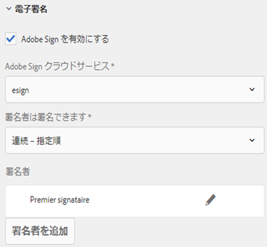
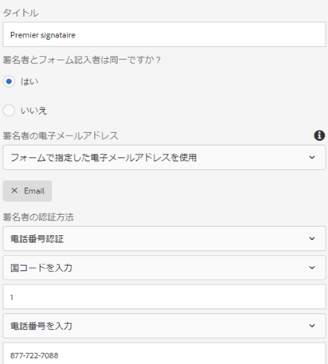
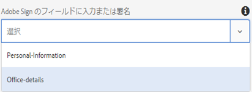
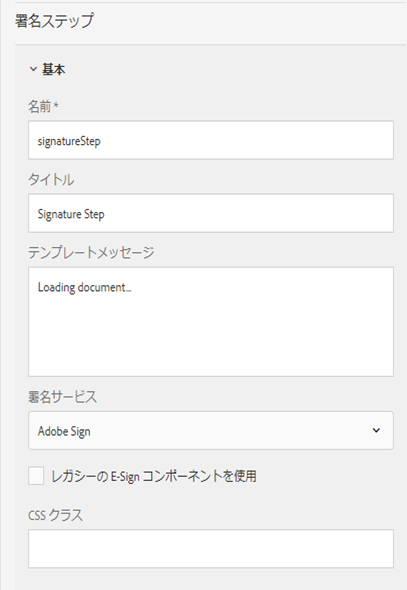

# アダプティブフォームでのAcrobat Signの使用 {#using-adobe-sign-in-an-adaptive-form}

>[!CAUTION]
>
>AEM 6.4 の拡張サポートは終了し、このドキュメントは更新されなくなりました。 詳細は、 [技術サポート期間](https://helpx.adobe.com/jp/support/programs/eol-matrix.html). サポートされているバージョンを見つける [ここ](https://experienceleague.adobe.com/docs/?lang=ja).

アダプティブフォームの電子署名 (Acrobat Sign) ワークフローを有効にして、署名ワークフローを自動化し、単一および複数の署名プロセスを簡素化し、モバイルデバイスからフォームに電子署名を行います。

Acrobat Sign により、アダプティブフォームの電子サインワークフローを有効にできます。電子署名を利用すると、法務、販売、給与、人事管理など分野でドキュメントを処理するワークフローを改善できます。

一般的なAcrobat Signおよびアダプティブフォームのシナリオでは、ユーザーはアダプティブフォームに入力してサービスを申し込みます。 例えば、住宅ローンやクレジットカードの申請では、すべての借り手や共同申請者から、法的に有効な署名を取得する必要があります。同様のシナリオで電子署名ワークフローを有効にするには、Acrobat SignとAEM Formsを統合します。 その他の例として、 Acrobat Signを使用して次のことができます。

* 完全に自動化された提案、見積り、契約プロセスを持つ任意のデバイスから契約を締結します。
* 人事プロセスを迅速に完了し、従業員にデジタル体験を提供します。
* 契約サイクル時間を短縮し、ベンダーのオンボーディングを迅速に実行できます。
* 共通するプロセスを自動化するためのデジタルワークフローを作成する。

Acrobat SignとAEM Formsの統合では、次のことがサポートされます。

* 単一ユーザーと複数ユーザーの署名ワークフローを処理する機能
* 複数の署名ワークフローを並列的に順次処理する機能
* フォーム内およびフォーム外の署名エクスペリエンス
* 匿名ユーザーまたはログインユーザーとしてフォームを署名する機能
* 動的な署名プロセス (AEM Formsワークフローとの統合 )
* ナレッジベース、電話、ソーシャルプロファイルによる認証機能

詳しくは、 [アダプティブフォームでのAcrobat Signの使用に関するベストプラクティス](https://medium.com/adobetech/using-adobe-sign-to-e-sign-an-adaptive-form-heres-the-best-way-to-do-it-dc3e15f9b684) より優れた署名エクスペリエンスを作成するため。

## 前提条件 {#prerequisites}

アダプティブフォームでAcrobat Signを使用する前に、以下の手順を実行します。

* AEM Forms Cloud Service がAcrobat Signを使用するように設定されていることを確認します。 詳しくは、 [Acrobat SignとAEM Formsの統合](/help/forms/using/adobe-sign-integration-adaptive-forms.md).
* 署名者のリストが準備されていること。すべての署名者の電子メールアドレスが少なくとも必要です。

## アダプティブフォーム用のAcrobat Signの設定 {#configure-adobe-sign-for-an-adaptive-form}

アダプティブフォーム用にAcrobat Signを設定するには、以下の手順を実行します。

1. [Acrobat Signのアダプティブフォームプロパティの編集](#enableadobesign)
1. [Acrobat Signフィールドをアダプティブフォームに追加する](#addadobesignfieldstoanadaptiveform)
1. [アダプティブフォームのAcrobat Signの有効化](#enableadobsignforanadaptiveform)
1. [アダプティブフォームのAcrobat SignCloud Serviceを選択](#selectadobesigncloudserviceforanadaptiveform)

1. [Acrobat Sign署名者をアダプティブフォームに追加する](#addsignerstoanadaptiveform)
1. [アダプティブフォームに対して送信アクションを選択する](#selectsubmitactionforanadaptiveform)

### Acrobat Signのアダプティブフォームプロパティの編集 {#enableadobesign}

既存のアダプティブフォームまたは新しいアダプティブフォームに対して、Acrobat Signのアダプティブフォームプロパティを設定します。

[Acrobat Sign用アダプティブフォームの作成](/help/forms/using/working-with-adobe-sign.md#create-an-adaptive-form-for-adobe-sign) 基本的なアダプティブフォームを作成する手順を説明します。 詳しくは、 [アダプティブフォームの作成](/help/forms/using/creating-adaptive-form.md) アダプティブフォームの作成時に使用できるその他のオプションについては、を参照してください。

#### Acrobat Sign用アダプティブフォームの作成 {#create-an-adaptive-form-for-adobe-sign}

Acrobat Sign用のアダプティブフォームを作成するには、以下の手順を実行します。

1. **[!UICONTROL Adobe Experience Manager]**／**[!UICONTROL Forms]**／**[!UICONTROL フォームとドキュメント]**&#x200B;に移動します。
1. 「**[!UICONTROL 作成]**」をタップして、「**[!UICONTROL アダプティブフォーム]**」を選択します。テンプレートのリストが表示されます。テンプレートを選択して、「**[!UICONTROL 次へ]**」をタップします。
1. 「**[!UICONTROL 基本]**」タブで次の操作を行います。

   1. アダプティブフォームの&#x200B;**名前**&#x200B;と&#x200B;**タイトル**&#x200B;を指定します。
   1. を選択します。 [設定コンテナ](/help/forms/using/adobe-sign-integration-adaptive-forms.md#configure-adobe-sign-with-aem-forms) AEM Formsと連携するAcrobat Signの設定時に作成されました。

      >[!NOTE]
      >
      >この **[!UICONTROL Acrobat SignCloud Service]** ドロップダウンリストには、このフィールドで選択した設定コンテナで設定されたクラウドサービスが表示されます。 この **[!UICONTROL Acrobat SignCloud Service]** ドロップダウンリストは **[!UICONTROL 電子署名]** 」セクションを使用して、 **[!UICONTROL Acrobat Signを有効にする]** オプション。

1. 「**[!UICONTROL フォームモデル]**」タブで、次のいずれかのオプションを選択します。

   * 「**[!UICONTROL フォームテンプレートをレコードのドキュメントテンプレートとして関連付ける]**」オプションを選択し、「レコードのドキュメント」テンプレートを選択します。フォームテンプレートベースのアダプティブフォームを使用する場合、署名用として送信されたドキュメントには、関連するフォームテンプレートに基づくフィールドだけが表示されます。表示されないアダプティブフォームのフィールドもあります。
   * 「**[!UICONTROL レコードのドキュメントを生成]**」オプションを選択します。「レコードのドキュメント」オプションが有効なアダプティブフォームを使用すると、署名用に送信されたドキュメントにアダプティブフォームのすべてのフィールドが表示されます。

1. 「**[!UICONTROL 作成」をタップします。]** 署名が有効なアダプティブフォームが作成され、Acrobat Signフィールドを追加する際に使用できます。

#### Acrobat Sign用アダプティブフォームの編集 {#editafsign}

既存のアダプティブフォームでAcrobat Signを使用するには、以下の手順を実行します。

1. **[!UICONTROL Adobe Experience Manager]**／**[!UICONTROL Forms]**／**[!UICONTROL フォームとドキュメント]**&#x200B;に移動します。
1. アダプティブフォームを選択し、**[!UICONTROL プロパティ]**&#x200B;をタップします。
1. 内 **[!UICONTROL 基本]** タブで、 [設定コンテナ](/help/forms/using/adobe-sign-integration-adaptive-forms.md#configure-adobe-sign-with-aem-forms) AEM Formsと連携するAcrobat Signの設定時に作成されました。
1. 「**[!UICONTROL フォームモデル]**」タブで、次のいずれかのオプションを選択します。

   * 「**[!UICONTROL フォームテンプレートをレコードのドキュメントテンプレートとして関連付ける]**」オプションを選択し、「レコードのドキュメント」テンプレートを選択します。フォームテンプレートベースのアダプティブフォームを使用する場合、署名用として送信されたドキュメントには、関連するフォームテンプレートに基づくフィールドだけが表示されます。表示されないアダプティブフォームのフィールドもあります。
   * 「**[!UICONTROL レコードのドキュメントを生成]**」オプションを選択します。「レコードのドキュメント」オプションが有効なアダプティブフォームを使用すると、署名用に送信されたドキュメントにアダプティブフォームのすべてのフィールドが表示されます。

1. 「**[!UICONTROL 保存して閉じる]**」をタップします。アダプティブフォームがAcrobat Signに対して有効になっている。

### Acrobat Signフィールドをアダプティブフォームに追加する {#addadobesignfieldstoanadaptiveform}

Acrobat Signは、アダプティブフォームに配置できる様々なフィールドを備えています。 これらのフィールドには、署名、イニシャル、会社名、タイトルなど、様々なタイプのデータを入力することができます。このため、署名が行われる際に署名だけでなく追加情報を収集できます。Acrobat Signブロックコンポーネントを使用すると、Acrobat Signフィールドをアダプティブフォーム内の様々な場所に配置できます。

アダプティブフォームにフィールドを追加し、これらのフィールドに関連する様々なオプションをカスタマイズするには、次の手順を実行します。

1. ドラッグ&amp;ドロップ **Acrobat Sign Block** コンポーネントを、コンポーネントブラウザーからアダプティブフォームに切り替えます。 Acrobat Signブロックコンポーネントには、サポートされるすべてのAcrobat Signフィールドが含まれています。 デフォルトでは、**署名**&#x200B;フィールドがアダプティブフォームに追加されます。

   

   デフォルトでは、Acrobat Signブロックは公開済みのアダプティブフォームには表示されません。 Adobe Sign ブロックが表示されるのは、署名ドキュメントだけです。Acrobat Signブロックの表示は、Acrobat Signブロックコンポーネントのプロパティから変更できます。

   >[!NOTE]
   >
   >* Acrobat Signブロックの使用は、アダプティブフォームでAcrobat Signを使用する場合に必須ではありません。 Acrobat Signブロックを使用せずに署名者用のフィールドを追加した場合は、署名ドキュメントの下部にデフォルトの署名フィールドが表示されます。
   >* Acrobat Signブロックは、レコードのドキュメントを自動的に生成するアダプティブフォームに対してのみ使用してください。 レコードのドキュメントまたはフォームテンプレートベースのアダプティブフォームの生成にカスタム XDP を使用している場合、Acrobat Signブロックは不要です。

1. を選択します。 **Acrobat Sign Block** コンポーネントをタップし、 **編集**  アイコン フィールドを追加するためのオプションと、フィールドの外観を設定するためのオプションが表示されます。

   

   **A.** Acrobat Signフィールドを選択して追加します。 **B.** Acrobat Signブロックを全画面表示に展開します。

1. 次をタップします。 **Acrobat Sign Field**  アイコン Acrobat Signフィールドを選択および追加するオプションが表示されます。

   を展開します。 **タイプ** ドロップダウンフィールドでAcrobat Signフィールドを選択し、「完了」をタップします。  アイコンをクリックして、選択したフィールドをAcrobat Signブロックに追加します。 「**タイプ**」ドロップダウンフィールドには、「署名」タイプ、「署名者の情報」タイプ、「データフィールド」タイプが表示されます。Acrobat SignとAEM Formsの統合は、タイプドロップダウンボックスに表示される唯一のサポートフィールドです。 Acrobat Signフィールドについて詳しくは、 [Acrobat Signドキュメント](https://helpx.adobe.com/jp/sign/using/field-types.html).

   

   フィールドには、必ず一意の名前を指定する必要があります。フィールドを必須フィールドとしてマークするための必須オプションを選択することもできます。また、 **名前** および **必須** オプションを選択すると、一部のAcrobat Signフィールドには、さらに多くのオプションがあります。 例えば、マスクや複数行のオプションなどです。また、各Acrobat Signフィールドには、同じAcrobat Signブロック内に存在するか異なるブロック内に存在するかに関わらず、一意の名前を指定します。

### アダプティブフォームのAcrobat Signの有効化 {#enableadobsignforanadaptiveform}

デフォルトでは、Acrobat Signはアダプティブフォームに対して有効になっていません。 Adobe Sign を有効にするには、以下の手順を実行します。

1. コンテンツブラウザーで「**フォームコンテナ**」をタップし、**設定**&#x200B;アイコン（）をタップします。この操作により、アダプティブフォームのコンテナプロパティを表示するプロパティブラウザーが開きます。
1. プロパティブラウザーで、を展開します。 **電子署名** アコーディオンで、 **Acrobat Signを有効にする** オプション。 これにより、アダプティブフォームでAcrobat Signが有効になります。

### Acrobat SignCloud Serviceと署名順序を選択 {#selectadobesigncloudserviceforanadaptiveform}

AEM Formsの 1 つのインスタンスに対して複数のAcrobat Signサービスを設定できます。 各機能（人事、財務など）に対して個別のサービスセットを持つことをお勧めします。 これにより、署名済みドキュメントの追跡とレポート作成が容易になります。 例えば、1 つの銀行に複数の部門があるとします。 これらの部署ごとに個別の設定を指定することで、ドキュメントを正しくトラッキングできるようになります。

また、1 つのドキュメントに対して複数の署名者を設定できます。例えば、クレジットカード申し込みには複数の申し込み者が含まれる場合があります。 銀行は、これらの申し込みの処理を開始する前に、すべての申請者の署名を取得する必要があります。複数署名者のシナリオの場合、ドキュメントに連続または同時の順序で署名することを選択できます。

クラウドサービスと署名の順序を選択するには、次の手順を実行します。

1. コンテンツブラウザーで「**フォームコンテナ**」をタップし、**設定**&#x200B;アイコン（）をタップします。この操作により、アダプティブフォームのコンテナプロパティを表示するプロパティブラウザーが開きます。
1. プロパティブラウザーで、を展開します。 **電子署名** アコーディオンで、 **Acrobat Signを有効にする** オプション。 これにより、アダプティブフォームでAcrobat Signが有効になります。
1. 既に設定済みのAcrobat SignCloud Servicesのリストからクラウドサービスを選択します。

   この **Acrobat SignCloud Service** リストが空です。 [AEM FormsとのAcrobat Signの設定](/help/forms/using/adobe-sign-integration-adaptive-forms.md) サービスを設定する記事です。

   ドロップダウンには、 `global` ツール/のフォルダー **[!UICONTROL Cloud Services]** > **[!UICONTROL Acrobat Sign]**. また、このドロップダウンには、アダプティブフォームの作成時に「**[!UICONTROL 設定コンテナ]**」フィールドで選択したフォルダーに存在するクラウドサービスも表示されます。

1. 「**署名者は署名できます**」ダイアログボックスで、署名順序を選択します。Acrobat Signの歌手はアダプティブフォームに署名できます **連続**  — 別の署名者の後に続く、または **同時**  — 順不同。

   順番に、1 人の署名者が、署名用のフォームを一度に 1 人ずつ受け取ります。 署名者がドキュメントへの署名を完了すると、フォームは次の署名者に送信されます。

   複数の署名者が同時に 1 つのフォームに署名することができます。

1. [アダプティブフォームに署名者を追加する](#addsignerstoanadaptiveform) 「完了」アイコンをタップして、変更を保存します。

### アダプティブフォームに署名者を追加する {#addsignerstoanadaptiveform}

1 つのアダプティブフォームに対して、1 人の署名者または複数の署名者のみを設定できます。 署名者を追加する際に、署名者の認証の詳細を設定することもできます。 また、フォームの入力者と歌手が同じ人物かどうかを選択することもできます。 署名者に関する様々な詳細を追加して提供するには、次の手順を実行します。

1. コンテンツブラウザーで「**フォームコンテナ**」をタップし、**設定**  アイコンをタップします。この操作により、アダプティブフォームのコンテナプロパティを表示するプロパティブラウザーが開きます。
1. プロパティブラウザーで、を展開します。 **電子署名** アコーディオンで、 **Acrobat Signを有効にする** オプション。 これにより、アダプティブフォームでAcrobat Signが有効になります。
1. 「**署名者設定」で「**&#x200B;署名者を追加&#x200B;**」をタップします。**&#x200B;アダプティブフォームに署名者が追加されます。1 つのアダプティブフォームに複数のAcrobat Sign署名者を追加することができます。
1. 

   「**編集** 」アイコンをクリックして、署名者に関する以下の情報を指定します。

   * **タイトル：** 署名者を一意に識別するタイトルを指定します。
   * **署名者とフォームの入力者は同じですか？:** 選択 **はい**&#x200B;フォームの入力者と最初の署名者が同じ人物の場合は、 このオプションを「**いいえ**」に設定した場合は、アダプティブフォームの署名ステップコンポーネントは使用しないでください。フォームに署名ステップコンポーネントが含まれている場合、このフィールドは自動的に「はい」に設定されます。
   * **署名者の電子メールアドレス：** 署名者の電子メールアドレスを指定します。 署名者は、ここで指定したメールアドレスで、署名する必要があるドキュメントやフォームを受信します。フォームフィールドに指定した電子メールアドレス、ログインしているユーザーのAEMユーザープロファイル、または電子メールアドレスを手動で入力するように選択できます。 このステップは、必ず実行する必要があります。また、署名者を 1 人だけ設定した場合は、署名者の電子メールアドレスが、AEM クラウドサービスの設定に使用するAcrobat Signアカウントと同一でないことを確認してください。
   * **署名者の認証方法：** 署名用のフォームを開く前に、ユーザーを認証するメソッドを指定します。 電話、ナレッジベース、ソーシャル ID ベースの認証のいずれかを選択できます。

   >[!NOTE]
   >
   >* ソーシャル ID に基づく認証の場合、Facebook、Google、LinkedIn を使用した認証オプションがデフォルトで用意されています。Acrobat Signサポートに連絡して、他のソーシャル認証プロバイダーを有効にすることができます。

   * **入力または署名するAcrobat Signフィールド：** 署名者用のAcrobat Signフィールドを選択します。 アダプティブフォームには複数のAcrobat Signフィールドを含めることができます。 署名者用に特定のフィールドを有効にできます。「 」フィールドに、使用可能なすべてのAcrobat Signブロックが表示されます。 いずれかのブロックを選択すると、そのブロックのすべてのフィールドが選択されます。フィールドの選択を解除するには、「X」アイコンを使用します。

   

   上記の画像には、2 つのAcrobat Signブロックの例が含まれています。個人情報とオフィスの詳細

   「完了 」アイコンをタップします。署名者が追加され、設定が完了します。

### アダプティブフォームに対して送信アクションを選択する {#selectsubmitactionforanadaptiveform}

次に、Acrobat Signフィールドをアダプティブフォームに追加し、フォームコンテナからAcrobat Signを有効にして、「Acrobat SignCloud Service」を選択し、Acrobat Sign署名者を追加して、アダプティブフォームに適した送信アクションを選択します。 アダプティブフォームの送信アクションについて詳しくは、[送信アクションの設定](/help/forms/using/configuring-submit-actions.md)を参照してください。

また、Acrobat Sign対応のアダプティブフォームは、すべての署名者がフォームに署名した後でのみ送信されます。 一部の署名者しか署名していないフォームは、フォームポータルの「保留中の署名」セクションで表示されます。Acrobat Sign Configuration Service は、次の場所でAcrobat Signサーバーのポーリングを続けます： [一定の間隔](/help/forms/using/adobe-sign-integration-adaptive-forms.md) 署名のステータスを検証する場合。 すべての署名者がフォームの署名を完了すると、送信アクションサービスが起動してフォームが送信されます。カスタムの送信アクションを使用していて、フォームでAcrobat Signを使用している場合は、送信アクションサービスを使用するようにカスタムの送信アクションを更新します。

>[!NOTE]
>
>アダプティブフォームのデータは、Forms Portal に一時的に保存されます。 次を使用することをお勧めします。 [Forms Portal のカスタムストレージ](/help/forms/using/configuring-draft-submission-storage.md). これにより、PII（個人を特定できる情報）データがAEMサーバーに保存されなくなります。

フォームの署名操作の準備が整いました。 フォームをプレビューして、署名操作を確認できます。 発行されたフォームでは、署名者が電子メールで署名用のフォームを受け取ると、Acrobat Signブロックフィールドが表示されます。 このエクスペリエンスは、フォーム外の署名エクスペリエンスとも呼ばれます。 最初の署名者に対するフォーム内の署名機能を設定することもできます。詳しい手順については、以下を参照してください。 [フォーム内署名機能の作成](/help/forms/using/working-with-adobe-sign.md#create-in-form-signing-experience).

## アダプティブフォームのクラウド署名の設定 {#configure-cloud-signatures-for-an-adaptive-form}

クラウドベースのデジタル署名（リモート署名）は、デスクトップ、モバイル、web 上で機能する新世代のデジタル署名で、署名者の認証に関する最高レベルのコンプライアンスと保証を満たします。クラウドベースのデジタル署名を使用してアダプティブフォームに署名できます。

後 [Acrobat Signのアダプティブフォームプロパティの編集](#enableadobesign)アダプティブフォームにクラウド署名フィールドを追加するには、以下の手順を実行します。

1. ドラッグ&amp;ドロップ **Acrobat Sign Block** コンポーネントを、コンポーネントブラウザーからアダプティブフォームに切り替えます。 Acrobat Signブロックコンポーネントには、サポートされるすべてのAcrobat Signフィールドが含まれています。 デフォルトでは、**署名**&#x200B;フィールドがアダプティブフォームに追加されます。

   

1. を選択します。 **Acrobat Sign Block** コンポーネントをタップし、 **編集**  アイコン フィールドを追加するためのオプションと、フィールドの外観を設定するためのオプションが表示されます。

   

   **A.** Acrobat Signフィールドを選択して追加します。 **B.** Acrobat Signブロックを全画面表示に展開します。

1. 次をタップします。 **Acrobat Sign Field**  アイコン Acrobat Signフィールドを選択および追加するオプションが表示されます。

   を展開します。 **タイプ** 選択するドロップダウンフィールド **電子署名** 「完了」をタップします。  アイコンをクリックして、選択したフィールドをAcrobat Signブロックに追加します。

   

   フィールドには、必ず一意の名前を指定する必要があります。

   次を使用して、アダプティブフォームにデジタル署名を適用します。

   * クラウド署名：トラストサービスプロバイダーがホストする[デジタル ID](https://helpx.adobe.com/jp/sign/kb/digital-certificate-providers.html) を使用して署名します。
   * Adobe Acrobat または Reader：ドキュメントをダウンロードして Adobe Acrobat または Reader で開き、スマートカード、USB トークン、ファイルベースのデジタル ID を使用して署名します。

   クラウド署名フィールドをアダプティブフォームに追加した後、次の手順を実行して設定プロセスを完了します。

   * [アダプティブフォームのAcrobat Signの有効化](#enableadobsignforanadaptiveform)
   * [アダプティブフォームのAcrobat SignCloud Serviceを選択](#selectadobesigncloudserviceforanadaptiveform)
   * [Acrobat Sign署名者をアダプティブフォームに追加する](#addsignerstoanadaptiveform)
   * [アダプティブフォームに対して送信アクションを選択する](#selectsubmitactionforanadaptiveform)

## フォーム内署名機能の作成 {#create-in-form-signing-experience}

また、アダプティブフォームの入力中に署名することもできます。 このエクスペリエンスは、フォーム内署名エクスペリエンスとも呼ばれます。 フォーム内署名機能は、複数の署名者環境で最初の署名者に対してのみ使用できます。 アダプティブフォームのフォーム内署名機能を作成するには、以下の手順を実行します。

1. [署名ステップコンポーネントの追加と設定](#add-and-configure-the-signature-step-component).
1. [概要ステップコンポーネントの追加](#configure-the-thank-you-page-or-summary-step-component).

### 署名ステップコンポーネントの追加と設定 {#add-and-configure-the-signature-step-component}

署名ステップコンポーネントを使用して、入力済みフォームに電子署名を行う領域を指定します。 署名ステップコンポーネントを含むセクションがレンダリングされると、入力済みフォームの署名可能なPDFバージョンが表示されます。 署名ステップコンポーネントは、フォームで使用できる全幅を取ります。 署名ステップコンポーネントを含むセクションには、他のコンポーネントを含めないことをお勧めします。

署名ステップコンポーネントを設定するには、次の手順を実行します。

1. 次をドラッグ&amp;ドロップ： **署名ステップ** コンポーネントをコンポーネントブラウザーからフォームに移動します。
1. 新しく追加された署名ステップコンポーネントを選択し、「**設定** 」アイコンをタップします。これにより、プロパティブラウザーが開き、署名ステップのプロパティが表示されます。 以下のプロパティを設定します。

   * **エレメント名**:コンポーネントの名前を指定します。
   * **タイトル：** コンポーネントの一意のタイトルを指定します。
   * **テンプレートメッセージ：** 署名メッセージの読み込み中に表示するPDFを指定します。 Acrobat Signサービスでは、署名PDFの準備と読み込みに時間がかかります。
   * **署名サービス：** を選択します。 **Acrobat Sign** オプション。
   * **従来の E 署名コンポーネントを使用**:それぞれのアダプティブフォームを [AEM Forms Workspace](/help/forms/using/introduction-html-workspace.md)、AEM Formsアプリ、または基になるアダプティブフォームにレガシー e-sign コンポーネントが付いている場合は、 **従来の E 署名コンポーネントを使用** オプション。
   * **設定**:設定を選択します (Acrobat SignCloud Service)。 このドロップダウンボックスを使用できるのは、「**レガシーの E-Sign コンポーネントを使用**」オプションが有効になっている場合だけです。

   完了（）アイコンをタップして、変更を保存します。

   

   >[!NOTE]
   >
   >* **[!UICONTROL 署名者ステップ]**&#x200B;コンポーネントをフォームにドラッグアンドドロップすると、「**[!UICONTROL 署名者とフォーム記入者は同一ですか？]**」オプションが自動的に「**はい**」に設定されます。フォームを正しく機能させるには、このオプションが設定されている必要があります。
   >* Acrobat Sign対応のアダプティブフォームでは、署名ステップコンポーネントを使用したセクションまたはパネルの「送信」ボタンの使用はサポートされていません。 手動送信の署名ステップの後、または [Acrobat Sign Configuration Service](/help/forms/using/adobe-sign-integration-adaptive-forms.md#configure-adobe-sign-scheduler-to-sync-the-signing-status).

### 「ありがとうございます」ページまたは概要ステップコンポーネントの設定  {#configure-the-thank-you-page-or-summary-step-component}

**概要ステップ**&#x200B;コンポーネントにより、フォームが自動的に送信され、カスタマイズ後の概要ページに情報が取り込まれ、送信されたフォームの概要情報が表示されます。また、リターンマップ内の必要な情報も取得します。 概要ステップコンポーネントは、フォームの幅いっぱいに表示されます。そのため、概要ステップコンポーネントが含まれているセクションに他のコンポーネントを配置しないようにすることをお勧めします。

これで、フォーム内署名機能の準備が整いました。 フォームをプレビューして、署名操作を確認できます。

## よくある質問  {#frequently-asked-questions}

**Q：特定のアダプティブフォームを別のアダプティブフォームに埋め込むことができますが、埋め込まれたアダプティブフォームでAcrobat Signを有効にできますか？**

**回答：** いいえ。AEM Formsは、Acrobat Sign対応のアダプティブフォームを埋め込んだアダプティブフォームの署名に使用することはできません。

**Q:高度なテンプレートを使用してアダプティブフォームを作成し、編集用に開くと、「電子署名または署名者が正しく設定されていません」というエラーメッセージが表示されます。 表示されます。エラーメッセージを解決する方法は？**

**回答：** 高度なテンプレートを使用して作成されたアダプティブフォームは、Acrobat Signを使用するように設定されます。 このエラーを解決するには、Acrobat Signクラウド設定を作成して選択し、アダプティブフォームのAcrobat Sign署名者を設定します。

**Q:アダプティブフォームの静的テキストコンポーネントでAcrobat Signのテキストタグを使用することはできますか？**

**回答：** はい、テキストコンポーネントでテキストタグを使用して、Acrobat Signフィールドを [レコードのドキュメント](/help/forms/using/generate-document-of-record-for-non-xfa-based-adaptive-forms.md) （「レコードのドキュメントの自動生成」オプションのみ）アダプティブフォームが有効になっています。 テキストタグを作成する手順とルールについては、 [Acrobat Sign Documentation](https://experienceleague.adobe.com/docs/document-cloud-learn/sign-learning-hub/admin-set-up/advanced-tasks-admins/adobe-sign-text-tagging.html). また、アダプティブフォームでは、テキストタグのサポートが制限されています。 テキストタグを使用して、Acrobat Sign Block がサポートするフィールドのみを作成できます。

**Q:AEM Formsには、Acrobat Signブロックと署名ステップの両方のコンポーネントが用意されています。 これらをアダプティブフォームで同時に使用することはできますか？**

**A：**&#x200B;はい。フォーム内で両方のコンポーネントを同時に使用することができます。これらのコンポーネントを使用する場合は、以下の推奨事項を参照してください。

**Acrobat Signブロック：** Acrobat Signブロックを使用すると、アダプティブフォームの任意の場所にAcrobat Signフィールドを追加できます。 また、特定のフィールドを署名者に割り当てることもできます。アダプティブフォームがプレビューまたはパブリッシュされたAcrobat Signブロックがデフォルトで表示されていない場合。 これらのブロックは、署名ドキュメント内でのみ有効です。 署名ドキュメントでは、署名者に割り当てられたフィールドのみが有効になります。 Acrobat Signブロックは、最初の署名者および後続の署名者と共に使用できます。

**署名ステップコンポーネント：** 署名ステップコンポーネントを使用して、フォーム内の署名機能を作成できます。 フォームの入力中に最初の署名者のみが署名できます。 署名ステップコンポーネントを含むセクションがレンダリングされると、フォームの署名可能なPDFバージョンが表示されます。 これは通常、最後のセクションか、最後から 2 番目のセクションになります。このセクションの後に、フォームの概要コンポーネントが表示されます。
