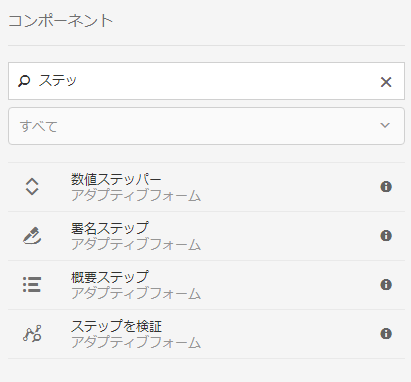

# アダプティブフォームで Adobe Sign を使用する {#using-adobe-sign-in-an-adaptive-form}

アダプティブフォームで電子署名（Adobe Sign）ワークフローを有効にすると、署名ワークフローが自動化され、単一署名プロセスと複数署名プロセスが簡素化されるほか、モバイルデバイスでフォームを電子的に署名できるようになります。

Adobe Sign を使用して、アダプティブフォームの電子署名ワークフローを実行することができます。電子サインにより、法務、販売、給与、人事管理などに関するドキュメントを処理するためのワークフローが改善されます。

Adobe Sign とアダプティブフォームの一般的なシナリオでは、サービスを申し込むためのアダプティブフォームをユーザーが入力します。例えば、住宅ローンやクレジットカードに申請する際には、すべての借り手と共同申請者から、法的に有効な署名を取得する必要があります。これに類似したシナリオで電子署名ワークフローを有効にするには、Adobe Sign を AEM Forms に統合します。例えば、Adobe Sign を使用して、以下のような処理を実行することができます。

* 完全に自動化された提案プロセス、見積りプロセス、契約プロセスを使用して、任意のデバイスで契約を締結する。
* 人事プロセスを短時間で完了し、従業員に対してデジタルエクスペリエンスを提供する。
* 契約のサイクルタイムを短縮し、ベンダーとの取引を早期に開始する。
* 共通するプロセスを自動化するためのデジタルワークフローを作成する。

Adobe Sign と AEM Forms を統合することにより、次の機能がサポートされます。

* 単一ユーザーと複数ユーザーの署名ワークフローを処理する機能
* 複数の署名ワークフローを並列的に順次処理する機能
* フォーム内とフォーム外での署名機能
* 匿名ユーザーまたはログインユーザーとしてフォームを署名する機能
* 動的な署名プロセスを処理する機能（AEM Forms のワークフローと統合）
* ナレッジベース、電話、ソーシャルプロファイルによる認証機能

アダプティブフォーム](https://medium.com/adobetech/using-adobe-sign-to-e-sign-an-adaptive-form-heres-the-best-way-to-do-it-dc3e15f9b684)でAdobe Signを使用し、より優れた署名エクスペリエンスを作成する際のベストプラクティスについて説明します。[

## 前提条件 {#prerequisites}

アダプティブフォームで Adobe Sign を使用する前に、以下の点を確認してください。

* Adobe Sign を使用するように AEM Forms クラウドサービスが設定されていることを確認してください。詳細については、[Adobe Sign の AEM Forms への統合](/help/forms/using/adobe-sign-integration-adaptive-forms.md)を参照してください。
* 署名者のリストが準備されていること。少なくとも、各署名者の電子メールアドレスが必要になります。

## アダプティブフォーム用に Adobe Sign を設定する {#configure-adobe-sign-for-an-adaptive-form}

アダプティブフォーム用に Adobe Sign を設定するには、以下の手順を実行します。

1. [アダプティブフォームのプロパティを編集してAdobe署名を行う](#enableadobesign)
1. [Adobe Sign のフィールドをアダプティブフォームに追加する](#addadobesignfieldstoanadaptiveform)
1. [アダプティブフォームに対して Adobe Sign を有効にする](#enableadobsignforanadaptiveform)
1. [アダプティブフォームに対して Adobe Sign クラウドサービスを選択する](#selectadobesigncloudserviceforanadaptiveform)

1. [アダプティブフォームに Adobe Sign の署名者を追加する](#addsignerstoanadaptiveform)
1. [アダプティブフォームに対して送信アクションを選択する](#selectsubmitactionforanadaptiveform)

### Adobe Signのアダプティブフォームプロパティの編集 {#enableadobesign}

既存のアダプティブフォームまたは新規のアダプティブフォームに対して、Adobe Signのアダプティブフォームプロパティを設定する。

[アダプティブフォームの作成Adobe](/help/forms/using/working-with-adobe-sign.md#create-an-adaptive-form-for-adobe-sign) 署名では、基本的なアダプティブフォームの作成手順を説明します。アダプティブフォームの作成中に使用できるその他のオプションについては、[アダプティブフォームの作成](/help/forms/using/creating-adaptive-form.md)を参照してください。

#### Adobe Sign用アダプティブフォームの作成 {#create-an-adaptive-form-for-adobe-sign}

Adobe Sign用のアダプティブフォームを作成するには、次の手順を実行します。

1. **[!UICONTROL Adobe Experience Manager]**／**[!UICONTROL Forms]**／**[!UICONTROL フォームとドキュメント]**&#x200B;に移動します。
1. 「**[!UICONTROL 作成]**」をタップして、「**[!UICONTROL アダプティブフォーム]**」を選択します。テンプレートのリストが表示されます。 テンプレートを選択し、「**[!UICONTROL 次へ]**」をタップします。
1. 「**[!UICONTROL 基本]**」タブで次の操作を行います。

   1. アダプティブフォームの&#x200B;**名前**&#x200B;と&#x200B;**タイトル**&#x200B;を指定します。
   1. AEM Formsと連携するAdobe Signの設定時に作成した[設定コンテナ](/help/forms/using/adobe-sign-integration-adaptive-forms.md#configure-adobe-sign-with-aem-forms)を選択します。

      >[!NOTE]
      >
      >**[!UICONTROL Adobe SignCloud Service]**&#x200B;ドロップダウンリストに、このフィールドで選択した設定コンテナで設定されたクラウドサービスが表示されます。 「**[!UICONTROL Adobe Signを有効にする]**」オプションを選択すると、アダプティブフォームプロパティの「**[!UICONTROL 電子署名]**」セクションに「**[!UICONTROL Adobe SignCloud Service]**」ドロップダウンリストが表示されます。

1. 「**[!UICONTROL フォームモデル]**」タブで、次のいずれかのオプションを選択します。

   * 「**[!UICONTROL フォームテンプレートをレコードのドキュメントテンプレートとして関連付け]**」オプションを選択し、「レコードのドキュメント」テンプレートを選択します。 フォームテンプレートベースのアダプティブフォームを使用する場合、署名用に送信されたドキュメントには、関連するフォームテンプレートに基づくフィールドのみが表示されます。 アダプティブフォームのすべてのフィールドが表示されるわけではありません。
   * 「**[!UICONTROL レコードのドキュメントを生成]**」オプションを選択します。 「レコードのドキュメント」オプションが有効になっているアダプティブフォームを使用する場合、署名用に送信されたドキュメントにアダプティブフォームのすべてのフィールドが表示されます。

1. 「**[!UICONTROL 作成」をタップします。]** 署名が有効なアダプティブフォームが作成され、このアダプティブフォームを使用してAdobe Signフィールドを追加できます。

#### Adobe Signのアダプティブフォームの編集 {#editafsign}

既存のアダプティブフォームでAdobe Signを使用するには、次の手順を実行します。

1. **[!UICONTROL Adobe Experience Manager]**／**[!UICONTROL Forms]**／**[!UICONTROL フォームとドキュメント]**&#x200B;に移動します。
1. アダプティブフォームを選択し、「**[!UICONTROL プロパティ]**」をタップします。
1. 「**[!UICONTROL 基本]**」タブで、AEM Formsと連携するAdobe Signの設定時に作成した[設定コンテナ](/help/forms/using/adobe-sign-integration-adaptive-forms.md#configure-adobe-sign-with-aem-forms)を選択します。
1. 「**[!UICONTROL フォームモデル]**」タブで、次のいずれかのオプションを選択します。

   * 「**[!UICONTROL フォームテンプレートをレコードのドキュメントテンプレートとして関連付け]**」オプションを選択し、「レコードのドキュメント」テンプレートを選択します。 フォームテンプレートベースのアダプティブフォームを使用する場合、署名用に送信されたドキュメントには、関連するフォームテンプレートに基づくフィールドのみが表示されます。 アダプティブフォームのすべてのフィールドが表示されるわけではありません。
   * 「**[!UICONTROL レコードのドキュメントを生成]**」オプションを選択します。 「レコードのドキュメント」オプションが有効になっているアダプティブフォームを使用する場合、署名用に送信されたドキュメントにアダプティブフォームのすべてのフィールドが表示されます。

1. 「**[!UICONTROL 保存して閉じる]**」をタップします。アダプティブフォームがAdobe Signに対して有効になっている。

### Adobe Sign のフィールドをアダプティブフォームに追加する {#addadobesignfieldstoanadaptiveform}

Adobe Sign には、アダプティブフォーム上に配置できるさまざまなフィールドが用意されています。これらのフィールドには、署名、イニシャル、会社名、タイトルなど、様々なタイプのデータを入力することができます。このため、署名が行われる際に署名だけでなく追加情報を収集できます。Adobe Sign ブロックコンポーネントを使用して、アダプティブフォームのさまざまな場所に Adobe Sign のフィールドを配置することができます。

アダプティブフォームにフィールドを追加し、それらのフィールドに関する各種のオプションをカスタマイズするには、以下の手順を実行します。

1. **Adobe Sign ブロック**&#x200B;コンポーネントを、コンポーネントブラウザーからアダプティブフォームにドラッグアンドドロップします。Adobe Sign ブロックコンポーネントには、サポート対象のすべての Adobe Sign フィールドが含まれています。デフォルトでは、**署名**&#x200B;フィールドがアダプティブフォームに追加されます。

   

   デフォルトでは、発行済みアダプティブフォームに Adobe Sign ブロックは表示されません。Adobe Sign ブロックが表示されるのは、署名ドキュメントだけです。Adobe Sign ブロックの表示設定は、Adobe Sign ブロックコンポーネントのプロパティで変更することができます。

   >[!NOTE]
   >
   >* アダプティブフォームで Adobe Sign を使用する場合、Adobe Sign ブロックの使用は必須ではありません。Adobe Signブロックを使用せずに署名者のフィールドを追加した場合は、署名ドキュメントの下部にデフォルトの署名フィールドが表示されます。
   >* レコードのドキュメントが自動的に生成されるアダプティブフォームの場合のみ、Adobe Sign ブロックを使用してください。カスタムの XDP を使用して、レコードのドキュメントやフォームテンプレートベースのアダプティブフォームを生成する場合は、Adobe Sign ブロックを使用する必要はありません。

1. **Adobe Signブロック**&#x200B;コンポーネントを選択し、**編集** アイコンをタップします。 フィールドを追加するためのオプションと、フィールドの外観を設定するためのオプションが表示されます。

   

   **A.** Adobe Signフィールドを選択して追加します。**B.** Adobe Signブロックを全画面表示に展開します

1. **Adobe Signフィールド** アイコンをタップします。 Adobe Sign のフィールドの選択オプションと追加オプションが表示されます。

   「**タイプ**」ドロップダウンフィールドを展開してAdobe Signフィールドを選択し、完了アイコンをタップして、選択したフィールドをAdobe Signブロックに追加します。 「**タイプ**」ドロップダウンフィールドには、「署名」タイプ、「署名者の情報」タイプ、「データフィールド」タイプが表示されます。Adobe Sign が AEM Forms に統合されている場合、「タイプ」ドロップダウンボックスに表示されているフィールド以外のフィールドは使用できません。Adobe Sign フィールドについて詳しくは、[Adobe Sign のドキュメント](https://helpx.adobe.com/jp/sign/using/field-types.html)を参照してください。

   

   フィールドには、必ず一意の名前を指定する必要があります。フィールドを必須フィールドとしてマークするための必須オプションを選択することもできます。Adobe Sign の一部のフィールドには、「**名前**」オプションと「**必須**」オプションのほかに、追加のオプションが用意されています。例えば、マスクや複数行のオプションなどです。また、フィールドが Adobe Sign の同じブロック内に存在するか別のブロック内に存在するかを問わず、Adobe Sign の各フィールドに一意の名前を指定できます。

### アダプティブフォームに対して Adobe Sign を有効にする {#enableadobsignforanadaptiveform}

初期状態の Adobe Sign は、アダプティブフォームに対して有効になっていません。Adobe Sign を有効にするには、以下の手順を実行します。

1. コンテンツブラウザーで「**フォームコンテナ**」をタップし、**設定**  アイコンをタップします。この操作により、アダプティブフォームのコンテナプロパティを表示するプロパティブラウザーが開きます。
1. このプロパティブラウザーで「**電子サイン**」アコーディオンを展開し、「**Adobe Sign を有効にする**」オプションを選択します。この操作により、アダプティブフォームに対して Adobe Sign が有効になります。

### Adobe Sign クラウドサービスと署名順序を選択する {#selectadobesigncloudserviceforanadaptiveform}

AEM Forms の 1 つのインスタンスに対して、複数の Adobe Sign サービスを設定することができます。人事や財務などの部門ごとに個別のサービスセットを設定することをお勧めします。こうすることにより、署名済みドキュメントの追跡とレポート処理が容易になります。例えば、銀行には複数の部署があります。これらの部署ごとに個別の設定を指定することで、ドキュメントを正しくトラッキングできるようになります。

また、1 つのドキュメントに対して複数の署名者を設定できます。例えば、複数のユーザーがクレジットカードを申し込む場合があります。銀行は、これらの申し込みの処理を開始する前に、すべての申し込み者の署名を取得する必要があります。このように複数の署名者を処理するシナリオの場合、各ドキュメントを順に署名することも、順不同で同時に署名することもできます。

クラウドサービスと署名順を選択するには、以下の手順を実行します。

1. コンテンツブラウザーで「**フォームコンテナ**」をタップし、**設定**  アイコンをタップします。この操作により、アダプティブフォームのコンテナプロパティを表示するプロパティブラウザーが開きます。
1. このプロパティブラウザーで「**電子サイン**」アコーディオンを展開し、「**Adobe Sign を有効にする**」オプションを選択します。この操作により、アダプティブフォームに対して Adobe Sign が有効になります。
1. 既に設定されている Adobe Sign クラウドサービスのリストで、任意のクラウドサービスを選択します。

   **Adobe SignCloud Service**&#x200B;リストが空の場合は、[AEM FormsでAdobe Signを設定](/help/forms/using/adobe-sign-integration-adaptive-forms.md)の記事に従ってサービスを設定します。

   「ツール/**[!UICONTROL Cloud Services]**/**[!UICONTROL Adobe Sign]**」の`global`フォルダーに存在するクラウドサービスのリストがドロップダウンに表示されます。 さらに、ドロップダウンには、アダプティブフォームの作成時に「**[!UICONTROL 設定コンテナ]**」フィールドで選択したフォルダー内に存在するクラウドサービスのリストも表示されます。

1. 「**署名者は署名できます**」ダイアログボックスで、署名順序を選択します。Adobe Sign の署名者は、アダプティブフォームを&#x200B;**連続**&#x200B;して（署名者順に）署名することも、**「同時」**&#x200B;に（順不同で）署名することもできます。

   順に署名する場合は、1 人の署名者が、署名用のフォームを一度に 1 つずつ受け取ります。最初の署名者によるフォームの署名が完了すると、フォームが次の署名者に送信され、最後の署名者になるまでこの手順が繰り返されます。

   同時に署名する場合は、複数の署名者がフォームを同時に署名することができます。

1. [アダプティブフォームに署名者を追加](#addsignerstoanadaptiveform) し、完了アイコンをタップして変更内容を保存します。

### アダプティブフォームに署名者を追加する {#addsignerstoanadaptiveform}

1 つのアダプティブフォームに対して、署名者を 1 人だけ設定することも、複数の署名者を設定することもできます。署名者を追加する際に、その署名者の詳細な認証情報を設定することもできます。また、フォームの入力者と署名者を同じユーザーにするかどうかを選択することもできます。署名者に関する各種の詳細情報の追加と指定を行うには、以下の手順を実行します。

1. コンテンツブラウザーで「**フォームコンテナ**」をタップし、**設定**  アイコンをタップします。この操作により、アダプティブフォームのコンテナプロパティを表示するプロパティブラウザーが開きます。
1. このプロパティブラウザーで「**電子サイン**」アコーディオンを展開し、「**Adobe Sign を有効にする**」オプションを選択します。この操作により、アダプティブフォームに対して Adobe Sign が有効になります。
1. 「**署名者設定**」で「**署名者を追加」をタップします。** これにより、署名者がアダプティブフォームに追加されます。1つのアダプティブフォームに複数のAdobe Sign署名者を追加することができます。
1. 

   **編集** アイコンをクリックして、署名者に関する次の情報を指定します。

   * **タイトル：** 署名者を一意に識別するタイトルを指定します。
   * **署名者とフォームの入力者が同じですか？:** フォームの入力者と最初の署名者が同じである場合は、「 **はい**」を選択します。このオプションを「**いいえ**」に設定した場合は、アダプティブフォームの署名ステップコンポーネントは使用しないでください。フォームに署名ステップコンポーネントが含まれている場合は、このフィールドの値が自動的に「はい」に設定されます。
   * **署名者の電子メールアドレス：**&#x200B;署名者の電子メールアドレスを指定します。署名者は、ここで指定した電子メールアドレスで、署名する必要があるドキュメントやフォームを受信します。フォームフィールドで指定した電子メールアドレスを使用することも、ログインユーザーの AEM ユーザープロファイルで指定した電子メールアドレスを使用することも、電子メールアドレスを手動で入力することもできます。このステップは、必ず実行する必要があります。また、署名者を 1 人だけ設定した場合は、その署名者の電子メールアドレスが、AEM クラウドサービスの設定で使用した Adobe Sign アカウントと同じにならないようにしてください。
   * **署名者の認証方法：**&#x200B;署名するフォームを開く前にユーザーを認証する方法を指定します。電話による認証、ナレッジベースによる認証、ソーシャル ID に基づく認証のいずれかを選択することができます。

   >[!NOTE]
   >
   >* ソーシャル ID に基づく認証の場合、Facebook、Google、LinkedIn を使用した認証オプションがデフォルトで用意されています。これ以外のソーシャル認証プロバイダーを使用する場合は、Adobe Sign サポートまでお問い合わせください。

   * **Adobe Sign のフィールドに入力または署名：**&#x200B;署名者用の Adobe Sign フィールドを選択します。1 つのアダプティブフォームで複数の Adobe Sign フィールドを使用することができます。署名者用に特定のフィールドを有効にできます。これらのフィールドには、使用可能なすべての Adobe Sign ブロックが表示されます。いずれかのブロックを選択すると、そのブロックのすべてのフィールドが選択されます。フィールドの選択を解除するには、「X」アイコンを使用します。

   

   上の画像には、Personal-Information と Office-details という 2 つのサンプルの Adobe Sign ブロックが表示されています。

   完了アイコンをタップします。 署名者が追加され、設定が完了します。

### アダプティブフォームに対して送信アクションを選択する {#selectsubmitactionforanadaptiveform}

Adobe Sign フィールドをアダプティブフォームに追加したら、フォームコンテナで Adobe Sign を有効にし、Adobe Sign クラウドサービスを選択して、Adobe Sign の署名者を追加します。その後、アダプティブフォームに対して、適切な送信アクションを選択します。アダプティブフォームの送信アクションについて詳しくは、「[送信アクションの設定](/help/forms/using/configuring-submit-actions.md)」を参照してください。

また、Adobe Sign が有効になっているアダプティブフォームは、すべての署名者がフォームに署名するまで送信されないことに注意してください。一部の署名者しか署名していないフォームは、フォームポータルの「保留中の署名」セクションで表示することができます。Adobe Sign 設定サービスは、[一定の間隔で](/help/forms/using/adobe-sign-integration-adaptive-forms.md) Adobe Sign サーバーをポーリングすることにより、署名のステータスを確認します。すべての署名者がフォームの署名を完了すると、送信アクションサービスが起動してフォームが送信されます。Adobe Sign を使用するフォームでカスタムの送信アクションを実行する場合は、送信アクションサービスを使用するように、そのカスタム送信アクションを設定する必要があります。

>[!NOTE]
>
>アダプティブフォームのデータは、一時的にフォームポータルに保存されます。Forms Portal](/help/forms/using/configuring-draft-submission-storage.md)には、[カスタムストレージを使用することをお勧めします。 これにより、PII（Personally Identifiable Information：個人を特定できる情報）データが AEM サーバーに保存されるのを防ぐことができます。

これで、フォームに署名するための準備が整いました。フォームのプレビューを表示して、署名の方法を確認することができます。署名者が電子メールで署名用のフォームを受信すると、発行済みフォーム上に Adobe Sign ブロックのフィールドが表示されます。この動作を、フォーム外署名機能といいます。最初の署名者に対して、フォーム内署名機能を設定することもできます。詳しい手順については、「[フォーム内署名機能の設定](/help/forms/using/working-with-adobe-sign.md#create-in-form-signing-experience)」を参照してください。

## アダプティブフォームのクラウド署名の設定 {#configure-cloud-signatures-for-an-adaptive-form}

クラウドベースの電子署名（リモート署名）は、デスクトップ、モバイル、Web 上で機能する新世代のデジタル署名で、署名者の認証に関する最高レベルのコンプライアンスと保証を満たします。クラウドベースの電子署名を使用してアダプティブフォームに署名することができます。

[Adobe署名のアダプティブフォームプロパティの編集](#enableadobesign)後、次の手順を実行して、アダプティブフォームにクラウド署名フィールドを追加します。

1. **Adobe Sign ブロック**&#x200B;コンポーネントを、コンポーネントブラウザーからアダプティブフォームにドラッグアンドドロップします。Adobe Sign ブロックコンポーネントには、サポート対象のすべての Adobe Sign フィールドが含まれています。デフォルトでは、**署名**&#x200B;フィールドがアダプティブフォームに追加されます。

   

1. **Adobe Signブロック**&#x200B;コンポーネントを選択し、**編集** アイコンをタップします。 フィールドを追加するためのオプションと、フィールドの外観を設定するためのオプションが表示されます。

   

   **A.** Adobe Signフィールドを選択して追加します。**B.** Adobe Signブロックを全画面表示に展開します

1. **Adobe Signフィールド** アイコンをタップします。 Adobe Sign のフィールドの選択オプションと追加オプションが表示されます。

   **タイプ**&#x200B;ドロップダウンフィールドを展開して「**電子署名**」を選択し、完了アイコンをタップして、選択したフィールドをAdobe Signブロックに追加します。

   

   フィールドには、必ず一意の名前を指定する必要があります。

   以下を使用して、アダプティブフォームに電子署名を適用します。

   * クラウド署名：トラストサービスプロバイダーがホストする[デジタル ID](https://helpx.adobe.com/jp/sign/kb/digital-certificate-providers.html) を使用して署名します。
   * Adobe Acrobat または Reader：ドキュメントをダウンロードして Adobe Acrobat または Reader で開き、スマートカード、USB トークン、ファイルベースのデジタル ID を使用して署名します。

   クラウド署名フィールドをアダプティブフォームに追加した後、次の手順を実行して設定プロセスを完了します。

   * [アダプティブフォームに対して Adobe Sign を有効にする](#enableadobsignforanadaptiveform)
   * [アダプティブフォームに対して Adobe Sign クラウドサービスを選択する](#selectadobesigncloudserviceforanadaptiveform)
   * [アダプティブフォームに Adobe Sign の署名者を追加する](#addsignerstoanadaptiveform)
   * [アダプティブフォームに対して送信アクションを選択する](#selectsubmitactionforanadaptiveform)

## フォーム内署名機能の設定 {#create-in-form-signing-experience}

フォームの入力時に、アダプティブフォームに署名することもできます。この動作を、フォーム内署名機能といいます。フォーム内署名機能は、複数の署名者が存在する場合に、最初の署名者のみ使用することができます。アダプティブフォームに対してフォーム内署名機能を設定するには、以下の手順を実行します。

1. [署名ステップコンポーネントの追加と設定](#add-and-configure-the-signature-step-component)を行います。
1. [概要ステップコンポーネントを追加](#configure-the-thank-you-page-or-summary-step-component)します。

### 署名ステップコンポーネントの追加と設定 {#add-and-configure-the-signature-step-component}

署名ステップコンポーネントを使用して、入力済みのフォームに電子的に署名するための領域を指定します。署名ステップコンポーネントが含まれているセクションをレンダリングすると、入力済みフォームの署名可能な PDF バージョンが表示されます。署名ステップコンポーネントは、フォームの幅いっぱいに表示されます。そのため、署名ステップコンポーネントが含まれているセクションに他のコンポーネントを配置しないようにすることをお勧めします。

署名ステップコンポーネントを設定するには、以下の手順を実行します。

1. **署名ステップ**&#x200B;コンポーネントを、コンポーネントブラウザーからフォームにドラッグアンドドロップします。
1. 新しく追加された署名ステップコンポーネントを選択し、**設定** アイコンをタップします。 この操作により、署名ステップのプロパティを表示するプロパティブラウザーが開きます。以下のプロパティを設定します。

   * **要素名：**&#x200B;コンポーネントの名前を指定します。
   * **タイトル：**&#x200B;コンポーネントの一意のタイトルを指定します。
   * **テンプレートメッセージ：** 署名 PDF の読み込み中に表示するメッセージを指定します。Adobe Sign サービスによる署名 PDF の準備と読み込みには、ある程度の時間がかかります。
   * **署名サービス：** 「**Adobe Sign**」オプションを選択します。
   * **レガシーの E-Sign コンポーネントを使用**：[AEM Forms Workspace](/help/forms/using/introduction-html-workspace.md) または AEM Forms アプリケーションで個別のアダプティブフォームを使用する場合や、ベースとなるアダプティブフォームにレガシーの E-Sign コンポーネントが含まれている場合は、「**レガシーの E-Sign コンポーネントを使用**」オプションを選択します。
   * **設定**：設定を選択します（Adobe Sign クラウドサービス）。このドロップダウンボックスは、「**レガシーE署名コンポーネントを使用**」オプションが有効な場合にのみ使用できます。

   完了（）アイコンをタップして、変更を保存します。

   

   >[!NOTE]
   >
   >* **[!UICONTROL 署名者ステップ]**&#x200B;コンポーネントをフォームにドラッグアンドドロップすると、「**[!UICONTROL 署名者とフォーム記入者は同一ですか？]**」オプションが自動的に「**はい**」に設定されます。フォームを動作させておく必要があります。
   >* 署名ステップコンポーネントが含まれているセクションやパネルの場合、Adobe Sign が有効になっているアダプティブフォームで「送信」ボタンを使用することはできません。[Adobe Sign設定サービス](/help/forms/using/adobe-sign-integration-adaptive-forms.md#configure-adobe-sign-scheduler-to-sync-the-signing-status)を使用して設定した間隔の後に、手動送信または自動送信の署名ステップをトリガーした後に、概要ステップを追加できます。

### 「ありがとうございます」ページまたは概要ステップコンポーネントの設定  {#configure-the-thank-you-page-or-summary-step-component}

**概要ステップ**&#x200B;コンポーネントにより、フォームが自動的に送信され、カスタマイズ後の概要ページに情報が取り込まれ、送信されたフォームの概要情報が表示されます。また、リターンマップ内の必須情報も取得されます。概要ステップコンポーネントは、フォームの幅いっぱいに表示されます。そのため、概要ステップコンポーネントが含まれているセクションに他のコンポーネントを配置しないようにすることをお勧めします。

これで、フォーム内署名機能を使用するための準備が整いました。フォームのプレビューを表示して、署名の方法を確認することができます。

## よくある質問  {#frequently-asked-questions}

**Q: 特定のアダプティブフォームを別のアダプティブフォームに埋め込むことができますが、埋め込まれたアダプティブフォームで Adobe Sign を有効にすることはできますか？**

**回答：** いいえ。AEM Formsは、Adobe Signが有効になっているアダプティブフォームを埋め込んだアダプティブフォームの署名に使用することをサポートしていません。

**Q:高度なテンプレートを使用してアダプティブフォームを作成し、編集用に開くと、「電子署名または署名者が正しく設定されていません」というエラーメッセージが表示されます。表示されます。このエラーメッセージを解決するにはどうすればよいですか？**

**A:**&#x200B;拡張テンプレートを使用して作成されたアダプティブフォームは、Adobe Sign を使用するように設定されています。このエラーを修正するには、Adobe Sign のクラウド設定を作成して選択し、アダプティブフォーム用の Adobe Sign 署名者を設定してください。

**Q: アダプティブフォームの静的テキストコンポーネントで Adobe Sign のテキストタグを使用することはできますか？**

**A:** はい。テキストコンポーネントでテキストタグを使用して、Adobe Sign のフィールドを[レコードのドキュメント](/help/forms/using/generate-document-of-record-for-non-xfa-based-adaptive-forms.md)（「自動生成されたレコードのドキュメント」オプション）が有効になっているアダプティブフォームに追加することができます。テキストタグを作成する手順とルールについては、[Adobe Sign のドキュメント](https://experienceleague.adobe.com/docs/document-cloud-learn/sign-learning-hub/admin-set-up/advanced-tasks-admins/adobe-sign-text-tagging.html)を参照してください。アダプティブフォームでは、テキストタグを使用する場合に制限があることにも注意してください。テキストタグを使用して作成できるのは、Adobe Sign ブロックがサポートされているフィールドだけです。

**Q: AEM Forms には、Adobe Sign ブロックと署名ステップコンポーネントの両方が用意されていますが、アダプティブフォームで両方を同時に使用することはできますか？**

**A:**&#x200B;はい。フォーム内で両方のコンポーネントを同時に使用することができます。これらのコンポーネントを使用する場合は、以下の推奨事項を参照してください。

**Adobe Signブロック：** Adobe Signブロックを使用すると、アダプティブフォームの任意の場所にAdobe Signフィールドを追加できます。また、特定のフィールドを署名者に割り当てることもできます。アダプティブフォームのプレビュー時と発行時には、Adobe Sign ブロックがデフォルトで非表示になります。これらのブロックは、署名ドキュメント内でのみ使用することができます。署名ドキュメント内では、署名者に割り当てられているフィールド以外は使用できません。Adobe Sign ブロックは、最初の署名者だけでなく、後続の署名者も使用することができます。

**署名ステップコンポーネント：**&#x200B;署名ステップコンポーネントを使用すると、フォーム内署名機能を設定することができます。この機能では、最初の署名者のみ、フォームの入力時に署名を行うことができます。署名ステップコンポーネントが含まれているセクションをレンダリングすると、フォームの署名可能な PDF バージョンが表示されます。通常は、最後または最後のセクションに続いて、フォームの概要コンポーネントが表示されます。
