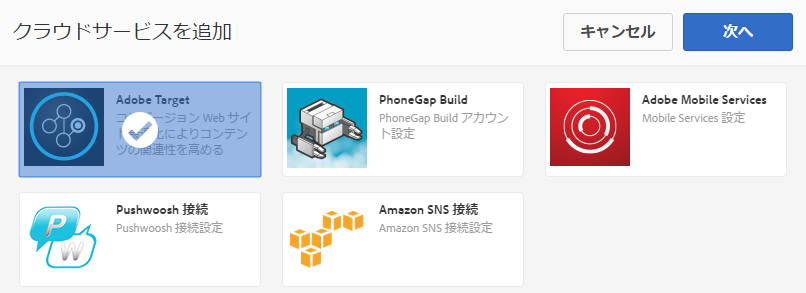
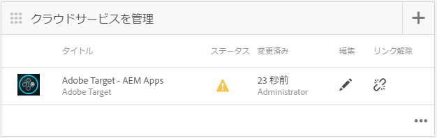
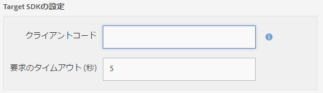
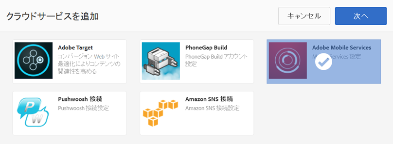

# Adobe Target Cloud Service の設定 {#configuring-adobe-target-cloud-service}

>[!NOTE]
>
>Adobeは、単一ページアプリケーションのフレームワークベースのクライアントサイドレンダリング（React など）を必要とするプロジェクトでは、SPA Editor を使用することをお勧めします。 [詳細情報](/help/sites-developing/spa-overview.md)を参照してください。

>[!NOTE]
>
>このドキュメントは、 [AEM Mobileの概要](/help/mobile/getting-started-aem-mobile.md) ガイド (AEM Mobileリファレンスの出発点として推奨 )。

コンテンツ作成者がモバイルアプリ用のターゲットコンテンツの生成を開始できるようにするには、いくつかの手順をまとめる必要があります。ユーザーおよびグループに対する適切な権限のセットの取得、クラウドサービスの作成、アクティビティのアプリケーションの設定、最後にコンテンツの生成がおこなわれます。

今後の想定は、 [AEM Mobile Hybrid Reference Application](https://github.com/Adobe-Marketing-Cloud-Apps/aem-mobile-hybrid-reference) は、正常にデプロイされ、AEM Mobile Dashboard からアクセスできます。

## 権限 {#permissions}

パーソナライゼーションコンソールへのアクセスを必要とするユーザーは、 `target-activity-authors` グループ化します。 ユーザーとグループの設定の一環として、 target-activity-group を apps-admins グループに追加することをお勧めします。 target-activity-authors グループを追加すると、パーソナライゼーションのナビゲーションメニューエントリを表示できます。

パーソナライゼーション管理コンソールへのアクセス権を持つユーザーまたはグループを target-activity-authors グループに追加し忘れると、ユーザーはパーソナライゼーションコンソールを表示できなくなります。

## Cloud Services {#cloud-services}

モバイルアプリケーションでターゲットコンテンツを機能させるには、次の 2 つのサービスを設定する必要があります。Adobe Target Service と Mobile ServicesAdobe。 Adobe Targetサービスは、クライアントリクエストを処理し、パーソナライズされたコンテンツを返すためのエンジンを提供します。 AdobeMobile Services サービスは、AMS Cordova プラグインで使用される ADBMobileConfig.json ファイルを介して、Adobe サービスとモバイルアプリケーション間の接続を提供します。 AEM Mobile Dashboard から、2 つのサービスを追加してアプリケーションを設定できます。

## Adobe TargetCloud Service {#adobe-target-cloud-service}

AEM Mobileダッシュボードで「Cloud Servicesを管理」を探し、「+」ボタンをクリックします。

Cloud Serviceの追加ウィザードで、「Adobe Target」クラウドサービスカードを選択し、「次へ」をクリックします。

「設定を選択」ドロップダウンで、新しい設定を作成するか、既存の設定から選択できます。 新しい設定を作成するには、ドロップダウンから「設定を作成」を選択します。 Target 設定のタイトルを入力します。 Target アカウントに関連付けられているクライアントコード、電子メール、およびパスワードを入力します。 これらのフィールドの値が不明な場合は、Adobe Targetサポートにお問い合わせください。 「検証」ボタンをクリックして、資格情報を検証します。 検証が完了したら、「送信」ボタンをクリックしてクラウドサービスを作成します。

作成されたクラウドサービスは、ウィザードによってモバイルアプリケーションに自動的に関連付けられます。 cq:cloudserviceconfigs プロパティ値は、 apps group ノードの jcr:content ノードで設定されます。 ハイブリッドアプリのサンプルの場合、 /content/mobileapps/hybrid-reference-app/jcr:content に設定され、自動生成されたフレームワークノードを指す値が/etc/cloudservices/testandtarget/adobe-target—aem-apps/framework に設定されます。 フレームワークノードには、デフォルトで設定される性別と年齢の 2 つのプロパティがあります。 フレームワークはAEMのプレビューでのみ使用され、デバイスには影響しません。

ウィザードが完了すると、Cloud Serviceを管理タイルには Target Cloud Service が含まれますが、AdobeMobile Services アカウントが見つからないことに関する警告が含まれています。

## AdobeMobile Service {#adobe-mobile-service}

Adobeの Mobile Services(AMS) アカウントもアプリケーションにリンクする必要があります。AMS サービスは、Target のクライアントコード情報を含む必要な ADBMobileConfig.json ファイルを提供します。 AMS アカウントとの関連付けを作成する前に、AMS に対する権限を持つユーザーが AMS アカウントを変更する必要があります。

### クライアントコード {#client-code}

AMS サービスにログインするには、以下にアクセスします。 [https://mobilemarketing.adobe.com](https://mobilemarketing.adobe.com/)、モバイルアプリケーションを選択し、「設定」をクリックします。 「 SDK Target オプション」フィールドを探し、フィールドにクライアントコードを配置して、「保存」をクリックします。

これで、クライアントコードがモバイルAdobeに関連付けられました。AMS クラウドサービスが Mobile Dashboard で設定されると、サービス設定の設定が ADBMobileConfig.json ファイルを介して配信されます。

### AdobeMobile Service Could Service {#adobe-mobile-service-could-service}

AMS が設定されたので、Mobile Dashboard でモバイルアプリケーションをAdobeに関連付けます。 AEM Mobileダッシュボードで「Cloud Servicesを管理」を探し、「+」ボタンをクリックします。

「AdobeMobile Services 」カードを選択し、「次へ」をクリックします。

作成または選択ウィザードの手順で、「 Mobile Service 」ドロップダウンを選択し、「設定を作成」エントリを選択します。 タイトル、会社、ユーザー名、パスワードを入力し、適切なデータセンターを選択します。 これらの値が不明な場合は、AdobeMobile Service 管理者に問い合わせて取得してください。 すべてのフィールドに入力したら、「検証」ボタンをクリックします。 検証プロセスが AMS に移動し、アカウントの資格情報が検証されます。検証が成功すると、モバイルアプリケーションのリストが表示され、関連するモバイルアプリケーションをドロップダウンから選択します。 「送信」ボタンをクリックして、ウィザードを完了します。 このプロセスでは、設定データと、アプリケーションに関連する分析を取得するのに少し時間がかかる場合があります。 プロセスが完了したら、モーダルの「完了」ボタンをクリックして、「モバイルAdobe」ダッシュボードに戻ります。

モバイルダッシュボードに戻ると、Cloud Servicesを管理タイルに AMS クラウドサービスが含まれます。 また、指標を分析タイルには、ライフサイクルレポートが表示されます。

## Target コンテンツ同期ハンドラー {#target-content-sync-handlers}

ユーザーのデバイスコンテンツにコンテンツを配信するために、AEMコンテンツ作成者が作成したオファーをレンダリングすることで、コンテンツが生成されます。 ターゲットオファーのレンダリングを処理するために、オファーを処理する新しいコンテンツ同期ハンドラーが追加されました。 Hybrid Reference Application をサンプルとして使用すると、en（英語）コンテンツパッケージには、 [mobileappoffers](https://github.com/Adobe-Marketing-Cloud-Apps/aem-mobile-hybrid-reference/blob/master/aem-package/content-author/src/main/content/jcr_root/content/mobileapps/hybrid-reference-app/en/_jcr_content/pge-app/app-config-dev/targetOffers/.content.xml) ハンドラ 次の手順は、オファーをデバイスにレンダリングする際に非常に重要です。 mobileappoffers ハンドラーには、アプリケーションに使用されるパーソナライゼーションアクティビティへのパスを識別する path プロパティがあります。

例えば、次の場所にあるアクティビティがある場合、 */content/campaigns/hybridref* このパスをコピーし、値として *パス* mobileappoffers ハンドラーのプロパティ。

Hybrid Reference Application には、開発用と生産用の 2 つの mobileappoffers ハンドラーがあります。

mobileappoffers ハンドラーの path プロパティにアクティビティのパスが設定されたら、ハンドラーを保存します。 これで、ハンドラーは、モバイルデバイス用のオファーのレンダリングを開始する準備が整いました。

### レンダリングモード {#render-mode}

mobileappoffers ハンドラーの設定は、公開設定と開発設定で異なります。 パブリッシュ設定の場合、という名前のプロパティがあります。 *renderMode* 値を *公開* cq:ContentSyncConfig ノードで設定します。 mobileappoffers ハンドラーは renderMode を参照し、publish に設定されている場合、作成される mbox ID を変更します。 デフォルトでは、AEMで作成された mbox には、mbox ID に —author 値が追加されます。 これは、アクティビティが公開されておらず、オファーの解決に未公開のキャンペーンを使用する必要があることを示します。

コンテンツがAdobeのモバイルダッシュボードでステージングされる場合、ステージング済みコンテンツは、実稼動準備済みコンテンツと見なされ、開発用以外のコンテンツ同期設定でレンダリングされます。 この方法でレンダリングすると、—author がすべての mbox ID から削除され、公開済みのアクティビティが Target サーバーで使用できるようになります。 ステージングされたコンテンツをテストする前に、アクティビティが公開されていることを確認します。

## コンテンツの作成 {#creating-content}

これで、クラウドサービスが作成され、mobileappoffers ハンドラーが設定されたので、コンテンツ作成者はターゲットエクスペリエンスの生成を開始できます。
