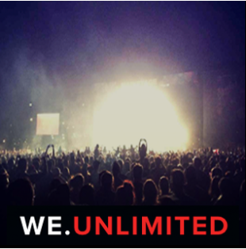

# テンプレートとコンポーネントの作成および追加 {#creating-and-adding-templates-and-components}

>[!NOTE]
>
>アドビは、シングルページアプリケーションフレームワークをベースにしたクライアント側のレンダリング（React など）を必要とするプロジェクトには SPA エディターを使用することをお勧めします。[詳細情報](/help/sites-developing/spa-overview.md)

AEM Mobile On-Demand には、完全に設定されたアプリテンプレート、記事テンプレートおよび記事コンポーネントが用意されています。

We.Unlimited アプリは、完全に設定可能で管理が容易な AEM Mobile On-Demand アプリケーションのシェルを表すサンプルのテンプレートです。

新しいアプリの作成時にこのサンプルテンプレートを選択すると、様々な機能を含んだ AEM Mobile ダッシュボードが提供されます。

>[!NOTE]
>
>AEM Mobile アプリコントロールセンターからアプリケーションおよびモバイルアプリコンテンツを管理するには、[AEM Mobile アプリケーションダッシュボード](/help/mobile/mobile-apps-ondemand-application-dashboard.md)を参照してください。

## アプリテンプレートの作成 {#creating-app-templates}

アプリテンプレートは、新しいアプリの作成時に使用されるもので、アプリのベースラインまたは基盤となるページテンプレートおよびコンポーネントの集まりです。テンプレートは、アプリを適切な方法で導くために、いくつかの基本的なプロパティをスタンプアウトします。 通常、ユーザーがアプリを作成する機会はあまり多くありません。

アプリテンプレートにより、AEM での新しいアプリの作成に使用される、開発者が作成した既存のデザインを利用する簡単な方法が提供されます。

新規アプリを別のアプリのテンプレートに基づいて作成すると、作成元アプリと同じ開始点からアプリを作成することができます。

アプリテンプレートに基づいて新しいアプリを作成する手順は次のとおりです。

1. AEM Mobileアプリカタログに移動します。 *&lt;server-url>/aem/apps.html/content/mobileapps*
1. 以下に示すように、**アプリ**／**選択**&#x200B;を選択します。

このテンプレートを使用してアプリを作成すると、記事、バナーおよびコレクションをアプリに追加できます。記事、バナーおよびコレクションの作成に再度アクセスするには、[コンテンツ管理アクション](/help/mobile/mobile-apps-ondemand-manage-content-ondemand.md)を参照してください。

>[!NOTE]
>
>または、サンプルのアプリテンプレート（例： ）を選択することもできます **We.Unlimited** アプリを使用できるようになります。 アプリにこのサンプルのテンプレートを使用した場合は、サンプルの記事やコレクションが用意されているので、それらを利用できます。テンプレートやコンポーネントは、サンプルをそのまま使用することも、既存のものをカスタマイズすることも、アプリ用に新しいものを作成することもできます。

>[!CAUTION]
>
>設定 ***redirectTarget*** プロパティ
>
>いずれかのアプリテンプレートを使用するときは、開発者がアプリケーションのコンテンツを定義します。ただし、開発者は、アプリケーションが jcr 内のどこに作成されるかと、***redirectTarget*** プロパティの値に注意する必要があります。
>
>***redirectTarget*** はアプリ作成プロセスの中で処理され、redirectTarget プロパティがアプリテンプレートの一部として利用可能で、redirectTarget の値が相対パスとして定義されている場合に、パスの解決を試みます。アプリテンプレート内の redirectTarget に相対パスの値が定義されているときは、その値が、解決されたアプリ作成場所のパスの後ろに付加されます。
>
>例えば、アプリテンプレート内で ***redirectTarget*** の値が「*lanugage-masters/en*」と定義されていて、アプリが「*/content/mobileapps/fooApp*」に作成される場合は、アプリ作成後の最終的な redirectTarget の値は「*/content/mobileapps/fooApp/language-masters/en*」になります。

## コンテンツテンプレートの作成 {#creating-content-templates}

各エンティティタイプには、2 種類の既製のテンプレートがあります。以下のとおりです。

* **デフォルトのテンプレート：** 適用可能なデフォルトのプロパティ/構造を持つコンテンツ作成に使用
* **読み込まれたテンプレート：** 適用可能なデフォルトのプロパティ/構造を持つAEM Mobileからコンテンツを読み込むために使用されます。

### 記事テンプレート {#article-templates}

Unlimited の記事は、AEM Mobile On-Demand の一般的な記事レイアウトを表すサンプルテンプレートです。

1. **記事を管理**&#x200B;の「**+**」をクリックして、新しい記事を作成します。「**Unlimited の記事**」または「**リッチテキスト記事**」を選択できます。以下の図は、これら 2 つの記事テンプレートの選択肢を示しています。

1. クリック **次へ** ：記事名/タイトル、説明、作成者、要約、部門、サムネール画像、記事へのアクセスなどの記事のメタデータを定義します。
1. 「**次へ**」をクリックして、広告プロパティを入力します。
1. 「**次へ**」をクリックして、「記事の画像」または「ソーシャルメディアの画像」を入力します。
1. 「**次へ**」をクリックして、この新しい記事へのコレクションリンクを選択します。
1. 「**次へ**」をクリックして、ソーシャルシェアの詳細を入力します。
1. 「**作成**」をクリックして、サンプルを使用した記事の作成プロセスを終了します。「**完了**」をクリックするか、「**記事を編集**」をクリックしてこの記事のプロパティを編集します。

### 記事へのコンポーネントの追加 {#adding-components-to-article}

作成者は記事を作成したら、テキストや画像などのコンポーネントを追加して内容を編集できます。記事は、AEM ページテンプレートの拡張です。

編集する記事を選択し、「**編集**」をクリックして、記事にコンポーネントを追加します。

 

左側のパネルにある「**+**」を選択して、記事にコンポーネントを追加します。

### 既製のテンプレートの作成 {#creating-out-of-the-box-templates}

既製の記事テンプレートはありませんが、カスタムテンプレートが拡張する必要があるデフォルトのテンプレートがあります。Geometrixx Unlimitedアプリの [記事テンプレートのサンプル](http://localhost:4502/crx/de/index.jsp#/apps/geometrixx-unlimited-app/templates/article).

通常の AEM テンプレートで必要なプロパティ以外の主なプロパティには次のものがあります。

***dps-resourceType=&quot;dps:Article&quot;***

このプロパティは、AEM ページが AEM Mobile をターゲットにした記事ページであると認識されるためのものです。

AEMテンプレートに従って、任意のデフォルトのプロパティまたは子ノードをテンプレートの ***jcr:content***.

### バナーおよびコレクションテンプレート {#banner-and-collection-templates}

>[!CAUTION]
>
>バナーとコレクションにはコンテンツがないので、作成時にカスタムテンプレートがサポートされない。

## コンポーネントの作成および追加 {#creating-and-adding-components}

コンポーネントはウィジェットを使用し、ウィジェットにアクセスできます。ウィジェットはコンテンツのレンダリングに使用されます。

単純なコンポーネントがコードリポジトリに含まれており、そのソースは AEM にあります。その後、ローカルで開くこともできます。CRXDE Lite。

>[!NOTE]
>
>現在、AEM Mobile には、既製のコンポーネントは用意されていません。

ページにコンポーネントを追加できます。AEM Mobile アプリでは任意のコンポーネントを使用できますが、適用された場合に適切にレンダリングされないことがあります。

ただし、AEM でレンダリングされるカスタムの書き出しコンテンツ同期ハンドラーがないと、カスタムコンポーネントを正しく書き出して AEM Mobile On-Demand Services にアップロードできない場合があります。

コンポーネントを既にAEMページに組み込んだ後、他の構築ブロックコンポーネントと共に、ページに別のコンポーネントを追加したり、既存のコンポーネントを編集したりできます。

**ページに別のコンポーネントを追加するには：**

1. ページを選択し、エディターのヘッダーの右上にあるドロップダウンで、編集モードであることを確認します。
1. エディターのヘッダーの一番左側にあるアイコンを使用して、サイドパネルを切り替えます。
1. を選択します。 **コンポーネント** タブ
1. 利用可能ないずれかのコンポーネントをページにドラッグ＆ドロップします。

**既存のコンポーネントを編集するには：**

1. ページを選択し、**編集**&#x200B;モードであることを確認して、コンポーネントを選択します。
1. 設定アイコンをタップして、コンポーネントを設定します。

>[!NOTE]
>
>AEMでコンポーネントを作成し、 [CRXDE Lite](/help/sites-developing/developing-with-crxde-lite.md). 要件に応じて既存のコンポーネントをカスタマイズしたら、上図のように&#x200B;**記事を管理**&#x200B;の「**編集**」オプションを使用して、ページにコンポーネントを追加できます。

>[!NOTE]
>
>AEM Mobile の[テンプレートおよびコンポーネント開発のベストプラクティス](/help/mobile/best-practices-aem-mobile.md)を参照してください。

### 次の手順 {#the-next-steps}

* [コンテンツのプロパティを使用したコンテンツの書き出し](/help/mobile/on-demand-content-properties-exporting.md)
* [モバイルとコンテンツ同期](/help/mobile/mobile-ondemand-contentsync.md)
