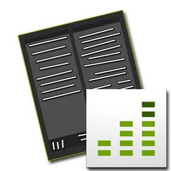

# モバイルアプリケーションへの Adobe Analytics の追加{#add-adobe-analytics-to-your-mobile-application}

>[!CAUTION]
>
>AEM 6.4 の拡張サポートは終了し、このドキュメントは更新されなくなりました。 詳細は、 [技術サポート期間](https://helpx.adobe.com/jp/support/programs/eol-matrix.html). サポートされているバージョンを見つける [ここ](https://experienceleague.adobe.com/docs/?lang=ja).

>[!NOTE]
>
>Adobeは、単一ページアプリケーションのフレームワークベースのクライアントサイドレンダリング（React など）を必要とするプロジェクトでは、SPA Editor を使用することをお勧めします。 [詳細情報](/help/sites-developing/spa-overview.md)を参照してください。

モバイルアプリケーションユーザーにとって魅力的で関連性の高いエクスペリエンスを構築したい場合は、 Adobeのライフサイクルと使用状況を監視および測定するために Mobile Services SDK を使用していない場合は、どのような決定に基づいていますか？ 最も忠誠度の高い顧客はどこにいますか。 コンバージョンの関連性と最適化を維持するには、どうすればよいですか？

ユーザーはすべてのコンテンツにアクセスしていますか？ アプリを放棄していますか。放棄した場合は、どこですか。 ユーザーはどのくらいの頻度でアプリにとどまり、どのくらいの頻度でアプリを使用するために戻ってくるのですか？ どのような変更を導入し、その後の保持率の向上を測定できますか。 クラッシュ率はどうなりますか。アプリはユーザーに対してクラッシュしますか。

を活用する [モバイルアプリ分析](https://www.adobe.com/ca/solutions/digital-analytics/mobile-web-apps-analytics.html) をAEM Apps に追加するには、 [AdobeMobile Services](https://www.adobe.com/marketing-cloud/mobile-marketing.html).

AEMアプリを実装して、モバイルアプリやコンテンツとの関わり方を追跡、レポートおよび理解し、起動回数、アプリ内時間、クラッシュ率などの主要なライフサイクル指標を測定します。

この節では、AEM *開発者* 次のことが可能です。

* モバイルアプリケーションに Mobile Analytics を統合する
* Bloodhound を使用した Analytics トラッキングのテスト

## 前提条件 {#prerequisties}

AEM Mobileでは、アプリ内のトラッキングデータを収集してレポートするためにAdobe Analyticsアカウントが必要です。 設定の一環として、AEM *管理者* は最初に次をおこなう必要があります。

* Adobe Analyticsアカウントを設定し、Mobile Services でアプリケーション用のレポートスイートを作成します。
* Adobe Experience Manager(AEM) で AMSCloud Serviceを設定します。

## 開発者向け — アプリへの Mobile Analytics の統合 {#for-developers-integrate-mobile-analytics-into-your-app}

### 設定ファイルを取り込むためのコンテンツ同期の設定 {#configure-contentsync-to-pull-in-configuration-file}

Analytics アカウントの設定後、コンテンツをモバイルアプリケーションに取り込むためのコンテンツ同期設定を作成する必要があります。

詳しくは、コンテンツ同期コンテンツの設定を参照してください。 設定は、ADBMobileConfig を/www ディレクトリに配置するようにコンテンツ同期に指示する必要があります。 例えば、Geometrixx Outdoorsアプリでは、コンテンツ同期設定は次の場所にあります。 */content/phonegap/geometrixx-outdoors/shell/jcr:content/pge-app/app-config/ams-ADBMobileConfig*. 開発用の設定もあります。ただし、Geometrixx Outdoorsの場合の非開発設定と同じです。

Mobile Application AEM Apps ダッシュボードから ADBMobileConfig をダウンロードする方法について詳しくは、 Analytics - Mobile Services -AdobeMobile Services SDK 設定ファイルを参照してください。

```xml
<jcr:root xmlns:jcr="https://www.jcp.org/jcr/1.0" xmlns:nt="https://www.jcp.org/jcr/nt/1.0"
    jcr:primaryType="nt:unstructured"
    extension="json"
    path="../../../.." 
    selector="ADBMobileConfig"
    targetRootDirectory="www"
    type="mobileADBMobileConfigJSON"/>
```

各プラットフォームでは、特定の場所に ADBMobileConfig をコピーする必要があります。

PhoneGap CLI を使用してビルドする場合、これは cordova のビルドフックスクリプトを使用して実行できます。 これは、次の場所のGeometrixx Outdoorsアプリで確認できます。*content/phonegap/geometrixx-outdoors/shell/_jcr_content/pge-app/app-content/phonegap/scripts/restore_plugins.js.*

iOSの場合、ファイルは XCode プロジェクトの **リソース** ディレクトリ ( 例： &quot;platforms/ios/Geometrixx/Resources/ADBMobileConfig.json&quot;) です。 アプリが Android をターゲットとしている場合、コピー先のパスは「platforms/android/assets/ADBMobileConfig.json」です。 PhoneGap CLI のビルド中にフックを使用する方法について詳しくは、 [Cordova/PhoneGap プロジェクトに必要な 3 つのフック](https://devgirl.org/2013/11/12/three-hooks-your-cordovaphonegap-project-needs/).

```xml
///////////////////////////
//          iOS
///////////////////////////
    ios : [
        {
            "www/ADBMobileConfig.json": "platforms/ios/<YOUR_APP_NAME>/Resources/ADBMobileConfig.json"
        }
    ],
///////////////////////////
//          ANDROID
///////////////////////////
    android: [
        {
            "www/ADBMobileConfig.json": "platforms/android/assets/ADBMobileConfig.json"
        }
    ]
```

### アプリに AMS プラグインを追加 {#add-the-ams-plugin-in-the-app}

アプリがデータを収集するには、AdobeMobile Services(AMS) プラグインをアプリの一部として含める必要があります。 このプラグインをアプリの config.xml の機能として含めることで、別の Cordova フックを使用して、PhoneGap Build プロセス中にプラグインを自動的に追加できます。

```xml
<feature name="ADBMobile">
    <param name="id" value="https://github.com/Adobe-Marketing-Cloud/mobile-services#0482f9cedf90c98a8d4b07219ece1933b2e46a60"/>
</feature>
```

Geometrixx Outdoorsアプリ config.xml は、 */content/phonegap/geometrixx-outdoors/shell/jcr:content/pge-app/app-content/phonegap/www/config.xml*. 上記の例では、「#」を追加し、プラグイン URL の後にタグ値を追加して、使用するプラグインの特定のバージョンをリクエストします。 これは、ビルド中にテストされていないプラグインが追加されるので、予期しない問題が発生しないようにするために実行することをお勧めします。

これらの手順を実行すると、Adobe Analyticsが提供するすべてのライフサイクル指標のレポートがアプリで有効になります。 これには、起動、クラッシュ、インストールなどのデータが含まれます。 それがあなたが気にする唯一のデータなら、あなたは終わります。 カスタムデータを収集する場合は、コードを実装する必要があります。

### 完全なアプリ追跡用のコードの実装 {#instrument-your-code-for-full-app-tracking}

複数のトラッキング API が [AMS Phonegap プラグイン API です。](https://experienceleague.adobe.com/docs/mobile-services/ios/phonegap-ios/phonegap-methods.html)

これらを使用すると、アプリ内でユーザーが移動しているページや、最も使用されているコントロールの状態やアクションを追跡できます。 アプリをトラッキング用に実装する最も簡単な方法は、AMS プラグインが提供する Analytics API を利用することです。

* ADB.trackState()
* ADB.trackAction()

参照用に、Geometrixx Outdoorsアプリ内のコードを確認できます。 Geometrixx Outdoorsアプリでは、すべてのページナビゲーションが ADB.trackState() メソッドを使用して追跡されます。 詳しくは、 /libs/mobileapps/components/angular/ng-page/clientlibs/app-navigation.jsのソースコードを参照してください。

ソースコードにこれらのメソッド呼び出しを実装することで、アプリケーションに対して完全な指標を収集できます。

### Bloodhound を使用した Analytics トラッキングのテスト  {#testing-analytics-tracking-with-bloodhound}



<!--NOTE TO WRITER: Reference to Bloodhound no longer valid. Bloodhound is EOL. Russell Whitchurch can provide details/alternate options.-->

オプションで、実稼動環境にデプロイする前に、Adobeツール Bloodhound を使用して分析設定をテストできます。 Analytics の設定をテストするには、ADBMobileConfig.json ファイルを編集して、実際の Analytics サーバーではなく Bloodhound が実行されているサーバーを指す必要があります。 この変更をおこなうには、ADBMobileConfig.json で次のエントリを変更します。

```xml
...
"analytics": {
    "rsids": "YOUR_RSID",
    "server": "YOUR_TRACKING_SERVER:YOUR_TRACKING_PORT",
...
```

このエントリに一致するように変更：

```xml
...
"analytics": {
    "rsids": "YOUR_RSID",
    "server": "localhost:50000",
...
```

これにより、AMS プラグインで収集されたすべてのデータが Bloodhound にリダイレクトされ、結果を表示できるようになります。

#### AMS に接続するためのプロパティ {#properties-for-connecting-to-ams}

*com.adobe.cq.mobile.mobileservices.impl.service.MobileServicesHttpClientImp* l は、AMS に接続するための次のプロパティを表示します。

| **ラベル** | **説明** | **デフォルト** |
|---|---|---|
| API エンドポイント | AdobeMobile Services HTTP API のベース URL | https://api.omniture.com |
| Config エンドポイント | 指定されたレポートスイート ID の ADB Mobile 設定を取得するために使用される URL | /ams/1.0/app/config/ |
| Mobile Service アプリ | ユーザーの会社内のアプリのリストを取得 | /ams/1.0/apps |
