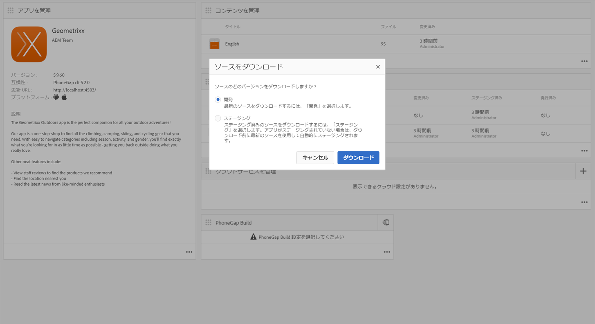
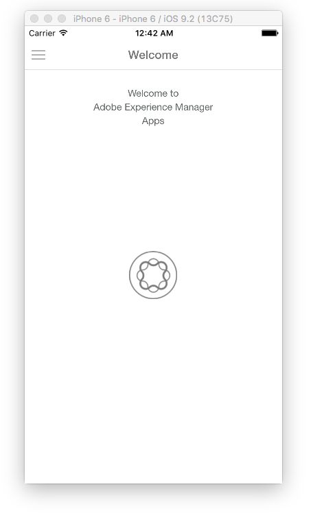

# ハイブリッドアプリの AEM Mobile 対応{#is-your-hybrid-app-ready-for-aem-mobile}

>[!NOTE]
>
>Adobeは、単一ページアプリケーションのフレームワークベースのクライアントサイドレンダリング（React など）を必要とするプロジェクトでは、SPA Editor を使用することをお勧めします。 [詳細情報](/help/sites-developing/spa-overview.md)を参照してください。

ハイブリッド PhoneGap または Cordova アプリをAEMに読み込みました。 認証可能なコンテンツをアプリに追加する場合があります。 このタスクを実行するには、AEMアプリの構造に関する一般的な理解が必要です。 AEMのアプリは、通常、2 つの部分に分かれています。 「シェル」と「コンテンツ」。 「シェル」は、アプリの静的部分で構成されます。（PhoneGap 設定ファイル、アプリフレームワーク、ナビゲーションコントロールなど）。 読み込んだアーカイブの内容は、シェルの一部として保存されます。 このドキュメントのコンテキストでは、シェルは、アプリ開発者が構築したハイブリッド PhoneGap アプリのAEM以外で作成したコンテンツです。

コンテンツとは、AEM開発者が構築したAEMで作成したコンポーネント、テンプレート、オーサリング済みページを指します。 コンテンツは、開発者向けコンテンツまたは作成済みコンテンツのどちらかに分類されます。 コンポーネント、デザイン、ページテンプレートは開発者が構築するので、開発コンテンツと見なされます。 author-content は、コンポーネントとテンプレートを使用して作成されたページです。 これらは通常、デザイナーまたはマーケターがおこないます。

作成したAEMページをハイブリッドアプリに追加するには、アプリ開発者とAEM開発者の間で調整が必要です。 アプリ内で作成したコンテンツを追加する場所であれば、アプリ開発者はAEMでオーバーレイ可能な構造にこれらのページを整理する必要があります。 アプリ開発者は、AEMが作成したコンテンツを追加する場所のパスをAEM開発者に提供し、ハイブリッドアプリにプレースホルダーページを提供できる必要があります。このページは、AEM開発者がページコンテンツを作成した後に置き換えられます。

説明を簡単に説明するために、AEMMarketing Cloudを使用します。AEM Mobileハイブリッドリファレンスを参照して、概念を説明します。 ハイブリッド参照アプリは、サイドメニュー付きのウェクロームページで構成されています。

この例では、アプリケーションのようこそページを作成します。 ソースを見る [https://github.com/Adobe-Marketing-Cloud-Apps/aem-mobile-hybrid-reference/blob/master/hybrid-app/www/js/app.js#L75](https://github.com/Adobe-Marketing-Cloud-Apps/aem-mobile-hybrid-reference/blob/master/hybrid-app/www/js/app.js#L75). アプリ開発者がようこそページを定義し、アプリによってレンダリングされるページのテンプレートを提供していることがわかります。 アプリ開発者とAEM開発者は、ここで調整をおこなう必要があります。 ハイブリッド参照アプリのようこそページテンプレートへのパスは、「content/mobileapps/hybrid-reference-app/en/welcome.template.html」と定義されています。 AEM開発者は同じパスを使用してAEMリポジトリにようこそページを作成するので、このパスは非常に重要です。

ハイブリッドアプリとAEMが作成したコンテンツは同じパスを使用することが重要です。これは、コンテンツ同期を使用して、ハイブリッドアプリに新しいページを追加するコンテンツをオーバーレイする機能に依存しているからです。 読み込みプロセスの一環としてハイブリッドアプリをAEMに読み込む場合、コンテンツ同期設定が設定されます。

アプリダッシュボードから「ソースをダウンロード」すると、これらのコンテンツ同期スクリプトが実行され、ハイブリッドアプリのアーカイブが組み立てられます。

ContentSync は、まず、ハイブリッドアプリのすべてのアプリ開発コンテンツが保存されるアプリの「シェル」を取り込み、アプリの「コンテンツ」を取り込みます。 「シェル」内に、「コンテンツ」と同じパスを持つページがある場合、「シェル」下のページは、「コンテンツ」下のページに置き換えられます。 つまり、ハイブリッド参照アプリのサンプルでは、「content/mobileapps/hybrid-reference-app/en/welcome.template.html」と同じパスを持つAEMで作成したページは、コンテンツ同期の実行時に、ハイブリッド参照アプリの一部であったページを、その場所にあるAEMのページでオーバーレイします。 オーバーレイは ContentSync によって処理されるので、アプリを使用しているユーザーにとって、AEMが作成したコンテンツを含むアプリの更新はシームレスに見え、アプリを再構築する必要はありません。 その結果、アプリを実行すると、ようこそページが次のように表示されます。

