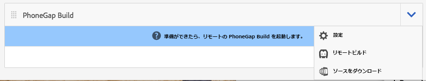
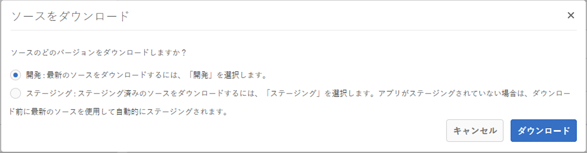
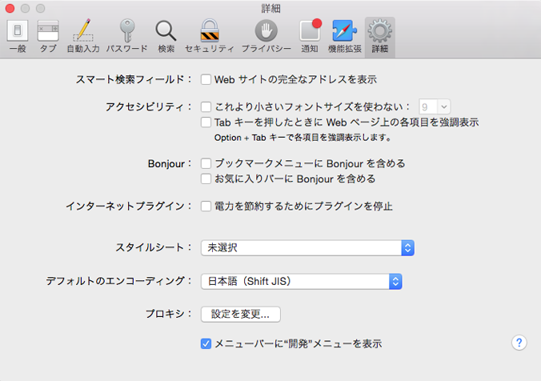

# PhoneGap CLI によるアプリの開発{#developing-apps-with-phonegap-cli}

>[!CAUTION]
>
>AEM 6.4 の拡張サポートは終了し、このドキュメントは更新されなくなりました。 詳細は、 [技術サポート期間](https://helpx.adobe.com/jp/support/programs/eol-matrix.html). サポートされているバージョンを見つける [ここ](https://experienceleague.adobe.com/docs/?lang=ja).

>[!NOTE]
>
>Adobeは、単一ページアプリケーションのフレームワークベースのクライアントサイドレンダリング（React など）を必要とするプロジェクトでは、SPA Editor を使用することをお勧めします。 [詳細情報](/help/sites-developing/spa-overview.md)を参照してください。

開発環境を設定している場合は、開発者として、いつでもデバイス上またはエミュレーター内でアプリケーションを実行できます。

次の例を実行するには、Xcode で OSx(Mac) を実行するシステムか、Android SDK がインストールされたMac/Win/Linux システムが必要です。

## Bootstrap環境 {#bootstrap-your-development-environment}

[PhoneGap CLI の設定](https://docs.phonegap.com/en/4.0.0/guide_cli_index.md.html#The%20Command-Line%20Interface)

iOSの場合：iPhone および iPad 向けの開発をおこなうには、Apple Xcode IDE を使用する必要があります。

* 無料でダウンロードできます [ここ](https://developer.apple.com/xcode/downloads/).
* [PhoneGap iOS platform ガイド](https://docs.phonegap.com/en/4.0.0/guide_platforms_ios_index.md.html#iOS%20Platform%20Guide)

Android の場合：iPhone および iPad 向けの開発を行うには、Googleの Android Studio IDE が必要です。

* 無料でダウンロードできます [ここ](https://developer.android.com/sdk/index.html).
* [PhoneGap Android プラットフォームガイド](https://docs.phonegap.com/en/4.0.0/guide_platforms_android_index.md.html#Android%20Platform%20Guide)

## ソースのダウンロード {#download-the-source}

開発環境を正常にブーストラップしたら、AEM App Build タイルからソースをダウンロードします。

* 「PhoneGap Buildタイル」ドロップダウンの山形をクリックします。



* 「ソースをダウンロード」をクリックします。
* 「ソースをダウンロード」モーダルから目的のソースを選択します。



>[!NOTE]
>
>開発ソースには、非ステージ化された変更が含まれ、アプリの最新の状態が含まれます。 アプリストアベンダーに送信するリリース候補を構築するには、ステージングソースを使用します。
>
>アプリをステージングしない場合、「ステージング」を選択すると、ステージングワークフローがトリガーされます ( ヒント：これは、AppStore とGoogle PlayStore で使用できる PhoneGap Enterprise Viewer App にステージング済みアプリとして表示されます。

* 「ダウンロード」をクリックし、ZIP をローカルマシンに保存します。
* ダウンロードした zip ファイルをワークスペースに展開します。

## （ソースから）アプリをビルドして読み込む {#build-and-load-the-app-from-source}

PhoneGap CLI は、プラットフォームプロジェクトの作成、ソースのコンパイル、1 つのコマンドでのアプリのデプロイを行うことができます。

>[!NOTE]
>
>これらの手順はすべて個別に実行できます。詳しくは、 [PhoneGap CLI ドキュメント](https://phonegap.com/blog/2014/11/13/phonegap-cli-3-6-3/).

1. PhoneGap CLI をインストール済みであることを確認します。上記を参照してください。
1. コンソール（またはターミナル）ウィンドウで、抽出したソースのルートディレクトリに移動します。
1. 以下のコマンドを入力します。

```xml
phonegap run android

// -- or -- //

phonegap run ios
```

>[!NOTE]
>
>この時点で問題が発生した場合は、基本に戻ってトラブルシューティング —
>
>1. 新しいフォルダーを作成します（mkdir テスト）
>1. この新しいフォルダーに移動します（cd テスト）
>1. 「phonegap create helloWorld」を実行します。
>1. helloWorld(cd helloWorld) に移動します。
>1. 「phonegap run android」を実行します（または上記のように android を ios に置き換えます）。
>1. 新しく作成した PhoneGap アプリを実行するとエミュレーターが開き、ネイティブへの JavaScript ブリッジが動作している場合は「Device Ready」と表示されます。

>
>これにより、PhoneGap CLI 開発環境が起動し、正しく動作していることを確認します。

## Safari およびIOSデバッグでの JavaScript のデバッグ {#debug-javascripts-with-safari-and-ios-debug}

Web アプリケーションの場合と同様に、Safari の開発者ツールを使用して、アプリの JavaScript をデバッグできます。

## Safari 開発者ツールの有効化 {#enable-safari-developer-tools}

開発者ツールを有効にするには：

* Safari の環境設定を開きます。

   * メニューバーで Safari をクリックします。
   * 環境設定をクリック

* 「プリファレンス」ウィンドウで「詳細」をクリックします。



* 「メニューバーに開発メニューを表示」をオンにします。
* 「プリファレンス」ウィンドウを閉じます。

## Safari をiOSに接続 {#connect-safari-to-ios}

Safari は、iOSデバイスまたはエミュレーターに接続できます。

* コンソールウィンドウで、抽出したソースのルートディレクトリに移動します。
* 次のコマンドを入力して、デバイスまたはエミュレーターでアプリを起動します。

```xml
phonegap run <platform> --device

// -- or -- //

phonegap run <platform> --emulator
```

* Safari を開く
* メニューバーの「開発」をクリックします。
* 「 iOS Simulator 」サブメニューを選択します。
* home.html をクリックします。


## Safari の Web インスペクタでの JavaScript のデバッグ {#debug-javascript-with-safari-s-web-inspector}

ソースの任意の場所にブレークポイントを設定できます。 エミュレーターまたはデバイスとやり取りする場合、アプリの実行はこれらのブレークポイントで停止します。 実行を順を追って進め、変数内の値を調べることができます。

* [Web インスペクタ ] ウィンドウで [ リソース ] をクリックします。
* ソースツリーに移動し、目的のソースファイルをクリックします。
* 隣の行番号をクリックして、ブレークポイントを追加します。
* デバイスまたはエミュレーターとやり取りする


* コントロールボタンを使用して、メソッドの実行、ステップオーバー、ステップインおよびステップアウトを続行します。


>[!NOTE]
>
>変数の値を確認するには、現在のメソッドで、マウスにマウスポインターを置きます。

## 次の手順 {#the-next-steps}

PhoneGap CLI を使用したアプリの開発について詳しくは、 [デバイスの機能へのアクセス](/help/mobile/phonegap-access-device-features.md).
