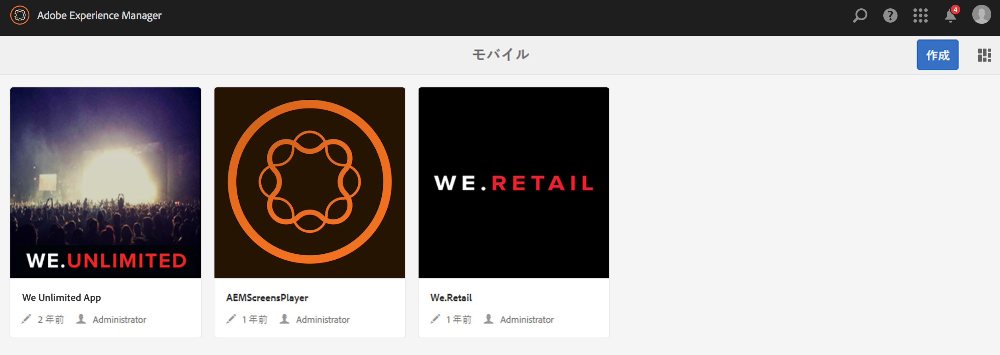
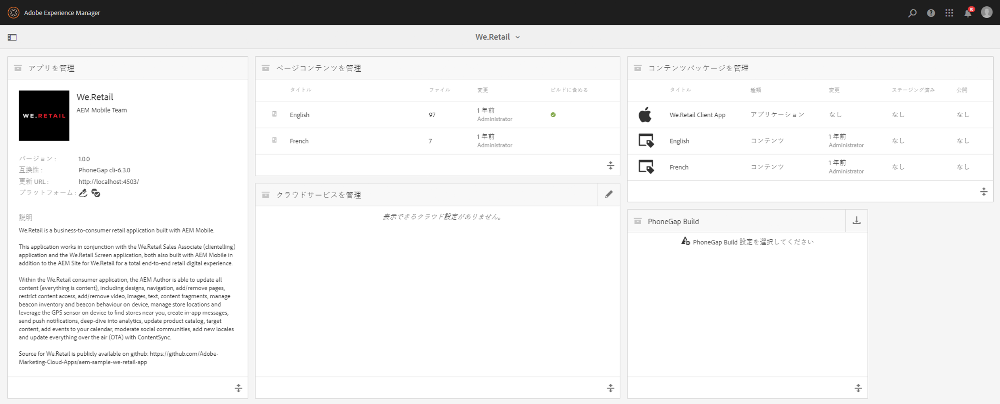
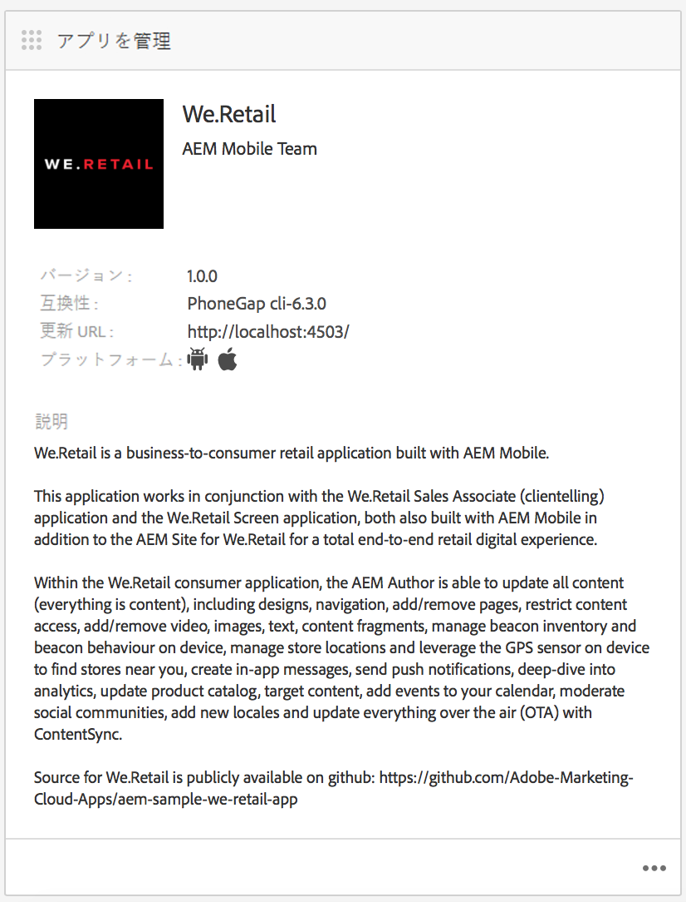
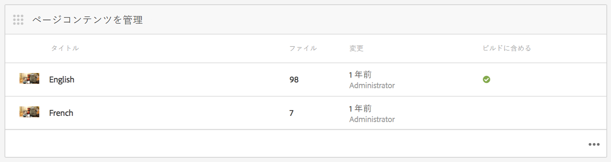
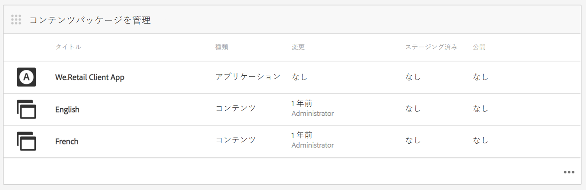
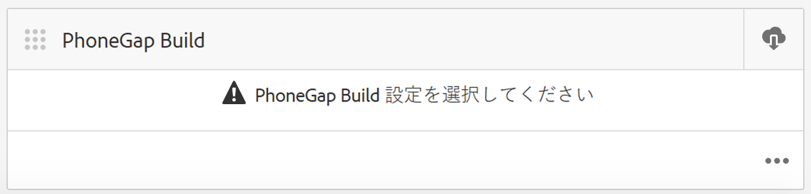
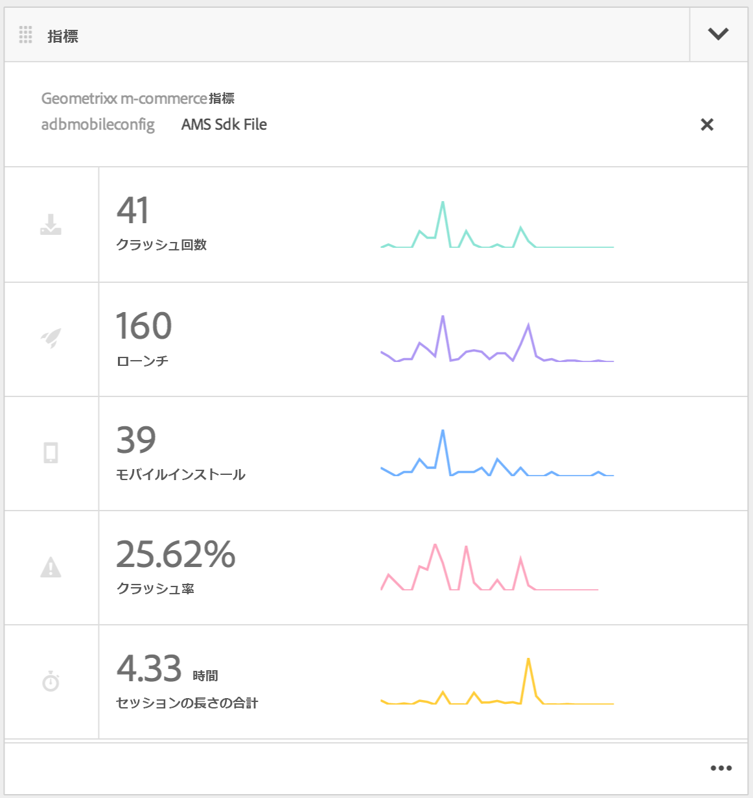
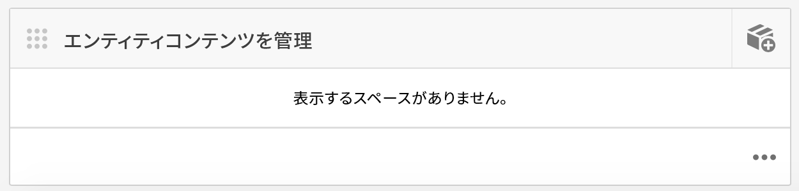

# モバイルアプリケーションのオーサリング{#authoring-mobile-applications}

>[!CAUTION]
>
>AEM 6.4 の拡張サポートは終了し、このドキュメントは更新されなくなりました。 詳細は、 [技術サポート期間](https://helpx.adobe.com/jp/support/programs/eol-matrix.html). サポートされているバージョンを見つける [ここ](https://experienceleague.adobe.com/docs/?lang=ja).

>[!NOTE]
>
>Adobeは、単一ページアプリケーションのフレームワークベースのクライアントサイドレンダリング（React など）を必要とするプロジェクトでは、SPA Editor を使用することをお勧めします。 [詳細情報](/help/sites-developing/spa-overview.md)を参照してください。

AEM Mobileダッシュボードを使用すると、モバイルアプリケーションの作成、構築、デプロイ、アプリケーションメタデータの作成、削除、編集をおこなうことができます。 アプリケーションが稼働したら、ライフサイクル指標や使用指標を含むアプリケーション分析を実行して、顧客コンバージョンとブランドロイヤルティを向上させることができます。

AEM Mobileアプリケーションを構築するには、 [モバイルアプリケーションの構築](/help/mobile/building-app-mobile-phonegap.md) ページ。

環境を設定して使い始めるには、 [AEM PhoneGap Enterprise を使用するためのAEMの管理](/help/mobile/administer-phonegap.md).

## AEM Mobile Apps カタログ {#the-aem-mobile-apps-catalog}

この [AEM Mobile Apps カタログ](http://localhost:4502/aem/apps.html/content/phonegap) は、AEMで管理されているすべてのモバイルアプリを表示します。

このカタログは、AEM Mobileの「ランディングページ」と考えて、管理者は、テンプレートに基づいて作成するか、モバイル開発者が既に開始した既存のアプリをアップロードすることで、新しいAEM Mobileアプリを開始できます。

アプリカタログのランディングページにアクセスするには、次の手順に従います。

1. 参照先 **ナビゲーション** 次を選択します。 **モバイル**.

1. 選択 **アプリ** をクリックして、アプリカタログを開きます。

## AEM Mobile App ダッシュボード {#the-aem-mobile-app-dashboard}

カタログからAEM Mobileアプリを選択すると、そのアプリのダッシュボードが表示されます。 ここでは、アプリの管理、統計の表示、モバイルアプリコンテンツの構築、デプロイ、管理をおこなうことができます。

AEM Mobileダッシュボードの各タイルを展開して、「。..」をクリックし、詳細を表示または編集できます。 をクリックします。

### アプリを管理タイル {#the-manage-app-tile}

アプリを管理タイルには、アプリケーションのアイコン、名前、説明、サポートされているプラットフォーム、更新用のホーム URL およびバージョン情報が表示されます。 このタイルをドリルダウンして、PhoneGap アプリケーション設定 (config.xml) を編集および管理し、配布用に様々なアプリケーションストアに送信するためのアプリケーションを準備できます。

クリック [ここ](/help/mobile/phonegap-app-details-tile.md) 」を参照してください。

### ページコンテンツを管理タイル {#the-manage-page-content-tile}

AEM Sites内でおこなうのと同じ方法で、AEM Mobileでコンテンツを作成、更新および削除できます。 この **ページコンテンツを管理タイル** 管理されているコンテンツのページ数と最終変更日を表示します。 タイル内の各レコードをクリックして、コンテンツをドリルダウンし、ページの作成、コピー、移動、削除および更新を行うことができます。 コンテンツが更新されたら、 **コンテンツパッケージを管理タイル。**

### コンテンツパッケージを管理タイル {#the-manage-content-packages-tile}

ページコンテンツを管理タイルでコンテンツを追加または変更したら、コンテンツリリースの更新を使用して、変更を顧客にプッシュできます。

コンテンツパッケージを使用すると、AEMアプリ作成者はAEMでページコンテンツを管理し、開発チームに PhoneGap Shell アプリケーション（アプリフレームワークまたはインフラストラクチャ）を変更してもらい、開発者に配布用に様々なストアに再送信する必要がなく、迅速に顧客に変更をプッシュできます。

コンテンツパッケージは、更新ごとにコンテンツリリースパッケージと見なされる ZIP ファイルを作成します。 これらのパッケージには、アプリのレンダリング時に生成される html リソースと html ページが含まれ、最後の更新以降に変更されたファイルのみをパッケージ化するのに十分なインテリジェントです。

コンテンツパッケージを管理タイルの **タイプ** 列には、アプリケーションシェルコンテンツ（開発者が管理するアプリのフレームワークやインフラストラクチャなど）を示す「アプリ」、コンテンツ作成者が管理するページコンテンツを表す「コンテンツ」が表示されます。

コンテンツは、言語として、またはアプリで複数のコンテンツリリースパッケージを使用するアプリの特定の部分として表すことができます。 コンテンツのバンドル方法の選択は、アプリケーションのコンテンツを管理する方法に応じた柔軟性と完全な設計になっています。

この **変更済み** 列には、ページが最も最近変更された日時が示されます。

この **Staged** 列には、最後のコンテンツ更新がいつ作成されたかが表示されます。 新しいコンテンツ更新を作成し、変更をステージングするには、タイル内の任意のレコードを開き、新しい更新を作成します。

この **公開済み** 列には、最後のコンテンツ更新が公開され、顧客が使用できるようになった日時が表示されます。 コンテンツを公開するには、まずそのコンテンツをステージングしてから、このタイルにドリルダウンしてコンテンツリリースの詳細コンソールから公開することで、更新を公開する必要があります。

 

このアイコンは、アプリシェルのコンテンツリリースパッケージを表します

これらのアイコンは、アプリコンテンツのコンテンツリリースパッケージを表します

### PhoneGap Buildタイル {#the-phonegap-build-tile}

この **PhoneGap Buildタイル** 接続先 [https://build.phonegap.com](https://build.phonegap.com) リモートビルドを作成し、ホストします。 ビルドが完了すると、ビルドはダウンロードとして、または QR コードを介して直接デバイスで利用できるようになります。

または、デバイスソースをダウンロードし、 [PhoneGap CLI](https://docs.phonegap.com/en/3.5.0/guide_cli_index.md.html).

### 指標タイル {#the-metrics-tile}

>[!CAUTION]
>
>指標タイルは、Cloud Service を設定した後にのみ表示されます。
>
>詳しくは、 [AdobeMobile ServicesCloud Service](/help/mobile/configure-adobe-mobile-cloud-service.md) 」を参照してください。

AEM Mobileは、 [AdobeMobile Services SDK](https://www.adobe.com/ca/solutions/digital-marketing/mobile-services/app-sdk.html) (AMS) を使用します。

コントロールセンター **指標タイル** アプリケーション用に AMS から取得した概要分析を表示します。 「。..」をクリックして、Analytics ダッシュボードにドリルダウンできます。 右下に

### エンティティコンテンツを管理タイル {#the-manage-entity-content-tile}

エンティティコンテンツを管理タイルでは、アプリの定義を追加および管理できます。 アプリの定義は、アプリに適したスペース（およびその他の設定）を特定する方法です。 これにより、アプリを再コンパイルする必要なく、新しいスペースを追加できます。 アプリの定義が更新され、新しいスペースの情報が含まれます。

クリック [ここ](/help/mobile/phonegap-app-definitions.md) をクリックして、アプリの定義を作成および管理します。

「。..」をクリックして、エンティティコンテンツを管理ダッシュボードにドリルダウンできます。 右下に

#### その他のリソース {#additional-resources}

管理者および開発者の役割と責務について詳しくは、以下のリソースを参照してください。

* [AEMを使用したAdobe PhoneGap Enterprise 向け開発](/help/mobile/developing-in-phonegap.md)
* [AEM を使用した Adobe PhoneGap Enterprise のコンテンツの管理](/help/mobile/administer-phonegap.md)
