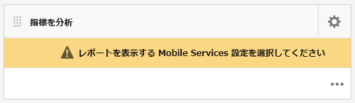
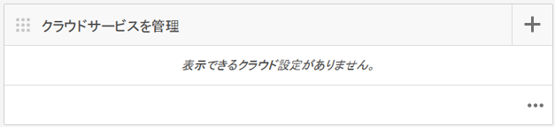
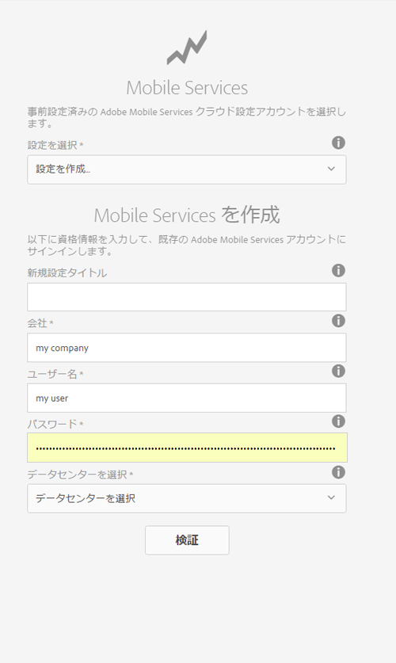
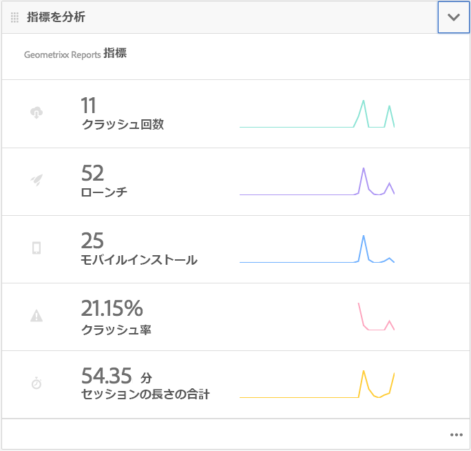
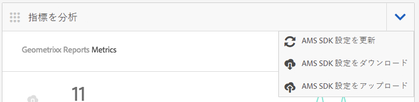
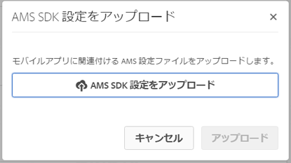

# Adobe Mobile Analytics によるアプリパフォーマンスのトラッキング{#track-app-performance-with-adobe-mobile-analytics}

>[!NOTE]
>
>Adobeは、単一ページアプリケーションのフレームワークベースのクライアントサイドレンダリング（React など）を必要とするプロジェクトでは、SPA Editor を使用することをお勧めします。 [詳細情報](/help/sites-developing/spa-overview.md)を参照してください。

より高い顧客コンバージョンと忠誠度を実現したいと考えています。

顧客に関連性の高い魅力的なエクスペリエンスを提供したい。

AEM Mobileアプリはマーケティングキャンペーンで何をしていますか？

モバイルアプリケーションを微調整して、ユーザーに最適なエクスペリエンスを提供する方法を教えてください。

AdobeMobile Services を使用すると、使用状況、アプリのクラッシュ回数、デバイスの詳細など、モバイルアプリに関する様々な重要な指標を追跡することで、モバイルアプリのユーザーの使用方法に関するインサイトを得ることができます。

Adobe Experience Manager Mobileは、AEM Mobile Application Dashboard から直接モバイル分析の詳細を表示します。 この **モバイル指標タイル** のダッシュボードには、モバイルアプリケーションのリアルタイム分析が用意されており、開発者、作成者および管理者はモバイルアプリの状態をすばやく把握できます。 分析を支えるカバーの下には、 [Adobeモバイル分析](https://www.adobe.com/ca/solutions/digital-analytics/mobile-web-apps-analytics.html) SDK. AdobeMobile Analytics SDK は、ネイティブで、または Web ビュー用の PhoneGap ブリッジプラグインを通じて、アプリケーションにプラグインできます。 指標は収集され、デバイスが接続されるまでデバイス上でキャッシュされ、そのデータがAdobeの Mobile Services クラウドにプッシュされて、レポートと分析がおこなわれます。

AdobeMobile Analytics SDK は、次の機能を提供します。

1. **モバイルチャネルのデータ収集**  — すべての主要なオペレーティングシステム上のモバイル Web サイトやアプリの包括的なデータを収集します。
1. **モバイルエンゲージメント分析**  — モバイルアプリ、Web サイトまたはビデオ内でのユーザーエンゲージメントを把握します。これには、消費者がチャネルを起動する頻度、チャネルから購入するかどうかなどが含まれます。
1. **モバイルアプリのダッシュボードとレポート**  — アプリやアプリストア指標のライフサイクル指標を含む使用状況レポートを取得します。ユーザー、起動回数、平均セッション長、リテンション長、クラッシュ回数のトレンドを確認できます。
1. **モバイルキャンペーン分析** - SMS、モバイル検索広告、モバイルディスプレイ広告、QR コードなど、モバイル固有のキャンペーンの効果を定量化します。
1. **位置情報分析**  — アプリのユーザーが起動した場所や、GPS の位置や目標地点によってモバイルエクスペリエンスとやり取りする場所を特定します。
1. **パス分析**  — ユーザーがアプリ内をどのように移動して、ユーザーを引き付けている画面や UI 要素を特定し、ユーザーをドロップオフにさせるかを確認します。

この節では、 [AEM Developers](#developers) 分析追跡を使用してAEM Mobileアプリを実装する方法を学ぶことができます。

最後に [AEM Administrators](#administrators) 学習内容：

* クラウドサービスを作成して Mobile Services をAdobe
* モバイルサービス設定の作成とレポートスイートの関連付け
* モバイルアプリにモバイルサービス設定を関連付ける
* AEM Apps コマンドセンターから指標を表示
* モバイルアプリに AMS SDK 設定を割り当て

## 開発者向け — アプリへの Analytics の統合 {#for-developers-integrate-analytics-into-your-app}

**前提条件：** AEM管理者は、Mobile Services クラウド設定Adobe、 [以下で説明するように](#amscloudserviceconfig).

開発者は [AEM Mobileアプリへの analytics の追加](/help/mobile/phonegap-add-analytics-to-apps.md) 必要に応じて、ユーザーがモバイルアプリコンテンツとどのように関わっているかを追跡、レポートおよび理解し、起動回数、アプリ内時間、クラッシュ率などの主要なライフサイクル指標を測定します。

## 管理者向け —AdobeMobile ServicesCloud Service {#for-administrators-configure-the-adobe-mobile-services-cloud-service}

Mobile Services のAdobeを活用するには、AEMAdobeMobile ServicesCloud ServiceをAdobe Analyticsアカウント情報と共に設定する必要があります。 Apps コマンドセンターでは、 **指標を分析** クラウドサービスを作成し、モバイルアプリに関連付けることができるタイル。

指標を分析タイルにある歯車アイコンをクリックして、モバイルアプリに対するクラウドサービスの設定を開始します。

指標を分析タイルの歯車アイコンをクリックすると、「Mobile Services Analytics を設定」モーダルダイアログが開きます。 「Mobile Service 設定を選択」ドロップダウンから設定を選択します。 新しい設定を作成する必要がある場合は、レンチボタンをクリックします。

AdobeMobile Services クラウドサービスを作成するには、サービスへの接続と、設定に割り当てるレポートスイートの選択の 2 つの手順が必要です。

まず、ダッシュボードの「Cloud Servicesを管理」タイルの「+」ボタンをクリックします。

「**+**「 」ボタン、 **追加Cloud Service** ウィザードが表示されます。

次に示すように、必須フィールドに入力して、新しい Mobile Service 設定を選択または作成します。 AEM管理者が Mobile Services への接続を正常に作成するには、この情報が必要です。

Mobile Services アカウント設定が完了したら、アプリを選択するよう求められます。 これにより、AdobeMobile Services 分析レポートがそのアプリケーションに接続されます。

目的のモバイルサービスを選択し、「更新」をクリックしてモバイルサービス設定を割り当て、ダイアログを閉じます。

モバイルサービス設定をAEM Mobileアプリに関連付けたので、タイルは指標データの取得とレポートの作成を開始します。

### AdobeMobile Services SDK 設定ファイル {#adobe-mobile-services-sdk-config-file}

この時点で、モバイルアプリケーションはクラウドサービスに関連付けられていますが、モバイルアプリケーションは、収集されたモバイル指標をAdobe Analyticsに返す方法をまだ知っていません。 モバイルアプリをAdobe Analyticsにワイヤアップするには、AdobeMobile Services SDK 設定ファイルをAdobe Experience Managerに追加する必要があります。

指標を分析タイルで矢印アイコンをクリックし、「 AMS SDK 設定をダウンロード/アップロード」メニューエントリを表示します。

最初の手順は、AdobeMobile Services から SDK 設定を取得することです。「AMS SDK 設定をダウンロード」をクリックすると、AdobeMobile Services の Web サイトにリダイレクトされ、設定ファイルをダウンロードできます。 ADBMobileConfig.json ファイルを取得したら、「AMS SDK 設定をアップロード」をクリックして、設定ファイルをAEMにアップロードします。

「AdobeMobile Services アプリ設定をアップロード」ボタンをクリックし、ADBMobileConfig.json ファイルを参照して、「アップロード」をクリックします。

モバイルアプリは ADBMobileConfig.json ファイルにアクセスできるので、Adobe Analyticsとやり取りする方法と、アプリの成功を促す重要な指標値のレポートを開始する方法に関する知識を持っています。

## 次の手順? {#what-s-next}

1. [AEM Mobileアプリのエクスペリエンスを開始する](/help/mobile/starting-aem-phonegap-app.md)
1. [アプリのコンテンツを管理](/help/mobile/phonegap-manage-app-content.md)
1. [アプリケーションのビルド](/help/mobile/building-app-mobile-phonegap.md)
1. [アプリのモバイル分析を使用してAdobeのパフォーマンスを追跡する](/help/mobile/phonegap-intro-to-app-analytics.md)
1. [Adobe Targetでパーソナライズされたアプリエクスペリエンスを配信](/help/mobile/phonegap-aem-mobile-content-personalization.md)
1. [ユーザーに重要なメッセージを送信する](/help/mobile/phonegap-push-notifications.md)
