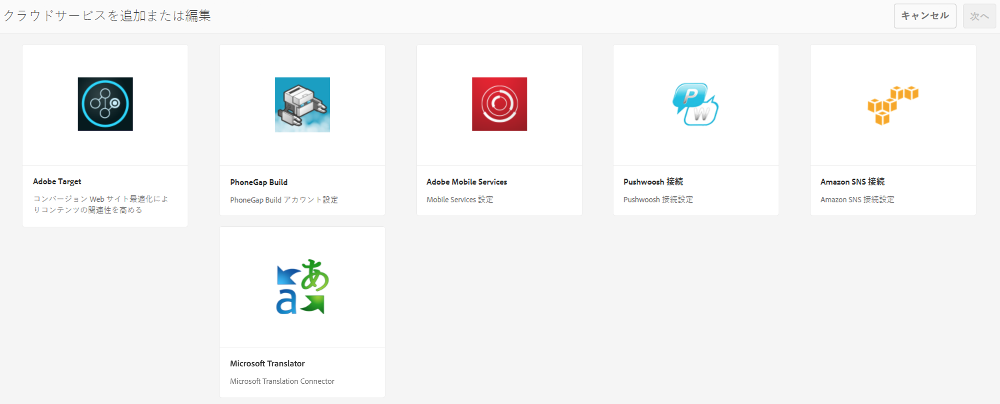
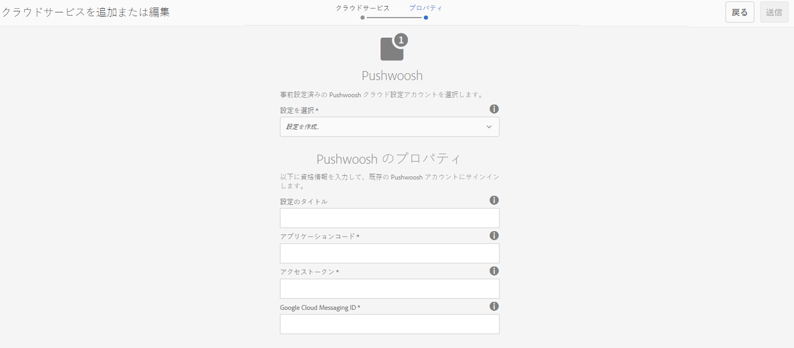
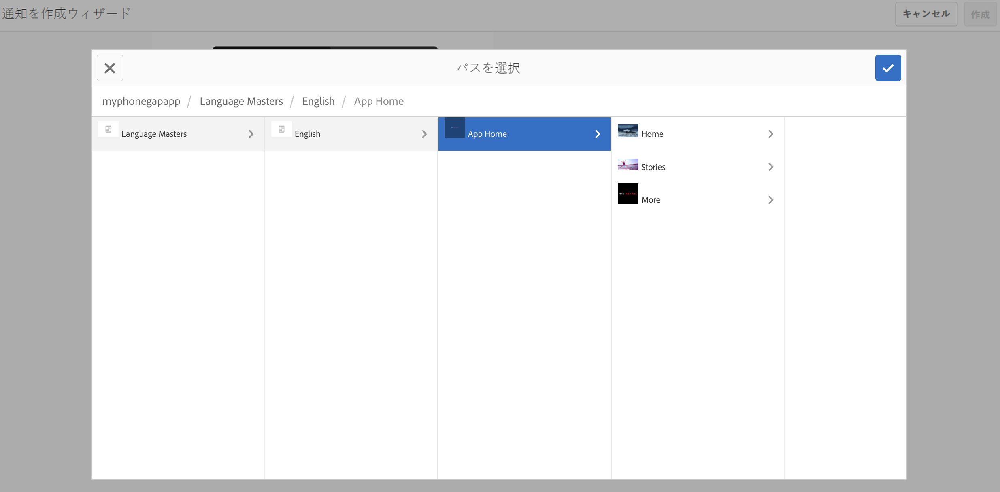

# プッシュ通知{#push-notifications}

>[!CAUTION]
>
>AEM 6.4 の拡張サポートは終了し、このドキュメントは更新されなくなりました。 詳細は、 [技術サポート期間](https://helpx.adobe.com/jp/support/programs/eol-matrix.html). サポートされているバージョンを見つける [ここ](https://experienceleague.adobe.com/docs/?lang=ja).

>[!NOTE]
>
>Adobeは、単一ページアプリケーションのフレームワークベースのクライアントサイドレンダリング（React など）を必要とするプロジェクトでは、SPA Editor を使用することをお勧めします。 [詳細情報](/help/sites-developing/spa-overview.md)を参照してください。

重要な通知を使用して、AEM Mobileアプリのユーザーに即座に警告できることは、モバイルアプリとそのマーケティングキャンペーンの価値にとって重要です。 ここでは、アプリがプッシュ通知を受信できるようにする必要がある手順と、AEM Mobileから携帯電話にインストールされたアプリにプッシュを設定して送信する方法について説明します。 また、この節では、 [ディープリンク](#deeplinking) 機能をプッシュ通知に追加します。

>[!NOTE]
>
>*プッシュ通知は、配信を保証しません。お知らせに似ています。 誰もが確実に受け取れるように最善を尽くしていますが、保証された配信メカニズムではありません。 また、プッシュの配信時間は、1 秒未満から 30 分まで様々です。*

AEMでプッシュ通知を使用するには、いくつかの異なるテクノロジーが必要です。 まず、プッシュ通知サービスプロバイダーを使用して、通知とデバイスを管理する必要があります (AEMでは、まだおこなっていません )。 AEMでは、次の 2 つのプロバイダーが標準で設定されています。 [Amazon Simple Notification Service](https://aws.amazon.com/sns/) （または SNS）、 [Pushwoosh](https://www.pushwoosh.com/). 次に、特定のモバイル OS のプッシュテクノロジーは、適切なサービス (Appleのプッシュ通知サービス (APNS)、iOSデバイス用 ) を経由する必要があります。Android デバイス用のGoogle Cloud Messaging（または GCM）と AEMは、これらのプラットフォーム固有のサービスと直接通信しませんが、これらのサービスがプッシュを実行するには、AEMで関連する設定情報を通知と共に提供する必要があります。

（以下で説明するように）インストールおよび設定が完了すると、次のように機能します。

1. プッシュ通知がAEMで作成され、サービスプロバイダー (Amazon SNS または Pushwoosh) に送信されます。
1. サービスプロバイダーがこれを受け取り、コアプロバイダー（APNS または GCM）に送信します。
1. コアプロバイダーは通知をそのプッシュに登録されているすべてのデバイスにプッシュします。 各デバイスでは、携帯電話データネットワークまたは WiFi を使用します（デバイスで現在使用可能な方を選択）。
1. 登録されたアプリが実行されていない場合、通知がデバイスに表示されます。 ユーザーが通知をタップすると、アプリが起動し、アプリ内で通知が表示されます。 アプリケーションが既に実行されている場合は、アプリ内通知のみが表示されます。

このリリースのAEMでは、iOSと Android のモバイルデバイスがサポートされます。

## 概要と手順 {#overview-and-procedure}

AEM Mobileアプリでプッシュ通知を使用するには、次の大まかな手順を実行する必要があります。

通常、AEM開発者は次の操作をおこないます。

1. AppleおよびGoogleメッセージングサービスへの登録
1. プッシュメッセージサービスへの登録と設定
1. アプリにプッシュサポートを追加
1. テスト用に電話を準備する

AEM管理者は次の操作を実行します。

1. AEMアプリでのプッシュの設定
1. アプリのビルドとデプロイ
1. プッシュ通知の送信
1. ディープリンクの設定 *（オプション）*

### 手順 1:AppleおよびGoogleメッセージングサービスへの登録 {#step-register-with-apple-and-google-messaging-services}

#### Appleプッシュ通知サービス (APNS) の使用 {#using-the-apple-push-notification-service-apns}

Appleページに移動します。 [ここ](https://developer.apple.com/library/ios/documentation/NetworkingInternet/Conceptual/RemoteNotificationsPG/Chapters/ApplePushService.html) Apple Push Notification Service に慣れるためのツールです。

APNS を使用するには、 **証明書** ファイル（.cer ファイル）、プッシュ **秘密鍵** （.p12 ファイル）と **秘密鍵のパスワード** Appleから その方法に関する説明は、 [ここ](https://developer.apple.com/library/ios/documentation/NetworkingInternet/Conceptual/RemoteNotificationsPG/Chapters/ProvisioningDevelopment.html).

#### Google Cloud Messaging(GCM) サービスの使用 {#using-the-google-cloud-messaging-gcm-service}

>[!NOTE]
>
>Googleは、GCM を Firebase Cloud Messaging(FCM) と呼ばれる類似のサービスに置き換えています。 FCM の詳細については、 [ここ](https://developers.google.com/cloud-messaging/faq).

Googleページに移動します。 [ここ](https://developer.android.com/google/gcm/index.html) を参照して、Google Cloud Messaging for Android に慣れてください。

次の手順に従う必要があります [ここ](https://developer.android.com/google/gcm/gs.html) から **Google API プロジェクトの作成**, **GCM サービスの有効化**、および **API キーの取得**. 次が必要です： **API キー** をクリックして、Android デバイスにプッシュ通知を送信します。 また、 **プロジェクト番号**（別名） **GCM Sender Id**.

次の手順は、GCM API キーを作成する別の方法を示しています。

1. google にログインし、 [Google Developer ページ](https://developers.google.com/mobile/add?platform=android&amp;cntapi=gcm).
1. リストからアプリを選択します（または新しく作成します）。
1. 「Android パッケージ名」に、アプリ ID( `com.adobe.cq.mobile.weretail.outdoorsapp`. （うまくいかない場合は、「test.test」を使用して再度お試しください。）
1. クリック **続行：サービスの選択と設定**
1. Cloud Messaging を選択し、 **Google Cloud Messaging の有効化**.
1. 新しいサーバー API キーと（新規または既存の） Sender ID が表示されます。

>[!NOTE]
>
>サーバー API キーを記録します。 この値は、プッシュプロバイダーのサイトに入力されます。

### 手順 2:プッシュメッセージサービスの登録と設定 {#step-register-and-configure-a-push-messaging-service}

AEMは、プッシュ通知に次の 3 つのサービスのいずれかを使用するように設定されています。

* Amazon SNS
* Pushwoosh
* Adobe Mobile Services

*Amazon SNS* および *Pushwoosh* 設定を使用すると、AEM screens 内からプッシュを送信できます。

*AdobeMobile Services* 設定を使用すると、Adobe Analyticsアカウントを使用して、AdobeMobile Services 内からプッシュ通知を設定および送信できます（ただし、AMS プッシュ通知を有効にするには、この設定でアプリを構築する必要があります）。

#### Amazon SNS メッセージサービスの使用 {#using-the-amazon-sns-messaging-service}

>[!NOTE]
>
>*Amazon SNS に関する情報と、新しいAWSアカウントを作成するためのリンクが含まれています [ここ](https://aws.amazon.com/sns/). 1 年間無料のアカウントを受け取ることができます。*

Amazon SNS を使用しない場合は、これらの手順をスキップできます。

プッシュ通知用にAmazon SNS を設定するには、次の手順に従います。

1. **Amazon SNS に登録**

   1. アカウント ID を記録します。 形式は、スペースやダッシュを含まない 12 桁の数字にする必要があります。&quot;123456789012&quot;.
   1. 後の手順（ID プールの作成）では、これらのいずれかが必要なので、「us-east」または「eu」地域にいることを確認します。
   1. 登録後、管理コンソールにログインし、「 」を選択します。 [SNS](https://console.aws.amazon.com/sns/) （プッシュ通知サービス）。 「使ってみる」をクリックします（表示された場合）。

1. **アクセスキーと ID を作成**

   1. 画面の右上にあるログイン名をクリックし、メニューから「Security Credentials」を選択します。
   1. 「アクセスキー」をクリックし、下のスペースで、 **新しいアクセスキーを作成**.
   1. クリック **アクセスキーを表示**&#x200B;をクリックし、表示されたアクセスキー ID と秘密アクセスキーをコピーして保存します。 キーをダウンロードするオプションを選択すると、同じ値を含む csv ファイルが取得されます。
   1. このページでは、他のセキュリティ関連証明書などを管理できます。

   >[!NOTE]
   >
   >アクセスキーは、複数のアプリで使用できます。

   「AWS Sandbox」アカウントを使用する組織の場合の手順は非常に似ており、以下で概要を説明します。

   1. 画面の右上にあるログイン名をクリックし、メニューから [My Security Credentials] を選択します。
   1. アクションの左側のリストで「ユーザー」をクリックし、ユーザー名を選択します。
   1. 「セキュリティ資格情報」タブをクリックします。
   1. ここから、鍵が表示され、新しい鍵が作成されます。 後で使用するためにキーを保存します。

1. **トピックの作成**

   1. クリック **トピックを作成** トピック名を選択します。 トピック ARN、トピック所有者、地域、表示名など、すべてのフィールドを記録します。
   1. クリック **その他のトピックアクション** > **トピックポリシーの編集**. の下 **これらのユーザーに対し、このトピックの購読を許可**&#x200B;を選択します。 **皆さん。**
   1. クリック **ポリシーを更新**.

   >[!NOTE]
   >
   >開発、テスト、デモなど、様々なシナリオ用に複数のトピックを作成できます。 残りの SNS 構成は同じままにすることができます。 別のトピックでアプリを構築します。そのトピックに送信されたプッシュ通知は、そのトピックで作成されたアプリでのみ受信されます。

1. **Platform アプリケーションの作成**

   1. 「アプリケーション」をクリックし、「Platform アプリケーションを作成」をクリックします。 名前を選択し、プラットフォーム (iOSの場合は APNS、Android の場合は GCM) を選択します。 プラットフォームに応じて、他のフィールドに入力する必要があります。

      1. APNS の場合、P12 ファイル、パスワード、証明書および秘密鍵をすべて入力する必要があります。 これらは、手順で取得されたはずです。 *Appleプッシュ通知サービス (APNS) の使用* 上
      1. GCM の場合、API キーを入力する必要があります。 これは、手順で取得されたはずです。 *Google Cloud Messaging(GCM) サービスの使用* 上
   1. サポートするプラットフォームごとに、上記の手順を 1 回繰り返します。 iOSと Android の両方にプッシュできるようにするには、2 つの Platform アプリケーションを作成する必要があります。

1. **ID プールの作成**

   1. 用途 [コグニト](https://console.aws.amazon.com/cognito) ：未認証ユーザーの基本データを格納するアイデンティティ・プールを作成します。 現時点では、Amazon Cognito では「us-east」および「eu」地域のみがサポートされています。
   1. 名前を指定し、「未認証 ID へのアクセスを有効にする」チェックボックスをオンにします。
   1. 次のページ (*Cognito ID は、リソースへのアクセスを必要とします*&quot;) [ 許可 ] をクリックします。
   1. ページの右上で、「*ID プールを編集»*. ID プール ID が表示されます。 後で使用するために、このテキストを保存します。
   1. 同じページで、「Unauthenticated role」の横のドロップダウンを選択し、Cognito_&lt;pool name=&quot;&quot;>UNAUTHrole が選択されています。 変更を保存します。

1. **アクセスを設定**

   1. ログイン先 [ID とアクセスの管理](https://console.aws.amazon.com/iam/home) (IAM)
   1. ロールを選択
   1. 前の手順で作成した役割 (Cognito_) をクリックします。&lt;youridentitypoolname>Unauth_Role。 表示された「役割 ARN」を記録します。
   1. 「インラインポリシー」を開く（まだ開いていない場合）。 ここに、oneClick_Cognito_のような名前のポリシーが表示されます。&lt;youridentitypoolname>Unauth_Role_1234567890123.
   1. 「ポリシーを編集」をクリックします。 ポリシードキュメントのコンテンツを JSON の次のスニペットに置き換えます。

   <table> 
    <tbody> 
     <tr> 
     <td>
 
 
{
 
 "バージョン":"2012-10-17"
 
 "ステートメント": [
 
 {
 
 "アクション": [
 
 "mobileanalytics:PutEvents",
 
 "cognito-sync:*",
 
 "SNS:CreatePlatformEndpoint",
 
 "SNS:Subscribe"
 
 ],
 
 "効果":「許可」
 
 "リソース": [
 
 "*"
 
 ]
 
 }
 
 ]
 
}
 
 
 </td> 
     </tr> 
    </tbody> 
    </table>

   1. クリック **ポリシーを適用**

#### Pushwoosh メッセージングサービスの使用 {#using-the-pushwoosh-messaging-service}

Pushwoosh を使用しない場合は、この手順をスキップできます。

Pushwoosh を使用するには：

1. **Pushwoosh への登録**

   1. pushwoosh.com に移動し、新しいアカウントを作成します。

1. **API アクセストークンの作成**

   1. Pushwoosh サイトで、 API アクセスメニュー項目に移動して、API アクセストークンを生成します。 これは安全に記録する必要があります。

1. **新しいアプリを作成**

   1. Android をサポートする場合は、GCM API キーを提供する必要があります。
   1. アプリを設定する際に、フレームワークとして Cordova を選択します。
   1. iOSをサポートするには、証明書ファイル (.cer)、プッシュ証明書 (.p12) および秘密鍵のパスワードを指定する必要があります。これらは、Appleの APNS サイトから取得されるはずです。 「Framework」で、「Cordova」を選択します。
   1. Pushwoosh は、「XXXXX-XXXX」形式でそのアプリのアプリ ID を生成します。各 X は 16 進数値 (0 ～ F) です。

>[!NOTE]
>
>*2 つ目のアプリが同じアプリ ID （および他の関連する値）を持つAEMで設定されている場合：API アクセストークンおよび GCM ID)、AEMの 2 番目のアプリを介して送信されたプッシュ通知は、そのアプリ ID を持つ他のアプリに送信されます。*

### 手順 3:アプリにプッシュサポートを追加 {#step-add-push-support-to-the-app}

#### コンテンツ同期設定を追加 {#add-contentsync-configuration}

notificationsConfig という 2 つのコンテンツノード（app-config で 1 つ、app-config-dev で 1 つ）を作成します。

* /content/`<your app>`/shell/jcr:content/pge-app/app-config-dev/notificationsConfig
* /content/`<your app>`/shell/jcr:content/pge-app/app-config/notificationsConfig

次のプロパティ（.content.xml ファイル）を使用する場合：\
&lt;jcr:root xmlns:jcr=&quot; &lt;span id=&quot; translate=&quot;no&quot; />https://www.jcp.org/jcr/1.0](https://www.jcp.org/jcr/1.0)&quot; xmlns:nt=&quot; [https://www.jcp.org/jcr/nt/1.0](https://www.jcp.org/jcr/nt/1.0)&quot;[\
jcr:primaryType=&quot;nt:unstructured&quot;\
excludeProperties=&quot;[appAPIAccessToken]&quot;\
path=&quot;../../../..&quot;\
targetRootDirectory=&quot;www&quot;\
type=&quot;notificationsconfig&quot;/>

>[!NOTE]
>
>コンテンツ同期ハンドラーは、これらのノードを探し、見つからない場合は pge-notifications-config.json ファイルを書き出しません。

#### クライアントライブラリを追加 {#add-client-libraries}

次の手順に従って、プッシュ通知クライアントライブラリをアプリに追加する必要があります。

CRXDE Lite:

1. に移動します。 */etc/designs/phonegap/&lt;app name=&quot;&quot;>/clientlibsall.*
1. プロパティペインの「埋め込み」セクションをダブルクリックします。
1. 表示されるダイアログで、「+」ボタンをクリックして新しいクライアントライブラリを追加します。
1. 新しいテキストフィールドに「cq.mobile.push」を追加し、「OK」をクリックします。
1. cq.mobile.push.amazon という名前をもう 1 つ追加し、「OK」をクリックします。
1. 変更を保存します。

>[!NOTE]
>
>プッシュ通知が削除された、または使用されなかった場合、アプリのスペースを考慮し、コンソールのエラーメッセージを避けるために、アプリからこれらの clientlibs を削除します。

### 手順 4:テスト用に電話を準備する {#step-prepare-a-phone-for-testing}

>[!NOTE]
>
>*プッシュ通知の場合、エミュレーターはプッシュ通知を受信できないので、実際のデバイスでテストする必要があります。*

#### iOS {#ios}

iOSの場合は、Mac OS コンピューターを使用し、 [iOS Developer Program](https://developer.apple.com/programs/ios/). 一部の企業には、すべての開発者が利用できる企業ライセンスがあります。

XCode 8.1 では、プッシュ通知を使用する前に、プロジェクトの「機能」タブに移動し、「プッシュ通知」切り替えをオンにする必要があります。

#### Android {#android}

CLI を使用して Android スマートフォンにアプリをインストールするには（以下を参照） **手順 6 — アプリケーションをビルドしてデプロイする**) の場合、最初に電話を「開発者モード」にする必要があります。 詳しくは、 [オンデバイス開発者向けオプションの有効化](https://developer.android.com/tools/device.html#developer-device-options) を参照してください。

### 手順 5:AEMアプリでのプッシュの設定 {#step-configure-push-on-aem-apps}

ビルドして設定したモバイルデバイスにデプロイする前に、使用すると決定したメッセージングサービスの通知設定を指定する必要があります。

1. プッシュ通知用の適切な認証グループを作成します。
1. 適切なユーザーとしてAEMにログインし、「アプリ」タブをクリックします。
1. アプリをクリックします。
1. Cloud Servicesを管理タイルを探し、鉛筆アイコンをクリックして、クラウド設定を変更します。
1. 通知設定として、「 Amazon SNS 接続」、「 Pushwoosh 接続」または「AdobeMobile Services 」を選択します。
1. プロバイダーのプロパティを入力し、「送信」をクリックして保存し、「完了」をクリックします。 AMS の場合を除き、この段階ではリモートで検証されません。
1. これで、設定を管理タイルに入力した設定がCloud Servicesされます。

### 手順 6:アプリのビルドとデプロイ {#step-build-and-deploy-the-app}

**注意：** 指示もご覧ください [ここ](/help/mobile/building-app-mobile-phonegap.md) PhoneGap アプリケーションの構築時に

PhoneGap を使用してアプリを構築してデプロイするには、2 つの方法があります。

**注意：** プッシュ通知のテストでは、エミュレーターで十分ではありません。プッシュ通知では、プッシュプロバイダー (AppleまたはGoogle) とデバイスの間で異なるプロトコルが使用されるからです。 現在のMac/PC ハードウェアおよびエミュレーターでは、この機能はサポートされていません。

1. *PhoneGap Build* は、PhoneGap が提供するサービスで、サーバー上でアプリを構築し、デバイスに直接ダウンロードできるようにします。 詳しくは、 [PhoneGap Buildドキュメント](https://build.phonegap.com/) を参照して、PhoneGap Buildを設定および使用する方法を確認してください。

1. *PhoneGap コマンドラインインターフェイス* (CLI) コマンドラインで豊富な PhoneGap コマンドセットを使用して、アプリのビルド、デバッグ、デプロイをおこなうことができます。 詳しくは、 [PhoneGap 開発者向けドキュメント](https://docs.phonegap.com/en/edge/guide_cli_index.md.html#The%20Command-Line%20Interface) を参照して、PhoneGap CLI を設定して使用する方法を確認してください。

### 手順 7:プッシュ通知の送信 {#step-send-a-push-notification}

新しい通知を作成して送信するには、次の手順に従います。

1. 新しい通知を作成

   * AEM Mobileアプリのダッシュボードで、プッシュ通知タイルを見つけます。
   * 右上のメニューで、「作成」を選択します。 このボタンは、クラウド設定が最初に設定されるまで使用できません。
   * 通知を作成ウィザードで、タイトルとメッセージを入力し、「作成」ボタンをクリックします。 これで、通知をすぐに送信するか、後で送信する準備が整いました。 メッセージやタイトルは、編集したり、変更や保存をおこなうことができます。

1. 通知を送信

   * アプリダッシュボードで、プッシュ通知タイルを見つけます。
   * 通知を選択するか、右下の「詳細」ボタン ( ) をクリックします。.) をクリックして、通知のリストを表示します。 このリストは、通知の送信準備ができたか、既に送信されたか、送信中にエラーが発生したかを示します。
   * 1 つの通知用のチェックボックスを選択し（のみ）、リストの上の「通知を送信」ボタンをクリックします。 表示されるダイアログで、「キャンセル」または「送信」の通知を 1 回おこなうことができます。

1. 結果の処理

   * プッシュ通知サービス (Amazon SNS または Pushwoosh) が送信要求を受け取り、有効であることを確認してネイティブプロバイダー（APNS および GCM）に正常に送信した場合、送信ダイアログはメッセージなしで閉じます。 通知リストには、その通知のステータスが「送信済み」と表示されます。
   * プッシュ送信が失敗した場合は、問題を示すメッセージがダイアログに表示されます。 通知リストには、その通知のステータスが「エラー」と表示されますが、問題が修正された場合は、通知を再度送信できます。 エラーが発生した場合は、追加のエラー情報がサーバーエラーログに表示されます。
   * iOSと Android のプッシュ通知には、プラットフォームにいくつかの違いがあることに注意してください。 その中には、

      * CLI を使用してビルドすると、Android にデプロイされた後でアプリが起動します。 iOSでは、手動で開始する必要があります。 プッシュ登録手順は起動時に発生するので、Android アプリはすぐにプッシュ通知を受け取ることができます（Android アプリは起動し、登録されるので）が、iOSアプリは受け取りません。
      * Android では OK ボタンのテキストはすべて大文字です（また、アプリ内通知に追加される他のボタンでも同様です）。iOSでは大文字ではありません。

AMS プッシュ通知の場合、通知は AMS サーバーから構成および送信される必要があります。 AMS には、AWSおよび Pushwoosh でAEM通知で提供される機能以外にも、追加のプッシュ通知機能が用意されています。

>[!NOTE]
>
>*プッシュ通知は、配信を保証しません。お知らせに似ています。 誰もがそれを聞くように最善の努力が行われていますが、保証された配信メカニズムではありません。 また、プッシュの配信時間は、1 秒未満から 30 分まで様々です。*

### プッシュ通知でのディープリンクの設定 {#configuring-deep-linking-with-push-notifications}

ディープリンクとは プッシュ通知のコンテキストでは、アプリを開く、または（開いている場合は）アプリ内の指定した場所に導くことを許可する手段です。

仕組み プッシュ通知の作成者は、オプションでボタンラベルを追加します ( つまり、「見せてくれ！」) 通知に追加し、視覚的なパスブラウザーを使用して、通知内でリンクするページを選択します。 送信時には、通常どおりプッシュが発生しますが、アプリ内メッセージでは、「OK」ボタンが「却下」ボタンに置き換えられ、新しいボタン（「私を表示」）が指定されます。 」も表示されます。 新しいボタンをクリックすると、アプリ内の指定されたページに移動します。 「却下」をクリックすると、メッセージが閉じられます。

アプリが開いていない場合は、シェードが通常どおり表示されます。 日陰で通知に対してアクションを実行すると、アプリが開き、プッシュ通知で設定した内容に基づいて、ユーザーにディープリンクボタンが表示されます。

通知を作成し、オプションのディープリンク用のボタンテキストとリンクパスを追加します。

>[!CAUTION]
>
>ダッシュボードのプッシュ通知タイルにアクセスするには、次の手順に従います。

1. 「 **Cloud Services** タイル。

   

1. を選択します。 **Pushwoosh 接続**. 「**次へ**」をクリックします。

   

1. プロパティの詳細を入力し、「 **送信**.

   

   設定を送信すると、 **プッシュ通知** タイルがダッシュボードに表示されます。

   

### 通知を作成ウィザード {#create-notification-wizard}

一度 **プッシュ通知** ダッシュボードにタイルが表示される場合は、通知を作成ウィザードを使用してコンテンツを追加します。

1. の右上隅にある追加記号をクリックします。 **プッシュ通知** タイルを使用して開きます。 **通知の作成ウィザード**.

   

1. リンクパスの参照アイコンをクリックすると、アプリのコンテンツ構造が表示されます。

   パスを選択したら、チェックアイコンをクリックします。

   

   >[!NOTE]
   >
   >リンクボタンのテキストは 20 文字に制限されています。
   >
   >エンドユーザーがアプリケーションの最新バージョンを持っておらず、リンクされたパスを使用できない場合は、ディープリンクのアクションを確認すると、ユーザーはアプリのメインページに移動します。

1. 次を入力します。 **テキストの詳細** 内 **通知の作成ウィザード** をクリックし、 **作成**.

   

   詳細を開くには、 **プッシュ通知** タイル。

   プロパティの編集、通知の送信、または通知の削除をおこなうことができます。

   

>[!NOTE]
>
>**追加情報**:
>
>6.4 リリース以降は、Pushwoosh とAmazon SNS はサポートされなくなり、パッケージ共有からアドオンとして利用できるようになります。

### 次の手順 {#the-next-steps}

アプリのプッシュ通知の詳細を理解したら、 [AEM Mobile Content Personalization](/help/mobile/phonegap-aem-mobile-content-personalization.md).
