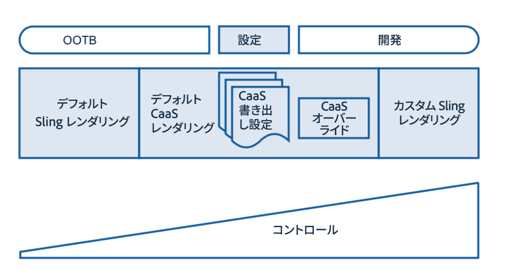

# レンダリングと配信{#rendering-and-delivery}

>[!CAUTION]
>
>AEM 6.4 の拡張サポートは終了し、このドキュメントは更新されなくなりました。 詳細は、 [技術サポート期間](https://helpx.adobe.com/jp/support/programs/eol-matrix.html). サポートされているバージョンを見つける [ここ](https://experienceleague.adobe.com/docs/?lang=ja).

>[!NOTE]
>
>Adobeは、単一ページアプリケーションのフレームワークベースのクライアントサイドレンダリング（React など）を必要とするプロジェクトでは、SPA Editor を使用することをお勧めします。 [詳細情報](/help/sites-developing/spa-overview.md)を参照してください。

AEMコンテンツは、 [Sling のデフォルトサーブレット](https://sling.apache.org/documentation/bundles/rendering-content-default-get-servlets.html) レンダリング [JSON](https://sling.apache.org/documentation/bundles/rendering-content-default-get-servlets.html#default-json-rendering) およびその他の形式

これらのレンダリングは通常、リポジトリーを参照し、そのままコンテンツを返します。

AEMは、Sling を介して、レンダリングされたスキーマとコンテンツを完全に制御するカスタム Sling レンダラーの開発とデプロイもサポートします。

Content Services Default Renderers は、標準の Sling Defaults と Custom Development の間のギャップを埋め、開発を行わずにレンダリングされたコンテンツの多くの側面をカスタマイズし、制御できます。

次の図に、コンテンツサービスのレンダリングを示します。

## JSON のリクエスト {#requesting-json}

用途 **&lt;resource.caas span=&quot;&quot; id=&quot;1&quot; translate=&quot;no&quot; />.[&lt;export-config span=&quot;&quot; id=&quot;0&quot; translate=&quot;no&quot; />.][&lt;export-config span=&quot;&quot; id=&quot;0&quot; translate=&quot;no&quot; />.json** JSON をリクエストする。]

<table>
 <tbody>
  <tr>
   <td>リソース</td>
   <td>/content/entities の下のエンティティリソース  または   /content の下のコンテンツリソース</td>
  </tr>
  <tr>
   <td>EXPORT-CONFIG</td>
   <td>
<strong>オプション</strong>  
 
/apps/mobileapps/caas/exportConfigs/EXPORT-CONFIG の下にある書き出し設定    省略した場合、デフォルトの書き出し設定が適用されます 
 </td>
  </tr>
  <tr>
   <td>DEPTH-INT</td>
   <td><strong>オプション</strong>    Sling レンダリングで使用される子のレンダリングの深さ再帰</td>
  </tr>
 </tbody>
</table>

## 書き出し設定の作成 {#creating-export-configs}

書き出し設定を作成して、JSON レンダリングをカスタマイズできます。

設定ノードは、以下に作成できます。 */apps/mobileapps/caas/exportConfigs に置き換えます。*

| ノード名 | 設定の名前（レンダリングセレクター用） |
|---|---|
| jcr:primaryType | nt:unstructured |

次の表に、書き出し設定のプロパティを示します。

<table>
 <tbody>
  <tr>
   <td><strong>名前</strong></td>
   <td><strong>型</strong></td>
   <td><strong>デフォルト（設定されていない場合）</strong></td>
   <td><strong>値</strong></td>
   <td><strong>説明</strong></td>
  </tr>
  <tr>
   <td>includeComponents</td>
   <td>String[]</td>
   <td>すべてを含む</td>
   <td>sling:resourceType</td>
   <td>JSON 書き出しから sling:resourceType が指定されたノードの詳細を除外</td>
  </tr>
  <tr>
   <td>excludeComponents</td>
   <td>String[]</td>
   <td>何も除外</td>
   <td>sling:resourceType</td>
   <td>JSON 書き出しから指定された sling:resourceType を持つノードの詳細のみを含めます</td>
  </tr>
  <tr>
   <td>excludePropertyPrefixes</td>
   <td>String[]</td>
   <td>何も除外</td>
   <td>プロパティのプレフィックス</td>
   <td>指定したプレフィックスで始まるプロパティを JSON 書き出しから除外する</td>
  </tr>
  <tr>
   <td>excludeProperties</td>
   <td>String[]</td>
   <td>何も除外</td>
   <td>プロパティ名</td>
   <td>JSON 書き出しから指定したプロパティを除外</td>
  </tr>
  <tr>
   <td>includeProperties</td>
   <td>String[]</td>
   <td>すべてを含む</td>
   <td>プロパティ名</td>
   <td>
if excludePropertyPrefixes セット  除外されるプレフィックスと一致するにもかかわらず、指定されたプロパティも含まれます。
 
else （無視されたプロパティを除外）は、これらのプロパティのみを含めます
 </td>
  </tr>
  <tr>
   <td>includeChildren</td>
   <td>String[]</td>
   <td>すべてを含む</td>
   <td>子名</td>
   <td>JSON 書き出しから指定した子を除外</td>
  </tr>
  <tr>
   <td>excludeChildren</td>
   <td>String[]    </td>
   <td>何も除外</td>
   <td>子名</td>
   <td>JSON 書き出しから指定された子のみを含め、他の子を除外</td>
  </tr>
  <tr>
   <td>renameProperties</td>
   <td>String[]    </td>
   <td>何も変更しない</td>
   <td>&lt;actual_property_name&gt;,&lt;replacement_property_name&gt;</td>
   <td>置換を使用してプロパティを名前変更</td>
  </tr>
 </tbody>
</table>

### リソースタイプの書き出しの上書き {#resource-type-export-overrides}

以下に設定ノードを作成します。 */apps/mobileapps/caas/exportConfigs に置き換えます。*

| name | resourceTypeOverrides |
|---|---|
| jcr:primaryType | nt:unstructured |

次の表に、プロパティを示します。

<table>
 <tbody>
  <tr>
   <td><strong>名前</strong></td>
   <td><strong>型</strong></td>
   <td><strong>デフォルト（設定されていない場合）</strong></td>
   <td><strong>値</strong></td>
   <td><strong>説明</strong></td>
  </tr>
  <tr>
   <td>&lt;SELECTOR_TO_INC&gt;</td>
   <td>String[] </td>
   <td>-</td>
   <td>sling:resourceType</td>
   <td>次の Sling リソースタイプの場合は、デフォルトの CaaS json 書き出しを返さないでください。  リソースをとしてレンダリングして、顧客の JSON 書き出しを返す。  &lt;resource&gt;.&lt;selector_to_inc&gt;.json </td>
  </tr>
 </tbody>
</table>

### 既存のコンテンツサービスの書き出し設定 {#existing-content-services-export-configs}

コンテンツサービスには、次の 2 つの書き出し設定が含まれます。

* デフォルト（設定が指定されていません）
* ページ（サイトページをレンダリングする）

#### デフォルトの書き出し設定 {#default-export-configuration}

要求された URI で設定が指定されている場合、Content Services のデフォルトの書き出し設定が適用されます。

&lt;resource>.caas[.&lt;depth-int>].json

<table>
 <tbody>
  <tr>
   <td><strong>名前</strong></td>
   <td><strong>値</strong></td>
  </tr>
  <tr>
   <td>excludeProperties</td>
   <td> </td>
  </tr>
  <tr>
   <td>excludePropertyPrefixes</td>
   <td>jcr:,sling:,cq:,oak:,pge-</td>
  </tr>
  <tr>
   <td>includeProperties</td>
   <td>jcr:text,text  jcr:title,title  jcr:description,description  jcr:lastModified,lastModified  cq:tags,tags  cq:lastModified,lastModified</td>
  </tr>
  <tr>
   <td>includeComponents</td>
   <td> </td>
  </tr>
  <tr>
   <td>excludeComponents</td>
   <td> </td>
  </tr>
  <tr>
   <td>includeChildren</td>
   <td> </td>
  </tr>
  <tr>
   <td>excludeChildren</td>
   <td> </td>
  </tr>
  <tr>
   <td>Sling JSON オーバーライド</td>
   <td>foundation/components/image  wcm/foundation/components/image  mobileapps/caas/components/data/contentReference  mobileapps/caas/components/data/assetlist</td>
  </tr>
 </tbody>
</table>

#### ページ書き出し設定 {#page-export-configuration}

この設定は、デフォルトを拡張して、子ノードの下にグループ化の子を含めます。

&lt;site_page>.caas.page[.&lt;depth-int>].json

### その他のリソース {#additional-resources}

コンテンツサービスのその他のトピックについては、以下のリソースを参照してください。

* [モデルの開発](/help/mobile/administer-mobile-apps.md)
* [コンテンツサービスのオーサリング](/help/mobile/develop-content-as-a-service.md)
* [コンテンツサービスの管理](/help/mobile/developing-content-services.md)
