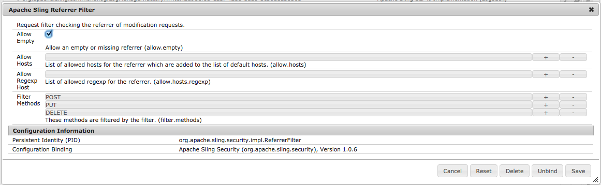

# リファラーフィルターの「空の値を許可」への設定{#setting-your-referrer-filter-to-allow-empty}

>[!CAUTION]
>
>AEM 6.4 の拡張サポートは終了し、このドキュメントは更新されなくなりました。 詳細は、 [技術サポート期間](https://helpx.adobe.com/jp/support/programs/eol-matrix.html). サポートされているバージョンを見つける [ここ](https://experienceleague.adobe.com/docs/?lang=ja).

>[!NOTE]
>
>Adobeは、単一ページアプリケーションのフレームワークベースのクライアントサイドレンダリング（React など）を必要とするプロジェクトでは、SPA Editor を使用することをお勧めします。 [詳細情報](/help/sites-developing/spa-overview.md)を参照してください。

AEM Mobile Application Viewer がオーサーインスタンス上のアプリを表示できるようにするには、HTMLリファラーフィルターを「allow empty」に設定する必要があります。

アプリケーションビューアを使用して開発状態とステージング状態のアプリケーションを確認する場合は、リファラーフィルターのデフォルト設定を変更する必要はありません。

実行中のAEMオーサーインスタンス内で、次の場所に移動します。 [http://localhost:4502/system/console/configMgr](http://localhost:4502/system/console/configMgr) 「Apache Sling Referrer Filter」を検索します。 リファラーフィルターをクリックして編集し、「空の値を許可」チェックボックスをオンにします（下図を参照）。 次に、「保存」ボタンを押し、ブラウザーページを閉じます。

