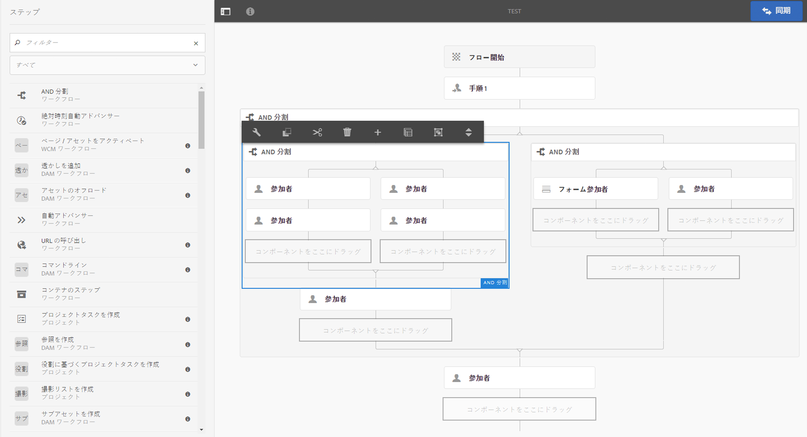
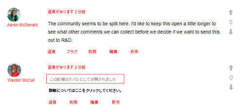
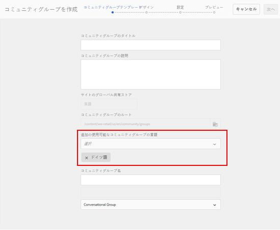
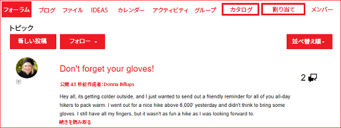
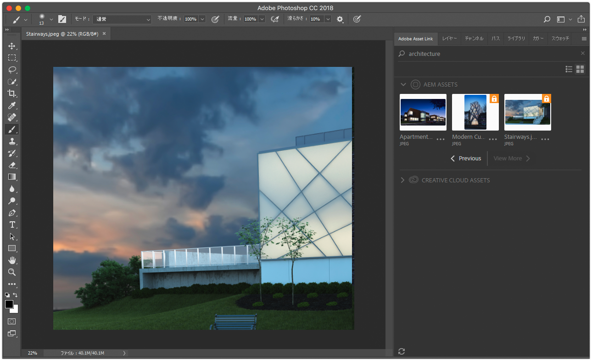
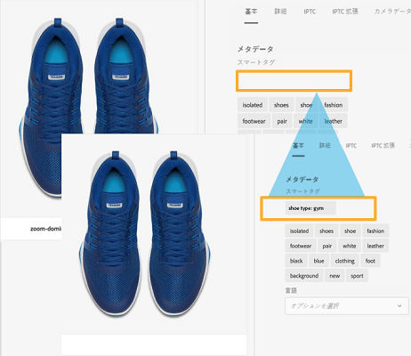

# 一般リリースノート（Adobe Experience Manager 6.4） {#general-release-notes-for-adobe-experience-manager}

## リリース情報 {#release-information}

| 製品 | Adobe Experience Manager |
|---|---|
| バージョン | 6.4 |
| 種類 | メジャーリリース |
| 正式版の日付 | 2018 年 4 月 4 日 |
| 推奨される更新 | [AEMリリースとアップデート](https://experienceleague.adobe.com/docs/experience-manager-release-information/aem-release-updates/aem-releases-updates.html?lang=ja)を参照 |

### 参考情報 {#trivia}

このバージョンの Adobe Experience Manager のリリースサイクルは 2017 年 4 月 27 日に開始され、22 回の品質保証とバグ修正を繰り返し、2018 年 3 月 22 日に終了しました。このリリースで修正された、機能強化と新機能を含むお客様関連の問題の総数は 704 件です。   

Adobe Experience Manager 6.4 は、2018 年 4 月 4 日より正式版として提供されています。

>[!NOTE]
>
>新しい機能パックはすべて[サービスパック](https://helpx.adobe.com/jp/experience-manager/maintenance-releases-roadmap.html)からのみ提供されるので、Adobeは最新のサービスパックをインストールすることをお勧めします。

## 新機能 {#what-s-new}

Adobe Experience Manager 6.4 は、Adobe Experience Manager 6.3 コードベースのアップグレードリリースです。新機能および強化機能、お客様向けの重要な修正、お客様向けの優先順位の高い機能強化、製品の安定性向上のための全般的なバグ修正が加えられています。また、Adobe Experience Manager6.3のすべての機能パック、ホットフィックス、サービスパックのリリースの大部分も含まれます。

以下のリストで概要を説明します。その後のページでは詳細をリストします。

### Experience Manager の基盤 {#experience-manager-foundation}

変更点の完全なリストについては、[AEM の基盤](wcm-platform.md)を参照してください。

Adobe Experience Manager 6.4 のプラットフォームは、アップデートバージョンの OSGi ベースのフレームワーク（Apache Sling および Apache Felix）と Java コンテンツリポジトリの Apache Jackrabbit Oak 1.8.2 上に構築されています。

Quickstart は、サーブレットエンジンとして Eclipse Jetty 9.3.22 を使用します。

#### ユーザーインターフェイス {#user-interface}

UI に対して様々な機能強化がおこなわれ、生産性と使いやすさが向上しました。

* [新しいコンテンツツリーレール](/help/sites-authoring/basic-handling.md#content-tree)で階層内をすばやく移動できます。これをリスト表示と組み合わせれば、クラシック UI インタラクションモデルに戻すことができます。
* 大きいフォルダーのカード表示とリスト表示でスクロールの操作性が向上しました。
* [検索結果の操作性が向上しました](/help/sites-authoring/search.md) - 「戻る」ボタンをクリックすると、前の検索結果に戻ります。
* 最もよく使用されるアクション（特定のレールを開く、項目を編集、移動、削除する、プロパティを開くなど）の[キーボードショートカットが追加](/help/sites-authoring/keyboard-shortcuts.md)定義されました。
* [キーボードショートカットを無効にする](/help/sites-authoring/user-properties.md) （環境設定で有効/無効にする）機能。
* [すべての UI で 7 日後にタイムスタンプが非表示になります](/help/sites-authoring/user-properties.md)（環境設定でデフォルトを設定します）。

これらの機能について詳しくは、[オーサリングのドキュメント](/help/sites-authoring/home.md)を参照してください。 

>[!CAUTION]
>
>クラシック UI の機能がさらに強化される予定はありません。AEM 6.4 にはクラシック UI が含まれており、以前のリリースからアップグレードするお客様はクラシック UI をそのまま使用し続けることができます。クラシック UI は廃止中は引き続き完全にサポートされます。[詳細情報](/help/sites-deploying/ui-recommendations.md)。

#### コンテンツリポジトリ {#content-repository}

* オンラインリビジョンクリーンアップによるコンパクションの処理速度と効率が向上しました。社内テストによれば、新しいテールコンパクションは処理が最大で 10 倍速くおこなわれ、AEM 6.3 よりも少ない IOPS で多くのディスク領域を回収できます。この結果、オンラインリビジョンクリーンアップの実行中もパフォーマンスへの影響が少なくなります。詳しくは、[ドキュメントページ](/help/sites-deploying/revision-cleanup.md#full-and-tail-compaction-modes)を参照してください。

* スケジュールに従ったクリーンアップメンテナンスの代わりに、MongoMK の継続的なリビジョンクリーンアップが実行されるようになりました。
* ドキュメントノードストアに対するリビジョンクリーンアップの効率が向上しました。

#### 検索とインデックス作成 {#search-indexing}

* oak-run（CLI）を使用したインデックス作成操作のサポートが強化されました。

   * インデックスの整合性チェック
   * インデックス作成に関する統計情報の提供
   * インデックス構成のインポートまたはエクスポート
   * インデックス再作成

* Lucene 関連リポジトリのサイズの増大を抑えることで、システム全体のパフォーマンスが向上しました。

詳しくは、[このドキュメントページ](/help/sites-deploying/indexing-via-the-oak-run-jar.md)を参照してください。

#### 監視 {#monitoring}

* 新しい[System Overview](/help/sites-administering/operations-dashboard.md#system-overview)は、パフォーマンス関連のシステムのステータスとアクティビティに関するスナップショット表示を提供します。
* インデックス作成、クエリー、メンテナンスに関する一連の[ヘルスチェック](/help/sites-administering/operations-dashboard.md#health-checks)が新しく用意されています。 

#### プロジェクトとワークフロー  {#projects-and-workflows}

* [ワークフローモデルを作成および編集するためのワークフローエディター](/help/sites-developing/workflows-models.md)がまったく新しくなりました。

#### 以前のバージョンからのアップグレード {#upgrade-from-earlier-version}

* [下位互換性](/help/sites-deploying/backward-compatibility.md)：AEM 6.4の機能には下位互換性があるので、カスタムコードはほとんどの場合そのまま動作し、アップグレードの労力を削減できます。
* [アップグレードの複雑さの評価](/help/sites-deploying/pattern-detector.md)：新しいパターン検出ツールにより、アップグレードの複雑さを実行前に評価することができます。
* [リポジトリの再構築](/help/sites-deploying/repository-restructuring.md):アップグレードを容易にし、導入のベストプラクティスを促進するための重要な再構築（主に/etc）
* アップグレードについて詳しくは、[このページ](/help/sites-deploying/upgrade.md)を参照してください。

### Experience Manager Sites  {#experience-manager-sites}

変更点の完全なリストは[AEM Sites とアドオン](sites.md)を参照してください。

#### Fluid Experience {#fluid-experiences}

コンテンツフラグメント、エクスペリエンスフラグメント、コンテンツサービスをベースとした Fluid Experience が 2017 年初頭に導入されたことをきっかけに、マルチチャネルファーストのコンテンツ管理への進化が始まりました。AEM 6.4 では、それぞれの機能が大幅に拡張されています。

**[コンテンツフラグメント](/help/assets/content-fragments.md)**

ビジュアルな[コンテンツモデル](/help/assets/content-fragments-models.md)エディターと新しい[設定可能なコンポーネント](https://docs.adobe.com/content/help/ja-JP/experience-manager-core-components/using/components/content-fragment-component.html)が AEM 6.4 で新たに導入され、コンテンツサービスに組む込む HTML 出力と JSON を柔軟に生成できるようになりました。

**エクスペリエンスフラグメント**

構築ブロック機能により、コンテンツが同じでレイアウトの異なるフラグメントバリエーションを、より効率的に作成できるようになりました。エクスペリエンスフラグメントをFacebookやPinterestに送るだけでなく、オファーとしてAdobe Targetに送ることも可能になりました。

**コンテンツサービス**

Slingモデルエクスポーターとコアコンポーネントの様々な機能強化が加えられ、シングルページアプリで作成されるモバイルアプリやエクスペリエンスにコンテンツを埋め込むための堅牢なJSON出力が提供されます。

#### サイトの構築をより迅速に{#gettings-sites-built-quicker}

AEM 6.4 で次世代のコンポーネントモデルへの転換が完了します。AEM 6.3 で導入されたコアコンポーネントの概念にスタイルシステムが加わって、新規サイトの作成や既存サイトの拡張を効率的におこなえるようになりました。

新しいコンポーネントモデルの最善の活用方法については、[AEM Sites の開発の手引き - WKND チュートリアル](https://docs.adobe.com/content/help/ja-JP/experience-manager-learn/getting-started-wknd-tutorial-develop/overview.html)を参照されることをお勧めします。

#### Screens アドオン  {#screens-add-on}

Digital Signageやキオスクのネットワークを含むすべてのマーケティングチャネルに一貫したメッセージを届けることが、AEM Screensの意味です。 AEM 6.4 では、Microsoft Windows および Google Chrome OS ハードウェアでサイネージプレーヤーを実行できるようになりました。さらに、リモートデバイス管理およびスケジュール（チャネルグループ）の機能強化もおこなわれています。

画面の更新について詳しくは、[AEM Screensユーザーガイド](https://docs.adobe.com/content/help/ja/experience-manager-screens/user-guide/aem-screens-introduction.html)を参照してください。

### Experience Manager Communities {#experience-manager-communities}

AEM 6.4 では、Communities に多くの新機能や機能強化が加えられています。変更点の完全なリストについては、[AEM Communities](communities-release-notes.md) を参照してください。主なものを以下に示します。

#### モデレートの機能強化  {#enhancements-to-moderation}

**自動スパム検出**

新しいスパム検出エンジンが組み込まれ、コミュニティサイトやコミュニティグループで不要なユーザー生成コンテンツを除外できるようになりました。このエンジンを system/console/configMgr から有効にすると、事前定義済みのスパム単語リストを基に、該当するユーザー生成コンテンツにスパムのマークが付けられます。スパム検出エンジンについて詳しくは、[コミュニティユーザーが生成したコンテンツの自動モデレート](/help/communities/moderate-ugc.md#spam-detection)を参照してください。

**新しい Q&amp;A フィルター**

「回答済み」と「未回答」という新しいフィルターが一括モデレートコンソールに追加され、Q&amp;A の質問をフィルター処理できるようになりました。回答済みと未回答のステータスフィルターの動作について詳しくは、[ユーザー生成コンテンツの一括モデレート](/help/communities/moderation.md#main-pars-note-521961797)を参照してください。

**ブックマークモデレートフィルター**

事前定義済みのモデレートフィルターをモデレートコンソールでブックマークできるようになりました。これらのフィルターは URL 文字列の末尾に追加されるので、後で共有、再利用、再検討することができます。[一括モデレートコンソール](/help/communities/moderation.md#main-pars-note-429176623)でフィルターにブックマークを付ける方法を知っている。

#### UGC とユーザープロファイルの削除 {#delete-ugc-and-user-profiles}

AEM 6.4 Communities では、エンドユーザーが自分のデータを管理できるように、[すぐに使用できる API](/help/communities/user-ugc-management-service.md) とサンプル[サーブレット](https://github.com/Adobe-Marketing-Cloud/aem-communities-ugc-migration/tree/master/bundles/communities-ugc-management-servlet)を公開しています。また、これらの API を使用すると、データ処理やデータ管理をおこなう組織で EU の GDPR に準拠することができます。

#### サイトおよびグループ管理の機能強化  {#enhancements-to-site-and-group-management}

**1つの手順で複数ロケールのグループを作成する**

多言語グループを 1 つの操作だけで作成できるようになりました。このようなグループを作成するには、サイトコンソールから目的のコミュニティサイトのグループコレクションに移動します。グループを作成し、コミュニティグループテンプレートページで目的の言語を指定します。この機能について詳しくは、[コミュニティグループコンソール](/help/communities/groups.md)を参照してください。

**[ワンクリックでのコミュニティサイトおよびグループの削除](/help/communities/groups.md)**

グローバルナビゲーションから操作している際に、それぞれのサイトおよびグループの削除アイコンを使用できるようになりました。このアイコンを使用すると、サイトまたはグループに関連付けられているすべての項目やコンテンツが削除され、ユーザーとの関連付けもすべて削除されます。この機能について詳しくは、[コミュニティサイトの管理](/help/communities/create-site.md#main-pars-text-fe17)および[コミュニティグループの管理](/help/communities/groups.md#main-pars-text-5e8c)を参照してください。

#### イネーブルメントの機能強化  {#enhancements-to-enablement}

グループ内で割り当て機能とカタログ機能を使用できるようになりました。これにより、ターゲットとなる特定のコミュニティメンバー向けの学習コンテンツを作成、管理、公開することができます。コミュニティグループの有効化の詳細については、[有効化リソースの管理](/help/communities/resource.md)を参照してください。

### Experience Manager Assets {#experience-manager-assets}

AEM 6.4 では、Assets にいくつかの新機能と機能強化が導入されています。例えば、Creative Cloud との統合の改善、人工知能関連の主要な技術革新、メタデータ管理の向上、レポート機能の強化、ユーザーエクスペリエンスの全般的向上などです。変更点の完全なリストについては、[AEM Assets](assets.md) を参照してください。主なものを以下に示します。

**Adobe Asset Link**

Creative Cloud エンタープライズ版の Adobe Asset Link を使用すると、コンテンツ作成プロセスでのクリエイターとマーケティング担当者の共同作業を効率化できます。これは Creative Cloud エンタープライズ版の新しいネイティブ機能で、クリエイターが使用中の Photoshop CC、Illustrator CC、InDesign CC から AEM に直接アクセスできるようにするものです。

この機能、使用するための必要条件、アクセス方法について詳しくは、[Adobe Asset Link](https://www.adobe.com/jp/creativecloud/business/enterprise/adobe-asset-link.html) のページを参照してください。

**AEM デスクトップアプリケーション**

AEMデスクトップアプリは、AEM 6.4と互換性があるバージョン1.8に更新されました。AEMデスクトップアプリの変更点の完全なリストは、専用の[AEMデスクトップアプリリリースノート](https://docs.adobe.com/content/help/ja/experience-manager-desktop-app/using/release-notes.html)ドキュメントに記載されています。

AEM 6.3 リリース以降に導入された機能改善としては、フォルダー階層をバックグラウンドでアップロードできる機能、アセットのバックグラウンド操作を監視するための新しい UI、キャッシュ、ネットワーク、ログインの機能強化、全般的な安定性向上などがあります。ドキュメントには[ベストプラクティスガイド](https://docs.adobe.com/content/help/ja-JP/experience-manager-desktop-app/using/using.html)も含まれています。

**Adobe Senseiサービス**

新機能には、強化されたスマートタグがあります。お客様のビジネス分野の分類を学習して、デジタルアセットにお客様固有のタグを自動的に付けることができます。また、スマート翻訳検索機能も導入されています。検索語がその場で翻訳されるので、複数言語での検索効率が向上します。この機能について詳しくは、[強化されたスマートタグ](/help/assets/enhanced-smart-tags.md)を参照してください。

**メタデータ**

多数のアセットのメタデータを同時に読み込み／書き出しする機能や、[カスケードメタデータ](/help/assets/cascading-metadata.md)などの高度なメタデータ構成要素など、様々な機能強化がおこなわれています。

**レポート**

アセットレポートは、AEM6.4で、新しいレポートフレームワーク、ユーザーエクスペリエンス、お客様の使用事例に関するOOTBのレポートが追加され、大幅なオーバーホールを経ています。 様々なレポートの生成方法について詳しくは、[アセットレポート](/help/assets/asset-reports.md)を参照してください。

**ユーザーエクスペリエンス**

スクロール操作、検索の戻るボタン、検索フィルターの改善など、Assets ユーザーによる閲覧、検索、管理を改善するための機能強化が多数おこなわれています。 [AEM Assets](assets.md)で使用できる完全なリスト。

**Brand Portal**

メタデータ、レポート、デジタル著作権、ログイン操作、およびアセット配布での公開のパフォーマンスに関して様々な機能強化がおこなわれています。新しい機能強化と機能について詳しくは、[AEM Assetsブランドポータルの新機能](https://docs.adobe.com/content/help/ja/experience-manager-brand-portal/using/introduction/whats-new.html)を参照してください。

#### Dynamic Media アドオン {#dynamic-media-add-on}

AEM 6.4 では、Dynamic Media に多くの新機能や機能強化が加えられています。完全なリストは[AEM Assets](assets.md)で入手できます。 主なハイライトは次のとおりです。

**スマート切り抜き**

スマート切り抜きは Adobe Sensei を利用したもので、画像の非破壊的な切り抜きを自動的におこない、重要な部分だけを残します。これにより、レスポンシブデザインに対応します。画像の切り抜かれる部分をプレビューし、必要に応じて、切り抜く範囲を手動で調整することができます。この機能により、製品画像のスウォッチを自動的に生成することもできます。

スマート切り抜きの使用について詳しくは、[画像プロファイル](/help/assets/image-profiles.md)のドキュメントを参照してください。

Dynamic Media コンポーネントでのスマート切り抜きの操作について詳しくは、[ページへのダイナミックメディアアセットの追加](/help/assets/adding-dynamic-media-assets-to-pages.md)を参照してください。

**スマートイメージング**

スマートイメージングでは、各ユーザー固有の表示特性を活用して、エクスペリエンスに最適化された画像を自動的に提供し、パフォーマンスとエンゲージメントを向上させます。

詳しくは、[スマートイメージング](/help/assets/imaging-faq.md)のドキュメントを参照してください。

**新しいメディアとビューアの機能強化**

パノラマビューアや VR などの新しいビューアを使用すると、より臨場感のあるエクスペリエンスを提供できます。

詳しくは、[パノラマ画像](/help/assets/panoramic-images.md)のドキュメントを参照してください。

### Experience Manager Forms {#experience-manager-forms}

AEM 6.4 Forms では、いくつかの新機能と機能強化が加えられています。主なものを以下に示します。

* マルチチャネルのインタラクティブコミュニケーション
* ビジネスアプリケーションからインタラクティブコミュニケーションへの事前入力
* ワークフローの最新化とモバイル作業のサポート
* フラグメントの遅延読み込み
* LiveCycle から Experience Manager Forms 6.4 への直接アップグレード

詳細については、リリースノートの [AEM Forms](forms.md) ページを参照してください。また、新機能および強化された機能とドキュメントのリソースについては、[AEM 6.4Forms](/help/forms/using/whats-new.md)の新機能および拡張機能の概要を参照してください。

### Experience Manager Livefyre {#experience-manager-livefyre}

使用している AEM 6.4 インスタンスに Livefyre を統合することができます。Livefyre と AEM の統合方法については、以下を参照してください。

* [Livefyre との連携](https://docs.adobe.com/content/help/en/experience-manager-64/administering/integration/livefyre.html)

### 顧客中心開発の強化 {#leverage-customer-focused-development}

アドビは、お客様が開発のすべての段階、つまり仕様、開発、テストに関与できる顧客中心開発モデルを使用しています。このプロセスにご協力いただいているお客様とパートナーの皆様に感謝いたします。

アドビでは、お客様中心のバグ修正と機能強化リクエストの開発に関する情報収集、優先順位付け、追跡の手順およびプロセスを整備しています。[Adobe Marketing Cloudサポートポータル](https://helpx.adobe.com/jp/contact/enterprise-support.ec.html)は、Adobe機能強化と欠陥追跡システムと統合されています。 お客様からの問い合わせは、可能な場合はカスタマーケアで特定および解決されます。研究開発部門にエスカレートされた場合は、すべての顧客情報が収集され、優先順位付けとレポートに使用されます。開発では有償のサポート、保証の問題、有償の顧客向け強化機能が優先されます。

この優先順位付けのプロセスにより、AEM 6.4 では 500 件を超えるお客様中心の変更がおこなわれました。

## このリリースに含まれるファイルのリスト {#list-of-files-that-are-part-of-the-release}

**基盤**

* スタンドアロンのクイックスタート：cq-quickstart-6.4.0.jar
* Application Server Quickstart:cq-quickstart-6.4.0.war
* 様々なWebサーバーおよびプラットフォーム向けのDispatcher 4.3.1以降。 [ダウンロードリンク](https://docs.adobe.com/content/help/en/experience-manager-dispatcher/using/getting-started/release-notes.html)を参照してください。
* Eclipse IDE用のプラグインです。[詳細を読んで](/help/sites-developing/aem-eclipse.md)をダウンロードしてください。

* Bracketsコードエディタの拡張機能。[詳細を読んで](/help/sites-developing/aem-brackets.md)をダウンロードします。
* Maven/Gradleの依存関係。 [ダウンロードリンク](https://repo.adobe.com/nexus/content/repositories/releases/com/adobe/aem/uber-jar/6.1.0/)を参照してください。

**Sites**

* コアコンポーネント（[GitHub プロジェクト](https://github.com/Adobe-Marketing-Cloud/aem-core-wcm-components)）
* We.Retail 参照実装（[詳細](/help/sites-developing/we-retail.md)）
* プロジェクトのブループリントのアーキタイプ（[GitHub プロジェクト](https://github.com/Adobe-Marketing-Cloud/aem-project-archetype)）
* 様々なプラットフォーム向けの AEM Screens Players（[ダウンロード](https://download.macromedia.com/screens/)）
* スマートコンテンツの言語モデル。英語は事前インストール済み。ほかに以下の言語がダウンロード可能

   * [ドイツ語](https://experience.adobe.com/#/downloads/content/software-distribution/en/aem.html?package=/content/software-distribution/en/details.html/content/dam/aem/public/adobe/packages/cq630/product/smartcontent-model-de)
   * [スペイン語](https://experience.adobe.com/#/downloads/content/software-distribution/en/aem.html?package=/content/software-distribution/en/details.html/content/dam/aem/public/adobe/packages/cq630/product/smartcontent-model-es)
   * [イタリア語](https://experience.adobe.com/#/downloads/content/software-distribution/en/aem.html?package=/content/software-distribution/en/details.html/content/dam/aem/public/adobe/packages/cq630/product/smartcontent-model-it)
   * [フランス語](https://experience.adobe.com/#/downloads/content/software-distribution/en/aem.html?package=/content/software-distribution/en/details.html/content/dam/aem/public/adobe/packages/cq630/product/smartcontent-model-fr)

* [AEM最新化](/help/sites-developing/modernization-tools.md) ツールを使用してClassic UIコンポーネントをCoral 3に移行

**Assets**

* Adobe Experience Managerデスクトップアプリ（[詳細を読む](https://docs.adobe.com/content/help/en/experience-manager-desktop-app/using/using.html)と[ダウンロード](https://docs.adobe.com/content/help/en/experience-manager-desktop-app/using/release-notes.html)）

* 強化された PDF Rasterizer を追加するためのパッケージ（[詳細](/help/assets/aem-pdf-rasterizer.md)および[ダウンロード](https://experience.adobe.com/#/downloads/content/software-distribution/en/aem.html?package=/content/software-distribution/en/details.html/content/dam/aem/public/adobe/packages/cq640/product/assets/aem-assets-pdf-rasterizer-pkg)）

* 強化された RAW 画像のサポートを追加するためのパッケージ（[詳細](/help/assets/camera-raw.md)）

**Forms**

* AEM Forms の機能パッケージ：

   * [adobe-aemfd-aix-pkg](https://www.adobeaemcloud.com/content/marketplace/marketplaceProxy.html?packagePath=/content/companies/public/adobe/packages/cq640/fd/AEM-FORMS-6.4-AIX)
   * [adobe-aemfd-linux-pkg](https://www.adobeaemcloud.com/content/marketplace/marketplaceProxy.html?packagePath=/content/companies/public/adobe/packages/cq640/fd/AEM-FORMS-6.4-LX)
   * [adobe-aemfd-solaris-pkg](https://www.adobeaemcloud.com/content/marketplace/marketplaceProxy.html?packagePath=/content/companies/public/adobe/packages/cq640/fd/AEM-FORMS-6.4-SOL)
   * [adobe-aemfd-win-pkg](https://www.adobeaemcloud.com/content/marketplace/marketplaceProxy.html?packagePath=/content/companies/public/adobe/packages/cq640/fd/AEM-FORMS-6.4-WIN)
   * [adobe-aemfd-osx-pkg](https://www.adobeaemcloud.com/content/marketplace/marketplaceProxy.html?packagePath=/content/companies/public/adobe/packages/cq640/fd/AEM-FORMS-6.4-OSX)

## 言語 {#languages}

次の言語のユーザーインターフェイスが使用できます。

* 英語
* ドイツ語
* フランス語
* スペイン語
* イタリア語
* ブラジル語ポルトガル語
* 日本語
* 簡体字中国語
* 繁体字中国語（限定的にサポート）
* 韓国語

Experience Manager 6.4 は、中国語エンコーディング規格の使用に関する GB18030-2005 CITS の認定を受けています。

## インストールとアップデート {#install-update}

設定の要件については、[インストール手順](/help/sites-deploying/custom-standalone-install.md)を参照してください。

詳細な手順については、[アップグレードドキュメント](/help/sites-deploying/upgrade.md)を参照してください。

## サポートされているプラットフォーム {#supported-platforms}

サポートされているプラットフォーム（サポートレベルを含む）の完全な一覧表については、[AEM 6.4 の技術要件](/help/sites-deploying/technical-requirements.md)を参照してください。。

>[!NOTE]
>
>Oracle は Oracle Java SE 製品の「長期サポート」（LTS）モデルに移行しました。Java 9および10は、Oracle別にLTS以外のリリースです([OracleJava SEサポート・ロードマップ](https://www.oracle.com/technetwork/java/eol-135779.html)を参照)。 アドビでは、AEM を実稼働環境で実行するための Java については、LTS リリース版のみサポートします。そのため、AEM 6.4 で使用するバージョンとしては、Java 8 をお勧めします。

## 廃止される機能および削除された機能 {#deprecated-and-removed-features}

アドビでは、製品の機能を常時評価して、さらに強力なバージョンへの置き換えの計画や、将来の展望や拡張に備えた部分的な再実装の決定を継続的におこなっています。

Adobe Experience Manager 6.4 についての情報は、[廃止および削除された機能](deprecated-removed-features.md)を参照してください。このページには、2019 年におこなわれる変更の予告と、前のリリースからアップデートするお客様向けの重要な注意事項も含まれています。

## 変更点の詳細なリスト  {#detailed-changes-lists}

[AEM Sites](sites.md)

[AEM Assets](assets.md)

[AEM Communities](communities-release-notes.md)

[AEM Forms](forms.md)

[AEM の基盤](wcm-platform.md)

## 既知の問題 {#known-issues}

[既知の問題のリスト](known-issues.md)

### 製品のダウンロードとサポート（制限付きサイト） {#product-download-and-support-restricted-sites}

以下のサイトは既存ユーザーのみが参照できます。アクセス権が必要な既存ユーザーの方は、アドビのアカウントマネージャーまでお問い合わせください。

* [licensing.adobe.com での製品のダウンロード](https://licensing.adobe.com/).
* [ソフトウェア配布](https://experience.adobe.com/#/downloads/content/software-distribution/en/aem.html)の追加機能に対する製品アップデート、パッチ、パッケージ。
* [Admin Consoleを介したカスタマーサポート](https://adminconsole.adobe.com/)。詳しくは、[新しいAdobeカスタマーサポート体験](https://docs.adobe.com/content/help/en/customer-one/using/home.html)を参照してください。
