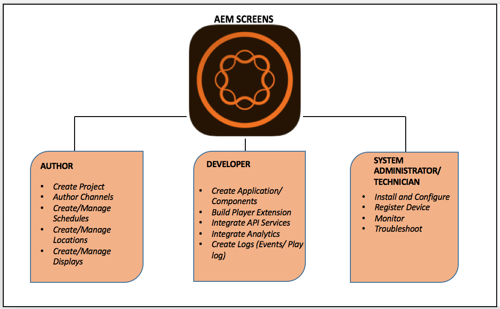

# AEM Screens とは {#what-is-aem-screens}

**AEM(Adobe Experience Manager)Screens** - *Digital Signage Solutionを使用すると* 、様々な種類の画面を含む動的でインタラクティブなデジタルエクスペリエンスやインタラクションを、包括的なデジタルマーケティングプラットフォームと組み合わせて公開できます。

[AEM Screens のキックスタート](kickstart-for-aem-screens.md)に従って、シンプルなデジタルサイネージエクスペリエンスをインストールおよび導入できます。

## 概要 {#overview}

**AEM Screens** は、***AEM Sites*** の強固な基盤の上に構築されています。マーケティング担当者や IT 担当者は、AEM Screens を使用し、ブランドを確立して需要を促進するという店舗や会場設備での目標に影響する、複数のデジタルスクリーンでのエクスペリエンスを作成して管理できます。AEM Screens と Sites を統合すると、既存のコンテンツを再利用し、明瞭で一貫性のある顧客ソリューションを効果的に提供することが可能です。これにより、費用対効果と有用性の非常に高い、特化したデジタルエクスペリエンスを作成するための合理的なワークフローが実現します。さらに、ブランドの認知度に影響を与え、購入や関与の増加につながる意思決定にも影響を及ぼすことができます。

AEM Screensは、専用のデジタルメニューボード、商品レコメンデーション、背景ライフスタイル画像を作成して、顧客とのやり取りを拡大し、同じAEMプラットフォームから、店舗、ホテル、銀行、医療、教育機関などの物理的な販売店にブランド体験を提供する強力なソリューションです。 Screens では、インタラクティブなディスプレイ、ウェイファインディング、ブランディング、環境へのアンビエンスの追加など、多数のユニークなアプリケーションがデプロイされる領域に基づいて顧客や従業員に提供されます。

 Screens を使用したアプリケーションの作成と管理はシンプルかつ直感的です。アプリケーションは、顧客や実装パートナーが AEM Screens 向けに作成した Web ページをホストします。***ロケーション*&#x200B;は、事前に定義された階層を管理し、*ディスプレイ*&#x200B;を含んでいます。各ディスプレイには、関連付けられている様々なデバイスやスクリーンを表示するダッシュボードがあります。AEM Screens のコンテンツは&#x200B;*チャネル*&#x200B;で管理されます。チャネル内に存在するコンテンツが AEM Screens Player によってディスプレイにレンダリングされます。

*AEM Screens に関連する重要な用語を理解するには、[用語集](screens-glossary.md)を参照してください。*

## Screens Player のアーキテクチャ {#architecture-of-screens-player}

次の図は、AEM Screens Player の一般的なアーキテクチャを示しています。

## デジタルサイネージエクスペリエンスを 5 分で作成する {#create-a-digital-signage-experience-in-minutes}

デモ用の Screens プロジェクトを作成し、コンテンツを Screens Player に公開するには、[AEM Screens のキックスタート](kickstart-for-aem-screens.md)を参照してください。

## 新しい AEM Screens プロジェクトの開始 {#starting-a-new-aem-screens-project}

新しいデジタルサイネージエクスペリエンスを開始するには、使用に向けて準備する前に各役割が協力する必要があります。

次の図は、AEM Screens のユーザーとその役割の定義を示しています。

>[!NOTE]
>
>*さらに、役割ごとの各責任範囲を参照するには、前述のユーザーをクリックしてください。*

## 前提となる知識 {#prerequisite-knowledge}

AEM Screens を使用してデジタルサイネージプロジェクトの作業を開始するには、Adobe Experience Manager（AEM）の知識が必要で、AEM Screens プロジェクトに取り組む前に知識を習得しておく必要があります。

Adobe Experience Manager 6.4および6.5について詳しくは、次のチュートリアルとリソースを参照してください。

* **[Adobe Experience Manager の概要](https://helpx.adobe.com/experience-manager/get-started.html)**：Adobe Experience Manager の入門記事やビデオチュートリアルが含まれています。
* **[AEM 6.5 のチュートリアルとビデオ](https://helpx.adobe.com/experience-manager/kt/index/aem-6-5-videos.html)**：AEM 6.5 のリリースに伴う AEM Sites、AEM Assets、AEM Forms、AEM Screens、AEM Foundation の新機能と更新された機能について重点的に解説する一連のチュートリアルとビデオです。
* **[AEM の中心概念](https://docs.adobe.com/content/help/en/experience-manager-64/developing/introduction/the-basics.html)**：AEM の構造に関する中心概念と、それを基にした開発方法の概要（JCR、Sling、OSGi、ディスパッチャー、ワークフロー、MSM の解説を含む）です。

## 実装の要点（ガイド付き） {#implementation-essentials}

ガイド付きの学習リソースである AEM Screens 実装の要点では、AEM Screens でサポートしている基本的な機能と高度な機能について説明しています。

新しいプロジェクトを作成する際、組織およびビジネスの要件によっては、異なる機能が重複することがあります。次に、各機能を順番に示します。AEM Screens プロジェクトを作成および管理するための手順について詳しくは、それぞれのリソースを参照してください。

1. [Screens のインストールおよび設定](configuring-screens-introduction.md)
1. [Screens プロジェクトの作成と管理](creating-a-screens-project.md)
1. [デバイスの割り当て](managing-devices.md)
1. [チャネルの作成と管理](managing-channels.md)
1. [ロケーションの作成と管理](managing-locations.md)
1. [ディスプレイの作成と管理](managing-displays.md)
1. [チャネルの割り当て](channel-assignment.md)
1. [デバイスの管理](managing-devices.md)
1. [スケジュールの作成と管理](managing-schedules.md)
1. [AEM Screens Player](working-with-screens-player.md)
1. [Device Control Centerのトラブルシューティング](monitoring-screens.md)

### 関連リソース {#related-resources}

AEM Screensにつ [いて](screens-concepts-feature-video-understand.md)、AEM Screensプロジェクトの様々な領域を紹介するビデオなどの追加のリソースとして、「AEM Screensについて」を参照してください。
