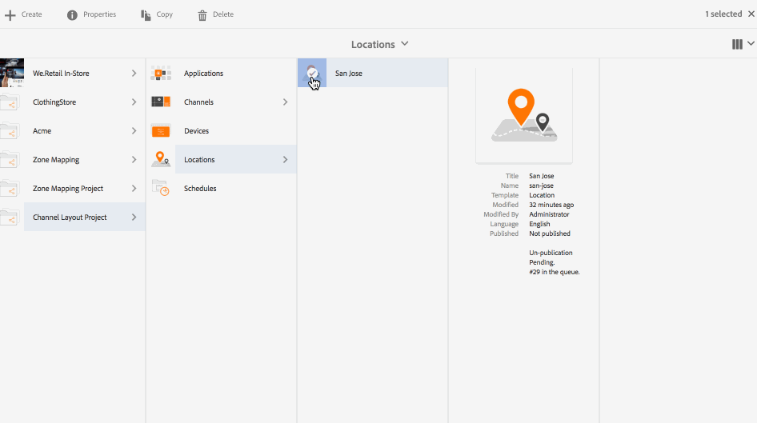

# チャネルレイアウトエディター{#channel-layout-editor}

***チャネルレイアウトエディター***&#x200B;を使用すると、マルチゾーンコンテンツを作成し、ビデオ、画像およびテキストなどの様々なアセットを使用して、コンテキストに沿った方法で単一のスクリーンに組み合わせることができます。画像、ビデオおよびテキストを取り込み、すべてを組み合わせて、直感的でインタラクティブなデジタルエクスペリエンスを作成できます。

プロジェクト要件に応じて、1 つのチャネルに複数のゾーンが必要になり、1 つの包括的なユニットとして編集することがあります。例えば、単一チャネルの 3 つの異なるゾーンで動作する関連ソーシャルメディアフィードを含んだ製品シーケンスなどです。

## 概要 {#overview}

チャネルを作成する際に、チャネルにゾーンを作成するために、様々なテンプレートを使用できます。プロジェクト要件に応じて、画像、ビデオまたは埋め込まれたチャネルを追加し、コンテンツを利用できます。

### 使用例の説明 {#use-case-description}

次の使用例では、チャネルでのマルチゾーンの作成を説明します。

1. ***Screens プロジェクトの作成***

   1. Adobe Experience Manager リンク（左上）を選択し、「**Screens**」を選択します。または、次の場所に直接移動できます。http://localhost:4502/screens.html/content/screens.
   1. 「**作成**」をクリックして、新しい Screens プロジェクトを作成します。
   1. **Screens プロジェクトの作成**&#x200B;ウィザードで「**Screens**」を選択し、「**次へ**」をクリックします。
   1. タイトルに「**チャネルレイアウトプロジェクト**」と入力し、「**作成**」をクリックします。
   

1. ***チャネルの作成***

   1. **チャネルレイアウトプロジェクト**&#x200B;に移動します。
   1. アクションバーの「**作成**」をクリックします。ウィザードが開きます。
   1. 「**1 x 2 分割画面チャネル**」を選択し、「**次へ**」をクリックします。
   1. 「**タイトル**」に「**水平分割**」と入力し、「**作成**」をクリックします。
   

1. ***チャネルへのコンテンツの追加***

   1. 作成した&#x200B;**チャネルレイアウトプロジェクト**&#x200B;に移動し、チャネル（**チャネル分割**）を選択します。
   1. アクションバーの「**編集**」をクリックして、**チャネル分割**&#x200B;用のエディターを開きます。
   1. アクションバーの左側にあるサイドパネルを切り替えるアイコンをクリックし、アセットとコンポーネントを開きます。チャネルに追加するコンポーネントをドラッグ＆ドロップします。
   

   >[!NOTE]
   >
   >例として、エディターで次の 2 つの画像をチャネルに追加します。

   

1. ***ロケーションの作成***

   1. ディスプレイを作成するロケーションフォルダー（**チャネルレイアウトプロジェクト**／**ロケーション**）に移動します。
   1. アクションバーの「**作成**」をクリックします。
   1. **作成**&#x200B;ウィザードから「**ロケーション**」を選択し、「**次へ**」をクリックします。
   1. ロケーションの「**タイトル**」に「**San Jose**」と入力します。
   1. 「**作成**」をクリックします。
   

1. ***新しいディスプレイの作成***

   1. ディスプレイを作成するロケーション（**Acme**／**ロケーション**／**San Jose**）に移動し、「**San Jose**」を選択します。
   1. アクションバーの「**作成**」をクリックします。**作成**&#x200B;ウィザードから「**ディスプレイ**」を選択し、「**次へ**」をクリックします。
   1. ディスプレイの場所の「**タイトル**」に「**分割表示**」と入力します。
   1. 「**ディスプレイ**」タブで、レイアウトの詳細を選択します。「**解像度**」で「**フル HD**」を選択します。「**デバイスの数 - 水平**」で「1」を選択し、「**デバイスの数 - 垂直**」で「**1**」を選択します。
   1. 「**作成**」をクリックします。
   

1. ***チャネルの割り当て***

   1. **チャネルレイアウトプロジェクト**／**ロケーション**／**San Jose**／**分割表示** に移動します。
   1. 「**分割表示**」を選択し、アクションバーの「**チャネルを割り当て**」をタップまたはクリックします。または、
   1. 「**ダッシュボード**」をクリックし、**割り当てられたチャネルとスケジュール**&#x200B;パネルの右上にある「**チャネルを割り当て**」を選択します。**チャネル割り当て**&#x200B;ダイアログボックスが開きます。
   1. 「**チャネルロール**」に「**Split**」と入力します。
   1. 「**チャネルを参照...**」で「パス別」を選択します。「チャネル」でチャネルフォルダーのパス（**チャネルレイアウトプロジェクト**／**チャネル**／**水平分割**）を選択します。
   1. このチャネルの「**優先度**」として「**1**」を選択します。
   1. 「**サポートされているイベント**」として「**最初の読み込み**」および「**待機中画面**」を選択します。
   1. 「**保存**」をクリックします。
   

1. ***デバイスの登録および割り当て***

   1. 別のブラウザーウィンドウを起動します。Web ブラウザーを使用して Screens Player にアクセスするか、AEM Screens アプリケーションを起動します。
   1. デバイスを開くと、デバイスの状態が未登録であることがわかります。AEM ダッシュボードから、**チャネルレイアウトプロジェクト**／**デバイス**&#x200B;に移動します。
   1. アクションバーの「**デバイスマネージャー**」をクリックします。
   1. 「**デバイスの登録**」をクリックすると、保留中のデバイスが表示されます。登録するデバイスを選択して、「**デバイスを登録**」をクリックします。
   1. Web ブラウザーまたは AEM Screens Player からコードを確認して、コードを検証する必要があります。「**検証**」をクリックして、**デバイスの登録**&#x200B;画面に移動します。
   1. 「タイトル」に「**NewD**」と入力し、「**登録**」をクリックすると、デバイスが登録されます。
   1. 「**ディスプレイを割り当て**」をクリックして、次の手順のディスプレイへのデバイスの割り当てに移ります。
   1. 「デバイスを割り当て」をクリックして、チャネルのディスプレイのパス（/content/screens/Test_Project/Locations/TestLocation/TestDisplay）を選択します。「**割り当て**」をクリックします。
   1. 「**完了**」をクリックしてプロセスを完了すると、デバイスが割り当てられます。
   

#### AEM Screens Player でのコンテンツの表示 {#viewing-content-in-aem-screens-player}

AEM Screens Player を読み込むか Web ブラウザーを使用します。チャネルのコンテンツが Screens Player に表示されます。コンテンツは、1 x 2 分割画面チャネルテンプレートに従って表示されます。

### 推論 {#inference}

チャネルを作成する際に使用可能なテンプレートを使用すると、様々なゾーンでコンテンツを利用および表示できます。前述の例は、2 x 2 テンプレートの使用例を示しています。

次の画像は、様々なテンプレートを使用して実現可能なレイアウトを示しています。
