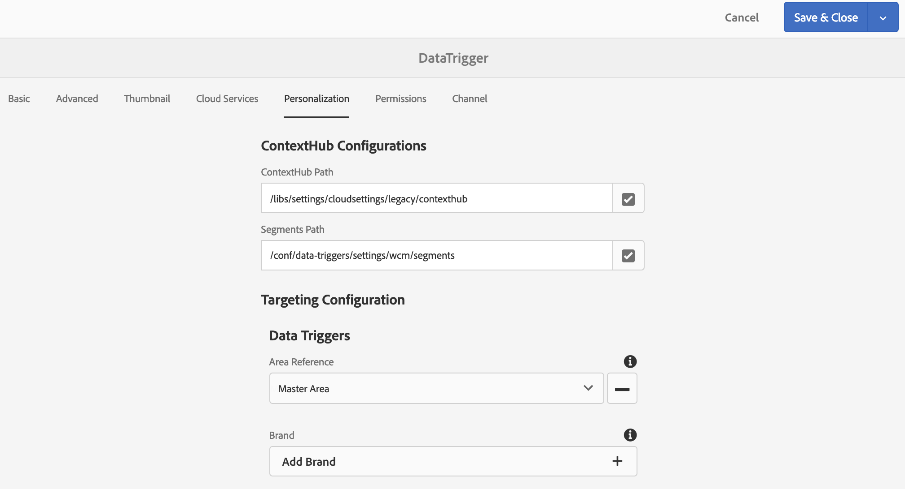
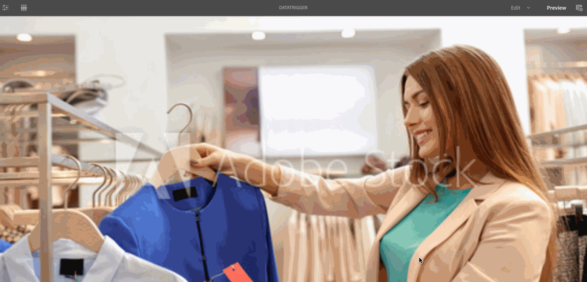
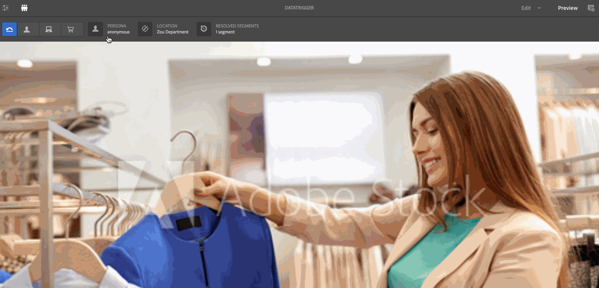

# データによってトリガーされたアセットの変更{#data-triggered-asset-change}

## 使用例の説明 {#use-case-description}

この使用事例では、場所の天気に基づいてパーソナライズされたコンテンツを実現する方法を説明します。

次のAEM Screensプロジェクトは、ContextHub、セグメント化エンジン、コンテンツターゲットUIを含むAEMパーソナライゼーションを活用します。

この使用例は、天候が次の場合に、各場所の現在の天気に基づいてパーソナライズされたコンテンツを配信します。

* *晴れ、夏の服を飾る*
* *寒い、冬服を飾る*

>[!NOTE]
>
>デモ用に、この使用例はコンテンツの更新を表示するために地域をキャプチャします。 様々なシナリオで、地理位置情報ビューの出力を手動で更新できます。

### 前提条件 {#preconditions}

この使用事例を開始する前に、以下の事項を確認してください。

* [パーソナライゼーション](/help/sites-administering/personalization.md)
* [ContextHub の設定](/help/sites-administering/contexthub-config.md)
* [ContextHub でのセグメント化の設定](/help/sites-administering/segmentation.md)
* [ターゲットモードを使用したターゲットコンテンツのオーサリング](/help/sites-authoring/content-targeting-touch.md)

### 主要なアクター {#primary-actors}

コンテンツ作成者

## 基本フロー：プロジェクトのセットアップ {#basic-flow-setting-up-the-project}

次の手順に従って、データを表示するプロジェクトを設定し、トリガーされたアセットの変更を示します。

1. Create an AEM Screens Project named as **DataTriggerAsset**, as shown below.

   

1. **シーケンスチャネルを作成する**

   1. **チャネル**&#x200B;フォルダーを選択し、「**作成**」をクリックしてチャネル作成用ウィザードを開きます。
   1. Select **Sequence Channel** from the wizard and create the channel titled as **DataTrigger**.
   

1. **シーケンスチャネルにコンテンツを追加する**

   1. Select the channel **DataTrigger**.
   1. アクションバーの「**編集**」をクリックして、エディターを開きます。アセットをいくつかチャネルにドラッグ＆ドロップします。
   

   >[!NOTE]
   >
   >初期設定の画像はエディターにのみ追加する必要があります。 置き換える画像は、手順(6)でターゲットモードに切り替える際に、エディターに追加する必要があります。

1. **ContextHubとターゲット設定の設定**

   1. DataTriggerAsset **—>** Channels **> dataTrigger****— に移動し、アクションバー****** から「Properties」をクリックします。
   1. 「パーソナラ **イゼーション** 」タブをクリックします。
   

1. **ContextHub設定とターゲット設定の追加**

   1. デモ用に、以下のコンテンツパッケージをダウンロードしてください。
   1. パッケージをAEMインスタンスにダウンロードしたら、ContextHubとセグメントのパスを設定する必要があります。
   * ContextHubの場 **合**、パスを次に設定します。 ***/libs/settings/cloudsettings/legacy/contexthub***
   * 「セグメ **ントパス**」で、パスを次のように設定します。 ***/conf/data-triggers/settings/wcm/segments***
   データトリガー

   [ファイルを入手](assets/data-triggers-1_00.zip)

   >[!NOTE]
   >
   >ContextHubとセグメントの設定について詳しくは、次を参照してください。
   >
   >* [ContextHub の設定](/help/sites-administering/contexthub-config.md)
   >* [ContextHub でのセグメント化の設定](/help/sites-administering/segmentation.md)

   

   「**保存して閉じる**」をクリックします。

1. **ターゲットモードへの切り替え**

   1. DataTriggerAsset **/** Channels **/** DataTriggerに移動し、アクションバー **か****** ら「Edit」をクリックします。
   1. 「編集」 **の下のメニュー** ・バーから「ターゲット設定」を選 **択します**。
   

1. **ターゲットコンテンツの追加**

   1. 「 **BRANDのデー** タトリガー **」と「**Seasonal Data-Trigger **in** ACTIVITY **」を選択します**。
   1. Click the **Start Targeting**
   

1. **ターゲットコンポーネントの定義**

   1. ターゲットコンテンツを設定するコンポーネントを選択します。
   1. 「 **Target** 」ボタンをクリックして、そのコンポーネントのターゲット設定を有効にします。
   1. サイドレールでオーディエンスのバリエーションを選択し、必要に応じて **コンテンツを調整して** 、各バリエーションのコンテンツを定義します。
   >[!NOTE]
   >
   >エディタで **アセット** パネルを非表示にするには、次の図に示すように、右側のパネルの左矢印をクリックする必要があります。

   

## 結果の表示 {#viewing-the-results}

上記の手順を完了したら、さらに進んで結果をプレビューし、表示します。

1. エディタ **ーで** 「プレビュー」をクリックします。

   

1. 以下に示すように、ContextHubアイコンを手動でクリックすると、場所や地域の温度に応じて画像がどのように変化するかを確認できます。

   場所を更新するとすぐに、その領域の温度がキャプチャされ、画像が冬の選択に合わせて更新され、夏の選択画像が置き換えられます。

   

