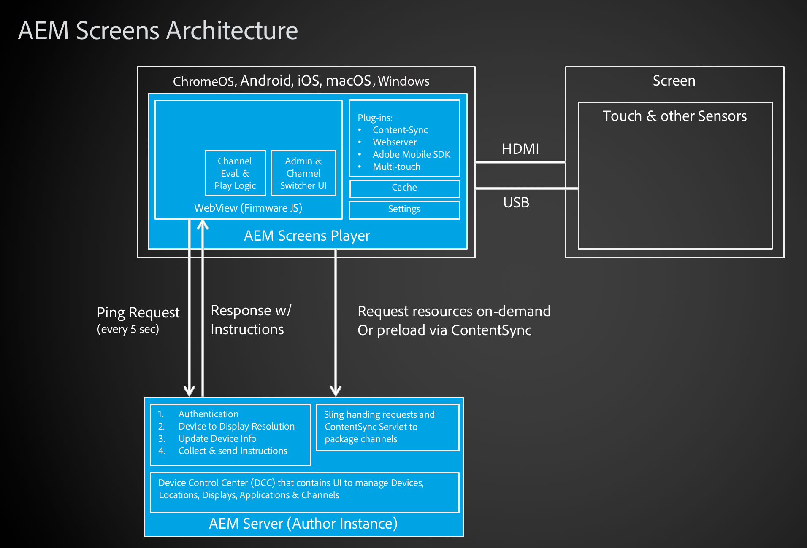

# Screens の開発{#developing-screens}

AEM Screens***開発者****は、インタラクティブシステムの設計と構築を担当します。 基本的に、開発者はアプリケーションを作成してコンテンツシーケンスを作成するか、複数のチャネルで利用できるアプリやシーケンスを開発します。

開発者は、アプリケーションやコンポーネントの作成、API 統合とプラグイン拡張での作業、プレーヤー拡張機能の作成、分析の統合およびログ記録操作の実行をおこないます。

## AEM Screens：アーキテクチャの概要 {#aem-screens-architecture-overview}

次の図に、AEM Screens のアーキテクチャを詳しく示します。

開発者リソースにアクセスするには、以下のリンクを参照してください。

* [REST API](/help/screens/rest-api.md)
* [コンポーネントの作成](/help/screens/creating-components.md)
* [オフラインチャネル](/help/screens/offline-channels.md)
* [AEM Screens と連携する Adobe Analytics の設定](/help/screens/configuring-adobe-analytics-aem-screens.md)

