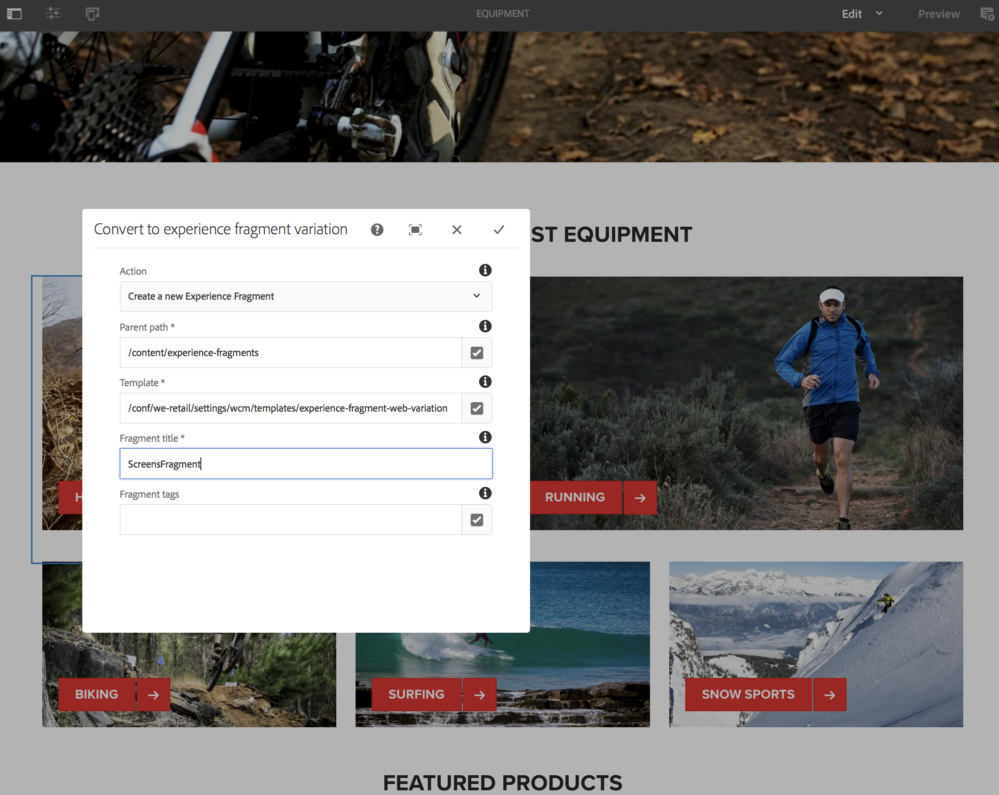

# エクスペリエンスフラグメントの使用{#using-experience-fragments}

エクスペリエンスフラグメントの使用に関するトピックを次に示します。

* **概要**
* **AEM Screens でのエクスペリエンスフラグメントの使用**
* **マスターページからの変更の反映**

## 概要 {#overview}

***エクスペリエンスフラグメント***&#x200B;は、ページ内で参照できるコンテンツおよびレイアウトを含む 1 つ以上のコンポーネントのグループです。エクスペリエンスフラグメントには、段落システム内に含めることができる 1 つ以上のコンポーネントなど、任意のコンポーネントを含めることができます。完全なエクスペリエンスに参照され、3 番目のエンドポイントによって要求されます。

## AEM Screens でのエクスペリエンスフラグメントの使用 {#using-experience-fragments-in-aem-screens}

>[!NOTE]
>
>次の例では、**We.Retail** をデモプロジェクトとして使用し、**Sites** ページのエクスペリエンスフラグメントを AEM Screens プロジェクトに利用します。

例えば、以下のワークフローでは、Sites の We.Retail に含まれているエクスペリエンスフラグメントを使用する方法を示しています。Webページを選択し、そのコンテンツをAEM Screensチャネルでプロジェクトの1つで利用できます。

### 前提条件 {#pre-requisites}

**チャネルを含んだデモプロジェクトの作成**

***プロジェクトの作成***

1. 「Screens」をクリックし、**作成**／プロジェクトを作成を選択して、新しいプロジェクトを作成します。

1. スクリーンプロジェクトを作成ウィザードで「スクリーン」を選択します。

1. タイトルに &quot;**DemoProject**&quot; と入力します。
1. 「**作成**」をクリックします。

**DemoProject** が AEM Screens に追加されます。***チャネルの作成***

1. 作成した **DemoProject** プロジェクトに移動し、**チャネル**&#x200B;フォルダーを選択します。

1. アクションバーの「**作成**」をクリックします（下図を参照）。ウィザードが開きます。
1. 「**シーケンスチャネル**」を選択し、「**次へ**」をクリックします。

1. 「**タイトル**」に「**TestChannel**」と入力し、「**作成**」をクリックします。

**TestChannel** が **DemoProject** に追加されます。\

>[!NOTE]
>
>プロジェクトの作成とチャネルの作成の詳細については、「プロジェクトの作成」と「チャネ [ルの管理](creating-a-screens-project.md) 」を参 [照してください](managing-channels.md) 。

### エクスペリエンスフラグメントの作成 {#creating-an-experience-fragment}

**DemoProject** の **TestChannel** に **We.Retail** のコンテンツを利用するには、以下の手順に従います。

1. **We.Retail の Sites ページへの移動**

   1. 「Sites」に移動し、**We.Retail**／United States／English を選択します。次に、**Equipment** ページを選択して、これを Screens チャネルのエクスペリエンスフラグメントとして使用します。
   1. アクションバーの「**編集**」をクリックして、Screens チャネルのエクスペリエンスフラグメントとして使用するページを開きます。
   

1. **コンテンツの再利用**

   1. チャネルに含めるフラグメントを選択します。
   1. 右側の最後のアイコンをクリックして、**エクスペリエンスフラグメントバリエーションに変換**&#x200B;ダイアログボックスを開きます。
   

1. **エクスペリエンスフラグメントの作成**

   1. 「**アクション**」として「**新しいエクスペリエンスフラグメントを作成**」を選択します。
   1. 「**親パス**」を選択します。
   1. 「**テンプレート**」を選択します。ここで **We.Retailテンプレートを選択します** 。
   1. 「フラグメントのタイトル」に「**ScreensFragment**」と入力します。
   1. チェックマークをオンにして、新しいエクスペリエンスフラグメントの作成を完了します。
   

1. **エクスペリエンスフラグメントのライブコピーの作成**

   1. AEM ホームページに移動します。
   1. Select **Experience Fragments** and highlight the **ScreensFragment** and click **Variation as live- Copy**, as shown in the figure below:
   

   c. **ライブコピーを作成**&#x200B;ウィザードで「ScreensFragment」を選択し、「**次へ**」をクリックします。

   d. 「**タイトル**」と「**名前**」に「**Screens**」と入力します。

   e. 「**作成**」をクリックして、ライブコピーを作成します。

   

1. **画面チャネルでのエクスペリエンスフラグメントの使用**

   1. **Screens** フラグメントを使用する Screens チャネルに移動します。
   1. Select the **TestChannel** and click **Edit** from the bar.
   1. サイドタブのコンポーネントアイコンをクリックします。
   1. Drag and drop the **Embedded Page** to your channel.
   

   e. Select the **Embedded Page** component and select the top left (wrench) icon to open the **Page** dialog box.

   f. 前述の&#x200B;*手順 3* で作成したフラグメントの **Screens** ライブコピーを「エクスペリエンスフラグメント」フィールドで選択します。

   

   h. 「デュレーション (ms)」フィールドに秒数を入力します。

   i.チェックマークをクリックして、プロセスを完了します。

   

### 結果の検証 {#validating-the-result}

After completion of precceeding steps, you can validate your experience fragment in the **TestChannel** by:

1. **TestChannel** に移動します。
1. アクションバーの「**プレビュー**」をクリックします。

チャネル内の **Sites** ページ（エクスペリエンスフラグメントのライブコピー）のコンテンツが表示されます（下図を参照）。\

## マスターページからの変更の反映 {#propagating-changes-from-the-master-page}

***ライブコピー***&#x200B;とは、ロールアウト設定で定義された同期アクションによって維持管理される（ソースの）コピーのことです。

上記で作成したエクスペリエンスフラグメントは **Sites** ページからのライブコピーなので、マスターページでその特定のフラグメントに変更を加えた場合は、チャネルつまりそのエクスペリエンスフラグメントの使用先に変更が表示されます。

>[!NOTE]
>
>For more information on Live Copy, see [Reusing Content: Multi Site Manager and Live Copy](/help/sites-administering/msm.md).

マスターチャネルから目的のチャネルに変更を反映するには、以下の手順に従います。

1. **Sites**（マスター）ページで「エクスペリエンスフラグメント」を選択し、鉛筆アイコンをクリックして、エクスペリエンスフラグメント内の項目を編集します。

   

1. エクスペリエンスフラグメントを選択し、レンチアイコンをクリックして、画像編集用のダイアログボックスを開きます。

   

1. **商品グリッド**&#x200B;ダイアログボックスが開きます。

   

1. 任意の画像を編集できます。例えば、ここでは、このフラグメントの最初の画像が置き換えられます。

   

1. エクスペリエンスフラグメントを選択し、ロールアウトアイコンをクリックして、チャネルで使用されているフラグメントに変更を反映します。

   

1. 「ロールアウト」をクリックして、変更内容を確認します。

   変更がロールアウトされたことがわかります。

   

### 変更の検証 {#validating-the-changes}

チャネルでの変更内容を確認するには、以下の手順に従います。

1. **Screens**／**Channels**／**TestChannel** に移動します。

1. アクションバーの「**プレビュー**」をクリックして、変更内容を確認ます。

次の画像は、**TestChannel** に反映された変更を示しています。\

