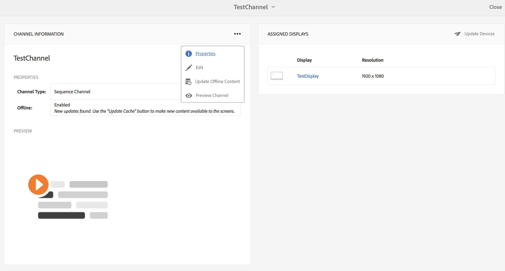

# オフラインチャネル{#offline-channels}

Screens Player では、***ContentSync*** テクノロジーを利用してチャネルのオフラインサポートを提供しています。

プレーヤーは、解凍したコンテンツを提供するためにローカルの HTTP サーバーを使用します。

チャネルが&#x200B;*オンライン*&#x200B;で実行されるように設定されている場合、プレーヤーは AEM サーバーにアクセスしてチャネルリソースを提供します。これに対し、チャネルが&#x200B;*オフライン*&#x200B;で実行されるように設定されている場合、プレーヤーはローカルの HTTP サーバーからチャネルリソースを提供します。

このプロセスのワークフローを次に示します。

1. 目的のページを解析します。
1. すべての関連アセットを収集します。
1. すべての要素を zip ファイルにパッケージ化します。
1. zip ファイルをダウンロードし、ローカルに抽出します。
1. コンテンツのローカルコピーを表示します。

## 更新ハンドラー {#update-handlers}

***ContentSync*** は、更新ハンドラーを使用して、特定のプロジェクトに必要なすべてのページとアセットを解析および収集します。AEM Screens では、次の更新ハンドラーが使用されます。

### 共通オプション {#common-options}

* *type*：使用する更新ハンドラーのタイプ
* *path*：リソースのパス
* *[targetRootDirectory]*：zip ファイル内のターゲットフォルダー

<table> 
 <tbody>
  <tr>
   <td><strong>タイプ</strong></td> 
   <td><strong>説明</strong></td> 
   <td><strong>オプション</strong></td> 
  </tr>
  <tr>
   <td>channels</td> 
   <td>チャネルを収集します</td> 
   <td>extension：収集するリソースの拡張子  [pathSuffix="]：チャネルパスに追加するサフィックス  [deep=true]:子ページを再帰的に解析するか  [includeImages=true]:チャネルにすべての画像を含める  [includeVideos=true]:チャネルにすべてのビデオを含める  [includeProducts=true]:チャネルにすべての製品を含める</td> 
  </tr>
  <tr>
   <td>clientlib</td> 
   <td>指定されたクライアントライブラリを収集します</td> 
   <td>[extension="]：css か js のどちらか（前者のみか後者のみを収集するために指定）</td> 
  </tr>
  <tr>
   <td>assetrenditions：</td> 
   <td>アセットレンディションを収集します</td> 
   <td>[renditions=[]]：収集するレンディションのリスト。デフォルトで元のレンディションに設定</td> 
  </tr>
  <tr>
   <td>copy</td> 
   <td>指定された構造をパスからコピーします</td> 
   <td> </td> 
  </tr>
 </tbody>
</table>

### ContentSync 設定のテスト {#testing-contentsync-configuration}

ContentSync 設定をテストするには、以下の手順に従います。

1. [ を開きます。http://localhost:4502/libs/cq/contentsync/content/console.html](http://localhost:4502/libs/cq/contentsync/content/console.html)
1. リストから設定を選択します。
1. 「キャッシュをクリア」をクリックします。
1. 「キャッシュを更新」をクリックします。
1. 「すべてダウンロード」をクリックします。
1. zip ファイルを解凍します。
1. 解凍したフォルダーでローカルサーバーを起動します。
1. スタートページを開き、アプリケーションの状態を確認します。

## チャネルのオフライン設定の有効化 {#enabling-offline-config-for-a-channel}

チャネルのオフライン設定を有効にするには、次の手順を実行します。

1. チャネルコンテンツを調べて、それが AEM インスタンスから要求されているかどうかを確認します（オンライン）。

   

1. Navigate to the channel dashboard and click **... **in the** CHANNEL INFORMATION **Panel to change the properties.

   

1. チャネルのプロパティに移動し、「**チャネル**」タブのチェックボックスが無効になっていることを確認します。「**保存して閉じる**」をクリックします。

   

   コンテンツを適切にデバイスに実装する前に、「**オフラインコンテンツを更新**」をクリックします。

   

   これに合わせて「**プロパティ**」の「**オフライン**」ステータスも更新されます。

   

1. チャネルコンテンツを調べて、それがローカルの Player-Cache から要求されているかどうかを確認します。

   

